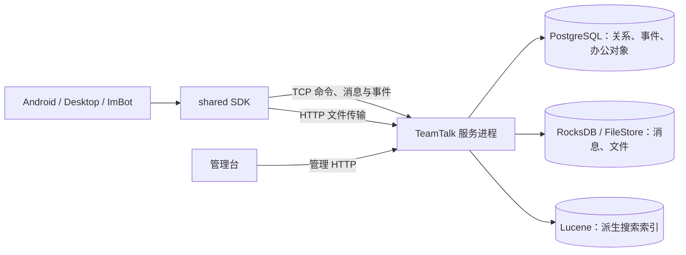

# 系统架构

> 新维护者先读[架构入门](architecture-primer.md)（多视角地图：模块依赖、三条数据通道、事件系统、
> 本地优先三分法、权限权威速查、端到端走查），本文与其余各篇是其后的深读材料。

TeamTalk 是全栈 Kotlin 的模块化单体：服务端部署为一个进程，客户端通过共享 SDK 复用协议与数据
逻辑，Android 与 Desktop 保持独立应用壳。架构的目标不是追求最大吞吐，而是在万级组织规模内
提供清晰的所有权、可靠的多端同步和较低的部署复杂度。

## 1. 系统上下文

管理后台通过 HTTP 调用服务端管理接口；它不参与实时消息链路。`protocol` 是 SDK 与服务端共同编译的契约库，
不位于网络请求中间。完整构建依赖图见[架构入门](architecture-primer.md#1-仓库地图每个模块为什么存在)。

## 2. 模块职责

| 模块 | 负责 | 不负责 |
|---|---|---|
| `protocol` | 纯 Kotlin wire 原语、传输模型、消息体、RPC IDL/生成物和跨端纯规则 | Netty、连接、缓存、UI、服务端存储 |
| `protocol-netty` | ByteBuf 帧累积、方向校验及有界 payload 适配 | 模型、领域规则、连接所有权 |
| `shared` | 客户端连接、认证会话、事件、缓存、Repository、ImBot | Compose UI、服务端实现 |
| `shared-testkit` | 供各模块 test 源集复用的 SDK 测试替身 | 任何产品 main 依赖或 SDK 发布内容 |
| `rpc-processor` | 从 RPC IDL 生成 Contract/Stub/Proxy | 运行时业务 |
| `app` | 共享 Compose 内容、ViewModel、业务 UI 状态 | TCP 细节、平台窗口 |
| `android` | Activity、NavHost、系统权限、Android 媒体和通知 | Desktop 交互 |
| `desktop` | 窗口、三栏布局、系统托盘、Desktop 媒体和测试服务 | Android 导航 |
| `richeditor` | 项目内维护的富文本编辑能力 | 消息协议和发送权限 |
| `server` | 认证、领域规则、事件、存储、HTTP/TCP 入口 | 客户端交互状态 |
| `admin` | 管理员操作界面 | IM 实时客户端 |
| `buildSrc` | 部署配置、上传和部署任务 | 运行时 profile |

依赖必须单向：客户端 SDK 和服务端通过 `protocol-netty` 适配 `protocol`，服务端生产代码不依赖 `shared`；`shared` 不依赖
Compose。这个边界由 Gradle 模块而不是包命名约定保证。
测试边反向依赖 `shared-testkit → shared`：只有 test 源集可依赖 testkit，产品源集不得引入
`com.virjar.tk.testing`。

## 3. 三条数据通道

### RPC 通道

`INVOKE/RESPONSE` 处理需要请求结果的短操作，例如更新资料、好友、建群、会话设置和历史查询。
Service 与 method ID 由 IDL 生成物锁定。

### 消息与事件通道

消息发送使用独立 `MESSAGE/MESSAGE_ACK`，以 `chatId + clientMsgId` 作为稳定发送身份并分配
`serverSeq`。服务端状态
变化通过 `NOTIFY` 推送；离线设备认证后由本地事件消费者显式分页恢复持久化事件，完成后才开放
实时推送。

### HTTP 通道

文件和日志不塞入 TCP 帧。HTTP 还承载健康检查、静态下载和管理后台。HTTP URL 是部署边界，核心
消息模型只保存附件相对路径。

## 4. 所有权层级

客户端用所有者驱动模型减少重连和登录竞态：

| 层级 | 所有者 | 生命周期 |
|---|---|---|
| 应用层 | 进程 | 配置、客户端凭据存储、登录窗口 |
| 用户层 | `UserSession` / `ClientSession` | 从持久账号离线恢复/认证成功到登出或权威认证失效 |
| 连接层 | `ImClient` | 单次 TCP 连接，可自动重建 |

网络断开和可重试的 AUTH 拒绝只清理连接 authority；不能顺带清空用户身份和本地数据。权威认证失效
终止用户层，客户端清 token 并回到登录流程。具体实现见[客户端与 SDK](client-and-sdk.md)。

服务端不持有进程内或 RocksDB token store。随机 access/refresh token 只以 SHA-256 保存在 PostgreSQL；
Users 与 Devices 各有独立 credential epoch。封禁、密码重置或设备撤销先原子提交状态与 epoch，再把
已提交代际发布为 ClientRegistry fence，从而拒绝旧连接重新激活。解除封禁不会回退 fence 或恢复旧
token；同一设备的新登录只保留最新 credential pair 并替换旧连接。

## 5. 一致性模型

- 服务端是权限、成员、消息序列、附件存在性和已读水位的权威。
- 客户端 UI 观察本地缓存，写操作经服务端后由事件收敛。
- 事件采用 at-least-once；完整快照 + upsert 使重复处理幂等。
- 消息以 `clientMsgId` 去重，以 `serverSeq` 排序和恢复。
- 已读以单调水位表示，不追踪每条消息的独立已读布尔值。

详细时序见[数据与同步](data-and-sync.md)。

## 6. 架构质量目标

1. **确定性**：协议字段、方法 ID、事件 payload 与状态所有者明确。
2. **可恢复**：断线、重复事件和进程重启不会制造重复消息或倒退已读水位。
3. **可验证**：共享契约能做 round-trip，本地边界能单测，业务链路能在真实部署验收。
4. **可部署**：一个服务端分发、一个 PostgreSQL 和本地数据目录即可运行。
5. **可演进**：产品未发布阶段允许破坏性调整，但调整必须同时更新协议版本、数据和文档。

关键取舍及被拒绝的方案见[架构决策](decisions.md)。
