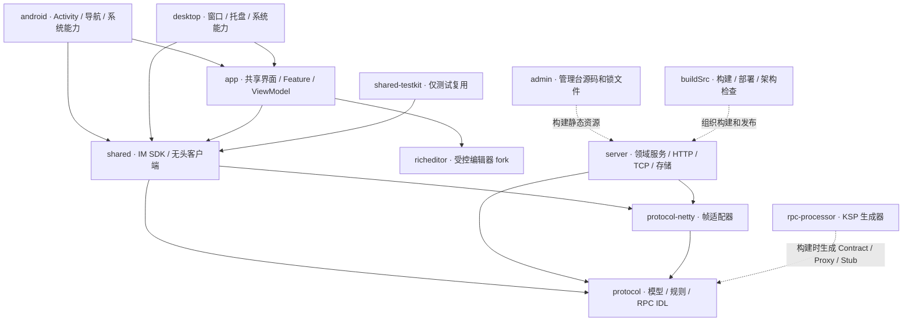
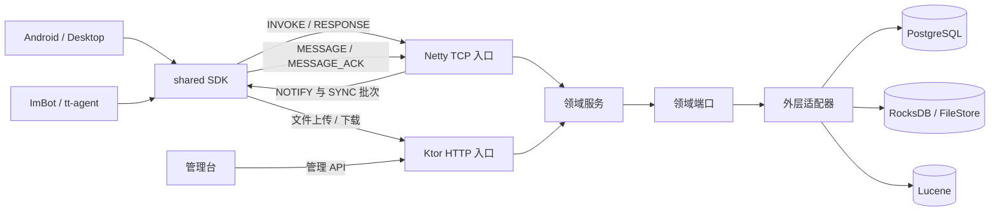
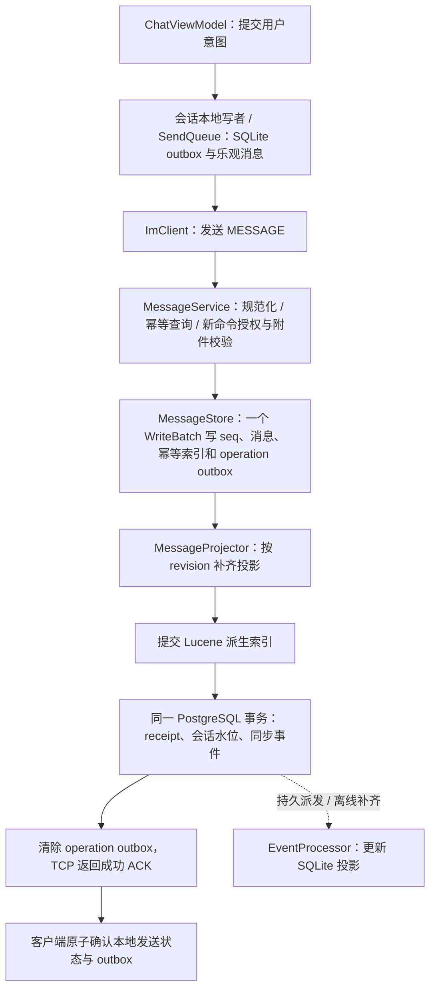
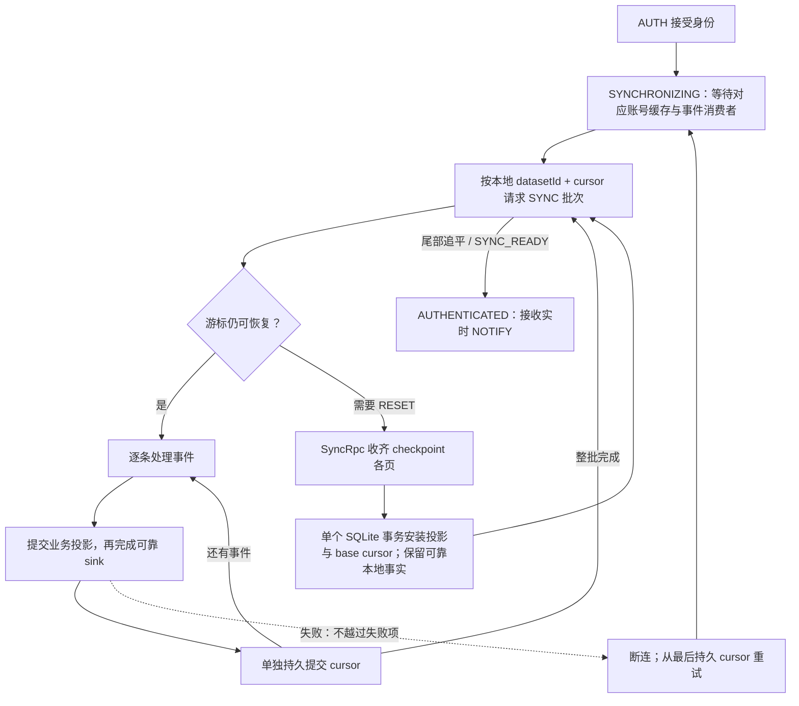
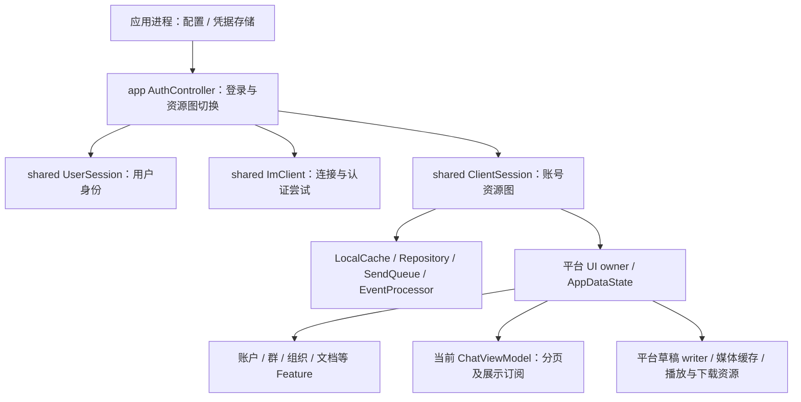
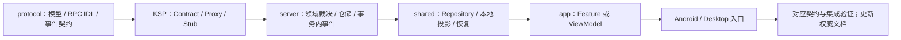

# 架构入门：从用户动作读到数据落盘

这份地图帮助项目所有者回答三个问题：一个动作由谁完成、哪份数据说了算、失败后从哪里继续。
先读图，再沿图下的源码入口走一遍；不必先通读所有文件。

图中的**依赖箭头**表示“调用方依赖谁”，**时序箭头**表示一次调用或数据交接，两者不能混用。
图用 Mermaid 源码保存，可在支持 Mermaid 的 Markdown 预览中阅读，也可以直接查看和修改文本。

## 1. 仓库地图：每个模块为什么存在

`richeditor` 不依赖 SDK；它由 `app` 引入。Android/Desktop 也直接声明 SDK 依赖，以组装平台资源。
`admin` 的静态资源构建边和 KSP 生成边不是业务运行时调用。服务端测试可以依赖 SDK/testkit，生产代码不可以。
实际依赖以 [settings.gradle.kts](../../settings.gradle.kts) 和各模块构建文件为准。

| 要改的事实 | 第一入口 | 改动应该在哪里结束 |
|---|---|---|
| 字节、RPC 参数、共享消息规则 | [protocol](../../protocol/protocol/src/commonMain/kotlin/com/virjar/tk/protocol) | 契约与纯规则，不包含数据库或 UI |
| 认证、同步、缓存、可靠发送 | [shared/client](../../client/shared/src/commonMain/kotlin/com/virjar/tk/shared/client) | SDK 内形成可恢复闭环，UI 只消费结果 |
| 用户用例与页面状态 | [navigation/feature](../../client/app/src/commonMain/kotlin/com/virjar/tk/app/navigation/feature)、[viewmodel](../../client/app/src/commonMain/kotlin/com/virjar/tk/app/viewmodel) | Feature 编排用例，ViewModel 提供可观察数据 |
| 窗口、返回、picker、媒体文件 | [Desktop](../../client/desktop/src/desktopMain/kotlin/com/virjar/tk/desktop)、[Android](../../client/android/src/main/kotlin/com/virjar/tk/android) | 平台资源有明确的创建、交接与关闭者 |
| 权限、领域命令与持久化 | [server/domain](../../server/server/src/main/kotlin/com/virjar/tk/server/domain)、[server/infra](../../server/server/src/main/kotlin/com/virjar/tk/server/infra) | 领域决定规则，适配器接数据库、搜索、文件与连接 |
| 运行、打包、部署 | [Application](../../server/server/src/main/kotlin/com/virjar/tk/server/Application.kt)、[buildSrc](../../buildSrc/src/main/kotlin/deployment) | 服务启动与制品分发，不进入领域规则 |

## 2. 运行时地图：请求真正经过哪里

三条通道是业务分工，不是三套身份系统：

| 通道 | 正常入口 | 容易误解的边界 |
|---|---|---|
| 命令查询 | `INVOKE/RESPONSE` → 生成的 Stub → 领域服务 | 组织目录分页也是二进制 RPC，不走普通客户端 HTTP API |
| 消息与事件 | `MESSAGE/ACK`、实时 `NOTIFY`、恢复用 `SYNC_REQUEST/BATCH/READY/RESET` | SYNC 批次用于补齐；实时推送不是只靠 SYNC_BATCH |
| 文件与运维 | 文件 Repository → HTTP；管理台 → 管理 HTTP | 消息保存相对路径；文件内容不塞入消息帧 |

协议层是两端共用的契约库，不是部署在网络中间的一台服务。传输是否使用 TLS 与业务通道分开理解，
运行时、SDK 与部署工具的当前差异见[运行配置](../07-operations/configuration.md)。

## 3. 数据地图：谁拥有真相，什么可以重建

| 数据 | 权威所有者 | 客户端如何使用 | 丢失后如何恢复 |
|---|---|---|---|
| 用户、成员、权限、会话与办公对象 | 服务端 PostgreSQL 领域表 | SQLite 中保存当前可见投影 | checkpoint、事件或领域分页重新拉取 |
| 消息、聊天内序号与待投影操作 | 服务端 RocksDB MessageStore | 按 chat + serverSeq 分页、排序、显示 | 从服务端历史回拉；服务端未完成投影从 operation outbox 继续 |
| 搜索索引 | Lucene 保存派生索引 | 搜索命中后按对象身份打开 | 从权威消息等已接入领域重建 |
| 文件字节与元数据 | FileStore | 完整认证下载、校验后进入有界本地缓存 | 可回拉媒体按需重新下载，播放器只读本地文件 |
| 尚未获确认的发送/命令 | 账号 LocalCache outbox | 先持久化意图，后台携原 identity 重试 | 从原 outbox 恢复，不能生成新 identity 假装重试 |
| 尚未提交的编辑内容 | 对应聊天/文档草稿 owner | 本地编辑、持久化或明确冲突恢复 | 按事实类别恢复；不能把脏草稿当普通缓存清空 |

**投影**是“为读取方便保存的副本”，**outbox**是“还不能忘记的用户意图”，**receipt**是“已经执行过某命令的凭证”。
`sync_events` 是可按保留期回收的变化日志，不是所有命令的永久收据。

读任何状态代码前，先认清它使用的坐标：

| 坐标 | 只在哪个范围内有意义 | 用途 |
|---|---|---|
| deployment + datasetId + uid | 一个部署的一份数据集、一个账号 | 本地库与资源隔离；同 uid 不等于同一数据集 |
| chatId + clientMsgId | 一次消息发送意图 | ACK 丢失后精确重试 |
| chatId + serverSeq | 某个聊天中的权威消息 | 排序、历史分页、已读与搜索定位 |
| uid + eventId | 一个用户的持久事件流 | 表示已处理到哪里；不等于消息序号 |
| revision / expectedRevision | 对应领域对象 | 防止旧快照覆盖新事实，或对并发修改返回冲突 |
| operationId / commandId | 对应可靠命令契约 | 区分新命令与重复请求；作用域、期限由各域规定 |

源码入口：[LocalCache](../../client/shared/src/commonMain/kotlin/com/virjar/tk/shared/client/LocalCache.kt)、
[MessageStore](../../server/server/src/main/kotlin/com/virjar/tk/server/infra/storage/MessageStore.kt)、
[领域模型](../02-product/domain-model.md)。

## 4. 从发消息理解跨存储一致性

先沿这条主线读，不必先研究每个 helper：

服务端没有跨 RocksDB、Lucene、PostgreSQL 的万能事务。可靠性来自：先留下可恢复事实，再推进派生投影，
全部完成后才返回成功。若在中间退出，原 identity 的重试或启动恢复继续处理原 operation；不再分配第二条消息。

从 [ChatViewModel](../../client/app/src/commonMain/kotlin/com/virjar/tk/app/viewmodel/ChatViewModel.kt) 的发送入口，依次打开
[SendQueue](../../client/shared/src/commonMain/kotlin/com/virjar/tk/shared/client/SendQueue.kt)、
[MessageService](../../server/server/src/main/kotlin/com/virjar/tk/server/domain/message/MessageService.kt)、
[MessageProjector](../../server/server/src/main/kotlin/com/virjar/tk/server/domain/message/MessageProjector.kt)。
更完整的失败与回放规则见[数据与同步](data-and-sync.md)。

## 5. 从断线恢复理解事件系统

普通事件的投影与 cursor **不是一个 SQLite 事务**。如果投影完成但 cursor 尚未提交，下一次会再次收到同一事件，
所以投影、删除与可靠 inbox 必须幂等。checkpoint 是另一种边界：收齐并校验后一次安装，不发布半份快照。

| 事件形态 | 示例 | 恢复方法 |
|---|---|---|
| 持久快照 | 会话、用户、聊天变更 | 同一实体 upsert；版本事实按领域规则合并 |
| 持久行变更 | 群文件 | revision 与删除墓碑阻挡迟到复活 |
| 持久行变更 | 表情回应 | 按 eventId 串行增删；完整区间快照由本地租约避免覆盖飞行期间的增量 |
| 瞬时失效提示 | ORGANIZATION_CHANGED，eventId=0 | 提升 requiredRevision，重连后通过组织 RPC 对账 |
| 瞬时展示信号 | PRESENCE、TYPING，eventId=0 | 在线状态刷新基线；输入状态超时清理，不补旧提示 |

入口：[EventProcessor](../../client/shared/src/commonMain/kotlin/com/virjar/tk/shared/client/EventProcessor.kt)、
[LocalDeliveryLogStore](../../client/shared/src/commonMain/kotlin/com/virjar/tk/shared/client/LocalDeliveryLogStore.kt)、
[ExposedPgUnitOfWork](../../server/server/src/main/kotlin/com/virjar/tk/server/infra/db/ExposedPgUnitOfWork.kt)、
[事件参考](../10-reference/event-reference.md)。

## 6. 从关窗口理解状态所有权

上图表达生命周期层级；具体对象由 GUI 组装根创建与关闭，并非每条边都意味着构造函数直接调用。
短暂断网只重建连接，不清空用户身份和 outbox；退出、权威身份失效或数据集切换才退役相应资源图。
关聊天页应停止其订阅，关账号工作区才关闭该账号资源。

文档内也有不同范围：切文档使旧导航请求失效，但不应取消已经提交的工作区首页收敛；保存按标签拥有请求，
草稿 writer 负责把最终编辑内容落盘。不要用一个全局 generation 解释所有“迟到结果”。
详细所有权与启动/退出图见[客户端与 SDK](client-and-sdk.md)。

## 7. 一次扩展应该改哪些地方

以增加一项需要离线展示的领域命令为例：

审阅时按下面四问判断能否合入：

1. 用户动作先固定了什么 identity，失败重试是否仍是同一个意图？
2. 哪个服务端入口裁决权限，状态、事件与收据在哪个提交边界一起成立？
3. 客户端读的是否仍是本地投影，离线、重连、重复和乱序如何恢复？
4. 谁关闭异步工作，关闭后哪个条件阻止旧结果回写？

RPC 服务名全局唯一、每个方法 ID 显式唯一，生成器负责拒绝冲突。不要手改生成文件。
按 [变更指南](../08-development/change-guides.md) 逐层实施；复杂功能的可交接切片在[路线图](../10-reference/roadmap.md)。

## 8. 项目所有者的阅读练习

每次只选择一个用户动作，画出“入口 → 写者 → 权威存储 → 返回/事件 → 页面”五步，再与现有图核对。
能够解释失败后哪一步重做，就比记住所有类名更接近掌控项目。

| 顺序 | 阅读练习 | 完成时应该能解释 |
|---|---|---|
| 1 | 启动 Desktop，定位 AuthController 与 ClientSession 的创建处 | 为什么断网还可以看本地数据，为什么认证失败与网络失败不同 |
| 2 | 沿第 4 节追一条消息 | ACK 丢失为何不会生成第二条；三个服务端存储为何需要 projector |
| 3 | 沿第 5 节追一次 SYNC_RESET | checkpoint 和普通 NOTIFY 的事务边界为何不同 |
| 4 | 读 GroupFileService 的 rename 与 receipt 分支 | 确认旧成功为何不应再次写条目、审计或事件 |
| 5 | 读 DocumentWorkspaceFeature 的导航、保存与草稿 owner | 切页、保存冲突、关闭窗口分别影响哪一组状态 |
| 6 | 对照一项 Roadmap 与功能状态 | 哪个结果已实现，哪个只是局部切片，还缺什么证据 |

以后交给 AI 的任务也沿同一路线：写清一个用户结果、需要保持的事实、最多几处修改入口和最小验收。
不以删了多少行、拆了多少类或增加多少测试替代设计判断。
