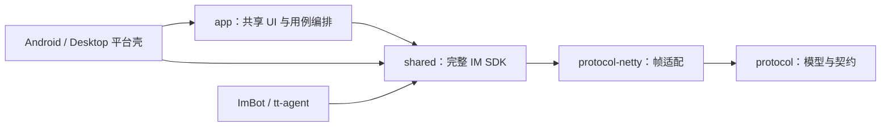
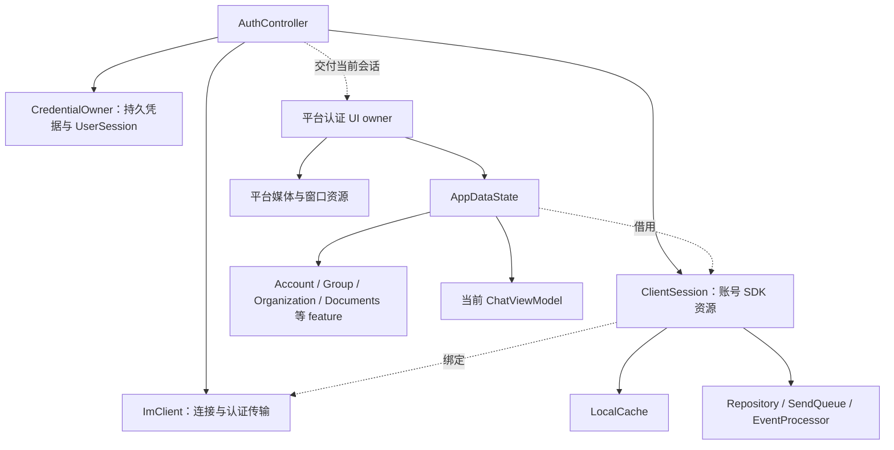
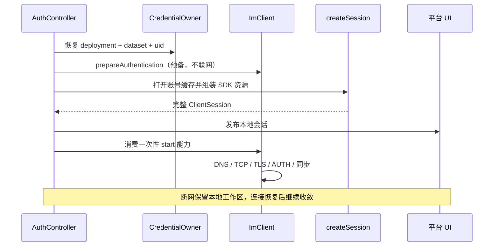
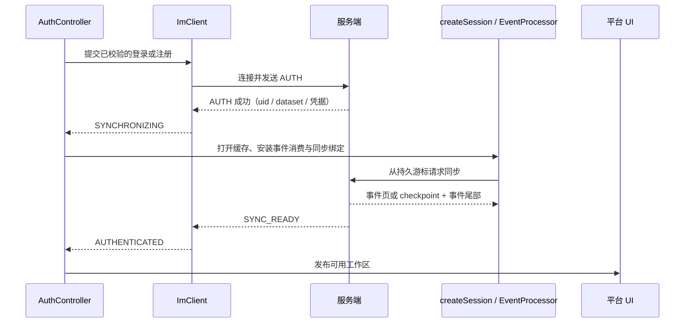
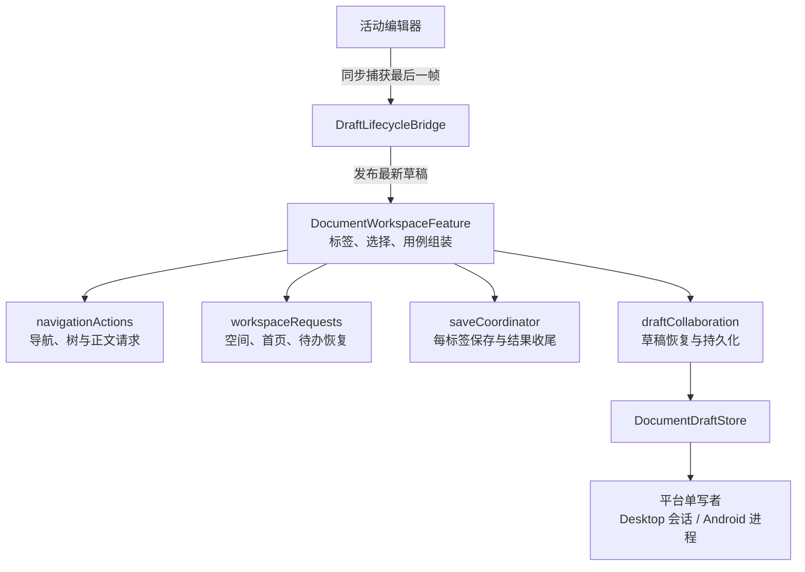
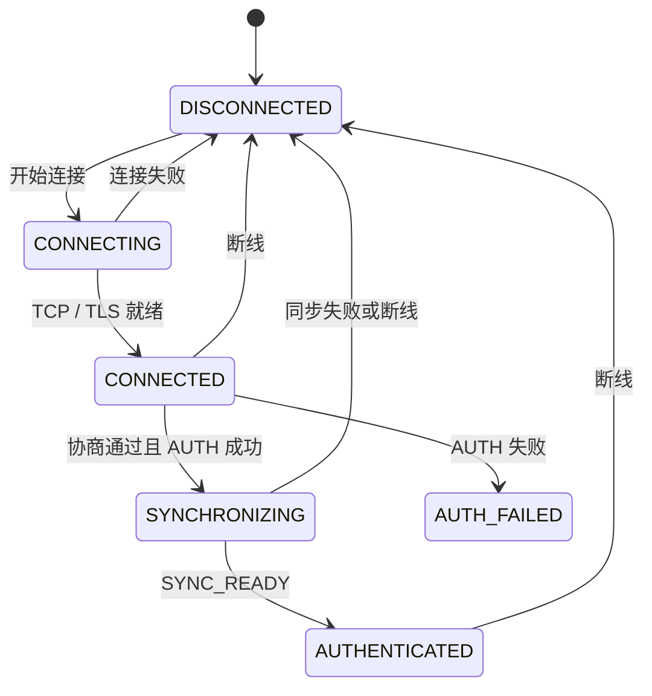
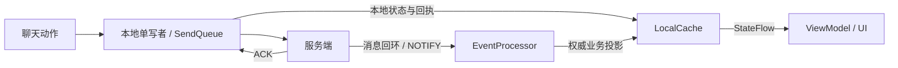

# 客户端与 SDK 架构

这篇文档先回答三个问题：谁拥有资源、一次操作经过哪些对象、退出时按什么顺序释放。
前两节可作为阅读源码的地图；后面的连接、Repository、事件和缓存章节用于核对具体边界。

| 想理解什么 | 阅读入口 |
|---|---|
| 为什么断网还能进入工作区 | [启动的两条路径](#22-冷启动与首次登录) |
| 登录、UI 和 SDK 谁负责关闭谁 | [会话所有权](#21-会话所有权) → [关闭与资源回收](#26-关闭与资源回收) |
| 文档导航、保存和草稿为何分别有状态 | [文档工作台的四个所有者](#23-文档工作台的四个所有者) |
| 消息为何先入本地队列，再等待服务器确认 | [发送与恢复](#28-发送与恢复) |
| 事件落库失败后会不会漏消息 | [EventProcessor](#5-eventprocessor) |
| 缓存里哪些数据可以重建 | [LocalCache](#6-localcache) |

## 1. 分层

平台壳拥有导航、窗口、权限和系统集成。`app` 观察 SDK 的本地数据并编排页面动作；`shared`
不依赖 Compose，连接、可靠队列、事件同步和数据库都能在无头客户端中独立工作。
平台壳显式依赖 `shared` 来装配驱动和会话，不能绕过 Repository 直接修改业务投影。

| 源码入口 | 主要职责 | 不负责什么 |
|---|---|---|
| [AuthController](../../client/app/src/commonMain/kotlin/com/virjar/tk/app/client/AuthController.kt) | 认证 UI、会话建立/复用/退役 | 消息缓存、业务权限 |
| [ClientSession / createSession](../../client/shared/src/commonMain/kotlin/com/virjar/tk/shared/client/ClientSession.kt) | 组装并拥有一份账号 SDK 资源图 | 窗口和页面导航 |
| [AppDataState](../../client/app/src/commonMain/kotlin/com/virjar/tk/app/navigation/AppDataState.kt) | 会话级 ViewModel、feature 和 UI 动作作用域 | 网络连接、数据库实现 |
| [ChatViewModel](../../client/app/src/commonMain/kotlin/com/virjar/tk/app/viewmodel/ChatViewModel.kt) | 当前聊天窗口、历史定位、发送动作与显示投影 | 消息最终真值、账号持久化 |
| [DocumentWorkspaceFeature](../../client/app/src/commonMain/kotlin/com/virjar/tk/app/navigation/feature/document/DocumentWorkspaceFeature.kt) | 文档工作台的标签、选择和用例组装 | 服务器授权、整空间预取 |

## 2. 会话组装

### 2.1 会话所有权

实线表示拥有并负责释放，虚线表示借用或交付。`UserSession` 保存身份，`ClientSession` 保存这次
登录的资源图，两者不能当作同一个状态容器。断网通常只改变连接状态；账号或数据集替换才需要换图。

[AuthControllerCredentialOwner](../../client/app/src/commonMain/kotlin/com/virjar/tk/app/client/AuthControllerCredentialOwner.kt)
持有固定 `TokenStore` 租约；传输回调只通过它更新 `UserSession`，不写 Compose。
[AuthSessionInitializationGate](../../client/app/src/commonMain/kotlin/com/virjar/tk/app/client/AuthSessionInitializationGate.kt)
串行处理离线引导和认证回调的会话构造，关闭失去所有权的候选，防止同时打开两份账号数据库。

`AppDataState` 拥有账户、群组、发现、组织、群文件、文档等 feature，以及会话、联系人和搜索
ViewModel；当前聊天另有一个 `ChatViewModel`。聊天页的 pager、typing、表情回应和
[发送者订阅](../../client/app/src/commonMain/kotlin/com/virjar/tk/app/viewmodel/ChatSenderProjections.kt)
各自有明确释放点。发送者只观察有界消息窗口内的 uid；订阅 Job 就是身份，检查、发布和清理在同锁内完成，
窗口驱逐或页面关闭后，旧订阅不能把用户重新放回显示投影。

### 2.2 冷启动与首次登录

两条路径的区别是是否已有可恢复的本地身份。已有凭据时，服务器暂时不可用不能阻止打开本地数据；
首次登录时，还没有可以信任的账号缓存身份，必须先认证，再完成同步。

**已有持久凭据的冷启动：**

**首次登录：**

### 2.3 文档工作台的四个所有者

文档标签切换与工作区数据恢复是两件事。切到另一篇文档应淘汰旧正文请求，但保存成功后的目录、首页
收敛仍需完成。草稿又比一次页面或请求活得更久，因此不归导航请求所有。

| 所有者与源码 | 失效边界 | 扩展时从这里进入 |
|---|---|---|
| [navigationActions](../../client/app/src/commonMain/kotlin/com/virjar/tk/app/navigation/feature/document/DocumentWorkspaceNavigationActions.kt) | 新导航使旧目录/正文请求失效 | 空间切换、标签激活、路径展开 |
| [workspaceRequests / refreshWorkspace](../../client/app/src/commonMain/kotlin/com/virjar/tk/app/navigation/feature/document/DocumentWorkspaceRefreshWorkflow.kt) | 新工作区刷新淘汰旧刷新；普通标签切换不终止恢复 | 重连、空间分页、首页收敛 |
| [saveCoordinator](../../client/app/src/commonMain/kotlin/com/virjar/tk/app/navigation/feature/document/DocumentWorkspaceSaveCoordinator.kt) | 校验精确标签实例、请求和编辑代次 | 保存、修订恢复、远端成功后的本地收尾 |
| [draftCollaboration](../../client/app/src/commonMain/kotlin/com/virjar/tk/app/navigation/feature/document/DocumentWorkspaceDraftCollaboration.kt) | deployment + dataset + uid 固定草稿归属 | 跨页面草稿恢复、落盘屏障和标签实例分配 |

导航调用直接写成 `navigationActions.selectSpaceNow(...)` 或 `navigationActions.isCurrent(...)`，
源码从调用处即可看见所有者。`refreshHomeProjection()` 另有工作区首页请求的归属判断，保存、移动和
删除完成后都走它；不把有实际时序规则的工作流混成纯转发方法。

关闭前先捕获“编辑器最终帧 → Feature 草稿快照 → 平台 writer”，然后才能释放依赖 SDK 缓存的 UI。
文档 writer 独立拥有已经接收的写入。Desktop 退役会同步确认草稿屏障；Android 安排非阻塞屏障并
观察其完成，不阻塞 Activity。入队成功不代表已经落盘，具体差异见
[草稿与平台生命周期](#210-草稿与平台生命周期)。

### 2.4 身份与认证的详细边界

首次登录在认证成功后建立 `ClientSession`。冷启动存在同部署的持久 refresh 凭据时，客户端先恢复
固定 uid 的 `UserSession`，再预备一次 refresh：该步只保留 exact authentication lease 并在
EventLoop 安装 dormant logical transport owner generation，不解析主机、不建立 TCP/TLS、不发送
AUTH。`ClientSession` 绑定这个精确 generation，打开对应 LocalCache 并把完整本地资源图
发布给平台后，组合根才消费一次性 start capability，允许 DNS/TCP/TLS/版本协商/AUTH 开始。
因此即使服务端在连接后立即返回可重试的 AUTH 失败，也只会在已挂载的工作区内显示
离线状态；本地打开不受 DNS、连接或同步 deadline 淘汰。远端认证与缓存收敛在本地
发布之后继续。

离线恢复只把 uid 与 refresh token 放回用户层，access token 保持为空，因此 HTTP 附件、管理接口等
仍会被会话凭据门禁拒绝。服务器认证成功后必须确认同一 uid；datasetId 未变化时，在同一 identity
epoch 内补齐用户名、显示名、新 access token 及服务端确认的稳定 refresh token。datasetId 变化时，
凭据提交必须在同一用户锁内原子发布已推进的 identity epoch 与新 Bearer，使旧 dataset 的 HTTP/媒体 owner
立即失效，随后再由认证根完整退役旧资源图。服务器明确拒绝凭据时才终止用户层、关闭本地会话并返回登录页。
服务维护、连接准入受限或本地 credential commit 失败只清空当前 Bearer，不推进 identity epoch；否则
仍挂载的附件、媒体、机器人与日志资源会被误判为旧登录，并在同账号重连成功后永久拒绝新 token。
identity epoch 只在 dataset 替换、登出、权威撤销或明确的账号/进程 owner 替换使整张资源图退休时推进。
普通 DNS、TCP、超时或断网只改变连接状态，不阻断本地缓存页面，也不清除持久登录态。

`app` 的 Compose 认证入口只保存需要触发重组的页面状态。固定 `TokenStore` 世代、AUTH 回调准入与
`UserSession` 由一个非 Compose credential owner 线性化；session initialization gate 明确区分
“本效果安装成功、并发效果已有 winner、构造期间 owner 已失效”，并确保平台认证回调对每个资源图
至多执行一次。每份不可变 `AuthState` 的登录/注册动作还捕获认证表面的 generation；共享规则校验与
首次有效提交在同一门禁内完成，双击、迟到 IME、已发布工作区或退出前表面的回调不能跨过账号替换
边界。可重试的一次性连接失败推进到新的登录表面，服务端权威拒绝仍按终态清理凭据，二者不混用。
提交动作向平台返回明确的“已录取 / 已拒绝 / 旧表面”结果；平台只能为已录取动作保留 loading，不能在
门禁前清除错误或让旧回调修改后来登录表面的状态。
平台只接收与 controller 当前资源引用相同且仍 active 的已发布 `ClientSession`，`hasLocalSession`
直接由该引用派生，不维护可能与 `session` 撕裂的第二个布尔事实。退出使用独立 retirement owner：同步发布本地终态后，只有封闭的一次性远端 logout
capability 可以继续运行；所有清理先完整 drain，普通异常只记录诊断，取消和非 `Exception` 缺陷在
drain 完成后以原对象提升。Compose 组合根仍保留异步退出世代和可观察 session 引用，避免把 UI
重组语义隐藏进不可观察的状态机对象。

服务端明确拒绝某一客户端协议版本时，credential owner 必须先在 `TokenStore` 中写入
`deployment fingerprint + exact protocol version` 持久围栏，再退役会话。围栏保留 refresh
credential，但同一二进制重启时必须在离线 session bootstrap 之前直接进入强制升级表面；
新协议版本不受旧版本围栏影响，deployment 切换会清除该 deployment 的围栏与凭据。围栏
持久化失败或 owner 已被取代时必须 fail closed，不能让已知不兼容的本地会话再次挂载。

### 2.5 平台 HTTP、媒体与遥测资源

平台的 HTTP 与媒体资源同样必须归属这次认证会话，不能通过进程全局 token 补参数。Desktop 在
`ClientSession` 外侧建立同寿命的 `DesktopSessionResources`：固定 owner uid，逐次从当前
`ClientSession` 的生命周期门禁凭据入口读取可轮换的 access token，并在每次请求前同时校验 uid 与
identity epoch 仍属于原认证会话。这样同 uid 的正常 TCP 重连/access 轮换可以继续工作，而 logout 后
同 uid 重登也不能复用旧 HTTP owner；退出后复用同一个 `UserSession` 容器登录另一账号时，旧
下载或上传任务无法取得新账号凭据。认证会话销毁会统一取消平台协程、录音与传输任务；`close()`
同样必须幂等。平台异步任务的诊断 logger 也必须从 `ClientSession` 取得固定 owner 快照，再由平台会话
资源增加独立 close gate；不得在任务内读取进程全局 `AppLog`。Desktop 诊断只接受预定义的脱敏事件，
不记录附件引用、本地路径、文件名或底层异常文本，避免退出重登后串入下一账号日志或上传敏感元数据。
Android 与 Desktop 媒体资源根的并发或重复 `close` 必须等待同一次完整清理并重放同一终态；普通关闭
失败可以聚合，但取消或非 `Exception` 缺陷必须以原对象传播，其他失败作为 suppressed cause 保留。
平台媒体资源在构造时固定 canonical deployment fingerprint + datasetId + uid；服务端重建即使复用同一账号和附件路径，也必须退役旧资源并打开新缓存命名空间。
会话 telemetry spool/crash pending 同样按 deployment + datasetId + uid 持久隔离；新 dataset 的遥测上传器不得扫描或
上传旧 dataset 遗留的诊断正文。客户端只把自己创建的固定三层哈希身份写入有硬上限的私有 registry；
遥测 IO worker 在根锁内按持久 cursor 分页，并把扫描、精确快照删除和 registry 更新放在同一次受锁维护中。
旧 namespace 的清理能力不包含读取或重新归属旧批次。Desktop data root 与 Android app-private
`filesDir` 只支持经验证的本地持久文件系统；网络盘、FUSE、external/SAF 和语义未知 provider 不属于
受支持的 profile，这项前置条件不能只靠 scanner 在运行时证明。在受支持的 profile 上，未登记节点、
链接、非空且缺 marker 的异常节点，以及无法取得安全目录句柄的平台都必须保留并跳过；即使跨
namespace 回收不可用，当前会话仍独立执行自身 segment 的七日、文件数和字节数约束。普通 spool 或
crash pending 存储初始化失败只能禁用该会话遥测，不能阻止本地会话建立、离线启动或其他办公能力。
Android 进程级语音播放器的发布与停止能力还绑定认证媒体会话对象的引用身份，而不是只绑定可跨重登
复用的 uid 缓存命名空间；旧页面、旧 identity epoch 或同 uid 的旧登录不能退休新会话播放器。
进度 listener 与脱敏诊断可隔离普通 `Exception`，不得把取消或 VM-fatal 缺陷当成 best-effort 事件吞掉。

HTTP 附件上传由会话拥有的 `FileRepository` 统一协调。Repository 固定 `server + owner uid`，每个请求
从同一 `UserSession` 读取一份原子凭据快照；上传内容实现 common `UploadSource`，声明已知长度并把
分块写给平台 sink。JVM 与 Android 只负责固定长度 multipart 的平台传输，不接收整块大文件
`ByteArray`。只有不超过 1 MiB 的明确小 payload 可以使用内存便利入口；Repository 关闭会断开正在
执行的 HTTP 连接，关闭或取消之后不再发布进度和结果。JVM 与 Android 的 HTTP operation gate 会先
封闭准入、断开全部已登记连接，再等待操作退出；每个 suspend operation 还在正文开始前安装独立的
取消观察者，调用方被取消时立即 `disconnect`，不能等阻塞式 `HttpURLConnection` 自行超时后才释放。
取消引发的底层 IO 异常必须还原为协程取消终态。并发或重复关闭重放同一个终态对象。普通断开失败
可以包装聚合，但操作、拒绝注册和诊断回调中的取消或非 `Exception` 缺陷必须原样优先传播，其他失败
只作为 suppressed cause 保留。重入关闭尚未形成完整终态，必须先以顶层 reentrant marker 通知外层
不得等待自身或提前发布 `CLOSED`，当时已经观察到的 fatal 作为其 suppressed cause 保留；当前 operation
在 `finally` 真正退出并使资源图 drain 后，才提升并精确重放原 fatal 对象。

群机器人管理的 HTTP Repository 同样是 `ClientSession` 的唯一资源，不由页面临时构造。它固定
`server + owner uid + identity epoch`，每个请求读取同一 `UserSession` 的最新原子凭据，任一 owner
字段变化立即失败；quiesce
会先关闭发布 gate，再断开所有活跃连接，因此迟到响应不能回写退出后的页面状态。
所有携带 Bearer 或会话凭据的远程 HTTP 基址都必须是 HTTPS；只有严格字面量 loopback 测试地址可用
明文 HTTP。文件传输、群机器人管理和遥测上传不跟随重定向，避免凭据被 3xx 转交给另一个来源或
明文端点。

### 2.6 关闭与资源回收

会话终止采用两个不可逆阶段。`quiesce(reason)` 先拒绝全部新业务，停止发送队列、事件消费、HTTP
Repository、遥测上传和本地缓存；reason 明确区分用户退出、认证撤销、进程 owner 替换、协议升级与
应用关闭。用户主动退出时，原始 `RpcClient` 不通过 Repository 或 session getter 暴露，只在
`USER_LOGOUT` quiesced 状态下签发一次性 retirement capability；该 capability 至多发送一次 logout
RPC，并在 `finally` 中至多执行一次 full close。页面先退出认证 UI，再尽力完成它；随后按 transport
owner generation 决定是否断开 TCP。其他终态直接从 quiesce 进入 close。每个资源按 best-effort
释放，单项 close 或 TokenStore 清理异常不得阻断后续资源、UI 终态、RPC stop 或 transport disconnect。
普通 `Exception` 汇总为诊断；`CancellationException` 与非 `Exception` 缺陷必须等必要清理完成后原样
传播，其余清理失败作为 suppressed cause 保留。quiesce/close 的 leader 持有唯一资源 drain，跨线程
follower 必须等 drain 完整结束并重放同一终态 Throwable；清理钩子同线程重入则立即返回 reentrant
边界失败，不能等待自身或提前把未完成清理发布为成功。
`createSession` 按资源逐项登记失败回收动作：cache、worker、HTTP transport、AppLog、RpcClient 与事件 binding
每取得一个 owner 就登记逆序释放，只有完整构造后才移交给 `ClientSession`；构造失败由组合根
继续清空内存身份并断开不属于 construction stack 的 `ImClient`。

业务 RPC、消息/typing、ACK 注册和事件同步控制各持有不可复活的 session admission。quiesce 在发布
`QUIESCED` 前同步退休业务 wire 与 sync wire；EventLoop 在 admission 锁内完成“校验 owner generation
→ 注册 waiter → 实际 write”，退休会等待已经准入的实际 write 退出，返回后不可能再向替代账号写包。
`SYNC_REQUEST` 的初次、分页与 reset 三个出口以及 `SYNC_READY` 都经过同一 sync admission；异步移除
binding 仅用于回收，不承担安全边界。

LocalCache 与所有已捕获的 `MessagePager` 共享同一个 `CacheUseGate`。固定锁序从 cache lease 开始；
close 取得独占 lease，等待已准入的同步 DB 操作退出，推进历史代次并关闭 driver，之后 ACK、cursor、
draft、history page 或 pager 的任何迟到写入都会在 SQL 前失败。SendQueue 回调和 EventProcessor 的
cache/SharedFlow/cursor 发布另带不可复用的停止代次，协程 cancel 只负责回收，不作为安全边界。

### 2.7 UI 与本地数据的线程边界

Compose/Main 不得直接查询、分页或写 LocalCache。`app` 通过可注入的 `UiLocalDataBoundary` 在后台
取得 SQL-backed flow、实体投影和 pager，再只把有界 StateFlow/resident projection 交给 UI；消息
sender 映射只覆盖当前 100 条消息窗口，重组只能查内存。草稿、已读、上传占位/进度/失败态、发送
准入、pager 关闭和编辑回滚则进入 `ClientSession` 固定账号的 `SessionLocalMutationQueue`：Main 只向
最多 2048 条的内存 FIFO 提交命令，draft/progress 按 key 保留最新值、readSeq 按最大值合并，SQLite
事务由单一后台 worker 串行执行。worker fatal 会永久封闭 admission 并明确失败所有尚未执行命令，
不能出现“接收成功但永不执行”。外部失败回调不在队列锁内调用，也不能通过重入关闭或抛错破坏
Boolean admission。

会话 quiesce 先和 wire admission 一起关闭本地 mutation admission，再 drain 所有已接收命令；之后
才取消本地镜像唤醒、关闭 SendQueue/EventProcessor 和 LocalCache。因此最终草稿/已读水位和已准入
outgoing 不会写入已关闭 driver，也不会跨登录写到下一账号。单项 drain 即使抛错仍走 best-effort
资源释放，LocalCache 的终态 close 会兜底回收未能单独关闭的 pager/内存编辑 lease。聊天 ViewModel
先退休内存 token 并取消/join pager collectors，再按 FIFO 提交 rollback 与 pager close，避免 close
与活跃 collector 重叠或销毁后继续发布消息。

### 2.8 发送与恢复

发送队列不是会话内存列表：`enqueue` 返回前必须把规范化后的最终 wire Message、单调
`localOrdinal`、状态、尝试次数与退避时间提交到账号 SQLite。worker 只 claim 最老的非终态 ordinal；
最老项仍在退避时不得越过它发送后续项。成功 ACK 的 message 序号/状态与 outbox `SUCCESS`
回执同事务提交；回执按完成时间有界保留，worker 不再 claim。`SUCCESS` 只是幂等查询凭据，绝不用其
初始 payload 合成或覆盖已确认消息；server echo/history replay 是 `SENT` 正文、时间戳、flags 和附件
元数据的唯一权威来源。如 echo 先于 ACK 到达，匹配 sender 的 outbox 会在同一投影事务中自愈为
`SUCCESS`，且不改写服务端字段。
超时、断线、负码与服务端 5xx 保留同一 `chatId + clientMsgId` 退避重试；4xx、ACK 复合身份错配和无效成功 ACK
才进入保留诊断的终态失败。
失败原因同时写入固定 `OutgoingFailureCode`；SDK/Agent/UI 只暴露审核后的 `apiCode/publicMessage`，
有界 `last_error` 仅留在本地诊断，不能进入 Agent JSON、遥测、搜索文本或用户提示。所有终态失败都可在
一个 SQLite 事务中显式丢弃；只有稳定失败码能证明服务端未接受请求时，才允许以全新 `clientMsgId` 和
规范 payload 原子替换后重新进入 active FIFO。超时、断线、ACK 身份错配、无效 ACK、进程中断等结果
不确定的类别禁止换新身份重发，避免旧请求其实已提交时制造重复消息。旧 receipt 即使已经 GC，也只有
精确的本人 `serverSeq=0 + FAILED` 投影保留同一个稳定且允许替换的失败码时才可恢复。任一权威消息、
非本人投影、非终态 receipt、失败码缺失/冲突或新身份碰撞都失败关闭；resident `MessageWindow` 只发布
一次 delete/replace 快照，UI 不会短暂同时看到旧失败行和新发送行。

SendQueue 在每次持久状态跃迁后发布不解码 payload 的 `OutgoingQueueSnapshot`：pending/in-flight、
retry-wait、terminal-failed、最老 active 年龄和最大 attempt。遥测仅在 DIAGNOSTIC policy 下接纳对应
纯数字事件；策略从 heartbeat/ACK 切到诊断时会按当前时刻重新查询持久队列并立即记录，队列静止也
无需等待下一次发送。服务端把五个数字保存为独立 Lucene point/stored field 并支持有界范围筛选，不从展示文本反解析。
`USER_LOGOUT`/`AUTH_REVOKED` 以 CANCEL 关闭队列，其他 owner 替换或进程关闭以 PRESERVE 留给同账号
下次恢复；固定 uid、cache namespace 和 transport owner lease 共同保证旧账号不会借新 token 发送。
启动恢复还会把没有 matching outbox 的 `serverSeq=0` SENDING/QUEUED/UPLOADING 投影标为 FAILED，
保留气泡用于诊断或手动重发，避免上传尚未完成时进程崩溃后永久转圈。
唯一发送 worker 退出后，队列拒绝新增发送工作；已持久化的未完成项由下次同账号会话恢复，或由显式
登出取消。当前会话不会自动重新创建 worker，不能把本地准入成功建立在已经不存在的消费者上。

### 2.9 UI 动作与会话作用域

Feature controller 组织跨 Repository 的页面用例与短期 UI 状态，但不拥有连接、数据库和平台导航。
Android/Desktop 壳消费同一业务动作，各自决定全屏、弹窗、抽屉和返回逻辑。新增功能先选择已有
feature；只有形成独立业务能力和状态生命周期时才新增 feature，不能把动作重新堆回
`AppDataState`。

Compose 或原生平台回调不直接持有 session 业务 owner。同步动作经 `UiActionAdmission`
与 `AppDataState.destroy()` 线性化；suspend 动作由 `SessionUiActionExecutor` 在会话作用域中启动，
页面作用域只等待结果。文件选择、权限和原生窗口的迟到回调必须在实际执行点重新准入；
退役取消 owner 作用域，而完成结果只有在最终准入仍开放时才能导航或发布 UI。等待页面已销毁时，
非 `Exception` 缺陷仍必须进入会话异常处理器，不能被无人等待的 Deferred 吞掉。

### 2.10 草稿与平台生命周期

聊天和文档编辑器各有一个 final-frame lifecycle bridge。退役先把 bridge 从 OPEN 推进到
CLOSING，同步捕获最后一帧并注销 capture handle，然后才销毁 feature/repository；迟到的
debounce 或 `onDispose` 在 CLOSED 后只能无害失败，不能穿过已 quiesce 的 session。

Android 的独立文档草稿由进程级单写者写入 `noBackupFilesDir`。草稿、创建命令和破坏性 operation
outbox 统一按 canonical deployment 指纹 + `datasetId` + uid 的不可变 owner key 合并到固定容量的
串行队列，生命周期 barrier 只记录已接收的任务序号，不占队列槽；删除/清空会先使旧代次失效，再
按 FIFO 执行磁盘失效与后续写入。固定队列暂时饱和或失败时，普通草稿写入只占用一个有界的最新值
接管槽：前序 barrier 完成后由进程单写者重试，调用它的 Compose/Main 链路既不等待前序任务，也不
直接编码或写磁盘。账号写代次在接管期间继续单调推进，旧任务因此不能重新取得发布权；生命周期
barrier/close 同时覆盖接管任务并保留前序失败；接管可以在新的健康队列世代继续落盘，但不会抹去
诊断，后台 `flush`/恢复读取明确观察失败后才确认该失败已经交付。

Desktop 的草稿也使用同一 deployment + dataset + uid owner 语义，把编辑帧限制为固定容量的单写
合并队列；正文使用独立内容寻址记录，原子文件只发布小型 manifest 与 tombstone。普通 Compose
disposal 只退休 UI owner，不冒充 session 结束原因；认证
桥必须完整传递五值 `SessionEndReason`。只有 `USER_LOGOUT` 单调删除；`AUTH_REVOKED`、
`PROCESS_REPLACED`、`PROTOCOL_UPGRADE`、`SHUTDOWN` 都保留。删除一旦被请求，较早或迟到的 preserve/capture 都不能降级或
复活它；导航、平台资源和 session 边界各自由一次性门控退休。

Desktop 的 application composition 与每个原生 `Window` composition 是不同的借用者。每次认证会话
因此拥有独立 presentation gate：session 退役的第一条同步边先关闭窗口渲染与已排队 UI 回调准入，
然后销毁导航和平台资源，最后才允许 `ClientSession` quiesce/close。Window 的迟到重组只能渲染空表面，
同步 cache lookup 还必须经过与 `AppDataState.destroy()` 共锁的 read gate；不得捕获
`ClientSession` 的退役后异常来掩盖越界。协议版本不兼容是独占终态表面，优先于残留的本地 session
标记；普通 DNS/TCP 失败不关闭 presentation gate，仍保留本地工作区。
排队的终止动作只有在它成功关闭该 presentation 后才能进入 AuthController，并且还必须以
捕获的 `ClientSession` 做引用恒等校验；旧窗口的 logout/auth-expired 不能退役后来安装的会话。
应用全局 Quit 不属于 session 动作，独立经过 application UI dispatcher，在 presentation 已关闭后仍可执行。

Desktop 的媒体缓存扫描与平台资源图在 IO dispatcher 构造候选，然后回到 Compose Main
复验精确 `ClientSession` 仍是当前 owner 才发布。发布前候选由交接对象拥有；取消、账号
替换或窗口组合退场会关闭它，只有同步退役 binding 安装成功后才移交所有权。
资源加载、可重试失败与就绪主界面复用同一个原生主窗口，不用窗口重建代替状态切换。

## 3. ImClient 状态机

`ImClient` 只拥有连接级状态：channel、pending ACK、认证尝试与重连任务。它不拥有权威 uid/用户状态；
认证协调器只在 exact attempt lease 内暂存 wire payload，成功后立即把密码/注册材料降级为稳定 refresh，
终止或替换时释放全部 payload 引用。

非 loopback 的 IM TCP 始终先建立 TLS 1.2/1.3。客户端使用系统 WebPKI，并以目标主机同时执行严格
hostname 校验和 SNI；pipeline 中 `SslHandler` 位于 `PacketCodec` 之前。只有 TLS handshake 成功后
才能发布 `CONNECTED` 并开始版本协商，协商成功后才允许 AUTH 写入，失败或 10 秒超时沿既有断线/重连路径处理且立即释放认证
payload。严格字面量 loopback 地址才可为进程内测试保留明文；DNS 解析结果是 loopback 不构成例外。

`AUTH_FAILED` 还需按类型决定账号处置：权威撤销会清理身份；维护、连接压力等可重试情形可保留
本地工作区，不能把所有认证失败都画成同一种账号终态。

- `connectAndAuth` 在调用线程同步保留单调认证 lease，再把 payload 安装和连接调度放入同一个 EventLoop
  任务。AUTH 写入和完整 AUTH_RESP 处理都借用该 exact lease；替换、退出或销毁返回后，旧回调不能发送
  口令、落盘身份或清理后继尝试。
- 持久账号冷启动使用两阶段 refresh 边界：`prepareAuthentication` 在 EventLoop 上安装认证
  payload 和 logical owner generation，但封住所有网络动作；平台完整发布对应
  `ClientSession` 后才调用一次性 `PreparedAuthentication.start`。放弃或替换该能力只能退役
  自己的 attempt/owner；不得在本地构造阶段解析 DNS、连接 socket 或使 AUTH 结果可观察。
- 显式登录/注册在跨过 account replacement 之前先用共享 `AuthRules` 校验完整账号与设备声明。局部可判定的
  非法显示名或设备字段不会调用退役函数，因而不能删除已持久的旧身份；ImClient 仍在保留 transport
  lease 前复验，防止非 UI 调用方绕过 Controller。校验与认证表面 generation 的首次有效消费原子完成；
  同一按钮/IME 的重复动作、工作区发布后的旧动作及 logout 后遗留动作均不得触发凭据清理或新连接。
- refresh attempt 固定 caller 期望 uid；AUTH 回包在 durable credential hook、事件同步和 cache 构造前
  同时校验 credential owner 与已安装 projection owner。不同 uid 直接进入终态，不发送 SYNC_REQUEST。
- 凭据确认属于 AUTH admission：`UserSession` 在同一身份锁内执行 uid 校验、同步持久化 hook、再发布
  新 access 与身份；即使 refresh bearer 值未变化，也不能绕过 owner generation/CAS。持久化失败时旧
  身份保持完整且认证不能进入同步。logout/timeout 会先退休 callback gate，
  等待已准入 commit 后再清凭据和内存身份，迟到 AUTH 不能重新保存 token 或复活会话。
- 连接状态在单线程 Netty 4.2 `MultiThreadIoEventLoopGroup + NioIoHandler` 中修改；SDK 终态销毁时
  仍由连接 owner 对该 group 执行 `shutdownGracefully`。
- `CONNECTED` 仅表示 TCP 与所需 TLS handshake 已就绪，尚不表示认证成功；pending handshake 被
  destroy 或新 endpoint 替换后，其迟到回调没有发布状态或发送 AUTH 的权限。
- durable refresh 和不带认证的普通连接使用 1/2/4/8/16/30 秒封顶的指数退避，并以稳定 deviceId
  散列把每次等待分散在对应上限的后半区，避免服务恢复时所有客户端同步重试；密码登录/注册只允许一个
  传输尝试。连接失败或
  AUTH_RESP 前断线会在 EventLoop 终结 exact attempt、释放口令并发布独立的可重试登录网络状态，不能
  冒充服务端认证拒绝或触发清凭据策略。
- AUTH_RESP 由认证状态机独占消费，不进入通用 packet 广播，避免 bearer 向无关 collector 扩散。
- 未认证时拒绝业务 RPC 和消息的实际 wire 写入；本地持久 outbox 仍可离线准入，
  `SendQueue` 等认证恢复后按原身份发送。不能把“当前不能写 socket”误解为“用户不能离线排队”。
- 账号本地会话与连接就绪解耦；冷启动先原子发布缓存工作区，再开启连接，
  连接状态由平台壳明确显示。服务维护和连接压力不得倒退该发布；服务端权威拒绝仍必须退役
  用户层、清理持久凭据并返回登录表面。发布态只由一个 active `ClientSession` 引用表达，平台不得
  再用独立布尔标记推断资源已经存在。

## 4. Repository 与本地优先

Repository 封装远端调用和本地更新策略。读操作可以从服务端拉取并写入缓存；多数写操作不直接
伪造最终本地状态，而等待服务端 NOTIFY 走统一写入路径。

### 4.1 文档：RPC 快照与独立草稿

文档域当前没有 Notify，是上述通用路径的显式例外。服务端在每个空间、首页、树、正文和 ACL RPC 中都按
当前用户、组织关系与 grant 重新授权；客户端缓存的 `myRole`、owner、steward 与 revision 只用于展示和
CAS，不是下一次请求的授权凭据。文档 feature 通过 `UiLocalDataBoundary` 先读取 SQLite 快照并发布 UI，
再发后台 RPC，不能在 Compose/Main 直接做缓存短读。

`DocumentRepository` 用仓储内的串行 remote boundary 覆盖一次 Document RPC 及对应的 LocalCache
写入或清理，SDK/headless 调用也遵守这一顺序。App 外层的 `DocumentRepositoryBoundary` 另用
feature publication owner 串行本地短读、仓储调用和失败后的 UI 投影清理；它只解决 feature 发布时序，
不是第二套权限状态机。
因此客户端不再复制服务端权限状态机，也没有 space/document authority generation、watermark、readmission、
权限签名 cutoff 或持久撤权 tombstone。LocalCache 只为“空间扫描、空间 mutation、首页集合、分支、正文读、
正文 mutation”等普通投影 lane 签发 `ProjectionSnapshotLease`；它表达 latest-request-wins 顺序，不表达
是否有权限。响应只能消费同 lane 的当前 lease，并在同一投影锁和 SQLite 事务中原子发布；失败或取消只
abandon 自己的 lease，不能清除已经存在的投影。

网络、超时、取消和 5xx 保留最后一份干净投影。当前串行请求得到空间级 403 或根分支 404 时，Repository
原子删除该空间的空间行、首页项、树和干净正文；精确文档 404/成功删除只清理目标文档及本地已知子树。
一次完整 `listSpaces` 扫描从首个 cursor 开始，所有页绑定同一 snapshotVersion 和 refresh cycle；只有
终点页到达后，扫描开始时存在但整轮从未出现的身份才按 omission 删除。任意中页、重启信号或容量截断都
不能把遗漏解释成撤权。最近访问和最近创建仍是两次独立、实时授权的 Repository 查询，返回列表直接发布，
不会用客户端权限状态再次过滤或重新准入空间。

删除干净投影不删除独立 `DraftStore`。工作台在清理前尽力同步捕获活动编辑器最后一帧，只把 dirty/creating
标签以 `pathResolved = false` 的本机 orphan 保留，并用 `offlineDraftSpaceIds` 阻止它发起保存、移动、历史、
授权或其他远端操作；这不是可恢复的远端空间权限记录。重新获得访问权后，新的 `listSpaces` 行按服务端返回的
完整 `DocumentSpace` 整行重建投影，本机不会把旧 metadata、role、custody 或 policyRevision 与新响应拼接。

远端命令提交与本地投影/UI publication 是两个结果。空间、文档或移动变更的 SDK 结果以可选
`projection` 表达后者；`projection = null` 仍可证明稳定 operationId 对应的命令已经提交。工作台必须按
命令回执完成精确 create/destructive outbox，不能因本地发布失败而重发已提交副作用，也不能从旧 intent
伪造 Owner、正文或 revision。存在投影时，Repository 先尝试写入对应 mutation snapshot lane；feature
随后还必须匹配稳定资源 ID、tab instance、request identity 和 edit/navigation generation，迟到响应不能
改写关闭后重开的标签或更新的编辑帧。匹配创建标签仍存活时，工作台先同步抓取最新编辑器帧，再绑定稳定
documentId、旋转恢复身份并完成 document create outbox；抓取失败时保持原身份和 outbox。

归属交接的 `DocumentCustodyTransferResult` 同样只是提交回执，不是当前 ACL 快照；本地清理干净空间后，
后续 `listSpaces` 按实时 steward/grant 重建。SQLite/缓存关闭等本地 publication 异常只记录诊断，不得把
远端成功改写成可重试命令失败；`CancellationException` 和非 `Exception` 终态缺陷仍保持传播。

ACL 写入先在进程内有界 outbox 冻结语义 intent、`expectedPolicyRevision` 与 canonical operationId。网络、
408、5xx、取消或未知结果保留该身份；同语义重试即使目录刷新到更高 revision 也复用首次 payload，同一
space 的不同 ACL intent 在结果确定前被拒绝。明确非 408 的 4xx 或成功 ACK 才释放 intent。
`DocumentPolicyMutationResult.effectiveRole = NONE` 立即清理整空间干净投影；任何正向 ACK 都只触发新的
typed 空间快照，并在新快照仍显示 ADMIN 时重拉 grants，不能通过 `cached.copy(myRole, policyRevision)`
组合字段。当前 outbox 只保证进程生命周期内的未知结果身份，尚未进入跨重启恢复 manifest。

### 4.2 在线状态与输入提示：瞬时数据

好友在线状态是这条本地优先链的显式瞬时例外。会话拥有的 `FriendPresenceRepository` 在
EventProcessor 开始收包前先订阅 Presence 与 Contact 提示，状态只保存在内存；`ClientSession` 和
`ImBot` 只公开只读 `friendPresenceByUid` StateFlow。Repository 在每个认证边沿、联系人变化和
serverEpoch 变化时合并调用 `contact.getPresenceSnapshot()`，以 refresh generation/latest-wins 拒绝
迟到结果，再用纯 reducer 按 epoch/revision 合并增量。断线或会话退役立即发布空 map，UI 将缺失值解释
为 UNKNOWN 而不是权威 OFFLINE；重新认证必须取得新快照，不能从 SQLite 恢复旧在线状态。

Typing 也不经过 Repository、LocalCache 或发送 outbox。`ClientSession.trySendTyping` 只在精确会话仍
active、transport generation/lease 匹配且连接已认证时执行一次 best-effort 写入；未准入返回 false，
取消仍传播，进入 transport 后的程序错误不伪装为可丢提示。聊天 ViewModel 只有在发送成功时才推进
2 秒节流窗口，接收端拥有单个 3 秒 TTL，并在断线、新消息或销毁时退休。

### 4.3 聊天：发送与编辑

消息确认的两条回路各有消费者：

ACK 由发送队列完成持久回执；事件消费者负责权威正文投影。两者不是同一条回调。

文本、媒体和办公引用统一通过 `ChatViewModel.sendMessage` 提交本地写者，由 `SendQueue` 原子持久化
乐观消息和 outbox；`MessageSender` 仅作为队列到 `ImClient` 的窄端口。收到有效成功 ACK 后消息变为
`SENT`，服务端回环事件再提供权威快照。可重试失败留在队列，明确拒绝显示失败气泡；不能把收到 ACK
或 RPC 调用成功与业务消息成功混为一谈。

已确认消息的编辑使用 cache-global、两阶段的 resident lease。reserve 先按
`(chatId, clientMsgId)` 排他占用当前 confirmed 投影，ViewModel 记录可退役 token 后才 publish；
临时正文只覆盖驻留窗口，不进入 SQLite，因此崩溃重启只能看到最后一份服务端投影。成功响应释放
lease 并保留 overlay 等待事件/历史收敛；失败或页面退役仅在没有同 key 新事实时恢复旧 resident。
任何同 key 权威写即使与 overlay 完全相等，也按来源标记 lease 已被 supersede，禁止“RPC 应答丢失”
把已提交的编辑回滚掉。同一缓存中的多个窗口/ViewModel 也不能并发编辑同一消息；调用方只能提供
新的 `messageType/body`，身份、创建时间、状态和既有 flags 均从当前投影继承。

职责边界如下：ViewModel 负责连续、可观察的数据流；feature controller 负责编排有明确起止的用户
用例；Repository 负责远端调用与本地收敛策略。Composable 只接收状态和回调，不直接编排多个
Repository。

RPC 与消息 ACK 在未就绪、发送窗口断线或等待回包时断线，统一抛出类型化的
`TransportUnavailableException`；`outcome` 只根据该类型转换为 `AppError.Network`。异常文案仅用于
诊断，不得参与网络失败分类；会话退役、容量门禁和编程不变式仍保留各自失败语义，不得被离线回退
吞掉。

### 4.4 群文件：可靠命令与增量投影

`GroupFileRepository` 是这条通用路径中的可靠命令边界。面向 app 的创建目录、发布文件、追加版本、重命名和删除
五类可恢复入口在首个 RPC 前都把完整规范 payload 写入 deployment + dataset + uid 隔离的 LocalCache outbox。创建以
`chat + parent + 规范名称`、追加版本/重命名/删除以 `chat + entry` 占用 per-entry 单槽；队列最多 256 条、
单条最多 24 KiB、合计最多 3 MiB，不为新操作驱逐未知结果。

Repository 内的 single-flight mutex 使前台提交与后台 worker 不会并发发送同一 generation；worker 入锁后
再查命令仍存在才重放。transport/超时、408、429、5xx 返回 `PENDING` 并保留原命令；确定业务 4xx
清除本 generation，401、403 和 codec 失败则保留命令但向调用方报错。后台最终只发布不含原 payload 的
`ACKNOWLEDGED` / `REJECTED` completion。拒绝会提示用户并重拉当前同 chat 页；
ACK 仅在 chat/parent/精确 entry 匹配时刷新，并在恢复的重命名或删除命中已打开目录时更新面包屑或退回父级。
群文件已经有 [LocalGroupFileEntryStore](../../client/shared/src/commonMain/kotlin/com/virjar/tk/shared/client/LocalGroupFileEntryStore.kt)
行级本地目录投影与持久 `GROUP_FILE_CHANGED` 事件。目录快照和 UPSERT/DELETE 增量共同更新
SQLite，按 `(chatId, parentId)` 观察目录；revision 与删除记录吸收重复、迟到事件。
[GroupFilesFeature](../../client/app/src/commonMain/kotlin/com/virjar/tk/app/navigation/feature/GroupFilesFeature.kt)
先展示可用的本地列表，再由权威目录页和实时事件收敛。打开、手动刷新、重连和命令 completion
仍是主动对账入口；已有离线投影不意味着已完成内容搜索或全部发布验收。

## 5. EventProcessor

### 5.1 普通事件：游标最后提交

[EventProcessor](../../client/shared/src/commonMain/kotlin/com/virjar/tk/shared/client/EventProcessor.kt)
消费 `NOTIFY`，在 IO 调度器解码和写数据库：

1. 根据 NotifyContracts 选择唯一 reader，校验并解码完整快照；非豁免类型缺少 payload
   与解码失败同等处理，不得跳过并推进游标。
2. upsert 或删除本地对象。
3. 如果会话安装了可靠 sink，在停止代次 gate 内同步投递持久入站消息；sink 返回前 stop 不得返回。
4. 以非阻塞 `tryEmit` 发出消息、输入状态或联系人变化提示；它不参与成功语义。
5. 权威本地投影和可靠 sink 都成功后推进 `lastEventId`。

普通事件的“业务投影 → 可靠 sink → `advanceSyncCursor`”分步落盘，**不共享一个覆盖三步的
SQLite 事务**。投影成功而 sink 或游标提交失败时，重连从旧游标重放；每个投影与持久 sink 都必须
幂等吸收重复。只有下面的 checkpoint 安装会在同一事务中替换投影与游标。

第 5 步只适用于正数 eventId 的持久事件。PRESENCE、TYPING 与 ORGANIZATION_CHANGED 的
`eventId = 0` 不读取或覆盖持久游标：前两者只进入会话内提示流，组织提示则先持久提升独立的
`requiredRevision`。Presence 在认证/重连、联系人变化或换代等既定刷新点由 FriendPresenceRepository
取得完整快照基线，不能靠 SharedFlow 缓存或离线重放推断；同 epoch 的单条瞬时增量若丢失，不会触发
即时补拉，只会在下一次既定快照刷新时修复。

身份认证成功只进入 `SYNCHRONIZING`。[createSession](../../client/shared/src/commonMain/kotlin/com/virjar/tk/shared/client/ClientSession.kt)
先按 canonical deployment 指纹 + datasetId + uid 打开并绑定 LocalCache，再把已有缓存交给
EventProcessor。事件消费者安装入站订阅，从持久游标发起 `SYNC_REQUEST`；每一批严格按 eventId 投影并逐条单调落盘，整批完成后才请求
下一页。任一持久事件失败都立即断开，后续事件不得越过失败项；收到 `SYNC_READY` 后连接才进入
`AUTHENTICATED` 并承接实时事件。

### 5.2 检查点替换

如果服务端以携带权威 datasetId 的 `SYNC_RESET` 拒绝本地 dataset/游标，EventProcessor 在 IO
dispatcher 上使用专用 `SyncRpc` 加载一次连接绑定的 checkpoint。loader 先校验 header 的
dataset/uid，再分别收齐 Contact、Chat 和 Conversation 的服务端所有 keyset 页；页面在内存中
分阶段收集，不逐页发布。这些页没有跨 RPC 的共享 MVCC snapshot，header 的 `baseEventId`
锚定安装后的事件 tail，用于收敛页间并发变化。

安装时 LocalCache 在一个 SQLite 事务中先 CAS 验证加载前的 expected dataset + cursor，再替换
current user/contact/chat/conversation，清掉 checkpoint 未携带的 member 与已确认 message 服务器投影，
并把 sync cursor 改为 `baseEventId`。outgoing、全部可靠命令 outbox、会话草稿/已读、Bot inbox
与 retained floor、组织和文档投影均不属于这个紧凑 checkpoint 替换边界。SQLite 成功后才
一次发布新内存投影并发送 `SYNC_REQUEST(baseEventId, datasetId)`；CAS 失配、收集/安装失败、
同步页重叠或重复 RESET 都会关闭连接，重连后从上一个完整本地事务重试。
认证得到不同 `datasetId` 时，平台仍必须选择新的文档 owner 命名空间，旧 dataset 的草稿、
创建命令和归档/删除 operation 不得恢复或重放。

### 5.3 提示流与无头可靠投递

跨层通知只通过 `SharedFlow` 对多个会话内消费者广播，消费者在自己的 scope 中订阅。
这些 flow 是可合并/可丢弃的刷新提示，LocalCache 和持久 cursor 才是权威；慢 UI 消费者不得对
持久事件 replay 施加背压。无头 ImBot 不把 `SharedFlow` 当业务队列：MESSAGE_RECV 先写普通消息
投影，再 `INSERT OR IGNORE` 到账号 SQLite inbox，最后推进 cursor。eventId 保序，
活动行由 eventId 主键吸收同一持久事件的重放；已回收 ACK 行则由单调 retained floor 继续吸收。
同一 `(chatId, serverSeq)` 的创建、编辑、撤回事件不会相互覆盖。两个磁盘语句之间崩溃会触发安全
重放而不是丢消息。进程内仅保留 CONFLATED wake-up。ack 把精确 eventId 更新为 acked，并在同一
事务中回收超过 1024 条/32 MiB 目标窗口的最旧 ACK 前缀；retained floor 永远停在最早 unacked 之前，
因此可靠 pending 不会被删除，Long cursor 也不会跨回收洞。旧数据若存在乱序 ACK，由更早 pending
暂时钉住回收，待其确认后继续收敛。peek 只返回 unacked，而 cursor 分页包含保留的 acked 与全部
unacked；正 cursor 落后 retained floor 时明确失败，0 表示从当前窗口重新开始。retained floor 位于
独立单行 `bot_inbox_metadata`，不复用 dataset-scoped `sync_state`；同一 dataset 的 checkpoint 替换保留
inbox 与 floor，避免重建当前投影时删掉已经本地可靠接收的业务 delivery。tt-agent 将过期 cursor 映射为 HTTP 410，
而不是空页或内部错误。
直连 ImBot 使用 `nextMessageDelivery` + 显式 ack 获得 at-least-once；tt-agent 的 REST 按全局
eventId 查询同一持久 delivery log，内存对象只负责唤醒长轮询，不承担事实源。
但这个 at-least-once 边界只覆盖事件仍在服务端保留窗内、或已进入本地 inbox 的 delivery。
超长离线越过服务端窗口后，checkpoint 只恢复当前权威投影，消息正文可由 history RPC 读取，但已压缩的
历史 delivery、编辑和撤回回调不会进入 inbox，不得将 Bot delivery log 描述为服务端无限队列。
例外是权威 `CHAT_DELETED` 墓碑：它是授权撤销/隐私边界，会原子清理该 chat 的 pending/acked
delivery、active/terminal/SUCCESS outgoing 回执与消息投影，而不保留为普通历史诊断。
`CHAT_CREATED` 在投影时只合并 conversation-dirty，先提交 Chat
与 cursor，再在 `AUTHENTICATED` 后异步重拉会话；重拉失败不回滚 cursor，也不高频自旋。
每次进入 `AUTHENTICATED` 还会无条件对账一次，以修复“cursor 已提交但 dirty 尚未落地就进程死亡”
的窗口。
`EventProcessor` 不保留可被后来者覆盖的单槽页面回调。页面、ViewModel 或会话销毁产生的
`CancellationException` 必须继续向上传播，Repository 不得将它包装成网络失败，Feature/ViewModel
也不得在取消后提交迟到状态或错误提示。

如果步骤 1–3 失败，游标不能提前推进；提示流被合并不影响权威投影的成功语义。

## 6. LocalCache

自定义 `LocalCache` 实现者需要实现回应快照的 `beginMessageReactionSnapshot` 与
`applyMessageReactionSnapshot(lease, chatId, fromSeq, toSeq, summaries)`：成功结果替换完整闭区间，
空结果也清理旧行，失效租约返回 false。旧的无租约逐消息替换接口已移除；仓库内 SQLite 实现与
`shared-testkit` 已同步。这是 SDK 实现接口的调整，不改变 RPC wire 或 SQLite schema。

### 6.1 命名空间与数据分类

本地缓存由 SQLDelight 持久层与内存 StateFlow 组成。平台实现负责数据库驱动和存储路径。

TCP authority 与 HTTP base 先共同规范化为一个 `DeploymentIdentity`；指纹、服务端 datasetId 和 uid 共同构成数据库
namespace。改变 TCP host/port、HTTP host/port 或 HTTP base path 中任一项都会打开全新 namespace，
旧部署的 cursor、outgoing 和 delivery 不会进入新部署。

缓存不是一种统一可丢弃的数据。先辨别事实来源，再决定能否清理或重建：

| 数据 | 来源与所有者 | 恢复/清理原则 |
|---|---|---|
| 已确认消息、联系人、组织、文档和群文件投影 | 服务端权威；LocalCache 保存已读取副本 | 可由快照、事件或对应领域 RPC 重建；各域容量不同 |
| 待发消息、未完成命令、已读镜像、会话草稿、可靠 inbox | 当前设备的可靠事实；账号 SQLite 持有 | 服务端不能保证补回尚未上服的操作，不能按普通缓存删除 |
| 未保存文档正文与本地创作恢复状态 | 独立 DocumentDraftStore 与平台 writer | 不随干净文档投影失效而删除；按明确退役原因处置 |
| 已完整下载的媒体 | 平台账号缓存 | 有界回收后可重新认证下载；上传源文件不属于这项缓存 |
| 在线状态、正在输入 | 会话内瞬时状态 | 不从 SQLite 恢复；断线清理或过期后显示未知状态 |

LocalCache 的共享接口提供：

- 用户、联系人、会话和消息的观察流。
- 消息插入、更新与按会话窗口读取。
- 会话合并，确保 serverSeq、readSeq 等单调字段不倒退。
- 完整持久化会话预览元组（正文、类型、时间戳），无网冷启动的会话列表不显示空摘要。
- 已读操作先原子推进本地投影与持久 read outbox；RPC 仅负责跨设备镜像。网络失败保留单调水位，
  初次认证和每次重连继续补发，旧 RPC 应答不能确认并发产生的更高水位。
- 外部 `LocalCache` 实现所需的不透明 lease capability；测试替身位于独立 `shared-testkit`，
  不进入 SDK 发布物。

### 6.2 本地可靠事实与容量

账号 SQLite 的本地可靠队列都有硬容量边界。outgoing 的 active（PENDING/IN_FLIGHT/RETRY_WAIT）
最多 1024 条，规范化 payload 与 request fingerprint 合计最多 64 MiB，fingerprint 长度为 1–64
字节；新 ID 在完成精确幂等/冲突检查后、写入前原子准入，容量不足抛出类型化
`LocalOutboxCapacityExceededException`，绝不淘汰已经准入的 active 操作。SUCCESS 与
TERMINAL_FAILED 共享回执预算，按 `completedAt/localOrdinal` 保留最新前缀，最多 512 条且合计
32 MiB；成功、终态失败、显式取消、权威消息自愈和启动恢复都会执行 GC，`last_error` 最多
1000 字符，当前 epoch 持久化稳定失败分类。草稿与已读 outbox 各最多 1000 个 chat；草稿正文合计同时受 1200 万字符和
48 MiB UTF-8 约束，更新已有 chat 使用旧值与新值的精确增量准入，拒绝时 generation、SQLite
和内存投影都保持原状。重连单 chat 镜像走 O(1) 精确读取，批量重试只扫描一次有界快照。
GUI 建群是账号级单槽命令：固定 `singleton_id=1` 从 schema 上防止无界积累，保存规范
operationId、creator 和完整规范 payload。`UiLocalDataBoundary` 在 IO dispatcher 上完成
SQLite 提交后才发 RPC；精确载荷重试复用 ID，修改载荷原子换新 ID，成功回复只按精确
operationId 条件清除，因此旧请求迟到不会删除新意图。若该行结构可读但不再满足规范形式，
LocalCache 只把建群单槽标记为 poisoned：其他离线投影仍可用，但读取、覆盖和清除该未知命令都
明确失败，直到账户本地数据被整体清理，避免损坏命令让断网会话无法启动或被静默覆盖。

SendQueue 构造只调用无返回值的 worker recovery：IN_FLIGHT、自愈权威消息和投影状态都使用批量
SQL，不逐 outbox 行点查 message，也不读取或解码 SUCCESS payload；只有确实缺失的非成功乐观
投影按每页 32 条解码重建。完整回执解码仍保留在显式 diagnostics API，不进入普通启动路径。

### 6.3 消息历史与驻留窗口

历史消息 RPC 必须在发请求前从 LocalCache 取得 `MessageHistoryLease`，并且只能通过该
lease 提交整页结果。lease 绑定缓存实例、全局投影代次、chat 生命周期、请求代次和
当前历史链。newest-page 的 begin 只预留 pending 新链并使更早的 newest 请求失效；
完整页成功提交后它才取代 committed anchor。older-page 只绑定 begin 当时已提交的
anchor，绝不绑定仅 pending 的新链：older 先提交可以安全扩展旧链，newest 先提交则
使旧 older 失效，因此不会把两段不连续页拼成假链。newest RPC 失败或取消时，
MessageRepository 必须显式 abandon pending lease，恢复上一个 committed anchor。`deleteChat`、
`resetServerProjection` 与 `close`
都会推进对应代次，因此墓碑之前的迟到页只返回 stale，不得重建被删除的 chat。
LocalCache 在固定锁序下再次验证 lease，并用一个 SQLite 事务校验、写入完整页；
页内任意一行失败必须整页回滚。MessageRepository 把 stale 映射为 `CancellationException`，
避免页面把丢弃结果当成业务失败。每条 newest/older 在途 lease 另保留至多 512 个
`clientMsgId` 的精确 authority-mutation fence：请求开始后先到的编辑、撤回或另一条已接受历史页
会保护响应中同 key 的 SQLite 与 resident 值，较旧响应只能合并其余行；该 key 不驻留时用当前
SQLite 权威行补入。实时单条事件同时进入同一预算内的 retain 子集，因此 newest reset 即使没有在
响应中看到该 key，也保留已经发布的 resident 实时事实；另一条历史页只提供 overlap 保护，不能让
旧链中未出现在 newest 响应里的行穿过 reset。不同 key 的实时新消息不会粗粒度废弃整页。集合溢出时
整页 fail closed 且不消费 lease，由 Repository abandon 后在下一请求重试，不能以无界集合换取
表面收敛。
chat 生命周期令牌由 gate 全局单调分配且不复用。每次 `pager` 获取独立、幂等关闭的精确租约；
同 chat 的 owner 共享窗口，但关闭只终止自己的消息流。LRU 只能淘汰零租约窗口；达到上限且全部
活跃时明确拒绝新 chat，不能静默拆离 collector。窗口淘汰后空闲历史锚点同步回收；若仍有当前分页
在途，则保留到该请求 consume/abandon，允许整页原子落库后再回收；在途期间重新驻留同一窗口会取消
延迟回收。这样 gate 的常驻状态与驻留窗口一致有界，同时非驻留预取只在请求在途期间占用状态，
删除或回收后重建的同名 chat 也不会接受旧 lease。普通 `getMessages` 是有硬上限的 SQLite 短读，
不得隐式创建驻留窗口。
重启后初始驻留窗口先按明确容量读取该 chat 的 `serverSeq=0` QUEUED/SENDING/FAILED 乐观行，
但已存在权威历史时至少保留一个最新 serverSeq 分页锚，再用最近权威消息填满剩余容量。内存与 Fake
使用同一“乐观优先、其次 serverSeq 倒序”规则，驻留窗口仍有界且 history cursor 可继续向旧页推进，
避免 50+ 条历史在 SQL `LIMIT` 前把本地可诊断气泡挤出视图。
窗口最多驻留配置容量的两倍；向旧页移动时会为刚加载的权威页腾出空间，不能把新页立即裁掉并重复
同一 cursor。若已到服务端历史末尾后，实时消息又挤出了权威旧页，pager 会返回被裁边界的精确
serverSeq，ViewModel 必须从服务端重新拉取该边界之前的页面；不能用不属于当前响应链的 SQLite stale tail
补位。

上述驻留窗口只约束内存；SQLite 中可从服务端重新拉取的权威消息还按每个 chat 最新
2,048 条且最多 64 MiB 逻辑字节保留。回收只选择 `serverSeq > 0`、没有稳定发送失败、也不被
非 SUCCESS outgoing 精确引用的行；`serverSeq = 0` 的乐观气泡、本地可靠队列、草稿、已读和失败诊断不参与
此 GC。启动只对有限 chat 和有限行做追平，普通写入在安全点分批摊销；活跃 pager 或历史请求会延后该
chat 的回收，最后一个 pager 关闭后再扫尾。因此 GC 不会拆断当前分页响应链，被回收的旧页仍通过原
历史 RPC 按需拉回。

### 6.4 用户、联系人和群成员投影

实体投影不把账号可见的全部 User、Chat 和群成员复制进内存。LocalCache 打开时只把当前产品需要
立即展示的活动联系人列表作为显式全量 resident 投影，并用一次 `contact LEFT JOIN user` 构造展示
摘要；不会先加载整张 User 表。`getUser`、`getChat` 走主键短读，`getMembers` 只对一个 chat 执行
一次成员与 User 摘要联表查询，这些普通读取都不固定内存对象。`observeUser`、`observeChat` 和
`observeMembers` 只在真正开始收集时为相应 key 建立 StateFlow，多个收集者共享引用计数；最后一个
收集者退出即释放。后台事件仍完整持久化，但只更新已经存在的 resident，不会因历史事件数量或群数
分配 StateFlow。

联系人展示模型由 Contact 关系与 User 资料组合投影；`getContacts` 与 `observeContacts`
消费同一份联表快照，`USER_UPDATED` 必须能驱动已展示联系人的姓名更新。平台壳不得直接写
LocalCache 伪造服务端状态；例如会话置顶必须经过 ConversationRepository，再由
`CONVERSATION_UPDATED` 收敛到本地投影。
会话、联系人和聊天 ViewModel 必须在后台订阅 LocalCache、把首个本地投影发布给 UI；构造和 Compose
重组不得用同步 `get*` 旁路。冷启动时只有进入
`AUTHENTICATED` 才允许发起列表/历史 RPC，之后每个认证恢复边沿都重试对账。无网不应把
可用的本地屏幕降级为一组注定失败的 RPC 和重复错误提示。

用户资料、群详情、群成员和群聊 `@` 候选同样只展示 LocalCache：资料页与 Me 观察
`observeUser`，群详情观察 `observeChat + observeMembers`，候选直接复用成员观察流。成员关系与
User 资料规范化存储；`Member.user`、联系人、组织成员、个人会话、资料 RPC 和 `USER_UPDATED` 都按
`User.revision` 合并到唯一 User 投影，旧版本和同版本冲突值不能覆盖已接受的资料。随后该规范投影同时
驱动联系人、群成员和 `@` 候选重组。内存层维护的反向索引只覆盖当前正在观察的群，
因此一次用户更新按键修改联系人和这些可见成员列表，不扫描或复制从未加载的群；未观察群下次
读取时直接从规范化表联接最新 User。离线进入页面立即读取持久投影，不清空已有内容；
初次认证和每次重连至少 best-effort 刷新当前账号资料，不能要求用户先打开自己的资料页。

非好友 `eventId = 0` 的 `USER_UPDATED` 只是在线收敛提示：已有本地关系、精确资料请求或活动观察者时
直接进入同一 revision 合并；关系快照稍后到达时，用最多 256 项的 session 内 LRU 桥接首次加载，且不把
全实例用户提前复制进 SQLite。极端情况下超过该容量会丢弃最旧的未知用户提示，这是有意的有界内存
取舍；它不回退已经持久化的 User，后续关系 RPC、资料查询或重连刷新仍是权威恢复路径。LRU 项在 SQL
事务提交前不消费，个人会话也必须先成功物化较新的 peer User，才能提交或发布较旧的会话身份快照。

`getProfile`、`getChat`、`getMembers` 在发 RPC 前取得按实体键隔离的 snapshot lease，响应只能提交到
LocalCache 后再由观察流展示。更新通知、成员增删、墓碑、reset、新请求都会使旧 lease 失效；RPC
失败或取消必须在 `finally` 精确 abandon 当前 lease，旧请求的清理不得释放同键的新请求。
`MEMBER_*` 的 wire payload 只有 Chat 摘要，只能在 `AUTHENTICATED` 后作为“精确重拉成员列表”的
提示，绝不能直接当作成员事实；页面进入与重连也会重拉，断网期间则继续展示最后一次持久成员投影。

### 6.5 组织目录

组织目录也遵循 LocalCache-first，但使用不同的容量边界：`OrganizationUnit` 全量树在账号缓存打开时
载入，`OrganizationMember` 只在某个 unit 被活跃观察时进入常驻内存，普通读取保持短生命周期。单位
投影持久保存 `snapshotKnown + revision + rows`，每个节点的直属成员投影也保存独立的
`snapshotKnown + revision + rows`；权威空列表是已读取数据，从未读取则是明确缓存缺口。直属成员 RPC
使用按 unitId 隔离的 snapshot lease；更新请求、本地变更、节点删除、reset 与 close 都会使旧响应
失效，失败或取消只 abandon lease，不能清除已有投影。

LocalCache 另持久保存单调 `requiredRevision`。收到 `ORGANIZATION_CHANGED(revision)` 时先推进这个
水位；低于水位的单位或成员快照立即变为 `snapshotKnown = false`，但旧行不删除。一次单位权威快照
提升 revision 后，同样使更旧的成员完整性失效；新成员快照必须达到 requiredRevision 才能重新标为
完整。组织页面先从后台载入并展示缓存，只有 `AUTHENTICATED` 才刷新，并在每次认证恢复边沿用二进制
`OrganizationRpc` 全量收敛；在线通知只合并唤醒这一刷新。切换节点先展示该节点的缓存，不能用空列表
覆盖离线内容。递归成员查询保持独立语义，不把递归结果当作任何节点的直属成员删除依据；离线组织
主体选择器只有在单位树及子树中每个直属成员快照都完整且 revision 相同时才能返回组合结果，且它只
用于展示/选择，不能成为服务端权限裁决依据。

UI 明确区分四种展示阶段：本地投影尚未加载时显示“正在读取组织目录”；空且
`snapshotKnown = false` 显示“组织目录尚未缓存”；空且已知显示“组织架构尚未配置”；旧 revision 的
非空行即使已失去完整性仍继续显示。成员列表同样区分“尚未缓存”和权威“暂无成员”。旧行保留的是
离线可读性，不是权限权威，搜索、文档 ACL 或其他资产访问仍必须由服务端实时裁决。

组织树和成员网络读取使用固定 256 条的 keyset 页。首个响应确定全局 organization revision，后续
opaque cursor 同时绑定该 revision 与成员查询范围；服务端 revision 改变时只返回显式 restart 页，
不能把新旧页拼接。SDK 对页数、总项数、重复 identity 和不推进 cursor 逐项 fail closed，最多重试
三轮；只有完整末页到达后才通过原 snapshot lease 一次替换 SQLite/内存。因此任意中页断网、codec
失败、容量越界或持续 revision 抖动都保留旧离线投影，UI 永远看不到半棵树。

### 6.6 文档投影与草稿

文档也遵循 LocalCache-first，但缓存的是最近成功读取的有界干净投影，而不是整个空间：空间工作集最多
1,024 个身份，最近访问和最近创建各 50 项，树按直接子分支保存，最多 20,000 个分支/50,000 个节点且
每分支不超过 512 项；干净正文按读取触碰的 LRU 最多 512 篇、合计 64 MiB UTF-8。空间、首页和分支的
持久 marker 区分“已确认为空”和“从未读取”。空间分页容量淘汰不代表 ACL 撤销，也不删除独立预算内
的树/正文；正文 LRU 淘汰只形成显式缓存缺口。
空间投影同时保存不可变 createdBy、owner principal、steward 和 custodyRevision，但这些离线字段与 `myRole` 一样都不是新的服务端授权凭据。

文档工作台打开后先发布 `DraftStore` 中的未保存工作以及上述 LocalCache 投影，再异步读取服务器。
已缓存正文可立即打开，转为编辑后由独立 `DraftStore` 持久保护；未缓存正文和分支显示明确缺口。
普通网络、超时或 5xx 不清空缓存；403 清理整个空间，根分支 404 退休空间，子分支 404 只清理对应
文档及本地已知子树。组织 ACL 选择器可继续复用组织目录缓存作只读降级，但旧角色、grant 或正文都
不是服务端授权凭据。

当前没有 document Notify。用户进入工作台、打开空间/分支/正文、手动刷新和成功 RPC 会使投影收敛；
工作台首次打开后，每次连接重新进入 `AUTHENTICATED` 还会启动一个 latest-wins 刷新任务。未曾读取的
页面不会被整空间预取，另一设备的修改也不会仅因页面停留而实时出现。

文档 move/rename 是 LocalCache 中独立的可靠命令 lane：每个 `spaceId + nodeId` 只有一个未决槽，全局最多
256 条，完整冻结原/目标 parent、名称、expectedRevision、canonical operationId 与 issuedAt。Repository
在首次 RPC 前完成 SQLite durability barrier；连接恢复或进程重启后仍用原 identity 重放。服务端精确
重放可能只返回 operationId 和空投影，SDK 会先用当前正文或 path spine 收敛本地名称、位置与 revision，
然后才清 outbox。工作台的恢复完成事件必须越过草稿恢复屏障，不能让启动期结构 ACK 抢先覆盖草稿。

### 6.7 Schema、损坏隔离与回收

本地 SQLite 同时含有服务器投影与可靠本地事实。同一协议 major 内保持文件名，使用 SQLDelight `.sqm`
迁移保留数据；[LOCAL_CACHE_SCHEMA_EPOCH](../../client/shared/src/commonMain/kotlin/com/virjar/tk/shared/client/LocalCacheSchema.kt)
固定为零号文件基线，不再通过递增它切换空库。安装更高协议 major 时由启动 owner 在打开凭据和数据库前
统一重置本安装数据并重新登录；降级拒绝打开，协议握手被服务器拒绝本身不会清库。
完整数据流程见[版本与数据演进](../04-protocol/versioning.md#数据随版本怎样处理)。
当前 epoch 为 0，命名由平台工具生成：

| 平台 | 当前数据库命名 |
|---|---|
| [Desktop/JVM 工厂](../../client/shared/src/jvmMain/kotlin/com/virjar/tk/shared/client/LocalCacheFactory.desktop.kt) | `deployments/<fingerprint>/datasets/<datasetId>/users/<uid>/cache_e0.db` |
| [Android 工厂](../../client/shared/src/androidMain/kotlin/com/virjar/tk/shared/client/AndroidLocalCache.kt) | 应用私有 databases 中的 `cache_e0_<fingerprint>_<datasetId>_<uid>.db` |

此前按 epoch 自动删除旧数据库族的入口已移除。未知 namespace 与损坏隔离库保持原样，不能由
“服务器投影可重建”推导出可以清空整份账号数据。当前完成度与恢复工具缺口见
[功能状态中的本地缓存生命周期](../10-reference/feature-status.md)。

当前 epoch 承载全部本地持久事实：
outgoing/Bot delivery log、已读镜像 outbox、会话预览元组、组织单元/直属成员/文档空间/首页/分支/正文
有界投影、GUI 建群/好友/邀请链接/群机器人凭据/群文件五类可靠命令的持久 outbox（各自有界）、
dataset + cursor 绑定的 sync state、完整认证 Attachment 描述符与 personal peer uid、
revision CAS、带 canonical 内嵌资产 sidecar 的 ReplyBody 消息字节、表情回应的行级服务端投影、
不可变 `(createdAt, nodeId)` 同级顺序与文档 move/rename durable outbox。outgoing 回执和本地失败
消息投影共用同一稳定失败分类；失败乐观投影在 receipt GC 后保留最小稳定失败结果；发布前的
Document 客户端权限状态机与撤权墓碑已删除，干净投影从服务端重建。
群机器人命令在请求前持久化客户端生成的唯一 token，只有用户
确认保存、服务端证明候选 token 已终止，或用户二次风险确认后显式放弃才清理；
可靠事实不得再按普通可重建投影随意清除。正式
发布前必须重新评审保留与迁移策略。

Android 打开账号 SQLite 时使用不删库的 corruption callback。首次打开、上次未正常关闭、已记录损坏或
距上次检查超过 7 天时执行 `PRAGMA quick_check`，其余打开只做轻量 schema 可读检查。确认损坏后先关闭
句柄，再仅移动当前 deployment + dataset + uid 的主库、WAL/SHM/journal 和生命周期 marker，主库作为侧车
移动的提交点；移动失败会回滚。

Desktop GUI 每次打开都先执行 `PRAGMA quick_check`，对已存在的数据库会在任何幂等 DDL 之前完成检查；这比在 JVM
再引入一套原生损坏回调和 marker 状态机更直接。只有 `quick_check` 失败或 JDBC 返回 SQLite `CORRUPT / FORMAT / NOTADB`
结果码才确认损坏，普通 I/O、目录或 schema 错误不会触发隔离。确认损坏后先关闭 JDBC driver，再原子保留
当前 deployment + dataset + uid 的私有账号 namespace，并创建干净替代库；其他账号和 deployment 不受影响。
headless JVM 的账号库承载可靠 inbox/outbox，因此确认损坏时保留原库并明确失败，不自动替换。

媒体缓存使用与 SQLite 不同的生命周期：deployment + dataset + uid 仍决定命中目录，但同一物理媒体根只有一份
字节与条目预算、一组并发 reservation 和一张按规范化绝对路径计数的 consumer pin 表。容量扫描只识别平台生产者的固定目录深度和
内容寻址文件名，再跨身份目录按 mtime 回收零租约的最旧可回拉媒体。录音源文件、上传 spool、未知文件、子目录和符号链接
不是该 LRU 的数据；正在下载的最终文件在网络前预留空间。播放、图片解码、预览和附件打开等消费路径在原子发布后于同一容量锁内完成租约交接，不留可被另一账号驱逐的裸文件窗口；普通只下载缓存完成后立即释放租约，文件可继续参与 LRU。

Android 与 Desktop GUI 的隔离库都可能包含未上服事实，因此最多保留一份且不自动删除；在显式诊断、恢复或
放弃工具落地前，再次损坏会明确失败，不制造第二份无界副本。新替代库中的服务端投影由快照、事件和各领域 RPC
重新收敛，隔离库中的本地可靠事实不会被伪装成已经恢复。

Desktop/JVM 在完整性检查后读取 `PRAGMA user_version`。新库在单一事务内创建；未标记但已存在的
旧库认领为 schema 1 后执行连续迁移，成功才写新版本，失败同时回滚 DDL/数据/版本。
AndroidSqliteDriver 使用同一 SQLDelight schema 的升级回调；同 major 的应用更新不清账号、草稿与发件箱。
排查不兼容时先核对版本和精确 namespace，不套用历史构建的删库指令。

UI 不应绕过 ViewModel 直接把网络响应当作长期状态。任何新增展示数据都需要先回答：它如何进入
LocalCache、如何从事件恢复、如何在重启后存在。

## 7. 平台边界

`app` 共享领域屏幕、消息渲染、ViewModel 和主题令牌，`shared` 共享 Repository 与 SDK。平台层必须拥有：

- Android NavHost、Activity、权限、通知和 Media3。
- Desktop Window、弹窗/抽屉/任务窗口、系统托盘、文件选择和桌面媒体。
- token store、SQLite driver、文件下载目录等平台实现。

Android 与 Desktop 媒体目录都按 canonical TCP+HTTP deployment 指纹、datasetId 与 uid 隔离；
图片、视频、语音、普通附件、文本预览和群文件必须走同一会话缓存与传输入口，不能仅用
HTTP 基址命名目录，也不能各自维护全局目录、匿名协程或重复 HTTP 实现。

文件与平台媒体传输只把 HTTP 401 分类为 `AppError.AuthExpired`；403 和其他状态保持普通业务失败，
错误文本只含状态码，不读取或传播响应体。401 上报携带该请求实际使用的 Bearer，最终由
`AuthController` 在 AUTH 结果安装的同一准入边界内同时校验精确 `ClientSession` 与当前 Bearer；因此
令牌轮换前发出的迟到 401 不能退休新凭据。内部下载 controller 必须保留该终态，不能降级为普通失败。

“代码能共享”不是共享的充分理由。交互模型不一致时，应共享业务动作和视觉令牌，分别实现容器。

### 三端资源生命周期对照

Desktop、Android 和 Headless 复用 `shared` 的 `ClientSession` / `LocalCache`。
`AuthController` 位于 `app`，只有两个图形客户端复用；Headless 用 `AgentService` 自行组装认证
与会话，不依赖 Compose 或认证 UI。图形端可从
[DesktopAuthenticatedUiOwner](../../client/desktop/src/desktopMain/kotlin/com/virjar/tk/desktop/DesktopAuthenticatedUiRetirement.kt)
和 [AndroidAppDataStateHolder](../../client/android/src/main/kotlin/com/virjar/tk/android/AndroidAppDataStateHolder.kt)
顺着构造与释放函数阅读。下表对照各端的组装和释放入口：

| 关注点 | Desktop | Android | Headless（shared jvmMain） |
|---|---|---|---|
| 认证与 UI 所有者 | `LoginWindow` → `AuthController`；`MainAppContent` + `DesktopAuthenticatedUiOwner` 接管 UI | `AndroidAuthenticationRoot` → `AuthController`；`AndroidAppDataStateHolder` 持有会话 UI | 无 UI；`AgentService` 直接组装会话 |
| 会话资源构造交接 | `DesktopSessionResourcesInstallation`：磁盘资源在 storage dispatcher 构造，回 Main 复验确切会话再发布；候选未发布前由构造者负责关闭 | `AndroidAppDataStateHolder` 持有 `AppDataState` 与草稿上下文；Activity 重建按精确身份决定续接 | `AgentMain` 顺序装配，无候选交接 |
| 退休（账号切换/登出） | `DesktopAuthenticatedUiRetirement`：先停再换，绑定安装完成前责任在构造者 | `AndroidUiRetirementPolicy`（DISCARD_DRAFTS / PRESERVE_DURABLE_DRAFTS / PRESERVE_SAME_USER_CONTINUATION）显式选择草稿处置 | `AgentLifecycleDrain`：逐 owner release，普通诊断与致命终局分流上报 |
| UI↔本地数据边界 | `UiLocalDataBoundary`（app 层唯一边界：UI 协程与阻塞 LocalCache/Repository 工作隔离） | 同左（共享 app 层） | 不适用；agent 只经 Repository |
| UI 发起的本地修改 | `SessionLocalMutationWriter` 非阻塞准入，session 存储 worker 落库 | 同左 | 无 UI 线程；通过 ImBot / Repository 提交业务 |
| 遥测生命周期 | 随会话退休一次性收敛 | `AndroidTelemetryLifecycle`（进程级注册/注销） | `AgentCredentials`/诊断管道 |

不变式：**会话资源的所有权只存在一个当前位置**——候选期在构造者、发布后在 owner、退休时按
端各自的 policy 处置草稿与本地事实；迟到候选/迟到 401/旧代际回调都不允许触及新会话。
