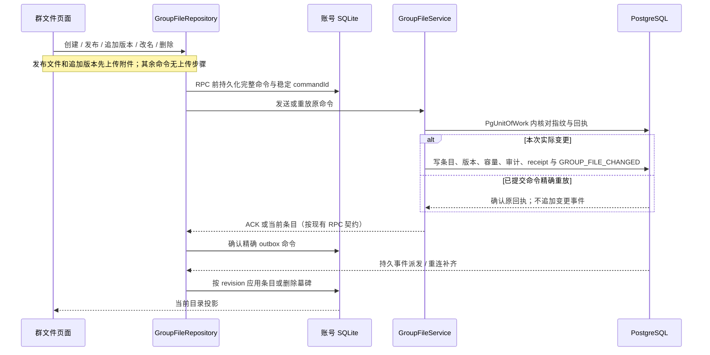

# 数据与同步

## 1. 消息发送生命周期

```text
Composer
  1. 生成 clientMsgId 与 MessageBody
  2. SDK 校验结构、附件路径和大小边界
  3. 经会话本地写者，由 SendQueue 原子持久化 SENDING 乐观消息与 outbox
  4. SendQueue 按 FIFO 认领，经 MessageSender / ImClient 通过 MESSAGE 发送
Server
  5. 校验认证、成员、消息类型与附件存在性
  6. 按 clientMsgId 幂等查询
  7. RocksDB 原子分配 serverSeq，并写高水位、消息、幂等索引、revision 和 CREATE operation outbox
  8. 按 operation revision 幂等提交 Lucene
  9. PostgreSQL receipt、Chat.maxSeq、Conversation 与 MESSAGE_RECV / CONVERSATION_UPDATED 一次提交
 10. 清除 outbox，返回 MESSAGE_ACK
Client
 11. 有效成功 ACK 原子更新本地发送状态与 outbox 回执；可重试失败保留原身份排队
 12. 回环 NOTIFY upsert 权威 Message 和 Conversation
```

第 5 步失败时不能返回成功 ACK。ImBot、Desktop 或 Android 只要收到成功，就应能把消息视为服务端
已接受；后续推送延迟属于同步问题，不是重新解释发送结果。

## 2. 幂等与顺序

`clientMsgId` 防止超时重试产生重复消息。服务端保存它到 `(chatId, serverSeq)` 的索引；精确重复发送
返回原消息，不推进高水位。如原请求留有未完成 outbox，重试会按 revision 顺序补齐投影再返回原结果。
新消息的 chat 高水位、消息、幂等索引和 CREATE outbox 位于同一个 sync-WAL RocksDB `WriteBatch`：批前
失败不消耗序号，批后失败一定留下可恢复消息。PostgreSQL `Chat.maxSeq` 是随 receipt、Conversation 和
同步事件一起提交的派生水位，并要求每次 CREATE 恰好从当前值推进一位。EDIT 和 REVOKE 同样先把新消息
快照与递增 revision 原子写进 RocksDB；相同 edit 或重复 revoke 不新增 revision。

`serverSeq` 在单个 Chat 内对已接受的权威消息从 1 连续递增，是历史分页、消息排序、缺口恢复和已读
水位的共同坐标。服务端权威历史出现空洞属于不变量损坏，不是正常失败语义；客户端本地投影缺页仍可
按已知 serverSeq 区间补拉历史。跨 Chat 不提供全局消息顺序。

## 3. 事件同步

大多数领域变更使用同一模型：

```text
PgUnitOfWork domain writes
  → append durable event intents
  → lock sync_streams in sorted uid order
  → allocate contiguous per-user stream_seq and commit once
  → invalidate process-local aggregate caches
  → after-commit dispatcher wake
  → push to all online devices under the user delivery gate
```

`stream_seq` 通过现有 wire `eventId` 暴露，只在一个 uid 内从 1 连续递增；不同账号可以拥有相同的
数字游标。领域 SQL 全部完成后才按 uid 固定顺序锁定 `sync_streams`，因此同用户序号顺序也是事务
提交顺序，多接收者命令不会只提交一部分事件。命令准入后，事务、缓存失效与 wake 是不可被请求
取消拆开的终态段；缓存失效必须先于 wake，保证事件触发的回查不会命中旧快照。进程若在提交后、
内存 wake 前退出，启动扫描仍会发现未派发事件；live 派发失败会阻塞该 uid 的后续序号并按持久重试
状态恢复。

dispatcher 的进程内 uid 邮箱只是提交后的有界提示，不是可靠队列。它最多保留 4096 个唯一 uid；
满载时可以丢弃提示，但会保留一个带版本的“必须扫描数据库”义务，只有一次成功的 PostgreSQL 扫描
周期才能确认恢复，扫描失败不能清除该义务。周期扫描、启动扫描和溢出恢复都使用稳定 uid keyset，
每个 worker turn 最多从 PostgreSQL 读取 256 个 uid；游标跨 turn 保留并在尾页后回绕，不会为了去重
把全部待派发事件及 payload 复制进 JVM 堆。溢出版本只有在一次从首 uid 开始的完整分页周期结束后
才确认，周期中出现的新版本另起下一周期，避免持续突发反复重置游标并饿死尾部账号。由此，突发只
影响实时唤醒延迟，不会改变 durable event 的完整性，也不会让单轮内存或工作量随事件表增长。

进程启动把第一次完整 durable scan 周期作为服务 readiness 门禁：所有有界页成功后才完成启动凭证，失败会原样
终止 Application 初始化并按资源逆序关闭，不能以“已尝试扫描”代替成功。运行期可重试的单次扫描或
投递错误仍保留 durable row/overflow obligation 并进入后续重试；若 dispatcher worker 因取消之外的
逃逸故障或 VM fatal 终止，则 liveness 与 readiness 同时进入不可逆失败，直到实例关闭和重启。

所有持久事件只能在权威 mutation 的同一个 outer `PgWriteScope` 中直接
`appendEvent`。不存在 standalone 持久事件发布器，因此新领域无法绕过该原子边界。
`TransientEventPublisher` 只向当前在线连接直发 eventId=0 的瞬时信号。

认证成功后，客户端等待 AUTH `datasetId` 对应的 LocalCache 与 EventProcessor 就绪，再用本地
`sync_state` 中不可拆分的 `datasetId + lastEventId` 发起显式分页同步。服务端先校验 dataset，再按 ID
升序返回有界批次；只有位于当前持久 floor 与 stream head 之间的游标才有效。客户端只有在整条事件投影成功
并原子保存 dataset 与单调游标后才请求下一批。
普通事件的业务投影、可靠 sink 与 cursor 提交是串行的独立步骤，不是整批或整事件的同一 SQLite 事务。
如果投影已成功而 cursor 未提交，重连从旧 cursor 幂等重放；checkpoint 则在收齐后把投影与 base cursor 一次安装。

最终的二次查空、`SYNC_READY` 与实时连接注册受同一用户事件门闩
保护。语义是 at-least-once：可能重复，不能丢失；完整快照通过 upsert 或稳定键删除收敛。

`lastEventId` 是“该账号已经持久投影完成的事件凭证”，不是跨账号全局序号。除初始值
`0` 只在持久 floor 仍为 0 时有效；低于 `compactedThrough`、损坏或越过本账号 `lastSeq` 的游标
触发显式 `SYNC_RESET`，不能通过一次空查询直接进入实时态并永久跳过后续事件。

RESET 不再回到 eventId 0。客户端保持 `SYNCHRONIZING`，在同一认证连接通过二进制
`SyncRpc` 先取得 current User 和 `baseEventId`，再分别收齐 Contact、可访问 Chat 和 Conversation
的服务端 keyset 页。每个 section 有自己的数据库读取，不宣称所有页共用同一 MVCC
snapshot；checkpoint anchor 与持久事件门闩共用同一 per-user gate，`baseEventId` 之后的 tail
负责收敛页间并发变化。

客户端收齐并校验全部 section 后，只在本地 `datasetId + cursor` 仍与加载前期望值精确相等
时，才用一个 SQLite 事务替换紧凑服务器投影并把 cursor 设为 `baseEventId`，再从该点
请求 tail。任何中间页都不发布到 SQLite 或 StateFlow。outgoing、Bot inbox/retained floor、会话
草稿/已读及可靠命令 outbox 保留并叠加到权威结果；同一 dataset 内的独立文档草稿 store 也不在
checkpoint 替换范围内。认证得到不同
`datasetId` 时则必须切换 deployment + dataset + uid 文档命名空间，旧 dataset 的草稿和可靠文档
operation 不得恢复或重放。收集/安装失败、同步页与 RESET 重叠或重复 RESET
一律断开，重连后从最后一个完整本地事务状态重试。

`sync_events` 默认保留 30 天，可通过 `TEAMTALK_SYNC_EVENT_RETENTION_DAYS=1..3650`
调整。compactor 只从当前 `compactedThrough + 1` 开始删除已完成派发尝试且已过期的连续
前缀，遇到未派发或未过期行即停止；序号空洞视为持久化不变量损坏，整轮失败并记录、重试，
绝不猜测推进 floor。删除事件与推进持久 floor 在同一 PostgreSQL 事务内完成。每一个 replay page、
checkpoint anchor 和 compactor 共用 per-user delivery gate；连接级
lease 保护最低仍需要的 replay/checkpoint cursor，断连时释放。

该设计保证的是“当前权威 checkpoint + 未压缩 tail”可恢复，不是永久业务回调队列。对 Bot 而言，
事件仍在服务端保留窗内，或已进入本地持久 inbox 后，可提供 at-least-once delivery；长离线
越过服务端事件窗时，checkpoint 恢复当前投影，消息历史可从 Message RPC 读取，但已压缩的
历史 delivery、编辑和撤回回调不会补发。

组织目录使用同一二进制连接，但不把一次全组织变更展开成每用户持久事件。组织管理写与全局
revision 在 PostgreSQL 提交后，`ClientRegistry` 向当前所有已经完成 `SYNC_READY` 的连接 best-effort
广播 `ORGANIZATION_CHANGED(revision, eventId = 0)`。该提示不能先于提交，也不能因单台设备写失败而
阻断其他连接；发布器整体失败同样不得把已经成功的管理命令改报失败。它不是 durable fanout，断线
设备不补发该帧。

客户端解码提示后先在 LocalCache 单调持久化 `requiredRevision`，再发布可合并的页面刷新信号。单位
快照和每个直属成员快照分别保存自己的 revision；低于 requiredRevision 的旧行继续可供离线展示，
但 `snapshotKnown = false`，不能作为完整目录、递归成员集合或权限证据。仅在
`AUTHENTICATED` 状态下，页面才以 `OrganizationRpc.listUnitPage/listMemberPage` 收齐同一 revision 的
权威分页快照；通知期间到达的更高 revision 合并为至多一次后续刷新。每次连接重新进入
`AUTHENTICATED` 都执行全量 revision-fenced RPC 对账，因此即使断线时漏掉全部瞬时帧也能最终收敛。

Presence 不持久化，因为离线期间的在线状态没有补发价值。`ClientRegistry` 启动时生成规范 UUID
`serverEpoch` 并从 revision 0 开始；首台设备上线和末台设备下线在修改连接索引的同一个串行 owner
命令中把 revision 加一，并冻结 uid、online、occurredAt、epoch 与 revision。中间设备增减不产生
transition。其 observer 只做非阻塞准入，不能等待最终又会进入注册表的 fan-out。

`PresenceCoordinator` 用容量为 1024 个“等待中 ∪ 正在投递”唯一 uid 的 latest-per-uid 邮箱保存完整
transition，并以 conflated wake 唤醒单个串行 worker：同一 uid 在等待期间的中间状态可以合并，但
occurredAt、epoch 与 revision 不得在异步层重建。已经进入 fan-out 的状态及其后继最终态仍按顺序投递。
邮箱满载时，已有 uid（包括正在投递的 uid）的最终态仍可更新，只有全新 uid 的变化会被丢弃；丢弃
总数持续累计并按阈值记录告警，不能把背压传回连接 actor。

登录基线由无参数 `contact.getPresenceSnapshot()` 提供。服务端先从 ContactRepository 取得当前认证用户的
完整好友集合，再用一次 Registry owner 命令同时读取当前 revision 与这些候选中的在线子集；因此
snapshot 返回 R 之前的 transition 已包含在 R 中，之后发生的 transition 必为 `> R`。RPC 不允许查询
任意 uid，也不暴露全局在线集合。

客户端 `FriendPresenceRepository` 是会话所有的纯内存投影。它先订阅 Presence/Contact 提示，再在
每次进入 `AUTHENTICATED`、联系人变化和首次或变化的 serverEpoch 上以 conflated 请求刷新完整快照；
refresh generation 与 latest-wins 取消共同拒绝迟到结果，单次失败保留当前投影且不热循环。同 epoch
只接纳更新 revision；快照前到达的较新事件先隐藏，待快照确认仍为好友后才发布；快照遗漏会移除旧
好友和未确认事件。epoch 变化立即撤下旧投影并等待新快照。离开认证态、quiesce 或 close 都清空为
UNKNOWN 并取消任务；Presence 不写 SQLite，不能让断线后的旧 ONLINE 看起来仍是权威事实。
同 epoch 的瞬时增量若在发布或接收侧丢失，不会自行触发即时补拉；认证/重连、联系人变化或换代等
下一次既定刷新点才会用完整快照重建基线。

TYPING 同样只走瞬时路径。发送方复用 Message 信封但不写 outbox，服务端在权威成员读取后以
`eventId = 0` 直发其他成员，不分配 serverSeq 或 ACK；IO 准入过载时直接丢弃。客户端仅在前台聊天的
真实正文变化上尝试发送，成功准入后才启动 2 秒 leading throttle；接收状态每次续期 3 秒，并在断线、
对方新消息进入当前投影或聊天 owner 销毁时清理。

## 4. 会话与已读

每个成员在每个 Chat 中有自己的 Conversation。收到消息时服务端更新 `lastSeq`；用户阅读时提交
新的 `readSeq`：

```text
newReadSeq = max(storedReadSeq, requestedReadSeq)
unreadCount = max(0, lastSeq - newReadSeq)
```

会话首页在 LocalCache 中仍是账号级全量 resident 投影，但权威网络快照通过最多 16 条的
keyset 页逐页传输，不再把全部草稿塞入一个 16 MiB 响应。服务端先应用活动 Chat、活动成员和
受管群可读条件，再按不可变 `chatId DESC` 查询 `limit + 1`；显示元数据用页内批量查询投影，
查询数不随页内条数增长。游标不使用会被草稿、置顶或新消息更新的 `updatedAt`；因此页间更新不会
把后排会话移到已读游标之前而永久漏读。

客户端在发出首页前只建立一个 mutation generation，全部页收集完成后才在一个 SQLite
事务中原子 apply，从不发布部分快照。页间收到 CHAT_CREATED、CHAT_DELETED 或 Conversation 更新会使
这一世代整体失效并有界重试；事件在 apply 后才到达时则通过幂等 upsert/delete 再收敛。客户端还拒绝不前进/
循环游标、跨页重复 `chatId`、超过 1,000 条、累计草稿超过 12,000,000 字符或累计文本超过
13,236,000 字符的快照；超过任一上限都是
明确失败，不得静默截断或删除本地会话。

服务端用按 uid 锁定的 O(1) usage 行守住相同聚合容量。用户“删除会话”只把仍有活动成员关系的
Conversation 标为隐藏、清除草稿并保留容量槽；真正退群或 Chat 解散才物理删除并释放槽位。只有
`lastSeq` 确实前进的新消息会恢复隐藏行，旧 CREATE 重放、EDIT 和 REVOKE 都不能让它重新出现。

LocalCache 构造时分别一次性读取 Conversation、草稿 outbox 和已读 outbox，并以 `chatId`
建立 keyed 内存状态。权威页收集后先去重并在 map 副本中完成本地草稿/已读叠加，SQLite 成功后
才替换内存状态，最后只生成并排序一次不可变 UI 列表。因此 N 条会话的快照合并为 O(N) keyed merge
加一次 O(N log N) 排序；置顶、最后消息时间相同时再按 `chatId` 排序，保证重启后的展示顺序确定。

Conversation 草稿的服务端与 LocalCache 契约当前仍只是一个 Markdown 字符串，不能与
`EmbeddedAsset` sidecar 原子持久化。带 `teamtalk-asset://` 引用的聊天编辑上下文仅在当前已认证
会话内保留完整 Markdown + sidecar，对外的持久/跨设备草稿镜像写空串，而不是写入失去 sidecar 的裸 URI。
因此普通文本草稿仍本地优先并跨设备收敛，未发送的富资产聊天草稿则不承诺跨进程或跨设备恢复。
缓存变化（包括清空）也会更新打开中的未修改输入框；本机编辑上下文的保留规则由共享 UI 处理，见
[客户端交互状态](../05-clients/README.md#3-交互状态与远端状态)，SDK 不复制编辑器状态。

User、Chat 和群成员不沿用会话首页的全量 resident 边界。它们始终完整持久化，但 User/Chat 只按主键
短读，群成员只按一个 chat 联表读取；仅活跃观察的实体键拥有引用计数 StateFlow。联系人列表是当前
产品明确保留的另一项全量 resident 投影，缓存打开时通过一次 Contact/User 联表恢复，不触发逐联系人
查询。USER_UPDATED 只重组联系人和反向索引中当前已观察的群成员；未打开群不会被扫描，之后读取时
从 SQLite 联接最新资料。CHAT_DELETED 和 cache close 在同一投影锁内使对应现存观察者看到空值并
推进 snapshot fence，墓碑前的在途 RPC 不能借惰性重读复活已删行。`SYNC_RESET` 本身不发布中间
全空状态；checkpoint 完整安装后才在同一投影锁内一次发布权威替换，仍存在的 User/Chat 观察者直接
看到新值，只有被 checkpoint 排除的键变为 null。close 还发布独立于业务值的 retirement 信号：
即使当前值原本就是 `null` 或空列表，所有实体观察流也会完成，最后一个收集者的引用释放不依赖
已经关闭的 SQL admission gate。

服务端向同一用户设备推送 Conversation 更新，并向其他成员推送可展示的 peer read waterline。
水位单调合并，因此乱序和重复事件不会让“已读”倒退。

### 表情回应：完整区间快照与实时增量

`message.listReactions(chatId, fromSeq, toSeq)` 的成功结果是请求闭区间的完整聚合，省略某个 seq 或返回
空列表都表示该位置没有回应。SDK 在 RPC 前获取该 chat 的本地快照租约，成功时在同一锁和 SQLite 事务
中删除区间旧行并写入完整结果；相邻区间与其他聊天不受影响。不能只删除响应中出现的 seq，否则空结果
永远清不掉旧回应。

飞行期间的实时 delta、后继快照、消息清理或 checkpoint/reset 使旧租约失效，迟到响应不能覆盖更新。
普通回应增量按用户事件流顺序处理，依赖 eventId 去重；它没有群文件那套行 revision/墓碑模型。
checkpoint 把回应作为可回拉投影与消息一起清理；保留的聊天页在重新进入 AUTHENTICATED 后补当前窗口快照。

实现从 [MessageRepository](../../client/shared/src/commonMain/kotlin/com/virjar/tk/shared/repository/MessageRepository.kt)
的 `loadReactions` 进入 [LocalMessageReactionStore](../../client/shared/src/commonMain/kotlin/com/virjar/tk/shared/client/LocalMessageReactionStore.kt)。
首次被新 delta 取代时立即重拉一次；连续两次竞争则停止，不推进页面已收敛范围，后续窗口刷新或重新认证继续恢复。
网络错误与 owner 取消不自动重试，不把聊天活动变成无界 RPC 循环。

## 5. 群成员变化

建群、加人或通过邀请加入时，服务端必须在推送群事件前为新成员建立 Conversation。移除成员时，
成员不能继续发送或读取受保护历史；被移除者仍需收到足够事件清理本地群状态。
图形客户端的建群先把规范化后的 `operationId + creator + name/avatar + memberUids`
写入 deployment + uid 隔离的 LocalCache 单槽，SQLite 提交是 RPC 发出前的 durability barrier。
进程重建后页面恢复完整冻结载荷；网络、超时或响应解码失败保留同一 ID，只有服务端成功应答才条件
清除该代次。载荷明确修改会原子替换为新 ID，用户也可显式放弃恢复命令；较旧请求的迟到成功不能
清理新命令。

好友申请接受/拒绝和邀请链接创建也先写入 deployment + uid 隔离的 SQLite outbox，再发首个 RPC。前者按
token、后者按 chatId 各只允许一个不可变待确认 payload；相同用户动作复用已保存的 operationId，冲突动作
不能覆盖未知结果。两类本地 outbox 各有 128 条硬上限。成功或明确的非 401/403/429 4xx 条件清除精确
generation；网络、超时、认证失效、权限拒绝、429、5xx、本地解码或未知故障继续保留，恢复 worker 复用原
ID 重试。403 不证明 ACK 丢失前的命令未提交，权限恢复后仍需取回原结果。

客户端把首次本地提交时的 `issuedAt` 作为不可变 payload 一并重试。服务端只接受允许 15 分钟未来时钟偏差且
未超过 7 天可靠期限的命令；过期命令固定返回 410，即使回执已经清理也绝不重新执行。服务端在领域 mutation
的同一 PostgreSQL 事务先占用 actor + operationId、保存规范指纹并完成结果收据；
相同 ID/相同 payload 返回原结果，不重新建立关系、创建链接或追加事件，相同 ID/不同 payload 返回 409。
好友处理收据每 actor 最多 1,024 条，邀请创建收据每 actor 最多 256 条；只清除已越过 7 天期限的收据，窗口内
达到硬容量时新命令返回 429，不得逐出仍可重试的身份。邀请重放仍重新取得当前活动群/User
锁并校验受管写权威和 admin，通过后才读取 token；回执与活动链接生命周期分离，撤销链接不破坏窗口内重放，
但撤权立即阻止秘密回读。沉默或已删除账号不依赖下一次业务写入：全局维护 worker 按 `expires_at, id` 索引、
固定页数和固定批量回收两张表的过期行，单轮工作量与事务锁持有时间都有硬边界。

角色和禁言变化发送完整 Chat/Member 快照。权限判断只读服务端当前状态，不信任客户端缓存角色。

## 6. 附件生命周期

```text
HTTP upload
  → FileStore 写入并返回 canonical relative path
  → client 构造 Attachment
  → MESSAGE send 或 DocumentContent RPC
  → server 按 path 查询元数据并校验
  → message 的 attachment→chat 索引，或文档的 revision interval manifest 写入
  → Markdown 只保存 scope-local asset URI；relative path 仅存于二进制 sidecar
  → receiver 用 access token + serverUrl + path 下载
```

上传成功但尚未形成业务引用的文件持有默认 7 天上传租约；小时级维护按固定页扫描过期对象，批量合并
MessageStore、群文件与文档修订清单的权威引用，只在零引用时通过 FileStore 持久 tombstone 回收实体和容量台账。
消息/群文件/文档从最终附件校验到引用提交，与回收决策共用固定容量的单实例分片跨存储围栏，因此同一路径不能在“已确认存在、
尚未提交引用”的窗口误删；提交后崩溃则由下一次权威引用扫描恢复决策。撤回消息和删除群文件会移除
活动引用，共享对象必须等最后一个引用消失才可回收。上传者只能在对象仍为未绑定 `staging`
状态时通过 owner 旁路预览/提交它；任一消息、群文件或文档引用会先单调置位 `businessBound`，之后连原
上传者也必须通过当前业务 ACL。消息发布后，当前会话成员经反向索引获得读取权限；文档资产则每次按
当前空间 `READ` ACL 判定。
退出或被移除后，服务端按实时成员资格拒绝新的下载。附件完整契约见
[消息与附件](../04-protocol/messages-and-attachments.md)。

## 7. 群文件生命周期



群文件目录已进入 LocalCache。领域分页提供完整目录快照，`GROUP_FILE_CHANGED` 提供持久行级变更；
`LocalGroupFileEntryStore` 按 revision 和删除墓碑合并，页面观察本地投影。离线旧数据可用于展示，
远端权限仍由当前成员关系裁决；搜索和历史/收据容量治理仍未完成。

图中的 PostgreSQL 派发箭头包含服务端 dispatcher 与客户端 EventProcessor，不是数据库直连客户端。
服务端的 [GroupFileRepository](../../server/server/src/main/kotlin/com/virjar/tk/server/domain/groupfile/GroupFileRepository.kt)
返回“当前条目 + 是否实际变更”，[GroupFileService](../../server/server/src/main/kotlin/com/virjar/tk/server/domain/groupfile/GroupFileService.kt)
只对真实变更追加事件。精确重放不新增条目、版本、审计或事件；rename/delete 的 Unit 回执不要求原条目仍存在。
创建与追加版本仍返回当前条目并受当前成员/条目/附件读取条件约束，这几类命令在删除或撤权后的确认契约
仍需结合[群文件历史治理](../10-reference/roadmap.md#content-03--群文件历史容量与保留治理)一起完成。

创建目录、发布文件、追加版本、重命名和删除在首个 RPC 前，都把规范 UUID、完整不可变参数和可选
附件描述符写入 deployment + dataset + uid 隔离的 SQLite outbox。创建意图按
`chat + parent + 规范名称` 唯一，目录与文件共享服务端同级名称约束；追加版本、重命名和删除共享
`chat + entry` 的 per-entry mutation 槽。同一待确认意图复用已持久化的 `entryId/commandId`，不同
payload 不能覆盖未知结果。队列最多 256 条、单条规范载荷最多 24 KiB、合计最多 3 MiB；
超限先拒绝且不驱逐旧事实。

Repository 用同一个 single-flight mutex 串行前台提交与后台重放；worker 拿到锁后会再查精确
`commandId` 是否仍在 outbox，不使用锁外的过期快照重发已终结 generation。成功 ACK 条件清除精确命令。
前台在等待该 mutex 前先固定当时已持久的 generation；若 worker 先完成，前台仍以同一
`commandId` 读取服务端收据，不会在旧行清理后为同一用户动作生成第二代。
transport 不可用、超时、RPC 状态 408、429 和 5xx 在前台返回 `PENDING`，保留原命令由恢复 worker 重试。
其他能确定该不可变操作不会成功的业务 4xx 清除本 generation 并报告拒绝；401、403 与本地 codec 失败
则保留可诊断/可恢复的原命令，但当次向调用方返回失败，不伪装成已接受的 `PENDING`。

后台终结会发布不含附件和名称的 `ACKNOWLEDGED` / `REJECTED` completion。`REJECTED` 向用户说明先前
保存的操作未完成，并重拉当前同 chat 页面；`ACKNOWLEDGED` 中的创建、重命名和删除只刷新匹配
chat/parent 的当前页，追加版本只刷新当前可见或正在查看的精确文件。若 ACK 的重命名命中已打开的祖先目录，
客户端重拉同级条目后替换路径节点；若 ACK 的删除命中当前路径分支，客户端退回被删目录的父级并清空旧页，
不让迟到 completion 把已切换的页面改回旧位置。

服务端为五类 mutation 都保存 actor、kind 和规范 payload 指纹的不可变收据。创建/追加版本的精确重放会核对
条目或版本事实；重命名/删除的 RPC 只返回 `Unit`，只有精确收据重放才作为这两个无载荷结果的窄例外。
收据 ACK 只证明原命令已提交，不代表条目当前仍存在或可见。协议为重命名和删除补齐
`commandId`，从而形成当前五类 mutation 的完整可靠命令契约。

群文件写入以 Chat 行为聚合围栏，在同一事务内复验成员并检查活动条目、直接子条目、活动版本和版本
总字节四项容量。活动条目数和活动版本字节数来自每群唯一 usage 行，删除按条目自身累计字节扣减；
写路径不会扫描全群历史版本。零字节版本仍消耗版本槽。目录和版本列表只多取一个越界探针行；若历史数据已超过
固定边界则整次读取失败，不能把静默截断伪装成完整目录或完整版本历史。

## 8. 文档生命周期

```text
client listSpaces(cursor?, limit <= 64)
  → server 在 SQL 中合并 owner、用户 grant、实时部门 membership/grant，按稳定 spaceId 键集分页并去重
  → client 发布单页并按需加载下一页；只为页面结果计算有效角色
client listNodes(spaceId, parentId)（仅子文档摘要，不传全部 Markdown）
client getDocument(spaceId, documentId)（当前完整快照）
client updateDocument(spaceId, documentId, DocumentContent(markdown, assets), expectedRevision)
  → server 重算空间有效角色
  → 在附件分片围栏中校验主文件/缩略图；新资产必须是本人未绑定 staging，复用只认同一文档历史已知资产
  → 将本次引用的 staging 对象先单调标记 businessBound
  → PostgreSQL 锁定文档当前行并比较 revision
  → 原子更新当前快照 + 追加不可变 DocumentRevision + 更新资产 revision interval
  → 返回新 revision
client moveNode(spaceId, nodeId, parentId?, name, expectedRevision, operationId, issuedAt)
  → client 在首个 RPC 前把完整不可变命令写入 LocalCache durable outbox
  → server 在同一事务移动/改名并追加 7 天有限收据
  → 首次提交返回当前移动投影；精确重放返回同 operationId 与空投影
```

文档的“历史已知资产”指 assetId 及描述符已经出现在该篇文档的某个已持久化修订中。对其他文档、
消息或群文件拥有读权不等于可将其资产重新绑定到本文档；新建文档没有历史集合，所有首修订资产都必须是调用者
本人的未绑定 staging 上传。这一边界阻止被撤权的旧上传者或仅拥有其他业务读权的用户借 path 抢占资产。
为使跨存储失败关闭，`businessBound` 早于 PostgreSQL 业务提交；若后续冲突或事务失败，对象可保守成为等待回收的孤儿，
但不能恢复 uploader 旁路。

空间游标是版本化、不透明的规范 UUID 锚点，查询使用 `spaceId > anchor` 和 `limit + 1`，不依赖游标行继续
存在或继续可见。首个响应确定本轮 `snapshotVersion`，服务端发现目录版本变化时返回显式 restart，客户端
最多重启三轮，不能拼接新旧目录。客户端最多保留 1,024 个空间身份，并把当前选中、已打开及本机草稿
空间视为恢复身份；远端窗口满后，完整接纳新页并淘汰最早的未保护远端行。保护身份导致新页无法完整进入
时停止推进游标。带有 `nextCursor` 的任意中间页只是局部窗口，恢复身份尚未出现不能解释为撤权；只有从
首 cursor 开始的完整扫描到达终点页后，整轮 omission 才可删除对应远端干净投影。网络失败继续保留本地
工作状态。

修订列表从持久化小字段投影标题、版本、字符数和编辑元数据，并按 revision 独占游标有界分页；用户选择具体版本后才按需读取完整 Markdown 与
该修订区间的资产清单，不用当前清单补造旧版本。恢复历史
版本沿用正常 update 流程，因此仍受最新 revision 冲突保护。

每个树节点都对应一篇完整 Document。`parentId` 可指向同空间的任意活动文档；客户端展开一篇文档时只加载它的直接
子文档，打开标题时才读取该文档正文。文档是否已有子节点不改变其身份、正文或修订语义。服务端、SDK、
LocalCache 和测试投影统一按不可变 `(createdAt, nodeId)` 对同级节点排序；名称不参与顺序，也没有第二套
可变 position、手动排序或 CRDT。移动保留原创建身份，因此目标分支仍可确定性重建同一顺序。

空间授权不复制部门成员；每次访问都使用当前 OrganizationMember 关系。服务端读快照以 actor 的活动
直属 membership 为 recursive CTE 锚点，只沿活动父链向上读取并确定性去重，不加载全量组织树；归档
节点截断继承，循环路径只保留直属授权，宽树中的无关节点不会进入结果。

客户端把成功 RPC 得到的空间工作集、最近访问/最近创建、已读取直接子分支和干净正文写穿到
deployment + dataset + uid 隔离的 LocalCache SQLite。空间、两条首页集合和每个 `(spaceId, parentId)`
分支分别保存“已加载”标记，因此权威空结果不会在重启后退化成缓存缺口。投影最多保留 1,024 个空间、
每条首页集合 50 项、20,000 个分支/50,000 个节点（每分支不超过 512 项），以及按 LRU 保留的 512 篇、
合计 64 MiB UTF-8 干净正文。空间分页窗口的容量淘汰不是撤权，不连带清理仍在独立预算内的分支或正文。

所有 Document RPC 都由会话内 `DocumentRepositoryBoundary` 的单一 `Mutex` owner 串行执行。远端调用、
对应 LocalCache publication/purge 和空间级失败向工作台的发布结束后，下一次 Document RPC 才能开始。
客户端不维护服务端 ACL 的镜像状态机，也不再有 space/document authority generation、issuance watermark、
readmission、正负 cutoff 或持久权限 tombstone。服务端在每个请求上以当前用户、实时组织关系和 grant
重新授权；缓存中的 `myRole`、owner、steward、custodyRevision 与 policyRevision 只是展示/CAS 投影。

LocalCache 的每个普通投影 lane 只保留一个 latest-request-wins `ProjectionSnapshotLease`：空间完整扫描、
空间 mutation、两条首页集合、每个分支、正文读取和正文 mutation 彼此隔离。响应只能消费同 lane 的当前
lease，并在同一缓存锁与 SQLite 事务中发布完整行或执行清理；失败和取消只 abandon 自己的 lease。
空间扫描的一张 lease 可跨越同一 refresh cycle 的多页，直到终点页才消费。两条首页查询分别实时授权，
返回列表直接替换各自投影，不根据客户端保存的角色做第二轮过滤。

工作台先发布缓存，再在后台 RPC 收敛。网络、超时、取消和 5xx 保留最后一份干净投影；当前串行请求的
空间级 403 会原子清理该空间的空间行、首页、树、授权界面和干净正文，根分支 404 同样退休空间；精确
文档 404/成功删除只清理目标文档及本地已知子树，单个历史修订的 404 不能删除活动正文。

一次 `listSpaces` refresh cycle 从首 cursor 开始，页间必须保持 snapshotVersion、严格 identity 顺序和
连续 cursor。只有终点页到达后，扫描开始时存在但整轮未出现的远端身份才以 omission 清理；局部页、
restart、网络失败或容量截断都不能推断撤权。清理干净投影不触碰独立 DraftStore：活动 dirty/creating
标签以 `pathResolved = false` 的本机 orphan 保留，并由 `offlineDraftSpaceIds` 阻止后续远端写、移动、
历史或 ACL 操作。重新获得访问权时，新 `listSpaces` 返回的完整 `DocumentSpace` 行重新建立投影；客户端
不把旧 metadata、role、custody 或 policyRevision 与新行拼接。

ACL mutation 不等待 Notify，而以 `expectedPolicyRevision + operationId` 可靠命令和 typed ACK 收敛。
进程内 outbox 在网络、408、5xx、取消或未知结果时保留首次 expected revision/opId；本地目录变化不生成
第二个同语义命令，同一 space 的冲突 intent 在前一结果确定前不发送。ACK 的
`effectiveRole = NONE` 立即清理整空间干净投影；任何正向 ACK 只触发新的 typed 空间快照，并在新快照仍
显示 ADMIN 时重拉 grants，不能用旧缓存 `copy` 出 role/policyRevision 组合对象。迟到 exact replay 可以
返回后续 mutation 形成的当前 revision，但客户端仍只接受服务端返回的完整新行。

当前仍没有 document Notify。进入工作台、导航到空间/分支/正文、显式刷新、成功写操作，以及工作台
已经打开后的重认证边沿负责有界收敛；仅停留在页面时，其他设备的修改不会实时推送。若两个成员从同一
revision 保存，只有先到达者成功，失败者本地编辑内容不应被清空。

未保存正文使用独立于 LocalCache 的本地续写存储，不扩大服务器事实边界。一个小型原子 manifest 只列出
脏/新建标签、待确认创建命令、破坏性操作意图及活动标签/空间提示；每个标签和命令按 recovery key 独立、受限编码，平台逐条安装
内容寻址记录后才发布 manifest。单条记录上限 16 MiB，全部记录精确编码总量上限 32 MiB，最多 1024 个
恢复身份；common 入队前以无分配的保守估算拒绝确定超限状态，平台和恢复入口再用 descriptor 的精确字节数复核。
恢复在读取任何正文前先校验全部 descriptor 的聚合预算，再逐条读取；单条记录损坏只丢弃该身份；磁盘/队列暂时不可用返回
`RETRYABLE`，上层不得把它缓存成“没有草稿”，也不得在恢复完成前写入新的快照。显式放弃先写独立
tombstone，再移除内存状态；新 manifest 发布后只能清理已经不再活跃的 tombstone。canonical deployment
fingerprint、datasetId 与 uid 共同隔离 namespace；只有用户明确退出账号才以单调删除状态阻止迟到写复活，认证失效只移除凭据并
保留同一 owner 的离线工作，其他 uid 无法读取。Desktop 还以进程级 writer lease 隔离同一账号的前后会话。
该机制只承诺恢复本机未保存工作、幂等创建和待确认破坏性命令；干净空间、首页、已加载分支和正文由
LocalCache 的独立有界投影负责，ACL grant 与历史列表则仍按需读取。`DraftStore` 记录中的
parent/ancestor 只为稳定创建意图保留，不能成为恢复后的目录事实；进程或 Activity 恢复时所有标签
统一降为 `pathResolved=false`、选中父页面为空，正文仍可编辑；路径只能由 LocalCache 中完整的
`Document` 投影或新的完整 `Document` 响应重新建立，不能由草稿 manifest 自证。
文档草稿记录会把 Markdown 与已上传 `EmbeddedAsset` descriptor sidecar 按同一版本编码恢复，但它不把操作系统
本地源文件变成可续传命令，也不在服务端创建草稿引用。所以断网时新选附件、上传跨进程续传和超过未引用租约的
长期草稿资产保留均不在当前承诺内。

空间创建 outbox 的成功终态由 `DocumentSpaceCreateResult` 判定。`space = null` 可以是服务端直接证明稳定
`spaceId` 对应的原创建事务已提交，但创建者在响应丢失后的重放时已因交接或归档没有可返回投影；非空
`space` 则是该次响应携带的完整服务端行。两种结果都是命令成功：工作台必须先持久封存并完成精确 create
outbox，不能把本地 SQLite/UI publication 失败当成 RPC 失败继续重试，也不能从原创建 intent 复活
`myRole = Owner`。非空行先走普通 space mutation snapshot，再由当前 navigation generation 决定是否选中；
调用者重新命中 grant 时仍由后续 `listSpaces` 按实时权限重建。独立未保存内容按 DraftStore orphan 规则保留。

文档创建 outbox 对应 `DocumentCreateResult(documentId, document?)`。首次提交通常携带完整文档；响应丢失后的
精确重放即使遇到撤权、交接、归档或该文档已删除，也可以只返回稳定 `documentId` 与 `document = null`。
两种响应都证明创建命令成功。若匹配标签仍存活，工作台必须先同步捕获最新编辑器帧，再绑定已提交的 documentId、
结束 creating 状态并清理完全匹配的 create outbox；捕获失败时保持原创建身份和 outbox，等待同一命令再次完成本地收尾。
null 不得被解释为 RPC 失败，也不得从本地初始 payload 伪造当前服务器投影。若远端携带文档，Repository
先尝试写入普通正文 mutation snapshot；工作台只在 tab instance、document request identity 与创建时捕获的
edit generation 仍匹配时合并 UI。迟到响应不能覆盖后来编辑、关闭后重开的标签或另一个创建命令；远端
命令成功与本地 publication 成败始终分开。

归档空间和删除叶文档使用独立的 destructive outbox。每次用户动作冻结一个 canonical UUID
`operationId`（删除同时冻结 space/document/parent/expectedRevision），先把意图写入 manifest 并通过
durability barrier，RPC 才能发送。服务端把 operationId 与软删除原子提交；响应丢失或进程退出后客户端
恢复同一意图、先建立只读终态围栏，再用同一 ID 重试。确认服务端成功后，本机在一次 tombstone 集合中
同时封存操作世代和所有受影响的标签/创建命令，再移除可见状态；因此“服务端已删、本机尚未改清单”的
崩溃窗口不会复活旧草稿。明确的 `400/409` 只封存操作世代并保留正文，网络/超时/未知结果则保留意图与
围栏继续重试。破坏性意图自身最多 512 个，并计入全局 1024 recovery identity 上限。

`updateDocument`、`moveNode` 和 `deleteNode` 的乐观锁冲突由文档领域异常表达，RPC 只把该异常映射为
`409`；普通参数/树规则校验仍为 `400`，取消则原样穿透请求 owner。保存的 `409` 会触发带标签实例和
编辑世代门禁的最新快照读取，采用服务器内容或保留本地草稿并基于最新 revision 继续都只是本地合并，
不会隐式再次写入。移动同样捕获旧父/目标父与 revision，成功后使相关懒加载分支的旧响应失效。
客户端的每个已加载树快照必须保证 nodeId 全局唯一。完整 `Document` 被接受后，在任何挂起前按 nodeId
扫描并淘汰错误分支，同时失效捕获旧父、缓存旧父和权威新父的请求；刷新始终绑定原 spaceId，并分别尝试
新、旧父分支。分支发布会从其他分支原子移除新结果中的 nodeId；路径 reveal 最后还要验证目标本身位于
权威父分支。不同父分支乱序返回同一 nodeId 时，低 revision 不得覆盖高 revision；同 revision 却声明不同
parent 属于投影矛盾，必须拒绝该次发布；后续显式刷新仍从服务端重建。失败只按 instance + document + parent/ancestors +
revision 的路径 stamp 降级该标签，绝不清正文。
移动后的打开标签路径复核只有一个 session 级 latest-wins owner：目标按空间与文档 ID 去重，RPC 以最多
4 个为一波串行推进，新 owner 产生后旧 owner 至多收完当前波且不得发布。网络、超时、认证或空间拒绝
会终止后续波次；合并仍须同时匹配标签 instance、文档身份和未解析状态，因此导航已校验的标签以及关闭后
重开的新实例不会被迟到路径覆盖。

`updateDocument` 是 content-only 写入，不携带 title；标题与 parent 只允许通过 `moveNode` 改变。客户端的
move/rename outbox 按 `spaceId + nodeId` 保留一个未决槽，最多 256 条，冻结首次 parent/name/revision、
canonical operationId 和 issuedAt。网络、超时、408、429 或 5xx 不换身份；后台与进程重启继续重放。服务端
首次提交和 actor 作用域 receipt 在一个 PostgreSQL 事务内完成，每 actor 最多保留 1,024 条仍处于 7 天
窗口内的身份；同 ID 异 payload 返回 409，过期返回 410，满窗返回 429。

首次提交的 `DocumentMoveCommandResult.result` 携带事务内当前节点和祖先链；精确重放令 `result = null`，
只证明原副作用已经提交，不复刻可能过时的历史位置。SDK 收到空投影 ACK 后先检查已缓存的足够新投影；
正文已缓存时读取当前 `Document`，否则读取当前 path spine。只有当前名称、位置和 revision 已发布，或
403/404 已完成相应投影清理，才删除本地命令；收敛读取的网络/5xx 失败继续保留 outbox。工作台把恢复
完成事件延后到草稿恢复屏障之后，再按当前标签实例合并，避免结构 ACK 覆盖尚未恢复的正文草稿。

## 9. 故障语义

| 故障 | 正确行为 |
|---|---|
| ACK 超时 | 本地消息标记失败/可重试；用同一 `chatId + clientMsgId` 重发 |
| NOTIFY 重复 | upsert 幂等，游标继续推进 |
| NOTIFY 解码或写库失败 | 记录 fault，不推进游标并关闭连接；重连后显式同步重试 |
| TCP 断开 | 保留用户层与本地缓存，指数退避重连 |
| AUTH_FAILED | 停止重连，清 token，销毁 ClientSession |
| 客户端本地历史缺少已知 serverSeq 区间 | 按 serverSeq 主动拉取权威历史修复；服务端权威历史空洞按不变量损坏诊断 |
| 搜索索引缺失 | 从消息权威存储重建 Lucene，不修改消息 |
| 文档 revision 冲突（409） | 拒绝覆盖并保留本地草稿；读取最新快照后由用户明确采用或基于最新版本继续 |

## 10. 一致性边界

TeamTalk 不提供跨 PostgreSQL、RocksDB 与 Lucene 的分布式事务。写入顺序和恢复手段必须保证：

- PostgreSQL/RocksDB 权威数据先于通知成功。
- Lucene 是可重建派生索引。
- MessageStore 把 chat 序号高水位与新消息原子提交；PostgreSQL `Chat.maxSeq` 只在 CREATE 投影事务中
  连续推进，不能先预留序号。
- Conversation 与事件由 PostgreSQL receipt + 同一 `PgUnitOfWork` 原子投影；PG 已提交后的重放不会
  产生新 eventId。
- MessageStore 以版本化 operation outbox 记录 CREATE/EDIT/REVOKE；启动循环恢复到全局连续两次查空，
  运行期失败保留 operation 并拉低 readiness。
- Lucene 以稳定 projectionKey 和 revision 拒绝旧重放；撤回/空正文使用 tombstone 防止旧正文复活。
- 客户端不因短暂派生数据缺失伪造权威成功。
