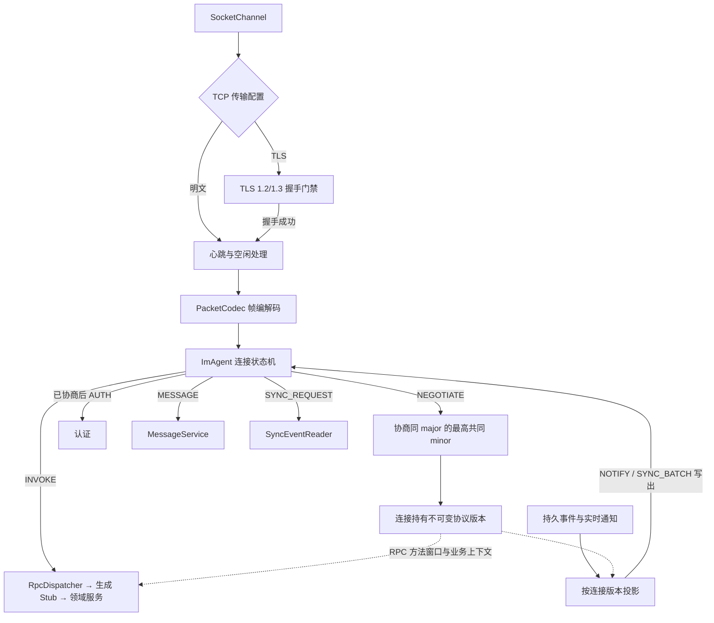

# 服务端运行时

## 1. 进程组成

TeamTalk 服务端是一个 JVM 进程，包含：

- Ktor/Netty HTTP(S) 服务：文件、健康、静态资源、日志和管理 API。
- Netty TCP 服务：连接、认证、RPC、消息、通知和心跳。
- 领域服务：用户、联系人、群、消息、会话、设备、在线状态和管理。
- 基础设施：PostgreSQL、RocksDB、Lucene、文件分层存储和事件同步。

它们由每个 Ktor Application 自己的 Koin 容器组装为容器内单例；每个 TCP 连接拥有独立
`ImAgent`。服务端运行时不读取进程全局 Koin 或 Exposed 默认数据库。

## 2. 启动顺序

```text
resolve Environment/dataRoot
  → initialize logging
  → validate the configured protocol window and local storage epoch
  → create Application-owned PostgreSQL handle, validate schema and apply known ordered migrations
  → verify PostgreSQL and local stores share the existing dataset identity
  → bind its Database explicitly into the Koin graph
  → open RocksDB stores
  → audit/rebuild Lucene from the bounded authoritative MessageStore cursor, then open the index
  → start durable sync dispatcher and await its first successful PostgreSQL scan
  → recover pending message projections
  → start TCP server
  → start HTTP(S) server
  → expose health status
```

新发行和连接协议以 `0.0.0` / `0.0` 为基线，服务端现有存储 epoch 继续是 **1**，原 dataset ID
保持不变。连接协商不能代替存储迁移；不支持的 schema、epoch、dataset 或迁移记录会阻止启动，普通
升级不清空业务数据。当前 PostgreSQL 0 号迁移在原 epoch 内放宽遥测协议 ID 的旧 byte 约束；DDL 与
`schema_migrations` 收据处于同一启动事务，失败共同回滚，完成后重启不重复执行。具体顺序和后续
迁移边界见[持久化生命周期](../06-server/persistence.md#6-schema-epoch-与生命周期)。

存储初始化、Lucene 权威一致性审计/原子重建、durable sync 的首次 PostgreSQL 扫描或 message operation outbox 恢复失败时应阻止实例
进入可用状态。FileStore 初始化包含 metadata、RocksDB payload 与大文件目录的全量一致性 reconcile；
pending、dangling 或 orphan 只有在物理占用已确认删除后才能撤销权威计量，无法收敛时不得发布健康；
metadata 扫描与 orphan 删除采用受固定文件数/批次约束的流式账本，零字节对象也占用持久文件槽。
首次 sync 扫描使用固定大小的 uid keyset 页跨多个可取消 worker turn 完成，不持有跨页数据库快照；
它不仅要枚举 pending uid，还必须让每个已发现 uid 的 PostgreSQL
读取/标记边界无未处理失败；逐 uid 异常不能被后台重试策略吞掉后仍宣称 READY。首次 sync 扫描成功前不能开放 TCP 或宣称 ready；后台 dispatcher 此后若因不可恢复
异常终止，则保留进程内 liveness/readiness 终态并让 `/health` 持续失败。公开健康详情只报告固定阶段，
内部异常仅进入服务日志和关闭终态，不能把 SQL、连接信息或异常正文返回给探针。`/health` 只有在
PostgreSQL、RocksDB、Lucene、sync-event-dispatcher、message-projection readiness、文件存储和 TCP
均可用时返回成功。
TLS 模式的 TCP 健康项以当前 keystore 叶证书作为唯一信任锚，对本机监听端点执行真实 TLS handshake；
明文模式使用 socket 连通检查。

PostgreSQL 所有权以 `PostgresDatabase` 为边界。`DatabaseFactory.create` 每次创建独立
`Database + HikariDataSource`，`createServerModule` 必须接收该 `Database`；所有自行开启 Exposed
事务的 Repository、UoW、同步、健康与管理适配器都显式传入同一个实例。关闭 Application 时先停止
后台任务、连接与本地存储，最后注销该 Database 并关闭它自己的连接池。两个嵌入式 Application 或
`TestEnvironment` 可以同时存在，关闭其中一个不会替换、关闭或重定向另一个的数据库。

Application 的资源 owner 按获取顺序的逆序释放，并在某个 closer 失败后继续清理其余资源；全部
释放完成后会聚合并上抛普通关闭错误。closer 或诊断回调抛出的取消与 VM fatal error 只延迟到 drain
完成，随后以原对象传播，其他关闭错误作为 suppressed cause 保留。并发和重复 `close` 等待同一次
drain；成功保持幂等，失败重放同一个终态异常对象，不能把进行中或失败的关闭伪装成“Server
stopped”。唯一例外是显式 dependency-quiescence barrier：普通 closer 失败仍继续 drain，但 worker
屏障报告尚未真实退出时，owner 必须终止 drain 并保留更早获取的依赖，不能为了关闭进度提前释放仍
可能被使用的 JDBC、RocksDB、Lucene 或文件句柄。关闭开始后才提交给 owner 的资源会由提交线程立即
释放并被拒绝。若启动本身已失败，清理
中的普通错误作为 suppressed failure 附着在原始启动异常上；清理阶段的取消或 VM fatal error 仍以
原对象优先，启动错误成为它的 suppressed cause。
后台 maintenance 由一个运行时一次性安装固定上限内的 worker，启动后不能动态追加；意外 worker
终止会取消同组 worker，并在关闭时重放同一个异常终态。取消等待使用所有并发/重复关闭者共享的单调
时钟上限。若阻塞式驱动无视协程取消，到期后关闭会稳定失败，但“关闭尝试已到期”和“worker 已退出”
是两个独立事实：dependency barrier 只有在根 Job 真实完成后才允许 owner 继续释放依赖，否则把剩余
资源留给进程级 fail-stop（例如服务管理器最终强制终止），而不是制造 use-after-close。进程退出后不得
复用该 maintenance runtime。
其中同步事件回收 worker 默认每小时扫描一次；单轮用户与事件数均有固定上限，耗尽预算时
以 5 秒间隔追赶，失败则等待 60 秒重试。它只压缩已完成进程内推送尝试且越过保留期的连续前缀，并与 replay/
checkpoint 共用 per-user delivery gate；删行与 `compactedThrough` 推进在同一 PostgreSQL 事务内完成。
durable sync dispatcher 与 Presence coordinator 各自在第一次关闭时冻结约 5 秒的单调时钟截止时间；
owner 与所有并发 follower 共享这一个 deadline。owner 先撤销新任务/observer 准入、关闭邮箱或 wake
并发出取消，再只用剩余预算等待 worker。到期后即使 worker 无视取消也会进入不可逆 `STOPPED`，发布
同一个超时终态并释放 follower，使资源 owner 可以继续逆序清理。后台 worker、observer 卸载和调用方
取消/中断的失败都会进入同一终态：取消或 VM fatal error 保持优先，其他错误作为 suppressed context；
Presence 的单项普通 broadcast 异常仍只告警并继续后续项，真正终止 worker 的异常会由后续关闭重放。

Ktor 会先构造 Application，再由 Netty 绑定 HTTP connector。HTTP 端口占用因此可能发生在 PostgreSQL、
RocksDB、Lucene、TCP 与后台任务都已打开之后，而且该 bind 失败路径不会可靠触发 ApplicationStopping。
生产入口把同一个资源 owner 提升到 embedded server 外层：`start(wait=true)` 无论正常返回还是抛错，
都先停止 engine，再显式关闭并重放 owner 终态，保证 HTTP bind 失败也不会留下第二个 TCP 服务或 native
目录锁。
当前运行时的 HTTP 与 HTTPS connector 互斥：启用 HTTPS 后关闭 HTTP，否则 HTTP 绑定所有网卡。
这与 SDK 地址校验和部署工具生成配置是不同边界，完整对照见
[传输配置边界](../07-operations/configuration.md#传输配置边界)。

## 3. TCP 管线



服务端从 `TCP_HOST/TCP_PORT` 读取监听地址和端口；TLS 由 keystore 配置决定，不能仅凭绑定地址推断。
各层默认值与部署覆盖规则以[运行配置](../07-operations/configuration.md#传输配置边界)为准。
TLS 分支的 `SslHandler` 位于 `PacketCodec` 之前，握手成功后才安装协议处理器，因此 AUTH 和其他帧
不会提前进入 `ImAgent`；握手失败直接关闭连接，没有协议级明文回退。明文分支直接安装协议处理器。

### 连接版本与业务实现

客户端建立 TCP 连接并完成所选传输模式的握手后，先发固定格式 `NEGOTIATE`，携带
`ProtocolRange(major, minimumMinor, currentMinor)` 和仅用于展示的发行字符串。服务端仅接受同一
major 且有交集的窗口，选择双方 `currentMinor` 的较小值作为本连接版本；不同 major、客户端过旧
或服务端过旧都返回明确的 `NEGOTIATE_RESP` 原因后关闭，尚未进入账号认证。

`ServerProtocolConfiguration` 在打开存储前读取 `MINIMUM_PROTOCOL_MINOR`。运营配置只能把最低
minor 从构建的 `ProtocolVersions.MINIMUM_MINOR` 向上提高，且不能超过当前 minor；非法配置阻止
启动。部署工具另在停服前按目标产物清单检查并保留远端的显式最低 minor，配置格式与升级行为见
[服务端环境变量](../07-operations/configuration.md#3-服务端环境变量)。当前 `0.0` 基线的最低值也是 0。
外部仍不承诺跨发行兼容，兼容窗口表达的是服务端实际保留并
允许访问的实现；此前 `1.0.8` 客户端不属于这次新窗口。未协商而直接 AUTH 的客户端仍能收到原格式
`AUTH_RESP / CODE_VERSION_UNSUPPORTED` 和升级原因，之后断连，不会因旧版号相同而被默许进入。

协商在每条连接只成功执行一次，`ImAgent.negotiatedProtocolVersion` 随连接固定，通过
`ImAgentFacade` 复制给请求。`RpcDispatcher` 在解析业务调用前检查生成注册表中的方法
`since/removed` 窗口，不可用时返回 426；允许的调用把版本放入 `RpcSessionContext.protocolVersion`，
由现有 RPC 工厂选择或组装相应业务实现。所有版本仍共享同一个 service/method ID 空间与一套构建
产物，领域服务不直接持有连接。普通 MESSAGE 另在业务处理前检查正文类型的可用窗口。

同 major 的扩展只能追加契约并递增 minor，既有方法、模型字段和编号不能原地改义。注解负责可用
范围，业务作者仍须保留窗口内各版本的行为；方法可调用并不证明所有返回模型都能被旧端解码。
实现入口是 [ImAgent](../../server/server/src/main/kotlin/com/virjar/tk/server/protocol/connection/ImAgent.kt)、
[RpcDispatcher](../../server/server/src/main/kotlin/com/virjar/tk/server/protocol/dispatcher/RpcDispatcher.kt)
和 [RpcSessionContext](../../server/server/src/main/kotlin/com/virjar/tk/server/protocol/rpc/RpcImpls.kt)。

### 通知投影与补齐边界

实时推送与 `SYNC_BATCH` 重放都经过 `ImAgent.write` 的
[ProtocolEventProjection](../../server/server/src/main/kotlin/com/virjar/tk/server/protocol/connection/ProtocolEventProjection.kt)。
不支持的持久通知被投影成保留 eventId、无 payload 的 `EVENT_CURSOR_ADVANCED`；不支持的瞬时通知
不发送。`MESSAGE_RECV` 和 `TYPING` 还检查 Message 头里的正文类型，不能仅因外层 NotifyType 已知
就发送未知正文。原持久字节不变，占位不能作为新业务事件入库，整页过滤后仍能推进客户端游标。

这不是任意新模型的自动适配。消息历史、搜索结果和 checkpoint 返回值需要各自的版本业务 adapter，
否则必须先提高最低 minor 再启用新正文类型。旧端已跳过的事件在升级后也不会自动重放：新增模块
必须在首次启用或小版本迁移时从权威 RPC/快照补齐本地投影，不能只保留旧游标就宣称升级完成。

### 连接任务与准入

EventLoop 不执行数据库和慢业务。ImAgent 把工作提交到协议执行器，完成后再回到 channel 写响应。
连接状态仍由 EventLoop 串行维护，避免锁和跨线程 channel 生命周期竞态。
`SYNCHRONIZING` 期间只允许有界 `SYNC_REQUEST` 和专用二进制 `SyncRpc` INVOKE；后者用于服务端拒绝
过旧游标后建立 connection-bound checkpoint。其他业务 RPC 仍只在连接完成 `SYNC_READY` 并进入
`AUTHENTICATED` 后准入。

每个 `TcpServer` 实例同时拥有 4096 个总连接 lease 和 1024 个未认证连接 lease，而不是使用进程全局
计数。boss EventLoop 接收 child socket 后，父 pipeline 在 Netty 将 child 提交到 worker EventLoop 注册
队列之前依次以 CAS 非阻塞获取两层 lease；任一容量耗尽都直接关闭仍未注册的 socket，拒绝流量不会
进入 worker 队列。两层 lease 都绑定在 child channel 上：认证成功只归还未认证 lease，总连接 lease
必须保留到 channel close，因此大量合法凭据也不能绕过服务器总 socket 预算；普通断开、pipeline
初始化失败、worker 注册失败和服务停止均由 close future 幂等归还剩余 lease。停止期间较晚完成注册的
child 会进入保持关闭状态的 channel group 并立即关闭；TCP owner 等 worker 终止后才同时断言两层
lease 已全部归还。

结构有效的 AUTH 在进入共享 IO worker、BCrypt 或 PostgreSQL 前，还必须取得 Application-owned 认证尝试
lease。门禁同时约束全局、认证操作、直接 socket 来源和规范化账号指纹，活动来源/账号状态使用固定容量；
超限进入单调时钟冷却，活动桶不会为了接纳轮换 key 而被淘汰。用户名先做 NFKC、去首尾空白和大小写
折叠再散列，refresh bearer 只保留不可逆指纹。进程门禁默认最多 16 个认证任务在途；TCP 入口还会按
实际 `IOExecutor` worker 数取更小的半数上限，确保至少一半 worker 留给已认证业务。IO 正常完成、取消、排队后
连接失效、提交拒绝和停机丢弃都通过同一个幂等 completion lease 归还容量。TCP 的所有维度及容量拒绝
返回相同的可重试维护响应，不把它伪装成凭据失效。管理登录复用同一门禁，但继续让门禁拒绝与错误凭据
共享既有的 HTTP 401 响应；HTTP 同样只使用 connector 的直接 peer，不在未建立可信代理清单时采用转发
请求头。

## 4. ClientRegistry

注册表结构是 `uid → deviceId → ImAgent`。它负责：

- 向某个用户全部在线设备推送。
- 同设备重复登录时替换旧连接。
- 用户最后一个连接关闭时触发离线状态。
- 为 SyncEventService 提供实时投递目标。

每个 uid 最多同时持有 16 条已经绑定身份的连接，计数同时覆盖 `SYNCHRONIZING` 和 live 状态，不能用
拖延事件重放绕过限制。准入、断开与同设备替换都在 ClientRegistry Looper 上线性化；同一 deviceId
携带严格更新的 credential epoch 时原子替换旧连接且仍只占一个槽，不同 deviceId 到达上限则在成功
密码证明之后返回统一的连接/设备上限错误，不返回 uid、计数或设备明细。

认证身份先作为 provisional session 进入上述有界连接索引，再通过 PostgreSQL 的 User/Device 状态与
credential epoch 联合快照完成最终准入。凭据变更若先提交，会被这次权威快照看到；若在快照之后提交，
则会在同一 Looper 上退休已经可定位的 provisional session。注册表因此不保留按历史 uid/device 永久
增长的进程内 epoch map；凭据防护状态只随受全局连接上限约束的 active/provisional session 存续。

领域服务不能长期持有 ImAgent；异步任务只持有 GC 安全的 facade 或 uid/deviceId，再通过注册表定位
当前连接。

每个 facade 还复制一份不回指 `ImAgent`/Channel 的连接任务 lease。`channelInactive` 先终止 lease；
IOExecutor 在入队与出队两端检查活性，并由独立桥接子任务只取消当前请求 scope，不能取消长期 worker。
因此已排队的断线请求不会进入 Service，执行中的可取消 BCrypt/Repository 边界会停止；注册在 hash 后、
凭据发行/刷新在不可取消提交前还必须再次检查协程活性，阻止迟到断线请求产生权威副作用。注册一旦
进入 UoW，User、首个 Device 与凭据哈希属于同一不可拆分提交，失败不会留下占用用户名的半注册身份。

注册表的单线程 Looper 使用固定容量 FIFO；普通命令满载时显式拒绝，不继续持有请求或
协程 continuation。连接断开是例外的终态命令：`channelInactive` 只在已由注册表持有的
`ImAgent` 上写入单调注销标记，再触发唯一保留槽中的可合并清扫。清扫不捕获单个连接，所以断连风暴
不会额外堆积 `Runnable/ImAgent`；清扫期间到达的标记会通过 revision 在 FIFO 队尾再触发一轮，
不会丢失。首个清扫保留它的 FIFO 位置；后续断开可能合并到已排队的清扫，但该标记只能在
已经 `DISCONNECTED` 的连接上单调写入，激活会检查 `isActive`，实时投递也会跳过失活连接，因此合并
不会让连接复活或破坏 `SYNC_READY → live NOTIFY` 顺序。

Presence 通过领域层的单观察者端口安装 compare-and-uninstall lease；observer 接收 Registry 在连接索引
同一 owner 命令中已经冻结的 `PresenceTransition(uid, online, occurredAt, serverEpoch, revision)`，异步层
不得重新生成时间或版本。online/offline 不再占用两个可独立变化的 callback 槽。旧 lease 重复卸载不会
清除后来安装的观察者，协调器关闭时先关闭邮箱并卸载 lease，因此已经取得的迟到 observer 也不能重新
提交 fan-out。并发或重复关闭只等待第一次关闭的固定 deadline；成功保持幂等，超时或 worker/lease
失败会向所有调用方重放同一个异常对象。

关闭时先关闭准入，再排空已接纳的命令；注册表最终清理仍在 Looper 线程上执行，
owner 等待该线程完成终结后 `stop` 才返回。

## 5. 领域与基础设施边界

领域服务负责业务不变量和事件目标，只依赖领域端口；`infra` 中的 Exposed/RocksDB/Lucene/
连接注册表适配器实现这些端口。典型写操作顺序：

1. 校验调用者、成员和参数。
2. 在权威存储提交状态；消息同时提交投影 outbox。
3. 按 revision 提交 Lucene；在一个 PostgreSQL UoW 中提交 receipt、Conversation 和完整事件快照。
4. PostgreSQL commit 后唤醒 dispatcher，最后精确清除对应 revision 的 Rocks outbox operation。
5. 返回 RPC 或消息 ACK。

不能先向客户端报告成功再异步做关键校验。例如文件消息必须在 ACK 前确认附件存在；群消息必须在
分配序列前确认发送者是成员。

`ChatStore` 只是 PostgreSQL 的 read-through 热缓存，不是第二事实源。每个 chat 的基础信息与可选
成员角色快照保存在同一个聚合 entry 中，256 个固定分片各自最多保留 16 个 LRU entry；因此访问过
的 chat 数量不能让堆永久增长。每个 entry 最多驻留 64 个成员角色；更大的群仍可读取完整成员列表，
但列表不会挂在热缓存上，单成员判断直接查询对应成员行。写事务只在 commit 后按 chatId 失效同一
聚合 entry，cache miss 与失效在同一分片锁内线性化；容量淘汰只影响命中率，不改变授权事实。

## 6. 线程与协程规则

- HTTP 的 Netty connection/worker/call EventLoop 使用固定线程数；显式注入的 Netty 4.2
  `MultiThreadIoEventLoopGroup` 通过 `NioIoHandler` 承担 NIO，并在完整线程生命周期内启用与 TCP
  相同的阻塞-IO 保护。Ktor 负责关闭注入到 bootstrap 的 EventLoopGroup；`shareWorkGroup` 让 call
  pipeline 与 worker 共用受保护的组，不再创建未受保护的隐式 call group。
- Application 在注册任何 route 前安装唯一的 HTTP `Call` 边界：除精确 `/health` 外，EventLoop 只做
  非阻塞准入，完整的下游 route、请求体读取、静态文件和响应构造都转入 Application 自有的 8 个固定
  worker。执行中与排队中的 call 总数最多为 `8 + 256`；满载立即返回 `503 Service Unavailable` 和
  `Retry-After: 1`，被拒绝的 pipeline 不启动、不留在后台等待。
- `/health` 是共享阻塞准入的唯一例外，使过载时仍可区分“业务容量饱和”与“实例已经失活”。其本地
  状态探针必须保持原子、有界且非阻塞；PostgreSQL、managed-chat projection 与 TCP 探针在显式可中断
  的 IO 边界内并行执行。并发探针请求只共享当前 active evaluation，终态立即清除且不缓存 readiness，
  状态变化后的下一请求必须重新采样。等待者取消不能取消共享检查，refresh owner 的取消继续传播；
  实现不创建后台 scope，公开 detail 仍只能使用固定阶段文本。
- HTTP 阻塞执行器由 `ServerResourceOwner` 最后获取。正常停止时 Ktor 先停止接入并排空 call，随后
  Application 关闭 HTTP 准入、排空已接纳任务并 join worker，才按逆序关闭其依赖的服务和存储。
  重复或并发关闭必须等待同一个 owner；若超时、被中断或 worker 未退出，所有调用都重抛同一个终态
  失败，不能把首次失败伪装成后续成功。
- TCP 的 Netty boss/worker EventLoop 同样使用 `MultiThreadIoEventLoopGroup` 与 `NioIoHandler`，只处理
  连接状态与帧调度。它们的线程工厂在完整
  `Runnable` 生命周期内设置可嵌套的 ThreadLocal 阻塞-IO 保护，并在 `finally` 中释放；线程退出异常
  也不会留下按 thread-id 登记的全局状态。
- 阻塞 JDBC、RocksDB、Lucene 和文件 IO 必须离开 EventLoop。
- MessageStore 通过公平读写门禁让已准入 RocksDB 操作在原生关闭前排空，关闭排队后不再准入
  新操作。RocksDB 关闭失败（包括中断或 fatal error）是不可逆终态：所有并发/重复关闭及后续
  重新初始化都重抛首次失败的同一对象，不得用默认 `RocksDB.close()` 把失败降级为成功。
- BCrypt 只由 `infra/security/BCryptPasswordHasher` 执行。该 Application-owned 适配器使用最多 4 个
  固定 CPU worker、64 个等待槽和同容量 coroutine 准入；TCP/HTTP 外层准入再限制等待者总数。登录、
  注册和改密的 PostgreSQL 查询运行在仓储 IO dispatcher，不能把 BCrypt 放进数据库事务或 IO worker
  上直接计算。HTTP/TCP owner 排空后才关闭密码执行器；关闭后等待者失败，取消仍传播原对象。
- PostgreSQL 防线位于唯一生产 `DatabaseFactory` 的 `DataSource.getConnection` 边界，而不是散落在
  Repository 方法内。所有同步/挂起 Exposed 事务、UoW、健康检查和直接查询在外层事务借连接时都会
  经过同一检查；受保护线程在触碰连接池之前立即失败。保护是显式选择的，因此 `IOExecutor`、
  `ClientRegistry` Looper、trace worker 与其他显式阻塞 owner 仍可承担其所有者允许的阻塞工作。
- Exposed 事务必须显式指定当前容器绑定的 `Database`；禁止依赖最后一次 `Database.connect` 留下的
  进程默认值，也禁止用进程全局容器定位基础设施。
- 连接 trace 使用专用的有界单线程投递队列，BASELINE 或未命中有效 DIAGNOSTIC 策略的连接不构造昂贵日志字符串。队列只做非阻塞
  准入，满载时丢弃最新 trace 并累计计数，不能把日志背压传导到 EventLoop 或业务执行器。
- 诊断 writer 有全局硬上限；连接释放后 Recorder 与 writer 都进入不可逆终态，迟到回调只计数并
  丢弃，不再持有或求值惰性日志内容。
- `ClientRegistry` 安装的单一 Presence observer 只准把完整 transition 非阻塞写入 latest-per-uid 有界邮箱
  并发送 conflated wake，不能等待会重新进入注册表的 fan-out，也不能改写其中的 occurredAt、epoch 或
  revision。容量按“等待中 ∪ 正在投递”的唯一 uid 计算；单 worker 串行投递保留状态，满载仍接纳已有
  或 in-flight uid 的最终态，只丢全新 uid 并累计告警计数。好友快照读取同样只用一次 Registry owner
  命令，把候选集合的在线子集与当前 revision 原子返回；不提供全局在线用户枚举。
  关闭时先关闭邮箱、compare-and-uninstall observer lease，再取消并在共享 owner deadline 内等待
  worker；超时不阻塞后续资源释放，worker 终止异常保留到关闭边界可观测。
- 领域协程发生异常时必须映射为协议错误并完成 pending request，不能静默挂起。
- Presence/Typing 是短暂状态，只走瞬时事件；瞬时投递必须传播协程取消，业务实体事件必须进入
  持久化同步队列。

## 7. 单体边界

单体不是“所有代码互相调用”。模块内部仍通过领域服务、Repository、事件同步和共享 Contract 保持
边界。只有当实际容量或组织协作证明单进程是瓶颈时，才考虑拆分；提前引入消息队列、分布式锁和
服务发现会破坏当前的确定性与可部署性。
