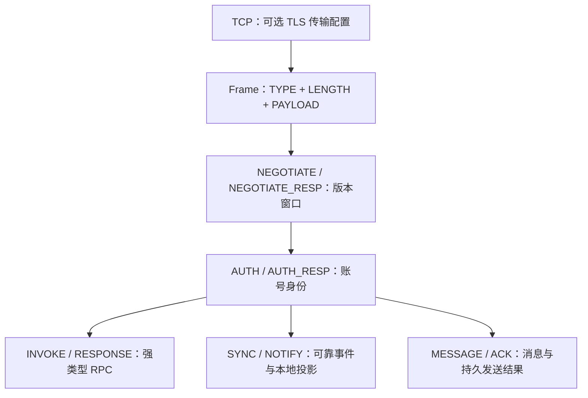

# 协议与数据契约

本章面向 SDK 维护者、其他语言客户端实现者和排查跨版本问题的开发者。
TeamTalk 尚未正式发布，不保证兼容，未来仍可能有破坏性变更；内部从开发者预览零号基线起维护
明确的兼容窗口，普通升级不能再默认清空资料。完整规则见[版本与兼容机制](versioning.md)。

## 协议层次

TLS 位于 Packet 外层，不通过 PacketType 协商。现有远程 SDK 使用 HTTPS + TLS/TCP，配置组合的边界
见[传输配置](../07-operations/configuration.md#传输配置边界)。TLS 就绪后先协商，再发 AUTH；
协议协商不携带密码，也不通过降级明文绕过传输失败。

当前协议为 `0.0`，数字 ID `0`，独立于展示版本 `0.0.0`。`ProtocolLimits.AUTH_PREAMBLE_MARKER`
只保留 AUTH 的固定 bootstrap 字节标识；业务版本使用 `ProtocolVersions` 与 `ProtocolVersion`。
Netty 的 `PacketCodec.PROTOCOL_VERSION` 是当前数字 ID 的兼容别名。

## 规范与代码的关系

| 契约 | 实现入口 |
|---|---|
| 版本协商、since/removed 与编号生命周期 | `ProtocolVersion.kt`、`payload/ProtocolNegotiationPayloads.kt`、`wire-baseline.tsv` |
| 原语与 payload | `PacketBuffer.kt`、`ProtoCodec.kt`、`ProtocolLimits.kt` |
| Netty 帧与方向校验 | `protocol-netty/.../PacketCodec.kt` |
| RPC | `rpc/def/*Rpc.kt` 及 KSP 生成 Contract/Stub/Proxy |
| 模型 | 实现 `IProto` 的 `model/`、`body/`、`payload/` |
| 通知 | `NotifyType.kt`、`NotifyContracts.kt` 与生成版本窗 |

字段顺序、方法 ID 和版本支持范围以源码、已登记清单及 wire 测试共同约束。不同版本代码共享同一编号
空间与制品；同 major 内的新契约分配新 ID，不修改旧签名或复用退役编号，不再使用通用逃生协议。

## 阅读顺序

1. [版本与兼容机制](versioning.md)：版本计数、协商、升级提示、退役与数据迁移。
2. [Wire Format](wire-format.md)：帧、字段顺序和边界。
3. [RPC 与事件](rpc-and-events.md)：IDL、事件同步与业务重试。
4. [消息与附件](messages-and-attachments.md)：消息体、文件与引用。
5. [认证与错误](authentication-and-errors.md)：身份、终态和离线入口。
6. [RPC 参考](../10-reference/rpc-reference.md) / [事件参考](../10-reference/event-reference.md)：查找当前编号。
