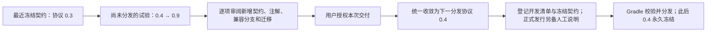
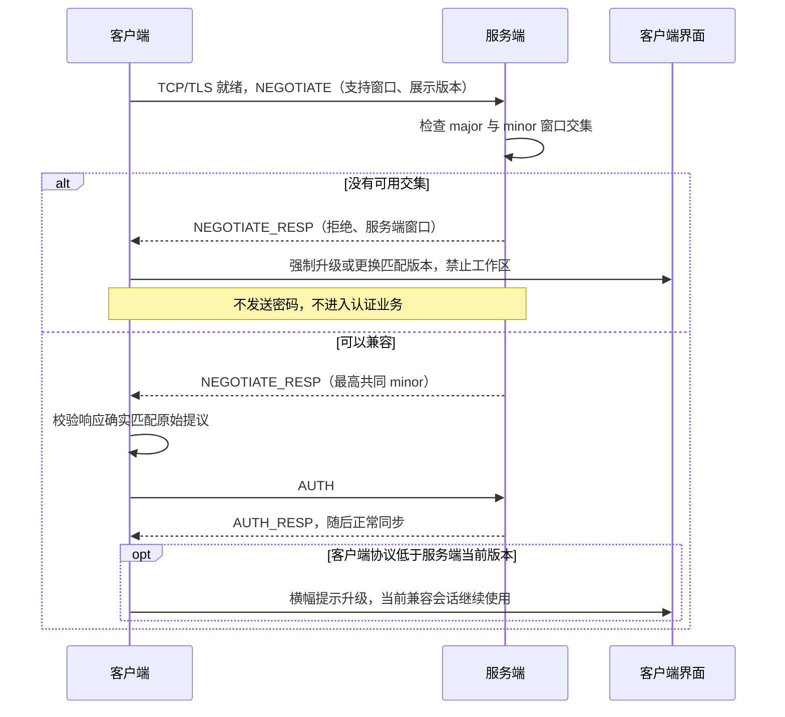
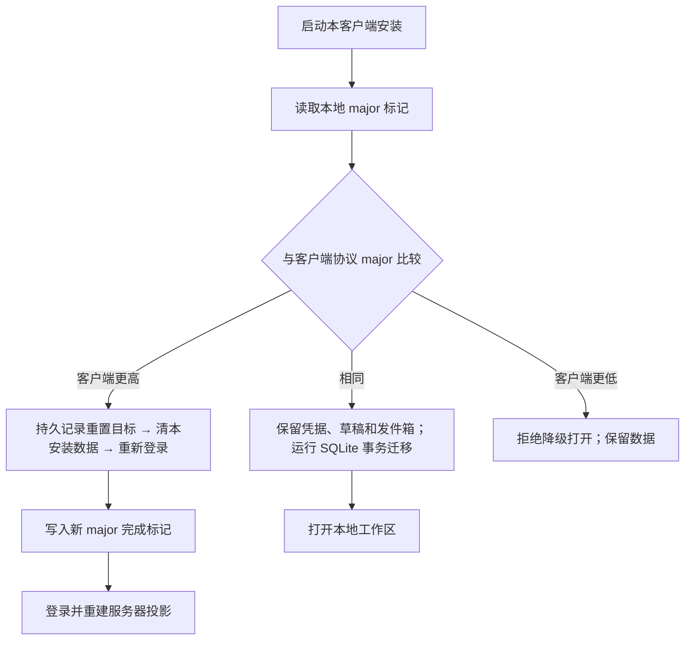

# 版本、兼容窗口与数据演进

TeamTalk 处于开发者预览阶段，**不对使用者保证版本兼容，未来仍可能有破坏性变更**。这不等于内部开发可以
随意破坏已有资料：从开发者预览零号基线开始，普通升级保留数据，同一协议大版本采用追加契约与明确迁移。
本章是协议生命周期和内部兼容规则的权威说明。

## 先分清版本与安装数字

| 身份 | 当前值与来源 | 用途 | 递增时机 |
|---|---|---|---|
| 统一展示版本 | `teamtalk.releaseVersion=0.0.0` | Server、SDK、Android、Desktop、MCP 使用同一字符串，配合 commit 排查构建范围 | 用户明确确认正式产品发行后推进；内测 snapshot 保持它不变，不从它推导协议能力 |
| 协议数字版本 | `major=0, minor=0`；`id=(major << 16) \| minor`，ID `0`；初始发行的完整契约冻结为 `0.0` | 连接协商、协议注解、支持窗口与升级提示 | 开发新增使用临时 minor；分发前把未发布增量合并成紧邻上一已冻结契约的一个 minor；明确的新 major 从 minor 0 开始 |
| 正式构建计数 | 根 `teamtalk.releaseBuildNumber`，初始为 `0` | Android `versionCode=buildNumber+1`；正式 Desktop revision 同样映射为 `buildNumber+1`；macOS jpackage 的系统包版本从 `1.0.0` 映射 | 正式发行时由用户确认推进；内测 snapshot 不修改它，Android 保持当前 code 手动覆盖 |
| 内测 Desktop 修订号 | `desktopRevision=完整 Git first-parent 提交数+根构建号+1` | 满足 Conveyor 同一展示版本不同安装包的 revision 要求，记录在内测清单与安装元数据中 | 手动 snapshot 交付时自动计算，不写回配置、不依赖 tag；同展示版本的后续 snapshot 从已分发源码的后代构建，原字节重试复用原号 |

人工版本配置均来自根 `gradle.properties`；内测 Desktop revision 另外依据完整 Git 历史推导。
`ProtocolVersions` 与 SDK `TeamTalkBuild` 由构建生成；禁止在业务、
SDK 或平台壳里另外硬编码一个发行字符串。`major` 范围 `0..32767`，`minor` 范围 `0..65535`，
打包后的 ID 是非负递增整数。不能因为客户端显示版本字符串更大就推定它支持某个 RPC。

例如：纯 UI 修复可从展示版本 `0.0.0` 发布为 `0.0.1`，协议仍为 `0.0`；增加一个 RPC 可将协议升为
`0.1`，而展示版本由该批发行决定。展示版本的大号变化也不触发本地清理，**协议 major 变化才触发**。
同一修复也可先作为私有内测 snapshot 交付：展示版本保持 `0.0.0`、根构建号保持 `0`、Android code
保持 `1`，仅 Desktop revision 随已提交源码自动计算。正式发行继续增加根构建号使 Android code 升级；
Desktop 比较完整安装版本，新展示版本的末位 revision 可按根构建号重新映射。

数据库自身的布局标记与发行版本分别管理。服务端 PostgreSQL/data epoch 保持现存值
`1`，客户端数据库文件仍为 `cache_e0...db`，SQLDelight schema 从 `1` 起步。改写这些已有标记不会产生
迁移，反而会使同一批数据被误判为不兼容；初始化空实例也不要求把这些格式标记归零。

## 开发编号与发行契约分开管理

开发新增契约可以按实现需要递增协议 minor，并通过开发清单校验；这不要求同时增加展示版本或安装序号。
展示版本推进、人工说明定稿、`prepareProtocolRelease`、tag 与 GitHub 发布需要用户确认正式产品发行。
用户要求更新内测安装包，已包含本次手动 snapshot 交付授权；提交工作源码后即可刷包，不修改根版本
文件，也不需要额外确认正式发版。纯开发、服务器部署和 Agent 本机验收不自动授权交付，
工具提示版本或快照不匹配也不是自行发包的依据。流程见[发行决定](../07-operations/releasing.md#谁决定发版)。

正式产品发行由根展示版本命名，人工说明写入 `doc/07-operations/releases/<releaseVersion>.md` 并随配置
一起提交。公开仓库的 `v<releaseVersion>` tag 标记这次源码；私有客户没有 GitHub，也遵守同样的本地记录。
提交摘要只能帮助核对遗漏，不能覆盖人工撰写的变更、升级步骤和已知限制。

| 文件 | 表达的事实 | 可以怎样修改 |
|---|---|---|
| `gradle.properties` | 下一次构建使用的展示版本、正式构建计数与协议窗口 | 开发协议 minor 按实现演进；正式发行推进展示版本和构建号，内测 snapshot 保持这两项不变 |
| `protocol/protocol/wire-baseline.tsv` | 当前开发源码的结构清单 | 经显式 `writeProtocolBaseline` 登记；始终受发行快照约束 |
| `protocol/protocol/releases/<version>/` | 为发行冻结的配置、wire 布局、生命周期及哈希 | 用户确认本次发行后显式准备新版本；既有目录不覆盖、不删除 |
| `protocol/protocol/contracts/<major>.<minor>/` | 与展示版本无关的已分发 wire 契约 | 获授权的首次私有分发或内测更新使用新契约时显式准备；同样不可覆盖、删除或回收编号 |

初始发行快照记录 `0.0.0 / buildNumber=0 / protocol=0.0` 的完整契约，源码身份由对应 tag 和密封清单固定。
发行前试验快照不作为本版兼容来源；初始基线确认后，不能再以“没有历史 tag”为理由回收已分发契约。
**向内测用户、SDK 集成方或任一私有客户分发都会冻结实际协议**。内测交付不必成为正式产品版本，但必须
在用户授权范围内使用已冻结的契约，不能以“没有公开下载”作为回收编号的依据。
为避免发布中断造成事实不明，发行快照从登记起即保守冻结；重试继续使用该版本，不能先删记录再复用编号。

用户明确要求新的私有应用保持当前展示版本进行首次分发时，使用 `prepareProtocolContract` 冻结实际协议，
再通过[首次私有分发入口](../07-operations/releasing.md#保持当前版本的首次私有安装包分发)交付。它不改变
公版零号记录，也不要求创建产品 tag；协议保护从这次分发前登记开始生效。
已有私有应用的[内测更新](../07-operations/releasing.md#保持展示版本的内测更新)使用 `releaseMode=snapshot`：
复用 `ProtocolContractPolicy` 对已冻结契约的校验；协议没变不新建契约，有新增才先收敛、登记并提交
`contracts/`。它不运行 `prepareProtocolRelease`，不修改 `releases/0.0.0/` 的原构建号或源码认领。
内测 Desktop revision 依赖完整历史，浅克隆不能用于交付。同一展示版本的后续 snapshot 保留已分发源码
及其历史，只能从其后代构建，不能压缩、重写该基线来重新使用修订号。正式推进展示版本时可整理开发历史，
既有正式 tag 和冻结协议记录仍受保护。Android 相同 code 的手动覆盖不豁免协议、
安装身份、签名和资料保留规则。



这里收敛的是未发布的 **minor 计数和对应的生命周期值**，不是把已发行的 RPC methodId 或消息编号重新排序。
若试验 `0.6` 已经分发，就必须先把这次发行纳入本地记录，此后的代码不得再假装最后发行仍是 `0.3`。
对既有已分发但漏记的历史必须按真实版本补录和评审，不能使用收敛任务改写事实；正常分发流程禁止漏记。

同一 major 内，有新增 wire 或首次声明退役时，下次分发的 minor 恰为上一冻结契约加一；该批新增统一标记为这个
minor。纯 UI/实现修复与已经声明的实现退役可以保持原协议号；正式发行推进根展示版本与构建号，内测
snapshot 按上述平台规则交付，不为刷包占用协议号。提高最低兼容
版本不能超过当前 minor，也不能回退到先前已经移除的范围。新 major 必须紧邻上一 major，并以 `minor=0`、
`minimumMinor=0` 开始；这时才允许重整 wire 编号，旧发行记录仍保留。

## 一次连接怎样协商



同一 major 的支持窗口是 `[minimumMinor, currentMinor]`；存在交集时选择双方 currentMinor 的较小值。
这也允许新客户端连接尚未更新、但仍在客户端保留范围内的旧服务端。不同 major 不混用编号，也不猜测解码。
协商信封是固定 bootstrap 契约，不携带凭据。AUTH 里的 `TK + 0 + 1` 是固定格式标记，**不是业务协议版本**。

服务端构建下限由 `teamtalk.minimumProtocolMinor` 固定，运行配置 `MINIMUM_PROTOCOL_MINOR` 只能提高
该下限，不能低于编译保留范围或高于当前 minor。运行配置在启动时读取，修改后重启生效；它不改变数据集。

客户端明确收到不兼容结论后，停止重连并退役工作区。服务器已淘汰旧客户端时，按部署和本客户端
精确协议 ID 保存拒绝状态，更新客户端后重新判断；服务器自身落后时只阻止本次会话，管理员升级后
重新启动客户端即可重新协商。网络超时、坏响应或临时维护不能伪装成强制升级。
已有账号仍保留离线启动能力：完全离线时无法预知服务端刚提高的下限，但**一旦已知旧客户端被淘汰，
之后的离线启动也不得绕过该限制**。拒绝旧客户端不删除账号凭据、草稿或发件箱。

## 同一 major 只新增，不修改已发行 wire

1. 已冻结发行 RPC 的 `(serviceId, methodId)`、参数顺序、类型和返回值不变。新签名使用新 methodId，
   新旧入口在同一组代码和 jar 内共存，各自调用明确的兼容业务逻辑。
2. 已冻结发行 IProto 模型的 wire 字段和编码顺序不变，不能以“字段可空”或“只加在末尾”为理由修改旧布局。
   要改变布局就创建新模型，并通过新 RPC/消息/通知入口引入。
3. 新增 RPC、PacketType、NotifyType、MessageType 或 wire 类型时，分配开发 minor，并用
   `@SinceProtocol(minor)` 描述首次支持版本；发行前只收敛未冻结值。零号基线中没有注解的已有条目属于 minor 0。
4. 同一 major 内退役的编号保留墓碑，不重新使用。一次变更涉及的所有协议新增可共同属于同一个新 minor。
5. 只改变实现方式、修复保持原契约的缺陷，不要求增加协议版本；不能用“重构”掩盖线上字节或业务语义变化。

示意（方法编号仅作说明，实施时在所属服务内分配未使用编号）：

```kotlin
@RpcMethod(21)
@SinceProtocol(1)
suspend fun getProfileV2(uid: String): UserProfileV2

@RpcMethod(3)
@SinceProtocol(0)
@RemovedInProtocol(3)
suspend fun getProfile(uid: String): UserProfile
```

`@RemovedInProtocol(3)` 表示协商版本从 minor 3 起不再调用该入口；如果服务端还兼容 minor 0–2，
旧实现仍要保留。最低支持版本升到 3 后，构建检查要求退役实现，清单留下原编号和签名的墓碑。
服务端请求上下文携带真实协商版本，生成代理和 dispatcher 共用版本窗，业务需要分支时从该上下文读取，
不得在不同层猜客户端展示版本。

## 构建怎样发现误改与废弃

```bash
# 普通检查，同时对照开发清单和独立的冻结发行快照
./gradlew :protocol:protocol:verifyProtocolBaseline

# 有意新增、退役或收敛未发行 minor 后，生成可 review 的开发清单
./gradlew :protocol:protocol:writeProtocolBaseline

# 用户明确确认本次发行后：新增不可覆盖的发行快照
./gradlew :protocol:protocol:prepareProtocolRelease

# 获授权的内测交付首次使用新协议时：新增独立契约，不创建正式发行快照
./gradlew :protocol:protocol:prepareProtocolContract
```

KSP 每次编译都从 `releases/` 与 `contracts/` 选择最新冻结契约检查实际源码，再检查开发清单是否已经登记；即使手工修改开发 TSV，也不能
掩盖已经发行的签名变化或墓碑复用。显式 `writeProtocolBaseline` 允许相对冻结快照重新登记未发行的工作，
因此收敛 minor 不会被旧开发计数永久锁死。它不会写入或修改发行历史。

`prepareProtocolRelease` 检查展示版本和安装序号递增、minor 连续、已发行布局与生命周期不被改写，再写入
新的发行目录。它是用户确认本次发行后才能执行的源码编辑操作，**不会由发布任务或 CI 偷偷执行**；维护者必须审阅并提交根配置、
人工说明、代码与两类清单。正式发行的 `verifyReleaseMetadata` 要求当前根版本已有匹配的最新发行记录，开发清单与冻结文件
逐字节一致。普通发行校验和编译均不需要 GitHub，也不查询远端 tag 才决定是否应保护一个契约。
CI 的 `verifyReleaseChange -PreleaseBase=<比较基点>` 还检查基点已有的发行快照和独立协议契约未被修改或删除；
正式发行要求根展示版本和构建号一起推进，并校验本次人工说明和新快照；单独变更或回退根构建号会被拒绝。
内测刷包不修改这两个字段，也不由 CI 自动生成 snapshot。纯开发 minor 变化不触发发行冻结。

手动服务端开发部署沿用 `verifyRelease` 的干净源码、架构和 wire 校验，可以运行尚未发行的开发 minor，
不强迫每次调试都登记客户端发行快照。客户端统一 `release` 同时执行这项门禁与相应模式的元数据检查；
首次私有分发与内测 snapshot 使用独立协议契约检查。实际交付仍须在用户授权范围内使用冻结协议，
不能以服务端调试路径绕过交付纪律。

收敛时应先列出所有大于上一发行 minor 的 `@SinceProtocol`、首次声明的 `@RemovedInProtocol`、版本判断、
迁移和测试，把同一批变更统一指向下一 minor，再登记开发清单。构建会阻止未收敛版本被打包成发行，
但不会用自动正则替换业务源码。每次审阅应同时看版本计数器、注解、清单 diff 和业务适配，不能只提交生成文件。

结构清单不能证明任意手写 `writeTo/readFrom` 的语义都未变化。例如在方法体里调换两次写入，即使构造
字段没改也可能破坏 wire；维护者仍须遵守冻结规则，并为实际编码变化保留 round-trip/golden 检查。

## 兼容分支不是任意新业务的自动翻译器

服务端可按协商版本投影推送：不支持的瞬时事件不发送；不支持的持久事件用无业务 payload 的
`EVENT_CURSOR_ADVANCED` 承载相同 eventId，让旧端推进游标而不解析新字段。此通知仅用于连接输出投影，
不能作为新的领域事实写进持久事件流。

这有两项必须由新增功能处理的边界：

- 旧客户端跳过某类事件后再升级，新功能需要通过权威 RPC/checkpoint 或本地 minor 迁移补齐初始投影，
  不能指望已经越过的事件再次自动到达。
- 当前 Message body 没有独立长度信封，历史列表中的未知消息类型不能安全跳过。新增消息类型必须提供
  明确的历史/同步兼容适配，或提高最低协议版本；只给枚举加 since 注解不等于完成整条业务兼容。

原来的 `ExtensionType`、`generic` RPC、`GENERIC(99)` 消息/通知和 `GenericPayload` 没有注册的业务实现，
已在零号基线移除。明确的新 ID 和版本窗承担演进职责，不另建 opaque payload 逃生入口。

## 数据随版本怎样处理



- **客户端 minor**：保持数据库文件名。Android 使用 SQLDelight driver 的升级回调；JVM 使用
  `PRAGMA user_version` 和事务包裹的 SQLDelight `.sqm` 迁移。未标记的旧 JVM 库按既有 schema 1 认领后
  逐步迁移，不直接冒充最新格式。零号首次认领时允许补齐历史上未事务化创建的 schema 1，之后不再
  重跑建表定义。失败回滚数据和版本，遇更高 schema 拒绝降级，不能自动删库。
- **客户端 major**：在凭据、SQLite 和草稿 owner 打开前执行；Desktop/Headless 持有数据目录进程锁。
  重置只清本安装管理的数据，保留目录认领与锁。先落 `reset:<major>` 再删除，中断后可继续，完成才记
  `ready:<major>`；更老客户端不接管半完成的数据。服务器返回不同 major 本身不会触发清理。
- **服务端**：普通部署保留 PostgreSQL、RocksDB、文件和 dataset identity。PostgreSQL 用从 0 起的
  `schema_migrations` 顺序台账，在同一事务内提交 DDL 与完成记录；首条迁移放宽遥测协议 ID 的旧字节约束，
  保留原行和 dataset。未来跨存储布局变化仍须提供明确迁移与恢复步骤，epoch 预检不代替迁移。跨 major 的协议编号
  重整也不自动授权删除服务端资料，重置需要明确实例、范围和影响。

## 零号基线的切换边界

初始 `0.0.0` 以完整现行契约建立协议 `0.0`。发行前的开发包、临时零号包和私有试验契约不属于本版
兼容来源；本次经用户确认重新初始化的测试实例不提供旧资料的原地迁移，使用者需换用本版客户端，
按新实例重新注册、登录。切换前自行保存本地草稿、待发消息与附件原件；不能仅凭相同展示版本混用旧包。

这次初始化只用于建立首个公开开发者预览基线。基线建立后，普通升级继续保留数据；既有发行记录、
独立分发契约与安装序号均按前述规则保护，不能把初始清理当作日后再次清库、降号或覆盖版本的授权。

Android 的展示版本重置为 `0.0.0`，零号安装序号为 `1`。Android 系统不会把它当作已安装的旧开发包
`versionCode=1000008` 的升级：旧开发安装需要单独处理换装，不能以静默清数据掩盖安装降级。
新预览基线之后，正式发行的 Android 安装 code 递增；私有内测 snapshot 可沿用当前 code 手动覆盖。
展示版本、协议版本与 Desktop revision 分别按前述规则推进。

macOS 的 JDK `jpackage` 同样要求包版本首段为正数。Compose DMG 将构建计数 `b` 映射为
`(b / 1000000 + 1).((b / 1000) % 1000).(b % 1000)`，零号为 `1.0.0`；Finder 的系统包元数据
可能显示此安装编号，应用内关于页、运行画像、发行清单和分发文件名仍显示 `0.0.0`。
Conveyor 的 `app.version` 读取统一展示版本，不使用这项仅供 jpackage 的映射；
正式发行的 `app.revision` 由根构建计数加一提供，避免 Conveyor 22.1 拒绝全零安装版本；snapshot 使用
完整 first-parent 提交数加根构建号再加一，同一展示版本下不能用浅克隆或重写已分发历史制造另一个修订号。
因此零号预览的 Linux 包版本为 `0.0.0-1`，Windows 与 macOS 的安装版本为 `0.0.0.1`，
应用内展示版本仍为 `0.0.0`。同一展示版本不得归零 Desktop 修订号来复用已分发包；正式推进展示版本时，
新版本可重新使用由根构建号推导的末位 revision。
