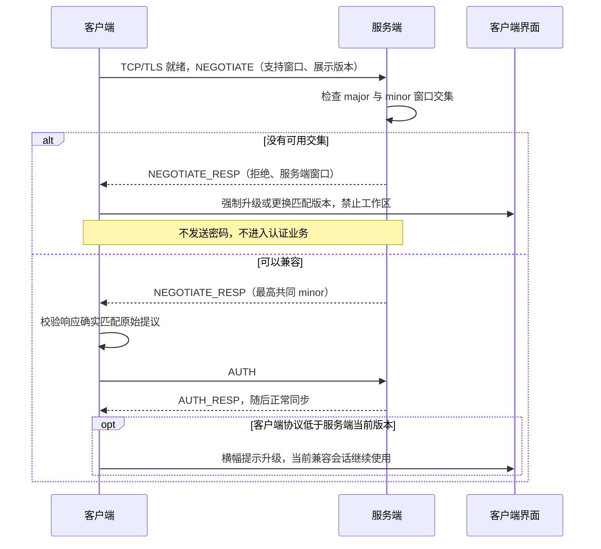
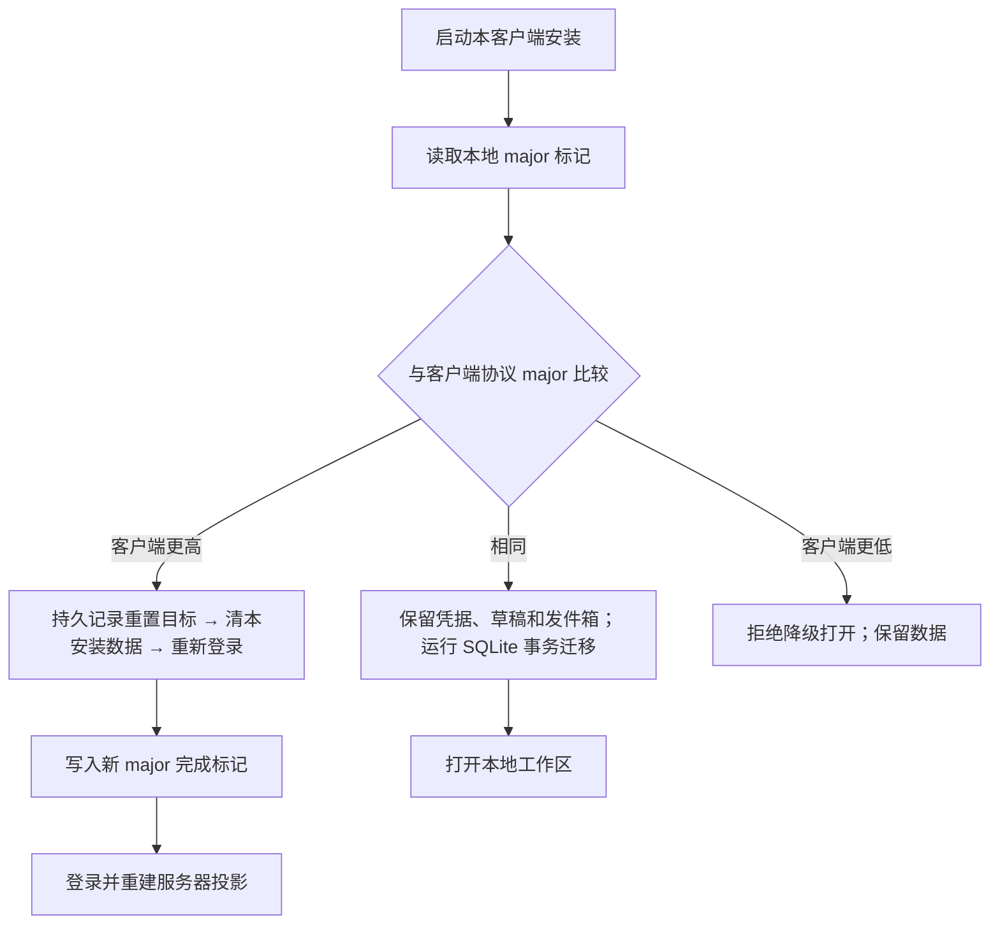

# 版本、兼容窗口与数据演进

TeamTalk 尚未正式发布，**不对使用者保证版本兼容，未来仍可能有破坏性变更**。这不等于内部开发可以
随意破坏已有资料：从开发者预览零号基线开始，普通升级保留数据，同一协议大版本采用追加契约与明确迁移。
本章是协议生命周期和内部兼容规则的权威说明。

## 先分清三种数字

| 身份 | 当前值与来源 | 用途 | 递增时机 |
|---|---|---|---|
| 统一展示版本 | `teamtalk.releaseVersion=0.0.0` | Server、SDK、Android、Desktop、MCP 使用同一字符串，配合 commit 排查构建范围 | 需要命名一次发行时；不从它推导协议能力 |
| 协议数字版本 | `major=0, minor=0`；`id=(major << 16) \| minor`，当前 ID `0` | 连接协商、协议注解、支持窗口与升级提示 | 每次新增 wire 契约递增 minor；明确的大版本收敛才递增 major 并将 minor 归零 |
| 平台安装序号 | `teamtalk.releaseBuildNumber=0` | 安装器识别新包；Android `versionCode=buildNumber+1`，零号为 `1`；macOS jpackage 的系统包版本从 `1.0.0` 映射 | 每次分发新的安装包时独立递增；不参与协议判断 |

事实源均为根 `gradle.properties`。`ProtocolVersions` 与 SDK `TeamTalkBuild` 由构建生成；禁止在业务、
SDK 或平台壳里另外硬编码一个发行字符串。`major` 范围 `0..32767`，`minor` 范围 `0..65535`，
打包后的 ID 是非负递增整数。不能因为客户端显示版本字符串更大就推定它支持某个 RPC。

例如：纯 UI 修复可从展示版本 `0.0.0` 发布为 `0.0.1`，协议仍为 `0.0`；增加一个 RPC 可将协议升为
`0.1`，而展示版本由该批发行决定。展示版本的大号变化也不触发本地清理，**协议 major 变化才触发**。

数据库自身已有的布局标记不属于本次发行版本重编号。服务端 PostgreSQL/data epoch 继续保持现存值
`1`，客户端数据库文件仍为 `cache_e0...db`，SQLDelight schema 从 `1` 起步。改写这些已有标记不会产生
迁移，反而会使同一批数据被误判为不兼容，因此本次原样保留。

## 一次连接怎样协商



同一 major 的支持窗口是 `[minimumMinor, currentMinor]`；存在交集时选择双方 currentMinor 的较小值。
这也允许新客户端连接尚未更新、但仍在客户端保留范围内的旧服务端。不同 major 不混用编号，也不猜测解码。
协商信封是固定 bootstrap 契约，不携带凭据。AUTH 里的 `TK + 0 + 1` 是固定格式标记，**不是业务协议版本**。

服务端构建下限由 `teamtalk.minimumProtocolMinor` 固定，运行配置 `MINIMUM_PROTOCOL_MINOR` 只能提高
该下限，不能低于编译保留范围或高于当前 minor。运行配置在启动时读取，修改后重启生效；它不改变数据集。

客户端明确收到不兼容结论后，停止重连并退役工作区。服务器已淘汰旧客户端时，按部署和本客户端
精确协议 ID 保存拒绝状态，更新客户端后重新判断；服务器自身落后时只阻止本次会话，管理员升级后
重新启动客户端即可重新协商。网络超时、坏响应或临时维护不能伪装成强制升级。
已有账号仍保留离线启动能力：完全离线时无法预知服务端刚提高的下限，但**一旦已知旧客户端被淘汰，
之后的离线启动也不得绕过该限制**。拒绝旧客户端不删除账号凭据、草稿或发件箱。

## 同一 major 只新增，不修改既有 wire

1. 已登记 RPC 的 `(serviceId, methodId)`、参数顺序、类型和返回值不变。新签名使用新 methodId，
   新旧入口在同一组代码和 jar 内共存，各自调用明确的兼容业务逻辑。
2. 已登记 IProto 模型的 wire 字段和编码顺序不变，不能以“字段可空”或“只加在末尾”为理由修改旧布局。
   要改变布局就创建新模型，并通过新 RPC/消息/通知入口引入。
3. 新增 RPC、PacketType、NotifyType、MessageType 或 wire 类型时，递增 minor，并用
   `@SinceProtocol(minor)` 描述首次支持版本；零号基线中没有注解的已有条目属于 minor 0。
4. 同一 major 内退役的编号保留墓碑，不重新使用。一次变更涉及的所有协议新增可共同属于同一个新 minor。
5. 只改变实现方式、修复保持原契约的缺陷，不要求增加协议版本；不能用“重构”掩盖线上字节或业务语义变化。

示意（方法编号仅作说明，实施时在所属服务内分配未使用编号）：

```kotlin
@RpcMethod(21)
@SinceProtocol(1)
suspend fun getProfileV2(uid: String): UserProfileV2

@RpcMethod(3)
@SinceProtocol(0)
@RemovedInProtocol(3)
suspend fun getProfile(uid: String): UserProfile
```

`@RemovedInProtocol(3)` 表示协商版本从 minor 3 起不再调用该入口；如果服务端还兼容 minor 0–2，
旧实现仍要保留。最低支持版本升到 3 后，构建检查要求退役实现，清单留下原编号和签名的墓碑。
服务端请求上下文携带真实协商版本，生成代理和 dispatcher 共用版本窗，业务需要分支时从该上下文读取，
不得在不同层猜客户端展示版本。

## 构建怎样发现误改与废弃

```bash
# 普通检查，只比较，不重写已登记事实
./gradlew :protocol:protocol:verifyProtocolBaseline

# 有意新增、退役或开始新 major 时，生成可 review 的清单变更
./gradlew :protocol:protocol:writeProtocolBaseline
```

KSP 登记并校验 `protocol/protocol/wire-baseline.tsv` 中的 ID、RPC 签名、模型字段及生命周期。
普通编译和 `verifyRelease` 都接入检查；显式写清单也不能把同 major 的旧签名改写或复用墓碑当成合法新增。
每次审阅应同时看版本计数器、注解、清单 diff 和业务适配，不能只提交生成文件。

结构清单不能证明任意手写 `writeTo/readFrom` 的语义都未变化。例如在方法体里调换两次写入，即使构造
字段没改也可能破坏 wire；维护者仍须遵守冻结规则，并为实际编码变化保留 round-trip/golden 检查。

## 兼容分支不是任意新业务的自动翻译器

服务端可按协商版本投影推送：不支持的瞬时事件不发送；不支持的持久事件用无业务 payload 的
`EVENT_CURSOR_ADVANCED` 承载相同 eventId，让旧端推进游标而不解析新字段。此通知仅用于连接输出投影，
不能作为新的领域事实写进持久事件流。

这有两项必须由新增功能处理的边界：

- 旧客户端跳过某类事件后再升级，新功能需要通过权威 RPC/checkpoint 或本地 minor 迁移补齐初始投影，
  不能指望已经越过的事件再次自动到达。
- 当前 Message body 没有独立长度信封，历史列表中的未知消息类型不能安全跳过。新增消息类型必须提供
  明确的历史/同步兼容适配，或提高最低协议版本；只给枚举加 since 注解不等于完成整条业务兼容。

原来的 `ExtensionType`、`generic` RPC、`GENERIC(99)` 消息/通知和 `GenericPayload` 没有注册的业务实现，
已在零号基线移除。明确的新 ID 和版本窗承担演进职责，不另建 opaque payload 逃生入口。

## 数据随版本怎样处理



- **客户端 minor**：保持数据库文件名。Android 使用 SQLDelight driver 的升级回调；JVM 使用
  `PRAGMA user_version` 和事务包裹的 SQLDelight `.sqm` 迁移。未标记的旧 JVM 库按既有 schema 1 认领后
  逐步迁移，不直接冒充最新格式。零号首次认领时允许补齐历史上未事务化创建的 schema 1，之后不再
  重跑建表定义。失败回滚数据和版本，遇更高 schema 拒绝降级，不能自动删库。
- **客户端 major**：在凭据、SQLite 和草稿 owner 打开前执行；Desktop/Headless 持有数据目录进程锁。
  重置只清本安装管理的数据，保留目录认领与锁。先落 `reset:<major>` 再删除，中断后可继续，完成才记
  `ready:<major>`；更老客户端不接管半完成的数据。服务器返回不同 major 本身不会触发清理。
- **服务端**：普通部署保留 PostgreSQL、RocksDB、文件和 dataset identity。PostgreSQL 用从 0 起的
  `schema_migrations` 顺序台账，在同一事务内提交 DDL 与完成记录；首条迁移放宽遥测协议 ID 的旧字节约束，
  保留原行和 dataset。未来跨存储布局变化仍须提供明确迁移与恢复步骤，epoch 预检不代替迁移。跨 major 的协议编号
  重整也不自动授权删除服务端资料，重置需要明确实例、范围和影响。

## 零号基线的切换边界

此前 `1.0.8` 等开发构建没有新协商首帧，不能列入这个兼容窗口；连接新服务器时需要更新客户端。
本次不改现有业务记录布局，因此服务器资料与能够打开的本地 schema 1 数据保留。

Android 的展示版本重置为 `0.0.0`，零号安装序号为 `1`。Android 系统不会把它当作已安装的旧开发包
`versionCode=1000008` 的升级：旧开发安装需要单独处理换装，不能以静默清数据掩盖安装降级。
新预览基线之后，安装序号只递增，展示版本和协议版本仍按各自规则推进。

macOS 的 JDK `jpackage` 同样要求包版本首段为正数。Compose DMG 将构建计数 `b` 映射为
`(b / 1000000 + 1).((b / 1000) % 1000).(b % 1000)`，零号为 `1.0.0`；Finder 的系统包元数据
可能显示此安装编号，应用内关于页、运行画像、发行清单和分发文件名仍显示 `0.0.0`。
Conveyor 读取统一展示版本，不使用这项仅供 jpackage 的映射。
