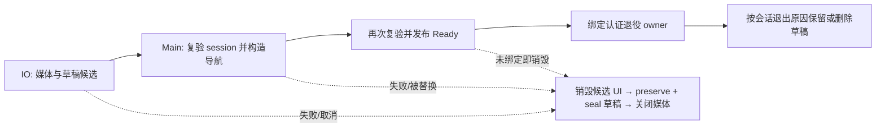

# Desktop 客户端

安装身份与应用名称来自根部署配置的 `client` 对象。公版和私有版可以拥有不同的 `.app`/安装名称、
系统安装标识和数据空间，并在同一电脑运行；登录、窗口与托盘读取配置的显示名称。字段与稳定性
规则统一见[客户端发行身份](../07-operations/configuration.md#客户端发行身份)。

## 1. 主窗口

Desktop 使用融合式应用标题栏和三栏主体：

```text
┌─────────────────────────────────────────────────────────┐
│ macOS controls  TeamTalk   全局搜索 ⌘K          连接状态 │
├──────┬────────────────┬─────────────────────────────────┤
│ 56dp │ 300dp          │ 当前会话/对象/全局搜索结果       │
│ 导航 │ 栏目列表        │                                 │
│      │                │                                 │
└──────┴────────────────┴─────────────────────────────────┘
```

- 默认窗口 1000×720，最小 880×600。
- 顶部只放产品身份、全局搜索和连接状态。已有持久凭据时即使冷启动没有网络也直接打开主窗口，
  从账号本地缓存展示内容，并在顶栏标为离线；后台重连成功后再同步服务端事实。
- 顶栏左右空白区保留系统标题栏习惯：可拖动窗口，双击在普通与最大化之间切换；最大化只占满
  当前屏幕可用区域，不进入全屏。搜索框与其他控件不响应窗口双击。
- macOS 绿色按钮仍进入系统原生全屏；标题栏、导航与工作区必须随屏幕尺寸重新布局，不能在右侧或
  底部露出黑色窗口底色。退出全屏后恢复进入前的位置和尺寸，不影响普通最大化状态。
- 左栏只负责一级栏目和设置入口。
- 中栏展示会话或联系人。
- 右栏保持当前工作上下文。

“文档”和“任务”进入各自的完整工作台，收起会话/联系人中栏。任务工作台保留左侧任务列表与右侧
详情/编辑器，不创建另一种独立任务资产窗口；建群、转发等“任务窗口”仍指临时输入流程的容器。

macOS 原生红黄绿按钮与应用 Surface 属于同一视觉层，不能再叠一条风格冲突的业务标题。

登录后的主窗口在托盘可用时，点击关闭按钮只隐藏窗口，连接和当前工作区继续保留。macOS 点击 Dock
图标与托盘菜单“打开”共用恢复入口：显示主窗口、取消最小化并将窗口带到前台；窗口已显示时直接聚焦。
没有可用托盘时，关闭主窗口仍执行应用退出，避免留下无法操作的后台进程。

主窗口挂载分为资源候选、UI 组装和退役绑定三个步骤。媒体缓存与文档草稿 writer（含私有目录检查）
在 IO 创建；回到 Main 后复验确切的 `ClientSession`，再创建导航和 Compose 状态。UI 组装失败也进入
已有的加载失败/重试表面，不会留下孤立 writer。



安装器只在退役绑定接手前拥有候选草稿的清理责任；接手后媒体关闭不封存草稿处置，保持
“Compose 先保留，AuthController 后明确注销则升级为删除”的既有顺序。未成功挂载不等于主动注销。
绑定登记与责任移交使用同一安装器锁；认证线程即使立刻认领退役，也必须等交接完成后才能关闭媒体。

Dock 使用 JDK `AppReopenedListener` 接收系统事件，监听器归属当前主窗口，窗口销毁时移除。
恢复动作通过既有会话 UI 调度入口更新 Compose 状态；隐藏窗口须等 AWT `componentShown` 确认显示后
再请求焦点，不能把修改 `visible` 当成窗口已经显示。普通消息通知不会调用这个前台恢复入口。

托盘图标沿用 JDK `SystemTray`。Windows 的右键菜单由
[WindowsTrayMenu](../../client/desktop/src/desktopMain/kotlin/com/virjar/tk/desktop/tray/WindowsTrayMenu.kt)
使用 Swing 绘制，避开部分中文系统的 AWT 原生菜单缺字；macOS/Linux 保留原生菜单。
菜单及承载窗口统一在 EDT 上管理，按鼠标所在屏幕的可用区域定位；点击外部、按 ESC 或选择菜单项后收起，
登出移除托盘时一起回收承载窗口，不留下额外任务栏窗口。
Windows 承载窗口必须位于工作区内，不能落在任务栏区域；已失去原生窗口的锚点会重建。
锚点显示后，菜单在 EDT 下一拍打开，避免主窗口隐藏后的托盘回调内同步弹出失败。
收起或登出会取消尚未显示的菜单请求，延迟回调不能重新打开已关闭的菜单；失败使用 `AppLog` 记录。

### 任务工作台与提醒

任务工作台提供“分配给我”和“我创建的”分页列表；列表与操作记录保持有界驻留并可继续加载。
详情支持创建人编辑、分配、关联群/部门和取消，参与者的状态按钮遵循服务端权限。截止输入为本地
日期与时间；未保存表单只在内存中，保存后的命令才进入持久恢复，完整边界见
[客户端共享状态](README.md#3-交互状态与远端状态)。

聊天附件面板与任务详情均可分享任务卡片，发送使用普通可靠发件箱。引用打开先重读任务，再切换到
任务栏目；冷启动或列表尚未包含该任务时也使用同一个目标入口。分享不扩展参与者权限，失权保留
聊天中的冻结预览并显示安全错误，不展示当前任务正文。

主窗口非活动、连接已认证且托盘可用时，客户端为尚未展示且未读的有效到期提醒显示系统通知，展示前
重验当前执行人与任务状态。应用内可打开提醒或标记已读；系统已展示与应用内已读分别持久保存，
同一次提醒在本地收据保留期间不重复展示。Desktop 系统提示使用托盘通知，不提供指定任务的点击
跳转，也不在进程退出后自行唤醒。两端工作流按[任务验收场景](../09-testing/scenario-catalog.md#i-任务协作)验证。

## 2. 全局搜索

搜索框位于顶栏中央，`Cmd/Ctrl+K` 聚焦。结果在右栏显示，分类为全部、消息、联系人、文件和服务。
数据源未完成的分类展示明确能力缺口，不能用演示数据伪装结果。

用户结果打开资料模态；消息结果把 `chatId + serverSeq` 写入 Desktop 聊天导航并打开会话，共享聊天层
完成有界加载、精确滚动和短时高亮；搜索输入仍留在顶栏，避免工作区再出现第二个搜索框。

发送消息进入终态失败后，消息菜单提供经确认的“丢弃失败消息”；只有稳定失败码证明服务端未接受时，
才额外提供“编辑并重发”。后者保留原 Markdown 供修改，但提交时用新的 `clientMsgId` 原子替换旧终态
记录；超时、断线、ACK 异常等未知结果禁止换新身份重发。界面仅展示稳定公开失败原因，不暴露底层
异常正文，重启与丢 ACK 后仍以持久 outbox、失败投影和权威回执为准。

## 3. 容器选择

| 意图 | 容器 | 示例 | 关闭方式 |
|---|---|---|---|
| 查看当前对象摘要 | 居中模态 | 用户资料 | X、ESC |
| 修改账号偏好 | 居中模态 | 个人设置 | 遮罩、X、ESC |
| 查看当前聊天上下文 | 右侧检查器 | 群详情、成员、邀请 | 外点、X、ESC |
| 跨域工作结果 | 右栏工作区 | 全局搜索 | 清空/切换上下文 |
| 企业内容生产 | 一级工作台 / 独立大窗口 | 多空间文档 | 切换一级菜单、关闭窗口 |
| 任务协作 | 一级工作台 | 分配给我、我创建的、详情与编辑 | 返回列表、切换栏目 |
| 连续输入或选择任务 | 独立任务窗口 | 建群、转发 | 系统关闭、ESC |
| 不可逆确认 | 小确认框 | 删除好友、离群、撤销邀请 | 取消/确认 |

根任务窗口不显示移动端式返回箭头；只有在窗口内部进入下一层才显示返回。

个人设置不占用中栏：导航栏头像和底部齿轮打开归属主窗口的居中模态，打开时工作区保持当前一级
栏目不变。菜单视图提供大头像（点击进入编辑资料）+ 身份信息、分组卡片（账号/安全，每项含图标、
标题与描述）和通用设置；外观是内联分段选择器（跟随系统/浅色/深色，切换立即生效），退出登录为
红色描边卡片并经过二次确认。编辑资料、修改密码、设备管理、黑名单是同一模态的内部子视图（返回
箭头回到菜单），不进入 DesktopNav 页面栈；子视图打开期间遮罩点击不关闭模态，避免误触丢稿。

## 4. 聊天检查器

群聊头部右侧的明确设置按钮打开 400dp 检查器。检查器从聊天区右边缘滑入并覆盖，不参与三栏 Row
测量，因此不能改变消息宽度、滚动位置或输入草稿。

- 不显示视觉遮罩，用户仍能识别聊天上下文。
- 检查器外部有透明阻断层；第一次点击只关闭检查器，不能穿透触发消息或输入操作。
- 检查器内部点击不关闭。
- 根页显示关闭按钮，内部成员/邀请页使用返回。
- “共享文件”从群设置进入同一检查器导航栈；目录、上传、版本和文件打开不替换聊天上下文。
- ESC 先关闭资料模态，再逐层退出检查器，最后退出右栏临时工作区。

## 5. 群共享文件

群文件是群设置的二级检查器，不长期占用聊天右侧布局。平台层使用 macOS 原生选择器读取本地文件，
上传到当前部署后再通过群文件 RPC 发布；打开文件仍走带 token 的 TeamTalk 下载端点与本地缓存。
页面打开、进入目录、修改或手动刷新时重新拉取；持久群文件变更事件会使相关本地投影失效，
当前页面按失效状态补齐目录和版本，离线时仍可展示已缓存的目录。

群文件与聊天中的图片、视频、语音、TXT/Markdown 和普通附件共用当前认证会话的媒体缓存。资源按
canonical TCP+HTTP deployment fingerprint、canonical datasetId 和 uid 隔离；TCP authority、HTTP base、服务端数据集重建或账号变化都会切换目录，新 dataset 不会命中旧媒体。退出会取消尚未完成的上传、下载和录音。HTTP 请求逐次读取同账号最新 token，
但 uid + identity epoch 门禁禁止旧会话在切换账号或 replacement dataset 后继续借用新 Bearer。
会话 crash pending 也按 deployment + datasetId + uid 隔离，不会由重建后的 dataset 上传旧诊断。
静默认证进入用户层时，媒体根扫描和 `DesktopSessionResources` 整体构造在 IO 执行；
主线程先显示可见的本地资源加载态，再于精确会话复验通过后在同一原生窗口切换到主界面。
普通构造失败保留同窗口重试入口；取消、会话替换和未完成生命周期交接的候选都会被关闭。
页面等待者或会话被取消时，下载器会
立即断开已登记的阻塞式 HTTP 连接；不能依赖最长 120 秒的读取超时来回收任务。

媒体缓存只合并最终目标文件相同的并发下载；同一引用若建议扩展名不同，会使用不同目标和独立下载。
每个等待者单独注册进度回调：普通 UI 回调异常被隔离，单个等待者的取消或非 `Exception` 缺陷只结束该等待者，
不会污染共享下载或其他等待者；认证 owner 门禁的取消和致命缺陷则属于共享会话失败。等待者返回或缓存关闭后不再触达其回调，
下载成功、失败或会话取消都会同步回收 in-flight 注册，允许确定性重试。

同一 `media_e2` 物理根的默认总上限为 512 MiB（与单附件协议上限一致）及 4096 个最终文件；
deployment/dataset/uid 目录仍隔离命中，但所有合法目录共享容量、预留和消费者租约。每次下载在网络前同时预留附件声明字节和一个文件条目，
并在必要时跨目录按 mtime 驱逐未使用的最旧文件；因此零字节附件也不能无界占用 inode。进程首次打开媒体根时先清理合法目录中的无主 `.part`，
无法清理则拒绝启用该缓存。单文件超过配额、`Content-Length` 与声明不符、无长度响应实际越界或 EOF
后字节不足都不会发布最终文件。播放器、图片解码、文本预览和系统打开流程使用文件租约，租约
释放前 LRU 不得删除该文件；系统打开只在同步交给操作系统期间持有租约，调用返回立即释放，
文本预览的 Ready 状态则拥有租约并在主线程完成替换、关闭弹窗或宿主销毁时释放。若所有可驱逐
空间都被仍可见的消费者租约持有，新下载明确失败而不是突破配额。交给系统应用打开发生普通失败
时，附件卡片进入脱敏的可见失败状态；认证失效或 owner 退休仍由会话终态处理，不伪装成打开失败。

画廊视频必须在完整缓存文件获得租约后才交给原生播放器；播放器只接收本地文件 URI，不接触附件 URL、
Bearer 或 loopback 代理。下载中显示确定进度，失败提供重试；快速翻页、账号替换或会话关闭会取消当前
等待者并释放播放器与文件租约，迟到下载不能覆盖新页面 owner。
Intel macOS（x86_64）使用项目内可审计的本地文件原生覆盖，按播放器 handle 串行管理 AVFoundation
资源；`dispose` 同步执行 teardown 并释放媒体文件描述符。播放器验收需覆盖视频和纯音频的重复
创建/销毁、播放/暂停/seek、横竖屏全屏尺寸，以及快速切换时的描述符数量与关闭后的释放。
arm64 dylib 构建支持不代表 Apple Silicon 实机行为已验证；各目标架构的签名、公证发行物仍须单独验收。

上传、下载和录音完成后的 UI 回写必须再次通过同账号会话门禁：资源已经关闭或身份已经替换时丢弃结果，
但 `CancellationException` 与非 `Exception` 缺陷保持原终态。录音发送会先完整尝试停止并关闭声卡；任一释放失败都不得继续上传
可能尚未完成的录音，普通失败进入诊断与页面错误，取消或致命缺陷原样传播。

## 6. 企业文档工作台

“文档”是一级导航，不从群设置进入。进入后收起会话/通讯录中栏，先显示空间索引、最近访问和最近
创建组成的文档首页；选择空间后页面切换为 276dp 紧凑懒加载文档树与空间概览/编辑画布，不永久保留
空间栏。空间切换不会关闭已打开标签；标签可来自不同空间，切换标签同步切换文档树上下文，未保存草稿
由 session-scoped 工作台状态持有。

文档树一行只展示一篇文档，可见行约 30–32dp，不用大文件夹图标或卡片区分内节点和叶节点。每篇文档无论是否已有子文档都可
打开正文；标题区负责打开，紧凑展开按钮只负责懒加载和展开子文档。新建根级文档与在当前文档下新建子文档必须有明确落点，不能依赖
隐含的“当前容器”状态。

工作台可拉出为 1280×820 独立窗口，主窗口显示明确承接态，避免两个编辑器同时写同一草稿。关闭独立
窗口后可在主窗口继续。编辑器沿用 Markdown 富文本能力；脏标签关闭必须确认，保存冲突必须保留草稿，
历史恢复产生新 revision。已保存的干净文档可从更多菜单打开紧凑懒加载目标树并移动到空间顶层或另一
篇文档下；脏草稿入口禁用并提示先保存。保存冲突读取最新版本后提供采用服务器内容或保留我的内容继续
两种明确选择，后者仍需再次保存。完整信息架构见[企业文档](../02-product/documents.md)。

macOS 文档独立窗口与任务窗口采用同一融合标题栏：原生窗口标题置空，应用 Surface 延伸到标题栏，
红黄绿按钮占用内容标题左侧预留区。文档首页或空间标题只绘制一次，不得在原生标题栏再重复显示。

保存请求仍在途时，“放弃并关闭”返回明确阻塞状态并保持确认框，不能吞掉用户的关闭意图。远端明确
删除但本机仍有修改的页面保留为可编辑草稿，显示“另存为新文档”；旧身份的保存、历史、移动和删除
全部关闭，另存操作以新 UUID 和空间根创建并在失败时保持可重试。

未保存标签和稳定 ID 创建命令按 canonical deployment + dataset + uid 写入私有数据目录。Desktop 与 Android 共享
`ABSENT / AVAILABLE / RETRYABLE` 恢复语义和“先取消 tombstone、后移除界面”规则，但平台实现使用
逐记录内容寻址文件、小型原子 manifest 与进程级同 namespace writer lease；前一会话超时退出后的旧线程
既不能覆盖后一会话，也不能让尚未发布的最新热草稿在会话交接时丢失。单条记录损坏只隔离该标签。用户
明确退出和显式放弃会单调删除对应草稿，迟到的 Compose disposal 不能复活；认证撤销、进程替换、协议
拒绝和应用关闭保留按 canonical deployment + dataset + uid 隔离的离线工作，重新进入同一部署、dataset 和账号后可恢复。托盘 Quit
属于应用关闭而不是账号退出。
权威账号封禁另有显式删除流程，在草稿 writer 与账号资源完全退役后清理同范围资料，见
[账号封禁清理](#账号封禁清理)。

进入文档工作台时先显示 SQLite 中最近一次成功收敛的空间、首页索引和本机草稿，再在后台刷新；选择
空间和展开节点同样先使用已缓存分支。已缓存的干净正文立即打开并继续后台校验，离线修改后转入上述
草稿续写层；从未读取或已被正文 LRU 淘汰的页面显示“正文尚未缓存”，不能伪造空正文。已读取空分支
保留 marker，因此离线时不会和“尚未加载”混淆。顶栏连接状态与工作台的“本地缓存/当前无网络”状态
同时可见；工作台已经打开后，连接恢复会自动刷新空间、首页、当前树和活动正文。

这仍是最近使用内容的有界缓存，不是全空间预取。网络、超时和 5xx 保留当前本地内容；服务端明确 403
或根分支 404 会退出对应空间，子分支 404 只移除该文档及本地已知子树，未保存正文保留为本地孤儿。
`DOCUMENT_CHANGED` 使当前空间已打开标签与已加载分支自动重新读取；远端新修订保留本地未保存正文，
继续按 409 冲突选择恢复。工作台评论区支持文档级讨论，提交后持久排队，明确失败可重试或丢弃；
未提交评论输入只在当前工作台会话内保留。权限与恢复边界见[企业文档](../02-product/documents.md#文档评论)。

服务维护、连接数限制或本地 credential admission 失败不是认证撤销。已有持久账号在这些
`AUTH_FAILED` 边缘继续挂载 LocalCache，清除连接 Bearer 并显示“离线”；只有服务端权威拒绝、设备封禁
或当前凭据的 HTTP 401 才退出认证工作区。HTTP 401 会保留 refresh、草稿和可靠发件箱，再通过 AUTH
重验；只有权威账号封禁才进入本机资料清理，普通拒绝返回登录页，不清除账号资料。
建群任务窗口在 RPC 前把规范 operationId 和完整载荷写入 deployment + uid 隔离的 LocalCache
单槽。进程重启后再打开建群会恢复群名和成员；直接重试复用 ID，明确修改才换新 ID，成功响应或用户
显式放弃前不丢弃该本地事实。

每条 TCP 连接先协商协议 `major/minor`，接受后才发送 AUTH 凭据。兼容但客户端 minor 较旧时，
共享 `ProtocolUpgradeBanner` 持续显示在主工作区标题栏下方，不阻止当前工作。发行版本采用与服务端、
SDK 相同的三段显示字符串，不能用它的字符串大小或 patch 数字决定兼容。

客户端低于服务器最低 minor、major 不兼容或支持窗口无交集时，Desktop 先封闭旧会话窗口，再显示
不可取消的全窗口升级提示；该表面只提供说明和退出，不重新挂载业务页面，也不自动下载或安装。
只有客户端低于最低 minor 或客户端 major 落后的拒绝写入独立的
`deployment + 精确 major/minor ID` 持久键；旧单字节版本的拒绝标识不沿用到新 ID 空间。
同一被淘汰版本离线重启仍保持升级表面，新 minor 不继承旧版本拒绝。服务器自身过旧（包括客户端
major 更高）只阻断当前壳，管理员升级服务器后重新启动即可保留凭据再次协商。冷启动仍先读持久账号与缓存：
完全离线时无法预测服务器新设的最低版本，恢复联网收到明确拒绝后才退役未知的新不兼容情况。

运行中收到协议拒绝保留凭据、草稿及待发工作。安装较高协议 major 的客户端则是明确的数据边界：
`TeamTalkMain` 获得数据目录进程锁后、打开任何持久账号资源前重置本安装数据，并要求重新登录；
同 major 的 minor 升级通过 schema 迁移保留可靠事实，不以清库重同步替代。完整规则见
[客户端版本边界](README.md#版本协商与升级提示)与[本地缓存](../03-architecture/client-and-sdk.md#6-localcache)。

原生 Window/AWT/Netty 回调在排队和实际执行两个时点都要检查 session presentation。普通动作在
presentation lease 内同步执行，close 的 CAS 败者也必须等待已准入动作排空；终止动作只有在它成功
关闭 presentation 且捕获的 `ClientSession` 仍是 AuthController 当前 owner 时才执行。托盘 Quit/窗口退出
是 application-global 动作，不经过已退役的 session gate，也不得被误当为账号 logout。登录/注册回调
同样先消费 app 返回的 submission disposition：只有已录取动作可以保持按钮 loading；旧窗口、迟到 IME
或同步启动失败不得清除新表面的错误，也不得留下无法复位的 loading。

主窗口显示承接态期间不再初始化或刷新工作台导航，独立窗口是唯一导航所有者；因此主窗口切换一级
菜单再回到“文档”不会把独立窗口推回首页。两个宿主仍复用同一个 session-scoped 文档状态，关闭或
收回独立窗口后，空间位置、标签和草稿继续留在主窗口。

### 独立文档草稿救援

Desktop 提供离线维护命令，将已校验归档中的一个未保存标签恢复到同部署指纹、datasetId、uid 的
现存健康当前 JVM 账号库。先退出目标安装的客户端，保留其 `.lock`；命令由 `TeamTalkMain.main(args)`
在初始化默认资料目录、UI、凭据或网络之前处理，只使用显式指定的路径。它不经过 `tt-agent` 或
文档业务 RPC。

先列出归档中的未退役标签标识：

```bash
./gradlew :client:desktop:run --args='list-document-draft-rescue --archive /private/path/cache-archive'
```

列举只返回 `owner`、`manifestSha256`、`recordKeys` 和范围说明，不解析或输出标签正文，不保证所列
标签可恢复。选定一个 `tab-<recoveryId>` 后再预览；`--database` 指向目标安装根内的当前数据库相对路径，例如
`deployments/<fingerprint>/datasets/<datasetId>/users/<uid>/cache_e0.db`；`--record-key` 是归档文档
manifest 中所选的标签标识。在仓库内运行预览：

```bash
./gradlew :client:desktop:run --args='preview-document-draft-rescue --cache-root /path/to/desktop-data --database <relative-current-database> --archive /private/path/cache-archive --record-key tab-<recoveryId>'
```

预览只输出身份、基线 revision、正文字符数与附件数等摘要，不输出标题、正文或附件路径。核对来源与
目标后，将预览中的 `manifestSha256` 和 `targetStateSha256` 原样用于确认导入：

```bash
./gradlew :client:desktop:run --args='import-document-draft-rescue --cache-root /path/to/desktop-data --database <relative-current-database> --archive /private/path/cache-archive --record-key tab-<recoveryId> --confirm-manifest-sha256 <manifestSha256> --expected-target-state-sha256 <targetStateSha256>'
```

来源只接受 format 1/2 JVM 归档及文档草稿 schema 11；选中标签必须完整、未退役，manifest 不得含
待确认创建、删除或归档。归档内所有账号库须为 SQLite schema 6、dataset 一致且无待确认移动/改名，
不能用空替代库证明隔离库无命令。目标文档 namespace 仅允许不存在、空目录或规范的 `DELETED`
状态；现有记录、操作、待确认移动或摘要变化都会拒绝导入，不覆盖已有工作。

重新进入同账号的文档工作台后，本机标题、正文、资产清单和旧 saved/revision 基线继续保留。
打开不会自动保存；启动可能使用缓存，显式保存仍由服务端检查当前权限、附件和 revision，冲突时先
选择采用服务器版本或保留本稿，再显式保存。归档与原资料保持不变。Android 来源、未完成附件上传、
文档操作和 Android 应用内导入不在此入口范围；完整边界见
[独立文档单标签救援](../03-architecture/client-and-sdk.md#独立文档单标签救援)。

### 可靠文档创建救援

归档里有已冻结但尚未确认的文档创建请求时，使用独立的 create 救援命令，同时恢复 creating 标签和
原请求。确认导入后，正常启动会在当前可见空间中重放原创建意图；它与上方打开后不自动保存的普通
草稿入口有不同的提交语义。原文档 ID、冻结正文/资产和标签里的后继修改分别保留，不拼成新的请求。

先列出创建命令对应的候选标签：

```bash
./gradlew :client:desktop:run --args='list-document-create-rescue --archive /private/path/cache-archive'
```

选中 `tab-<recoveryId>` 后，退出目标安装的客户端，按目标 doctor 数据库相对路径预览：

```bash
./gradlew :client:desktop:run --args='preview-document-create-rescue --cache-root /path/to/desktop-data --database <relative-current-database> --archive /private/path/cache-archive --record-key tab-<recoveryId>'
```

预览不输出冻结正文或本机后继草稿。核对身份、执行后果及来源/目标范围，明确要恢复原创建请求后，
原样提供 `manifestSha256` 和 `targetStateSha256`：

```bash
./gradlew :client:desktop:run --args='import-document-create-rescue --cache-root /path/to/desktop-data --database <relative-current-database> --archive /private/path/cache-archive --record-key tab-<recoveryId> --confirm-manifest-sha256 <manifestSha256> --expected-target-state-sha256 <targetStateSha256>'
```

来源仅支持当前格式的 JVM 归档，未退役记录中必须恰有一条待确认文档创建和一个完整的配对 creating 标签；任何空间
创建、删除/归档或移动/改名依赖都会拒绝。目标仍须是同 owner 的健康当前库和空文档 namespace，
不覆盖已有草稿或操作。命令在默认资料目录、UI、凭据和网络初始化前执行，不通过 `tt-agent`。

重启后重放原请求；已被服务端接受的请求通过无正文 ACK 绑定原文档，后继修改仍待用户显式保存。
空间撤权、归档或暂不可见时待办可能继续保留，首次创建的附件失效也可能被拒绝；不要改原 ID 或删除
待办来把未知结果变成另一条创建。导入成功不等于服务端创建完成，不保证重新获得空间或附件权限。
原归档和隔离资料保持不变；其余文档操作、未完成上传及 Android 来源/原机导入仍不支持。
完整边界见[可靠文档创建救援](../03-architecture/client-and-sdk.md#可靠文档创建救援)。

## 7. 用户资料

资料是主窗口内 440dp 的紧凑模态对象预览：横向头像与身份信息、主要动作、少量次要动作和低强调危险
动作。卡片按内容收敛，高度超过 620dp 后才在内部滚动；它不替换聊天、不占满右栏，也不进入全局页面栈。

该模态使用归属于主窗口的无装饰 common `Dialog`，不得创建带原生装饰的 Desktop `DialogWindow`。
macOS 上只能保留主窗口的一组红黄绿按钮，资料卡自身只有一个内容标题和一个 X；点击遮罩、X 或按 ESC
均关闭同一个模态，并由 dialog owner 隔离背景焦点与键盘输入。这样既避免原生标题栏与业务标题重复，
也让资料始终归入 `main` 自动化语义树。个人设置模态使用同一承载方式；需要独立生命周期的建群、
文档和画廊仍使用任务窗口，不与对象预览模态混为一类。编辑资料不再使用独立任务窗口，其桌面原生
图片选择、居中裁剪与上传链路在设置模态的子视图中运行，生命周期仍由该子视图的 route owner 兜底
清理。

从联系人、`@`、群成员和搜索打开资料应使用同一个模态。发消息关闭模态并打开会话；发起群聊进入
已预选该用户的任务窗口。

双端好友资料提供“设置好友备注”，可以保存或留空清除，仅本人可见。联系人、资料标题、私聊会话与
聊天标题、全局搜索、建群候选及转发目标使用同一“备注 → 姓名 → 用户名”展示顺序，不把备注写入 User。
备注变化通过初始协议基线中的 `CONTACT_UPDATED` 同步到本人的其他设备；关系与事件规则见
[领域服务](../06-server/domain-services.md#2-contact)。

手机号输入固定为 11 位大陆号码，可清空，不要求填写国别码。服务端新增号码统一存为裸 11 位；
历史 `+86` 记录保留，编辑时显示为 11 位。同号历史双格式已归属不同账号时不自动合并或抢占资料，
号码不变仍可编辑姓名/头像；新占用在事务内同时检查两种格式，冲突显示“手机号已被使用”。

编辑资料视图使用桌面原生图片选择器。所选头像先在当前账号私有临时目录中解码、按 EXIF 方向归一，
再自动居中裁成真实方形文件并限制到 512×512 以内；预览、替换和清除都在保存前明确展示。本批不提供
可拖动取景框。处理后的文件才进入认证 `FileRepository` 上传，进度和错误留在设置模态子视图内。
每次处理前只检查当前账号 `outgoing-avatar` 目录的前 128 个候选，保留最新 8 个、单次至多删除 32 个
超过 24 小时或超出保留量的非活动临时文件；不扫描其他媒体缓存目录。

## 8. 通讯录

中栏先区分“组织架构”和“好友”。组织视图按层级显示部门，选择部门后展开直属成员，部门群使用
明确图标；点击成员进入统一资料弹窗。好友视图包含“新的朋友”、本地搜索、拼音分组和联系人。
Desktop 依靠键盘搜索、鼠标滚轮和 sticky 分组，不显示移动端右侧字母索引栏；否则单个分组字母
会悬浮在中栏中央并占用对齐空间。

组织视图先读取 LocalCache：读取尚未完成显示“正在读取组织目录”，空且未知显示“组织目录尚未缓存”，
只有当前 revision 的完整空快照才显示“组织架构尚未配置”。更高 requiredRevision 使已有非空行过期时，
旧行仍保持离线可见；其作用仅是浏览，不代表当前文档或其他资产权限。在线与重连刷新都使用二进制
`OrganizationRpc`，瞬时组织变更提示只负责唤醒同一条刷新链路。

好友列表头像右下只在会话内 Presence 明确为 ONLINE 时显示 10dp 绿色圆点，并提供“在线”语义；
UNKNOWN、OFFLINE 或尚无该好友状态时都不画圆点，也不追加可能误导的“离线”文案。该指示不扩展到
组织成员或资料模态，断线后由共享会话状态统一回到 UNKNOWN。

## 9. 聊天与输入

- 头部 48dp；群名只作识别，设置使用独立按钮。
- 消息列表保留双方头像和清晰的连续消息分组。
- 自己气泡使用浅蓝容器与深色文本，品牌蓝不铺满大面积消息。
- 输入器至少三行，Enter 换行，`Cmd/Ctrl+Enter` 发送。
- B/I/删除线/代码工具直接修改富文本状态，不只是装饰按钮。
- 表情、附件、`@` 和 `/` 补全层锚定输入区，不打开移动端式全屏页面。
- 只有主窗口处于活动状态、当前连接已认证且编辑器发生真实正文变化时才尝试发送 TYPING；成功准入后
  2 秒内不重复发送，transport 拒绝不推进节流窗口，也不显示发送错误。
- 收到当前会话内其他成员的 TYPING 时，在输入器上方显示“显示名 正在输入…”；每次信号续期 3 秒，
  断线、对方新消息进入当前消息投影、切换/销毁聊天都会立即清除。

## 10. 桌面交互

| 操作 | 行为 |
|---|---|
| 单击列表项 | 打开对象 |
| 右键列表/气泡 | 上下文菜单 |
| 双击顶栏空白区 | 最大化或恢复主窗口，不进入全屏 |
| macOS 绿色按钮 | 进入或退出原生全屏，内容铺满当前屏幕并恢复原窗口 bounds |
| ESC | 关闭最上层临时容器 |
| Cmd/Ctrl+K | 全局搜索 |
| Cmd/Ctrl+Enter | 发送消息 |
| Enter | 换行 |

焦点是桌面体验的一部分：登录打开时聚焦账号输入；打开会话后聚焦编辑器；关闭补全或弹层后恢复原
焦点。不能仅依赖某个 Compose focusable 节点接收 ESC，窗口级临时容器需要可靠的键盘拦截。

## 11. 私有数据目录

Desktop 不把运行数据放在安装目录或开发仓库。公版继续使用原有用户级根目录；私有版使用稳定的
`client.applicationId` 作为同一平台数据根下的子目录名。例如：

| 平台 | 公版路径 | 私有版示例 |
|---|---|---|
| macOS | `~/Library/Application Support/TeamTalk` | `~/Library/Application Support/com.example.teamtalk.internal` |
| Windows | `%LOCALAPPDATA%\TeamTalk` | `%LOCALAPPDATA%\com.example.teamtalk.internal` |
| Linux | `$XDG_DATA_HOME/teamtalk` | `$XDG_DATA_HOME/com.example.teamtalk.internal` |

Windows 的 `LOCALAPPDATA` 缺失时使用 `~/AppData/Local`；Linux 的 `XDG_DATA_HOME` 未设置或为相对路径时
使用 `~/.local/share`。显示名称和服务器域名不决定上述子目录，修改显示名称不会切换本安装的数据根。
主题偏好同样按发行隔离；单实例锁跟随数据目录，因此再次打开同一发行会唤醒它自己的窗口，公版与
私有版不互相抢占。每个目录中的账号、草稿、可靠发件箱和媒体缓存继续遵循现有本地所有权规则。

Conveyor 的 Windows MSIX 从 Windows 10 1903 起支持安装，清单显式声明
`unvirtualizedResources` 并关闭 AppData 文件写入虚拟化，使默认目录与 ZIP/MSI 使用同一真实位置。
`runFullTrust` 本身不会关闭虚拟化；机制见
[微软清单说明](https://learn.microsoft.com/en-us/uwp/schemas/appxpackage/uapmanifestschema/element-desktop6-filesystemwritevirtualization)。

旧 MSIX 可能把资料写在真实 LocalAppData 下的
`Packages/<当前 PackageFamilyName>/LocalCache/Local/<数据目录名>`。
创建数据根和 marker 前，`WindowsMsixDataDirectory` 先通过系统 API 取得当前包身份及未重定向的
LocalAppData，只读检查这个固定旧目录。目录非空（包括只有 marker）、不是普通目录，或读取失败时，
停止启动并提供诊断；不会新建空登录，也不会覆盖、删除或自动合并两处资料。默认环境路径与系统真实
路径冲突时同样停止，显示当前路径与系统路径，避免把 `Packages` 再拼进已重定向的路径。
处理前应退出应用、备份两处目录，不能先卸载旧 MSIX；两边均有资料时须确认来源后迁移。

这项检查只保护当前包身份与当前数据目录名，不搜索其他发行、旧签名身份、Roaming、LocalState 或
安装目录；已发布的 `0.0.0` 未使用那些位置。普通 ZIP/MSI 进程及显式 `teamtalk.data.dir` 不做默认
MSIX 旧目录探测。检查不替代迁移：发现旧资料后仍需处理，真实安装的覆盖升级和保留登录、聊天/文档
草稿应单独验收，不能以普通 Windows JVM 测试或成功出包代替。

`-Dteamtalk.data.dir=<absolute-path>` 只用于显式开发/诊断 profile：路径必须绝对、父目录已存在，父链不能
经过符号链接或由其他普通用户修改。Gradle `:client:desktop:run` 与安装包使用相同的平台默认路径，不再隐式
回退到仓库 `data/desktop`。需要隔离开发数据时必须显式传入已准备的私有目录。
该持久 data root 必须位于平台默认或经验证的本机文件系统；这是配置与验收前置条件，启动代码不声称能
可靠识别所有 mount/provider。账号数据库与凭据依赖本机锁和原子替换；跨 namespace 遥测回收还要求
安全目录句柄、稳定 file key 和目录 force。受支持的 Windows 本地 profile 缺少后者时只跳过跨 namespace
回收；网络盘、FUSE 和语义未知 provider 整体不受支持。

数据根带固定 marker。POSIX 根和账号 namespace 必须为 `0700`；认证文件、device-id、SQLite 主 DB 与
crash pending 必须为 `0600`，同时校验 owner、符号链接和硬链接。SQLite 自建的 journal/WAL/SHM
sidecar 以账号 namespace 为安全边界，不承诺其单文件 mode 恒为 `0600`，但不得逃出该目录。macOS 还会
用固定原生命令检查扩展 ACL。Windows 的当前用户通过系统执行身份取得，不把 `user.home` 的 owner
当作当前用户；系统创建的 profile 可以属于 SYSTEM，而 AppData 与应用数据属于登录用户。
SYSTEM / Administrators 的 SID 先解析为本机账户名，再交给 NIO，兼容本地化系统。
父链逐目录检查实际生效的 ACL：允许盘根的子项创建权及仅向下继承的条目，拒绝其他普通用户对既有
目录的删除、修改属性或改权限能力。Authenticated Users / Everyone 不属于受信任管理员集合。
新建私有路径明确设置当前用户 owner 与精确 owner-only ACL；既有叶子仅校验，不改 owner 或 ACL。

Windows 默认 JDK provider 可以不提供 `fileKey`。有界文本读取复用共享的创建时间、修改时间、大小
快照检查，避免 marker、凭据在二次读取时被错误拒绝；这不替代跨目录回收所需的持久句柄能力。
实现集中于 `JvmFileSystemIdentity`、`JvmPrivateDataDirectory`，Desktop 与无头 SDK 共用。

Desktop 启动可兼容当前用户拥有的
旧 `0755` 等根目录：确认真实目录、安全父链和扩展 ACL，且 owner 已有完整读写遍历权限、group/others
不可写后，仅移除根目录额外的读取与遍历权限，将其收紧为 `0700`，保留原目录与全部资料。
该处理不递归改文件、不改 owner、不清除或放宽 ACL；子目录和文件、SDK/无头入口仍执行原有严格检查。
其他不满足门禁的路径继续拒绝启动。

启动器只打开上述当前用户数据根，不探测、不复制安装目录旁的旧 `data/`，也不会因为无关旧目录存在而
阻止当前客户端启动。当前根若已经非空却没有正确 marker，则直接拒绝采用，避免把任意目录误认成账号
数据；应先备份并诊断目录来源，再恢复合法目录或实现明确迁移，不能以预发布为由直接删除用户资料。
公版默认路径和既有身份保持兼容，普通升级保留当前数据；协议 major 的本地重置仍按
[版本规则](../04-protocol/versioning.md)执行，范围仅限当前安装管理的数据。

工作区打开前发生的目录、实例锁或本地数据恢复失败，由
[StartupFailureDialog](../../client/desktop/src/desktopMain/kotlin/com/virjar/tk/desktop/StartupFailureDialog.kt)
提供中文说明、可选中的诊断详情和“复制全部详情”按钮。详情包含失败阶段、构建与 OS/Java 信息及异常链，
最多约 65,536 个字符；同时写入 stderr，不初始化依赖数据根的日志系统，也不额外创建诊断文件。
复制不会关闭对话框，剪贴板占用时可重试；诊断中的本机路径应只提供给维护者。

### 账号封禁清理

[DesktopAuthentication](../../client/desktop/src/desktopMain/kotlin/com/virjar/tk/desktop/DesktopAuthentication.kt)
集中组装共享认证控制器需要的设备身份、凭据、缓存工厂和清理钩子；`LoginWindow` 负责部署切换、窗口与会话 UI 的挂载，
按共享 `AuthState` 选择界面。平台资源退役仍由 `DesktopAuthenticatedUiRetirementBridge` 连接到原有关闭流程。
[DesktopAccountDataCleanup](../../client/desktop/src/desktopMain/kotlin/com/virjar/tk/desktop/DesktopAccountDataCleanup.kt)
按 deployment + dataset + uid 清理账号数据目录及其损坏隔离副本、`media_e2` 中的媒体 namespace、
`document-drafts/v3` 中的草稿 owner，以及账号遥测和待上传崩溃资料。安装 marker、设备标识、主题、
其他账号或数据集与用户自行保存到系统目录的文件保留。

清理先在当前数据根写入 `.account-cleanup` marker，再关闭窗口/UI、草稿 writer、媒体和 SDK 数据库，
最后删除精确资料与匹配凭据；失败保留 marker 并显示阻止进入工作区的专用表面。
`TeamTalkMain` 在取得数据目录单实例锁后、恢复凭据和账号资源前续清未完成任务；续清失败直接停止启动。
这与协议 major 重置是不同范围的操作，身份来源、HTTP 401 重验和恢复顺序统一见
[账号封禁与本地资料清理](../03-architecture/client-and-sdk.md#211-账号封禁与本地资料清理)。

## 12. 可测试性

Desktop 内置只绑定 loopback 的 HTTP 测试服务，导出语义树、点击、输入、按键和截图。稳定入口使用
testTag，不以可变中文文案或屏幕坐标作为首选。多窗口操作必须指定 window ID。

详细接口见[Desktop 自动化](../09-testing/desktop-automation.md)。
`FileRepository` 上传/小文件下载与媒体缓存直连下载共用同一 401 终态：请求 Bearer 会送到 UI 串行化
边界并由认证控制器再次精确校验；迟到的旧 Bearer 401 不关闭工作区。403/其他状态保持普通文件失败，
响应体和凭据不进入错误或诊断文本。
