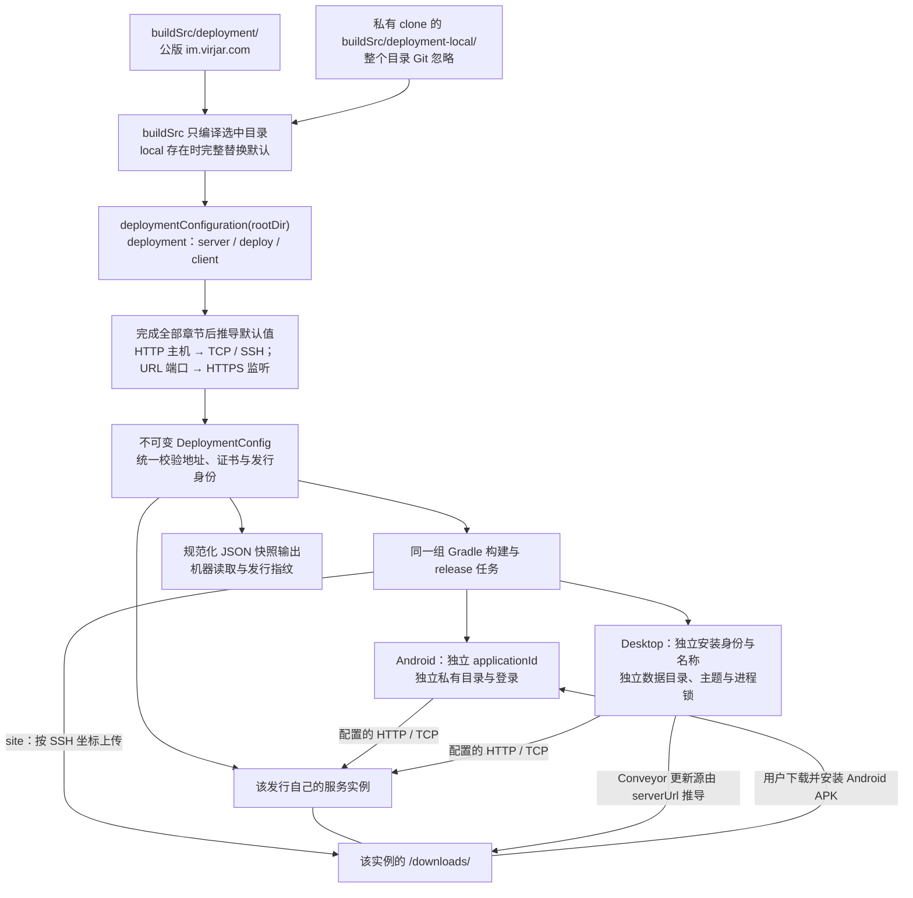

# 运行配置

## 1. 配置分层

| 层 | 文件/来源 | 内容 | 是否入库 |
|---|---|---|---|
| 公版默认部署配置 | `buildSrc/deployment/Deployment.kt` | 公版 HTTP、TCP、SSH、安装路径、客户端发行身份 | 是 |
| 本机部署配置 | `buildSrc/deployment-local/Deployment.kt` | 整个 local 目录完整替换默认配置目录；私有发行在独立 clone 中维护 | 否 |
| 部署 secret | `gradle/deployment.secrets` | 数据库、TLS 等密码 | 否 |
| 实例环境 | `/opt/teamtalk/conf/env.sh` | systemd/JVM 环境变量 | 否 |
| 服务默认值 | `server/.../application.conf` | HTTP、数据库、文件上限 | 是 |
| 客户端默认值 | 生成配置 / ServerConfig | 应用身份与名称、serverUrl、TCP host/port | 构建产物 |

单一部署配置的目标是让客户端、部署任务和真实验收指向同一实例。`buildSrc` 每次只编译选中的一套
Kotlin 配置源码，按 `server`、`deploy`、`client` 章节描述配置，最终返回经校验的 `DeploymentConfig`
对象。secret 与实例运行参数仍然分层，不写进部署配置源码。

## 2. Kotlin 部署配置

仓库提交的 `buildSrc/deployment/Deployment.kt` 始终保留公版 `im.virjar.com`。私有部署使用独立 clone，
在其中创建被 Git 忽略的 `buildSrc/deployment-local/` 目录，并提供自己的 `Deployment.kt`。`buildSrc`
的 main source set 在标准工具源码之外，只额外纳入选中的配置目录：local 目录存在时完整采用 local，
否则采用默认目录；两套配置不会一起编译或叠加，也没有 `-P` 选择入口。local 目录存在但缺少 `Deployment.kt` 入口，或配置类型、
语法有误时构建失败，不回退公版。

配置入口仍是 `package deployment` 下的普通 Kotlin 函数
`fun deploymentConfiguration(rootDir: File): DeploymentConfig`，函数用 `deployment { ... }` 构造配置，
由根构建直接调用。选中的配置目录与 `src/main/kotlin` 进入同一 main source set，使用相同的 Kotlin
编译和类型检查；单独放置目录是为了整套选择公版或私版配置及其辅助文件，不是另一种脚本执行方式。
新增或切换 local 目录后重新同步 Gradle，让 IDE 更新源码目录与类型导航。

DSL 按用途分层：`server` 配置用户访问的 HTTP/TCP，`deploy` 配置管理员的 SSH 与安装目录，`client`
配置客户端行为与发行身份。所有章节完成后才计算默认值，因此调用顺序不影响主机推导。
各层使用 `@DslMarker` 限定隐式接收者，避免在内层误改外层同名字段；最终仍构建不可变
`DeploymentConfig`，由其 `init` 统一检查地址、路径、证书和安装身份。源码入口为
[DeploymentDsl](../../buildSrc/src/main/kotlin/deployment/DeploymentDsl.kt)。

下表路径表示嵌套 DSL 章节，不是另一份 JSON 输入格式：

| DSL 字段 | 默认值与作用 | 最终配置字段 |
|---|---|---|
| `server.http.url` | 必填，绝对 HTTP(S) 根地址；HTTPS 监听端口自动取 URL 端口，省略时为 443 | `serverUrl`、`sslPort` |
| `server.tcp.host` | 默认取最终 HTTP URL 的主机，TCP 入口不同时显式填写 | `tcpAddress` 的主机 |
| `server.tcp.port` | 默认 5100，范围 1–65535 | `tcpAddress` 的端口 |
| `server.tcp.tls.certificateFile` | 可选的公共 PEM `File`；未配置时沿用 SDK 默认策略（远端 WebPKI），配置后读取一张 X.509 证书，禁止私钥；文件不可读或格式错误直接失败 | `tcpTlsCertificatePem` |
| `deploy.directory` | 默认 `/opt/teamtalk`，必须是规范化的非根绝对路径 | `deployPath` |
| `deploy.ssh.host` | 默认取最终 HTTP URL 的主机，可单独填写 SSH hostname 或 IPv4 | `deployHost` |
| `deploy.ssh.port` | 默认 22，范围 1–65535 | `deployPort` |
| `deploy.ssh.user` | 默认 `root`，必须符合安全用户名格式 | `deployUser` |
| `client.allowCustomServer` | 默认 `false`，控制登录页自定义服务器入口；私有发行通常保持关闭 | `allowCustomServer` |
| `client.identity` | 默认保留公版身份；内部三个字段见下节 | `client` |

`sslPort` 不需要再手填一遍；HTTP 模式不会因其内部默认值启用 HTTPS connector。`server.tcp.port`
沿部署链写入 `TCP_PORT`，再由 `TcpServer` 与健康探针共同读取；5100 只是默认值，
不是固定监听。客户端地址、运行时监听和验收目标必须在同一次配置变更中保持一致。

### 客户端发行身份

公版与私有版可以在同一设备分别安装、运行和升级。产品开发在主仓库进行，私有出包和部署在独立
clone 进行，不需要另建私有源码分支或提交部署坐标。以下是私有 clone 中
`buildSrc/deployment-local/Deployment.kt` 的完整示例；IP 仅为文档占位，使用前替换为自己的实际部署坐标。
先按[私有化部署](../01-getting-started/private-deployment.md#2-配置部署坐标与客户端身份)生成或准备 TCP 证书：

```kotlin
package deployment

import java.io.File

fun deploymentConfiguration(rootDir: File): DeploymentConfig = deployment {
    server {
        // TCP 与 SSH 默认使用这个 URL 的主机，不必重复填写。
        http { url = "http://203.0.113.10" }
        tcp {
            port = 5100
            tls {
                // 只读取公共证书；private-key.pem 另行提供给部署任务。
                certificateFile = File(rootDir, "gradle/tcp-tls/certificate.pem")
            }
        }
    }
    deploy {
        directory = "/opt/teamtalk"
        ssh {
            user = "root"
            port = 22
        }
    }
    client {
        allowCustomServer = false
        identity {
            // 首次分发后保持安装标识和英文名稳定。
            applicationId = "com.example.teamtalk.internal"
            displayName = "TeamTalk 内部版"
            desktopName = "TeamTalkInternal"
        }
    }
}
```

| `client.identity` 字段 | 默认值 | 用途与约束 |
|---|---|---|
| `applicationId` | `com.virjar.tk` | 稳定的反向域名应用标识；Android 安装 ID 追加 `.android`，Desktop Bundle ID 与私有版数据目录据此生成 |
| `displayName` | `TeamTalk` | 用户看到的应用名称，可包含中文；用于启动入口、登录界面、窗口、托盘和升级提示 |
| `desktopName` | `TeamTalk` | 稳定的英文安装名称；只用 ASCII 字母和数字，首字符为字母；用于 `.app` 名称、桌面安装与产物命名 |



首次分发前同时选定应用标识、英文安装名称和签名材料，后续普通升级保持三者稳定，只按根
`gradle.properties` 递增发行版本。`displayName` 可以调整；它不决定本地数据目录。Windows 的安装
身份由构建配置同步派生，不能仅修改窗口标题或 macOS Bundle ID 就当作完成新发行。
源码的 Kotlin 包名与 Android `namespace` 保持不变，不需要批量替换源码中的 `com.virjar.tk`。

默认配置保留已有公版的安装身份和数据目录。私有版使用独立应用标识与英文安装名称，第一次打开
时独立登录，不探测或复制公版资料。之后同一发行的普通升级保留账号、草稿、发件箱和附件缓存。
改变应用标识会形成另一个安装及数据空间，不能用来给原发行“升级”或绕过迁移。
桌面私有版目录由稳定的 `applicationId` 派生，服务器域名和显示名称都不参与目录命名；账号内仍按
部署、dataset 和 uid 隔离，迁移服务器坐标时不能据此宣称旧会话资料会自动合并。

每个私有发行使用自己的服务器。站点首页通过 `serverUrl` 对应根地址的 `/downloads/android.json`
读取已发布 Android 包的显示名称、版本与下载链接。受发行收据管理的 APK 使用包含英文安装名称、版本和
文件摘要的下载名，区分不同应用和不同字节的安装包；旧 `/downloads/TeamTalk-android.apk` 入口继续兼容，
下载时也返回同一明确文件名。身份校验、缓存与无收据目录的行为见[站点发布](releasing.md#发布到私有站点)。
用户下载后手动安装；当前 Android 只有协议升级提示与不兼容时的工作区准入限制，尚未实现客户端自动
下载安装。Desktop 的下载入口为 `/downloads/desktop/download.html`，Conveyor
更新源由 `serverUrl` 推导，更新元数据也发布在该 Desktop 目录。共享升级横幅只表达协议兼容状态，
不是自动更新器；这些站点相对路径不需要另配第二个更新源。
服务器坐标、客户端身份及签名准备好后，继续使用[统一发行流程](releasing.md)；无需额外发布脚本。

### 用辅助函数拆分配置

DSL 是普通 Kotlin，可以在选中目录内新增同包文件，例如 `PrivateEndpoint.kt`，按章节拆分：

```kotlin
package deployment

import java.io.File

fun ServerDeploymentBuilder.configurePrivateEndpoint(rootDir: File) {
    http { url = "http://203.0.113.10" }
    tcp {
        tls { certificateFile = File(rootDir, "gradle/tcp-tls/certificate.pem") }
    }
}
```

随后在 `Deployment.kt` 的 `deployment { ... }` 中用 `server { configurePrivateEndpoint(rootDir) }`
替换原 `server` 章节，保留其余 `deploy`、`client` 配置。默认与 local 目录的辅助文件也不会叠加编译；
两种配置共同使用的 DSL 与校验实现仍放在 `buildSrc/src/main/kotlin/deployment/`。

### 发行快照与秘密

人编辑 Kotlin DSL，机器使用最终对象的规范化 JSON 快照；构建工具不再提供 JSON 配置加载入口。
发行密封目录中的 `deployment-config.json` 记录最终生效的全部非敏感字段；配置摘要对函数返回的对象
计算，不对 Kotlin 源码文本计算，因此注释、变量名和等价的函数拆分不会改变配置身份。快照是构建输出，
不能反过来编辑它配置下一次构建，也不能包含秘密。

local 覆写可以用于本地出包和 `release -PreleaseTargets=site`；GitHub 发布拒绝存在 local 覆写的构建，
避免将私有配置上传到公开发行。Git 忽略 local 目录不免除源码、根版本、协议快照与人工发布说明的
干净工作树要求；复用发行目录时仍须匹配当前解析出的配置。签名、SSH 私钥和数据库口令继续通过独立
secret 文件或受控环境输入提供。

本地脚本需要当前配置时，先运行 `./gradlew writeDeploymentConfig`，再读取
`build/deployment/deployment-config.json`。Gradle 调用编译后的配置函数，避免工具自行解析 Kotlin 或
误用上一次构建的目标；该文件与密封目录中的同名快照分别服务于当前构建和已封存发行。

### 传输配置边界

HTTP scheme 与 TCP TLS 分别配置。HTTP 站点可以配合自签 TCP 证书使用 IP 部署，不要求先取得域名或
购买 HTTPS 证书。TCP 使用 TLS 1.2/1.3；配置公共证书只改变该客户端 TCP 链路的信任源，仍验证
`tcpAddress` 的主机名或 IP SAN，HTTP 请求和系统全局信任不受它影响。

| 层 | HTTP | IM TCP 与证书 | 代码入口 |
|---|---|---|---|
| 服务运行时 | 未启用 HTTPS connector 时，HTTP 监听 `0.0.0.0:KTOR_PORT`；同时配置 HTTPS 端口与可加载 keystore 时只开 HTTPS，关闭 HTTP | 默认 `0.0.0.0:5100`；配置 `SSL_KEYSTORE` 后使用 TLS 1.2/1.3，否则为明文。监听地址本身不强制 TLS | [Application](../../server/server/src/main/kotlin/com/virjar/tk/server/Application.kt)、[ServerTransportConfiguration](../../server/server/src/main/kotlin/com/virjar/tk/server/ServerTransportConfiguration.kt) |
| 当前 Android/Desktop/无头 SDK | `serverUrl` 显式选择 HTTP 或 HTTPS，允许非本地 HTTP；文件、机器人和遥测共用地址规则，不跟随认证请求重定向。Android debug/release 清单均允许明文 HTTP | 非本地地址强制 TLS；默认平台 WebPKI，配置 `tcpTlsCertificatePem` 时使用只包含该证书的专用 TrustStore。始终校验主机名/IP，握手失败不回退明文。未配置证书时仅 `localhost`、`::1` 和合法四段 `127.*` 字面地址可用明文 | [ClientTransportTls](../../client/shared/src/commonMain/kotlin/com/virjar/tk/shared/client/ClientTransportTls.kt)、[Android HTTP](../../client/shared/src/androidMain/kotlin/com/virjar/tk/shared/repository/FileRepository.android.kt)、[JVM HTTP](../../client/shared/src/jvmMain/kotlin/com/virjar/tk/shared/repository/FileRepository.desktop.kt) |
| 当前 Gradle 部署工具 | `serverUrl` 选择 HTTP 或 HTTPS connector；HTTP 配置 `tcpTlsCertificatePem` 后允许成对 PEM 参数 | HTTPS 或显式公共 TCP 证书启用 TLS，生成 `TCP_HOST=0.0.0.0` 与 `SSL_KEYSTORE`；HTTPS 另外设置 `KTOR_SSL_PORT`，HTTP 不设置它。无 TLS 的本地开发保留 loopback TCP | [DeploymentConfig](../../buildSrc/src/main/kotlin/deployment/DeploymentConfig.kt)、[EnvSh](../../buildSrc/src/main/kotlin/deployment/EnvSh.kt)、[TLS 预检](../../buildSrc/src/main/kotlin/deployment/TlsDeploymentPreflight.kt) |

HTTP 的平台与 SDK 限制已统一；没有额外明文开关，配置 `http://` 就是明确选择，不在 HTTPS 失败时降级。
HTTP scheme 不决定 TCP 信任。各组合仍须分别判断：

| 连接组合 | 客户端 | 标准部署工具 |
|---|---|---|
| 本地 HTTP + loopback 明文 TCP | 支持 | 支持本地开发 |
| 远程 HTTPS + WebPKI TLS/TCP | 支持 | 支持 |
| 远程 HTTP + 固定证书 TLS/TCP | 支持自签或 CA 颁发的服务证书；客户端配置该公共证书，主机/IP 必须匹配 SAN | `tcpTlsCertificatePem` 显式启用 TCP TLS；首次部署提供对应 PEM 与私钥。可用 `generateTcpTlsCertificate` 生成或复用自签证书，HTTP connector 继续使用明文 |
| 远程 HTTP + 明文 TCP | HTTP 支持；非本地 TCP 仍要求 TLS | 不作为当前完整客户端部署路径 |

自签证书生成与客户端信任必须成对准备：服务器持有证书及私钥，客户端只包含公共 PEM。证书生成任务
在已有文件时检查并复用，不因重建客户端或升级服务器而重新签发。证书过期、主机/SAN 不符或部署了
另一张证书时连接明确失败，不使用 trust-all，不关闭端点校验，也不回退平台信任或明文来掩盖错误。
普通升级保留原证书与私钥；确需轮换时先制定客户端信任迁移和回退步骤，不能只更换服务器证书。
传输组合的验收证据按[传输安全验收门槛](../09-testing/deployment-acceptance.md#传输安全验收门槛)记录，
不能将构建通过当作所有组合和客户端已实测。
HTTP 部署只传 `-PsslCert/-PsslKey` 而未配置 `tcpTlsCertificatePem` 会被拒绝；这避免服务端启用一张
客户端不知道的私有证书。部署预检会验证公共证书有效期、SAN 与上传 PEM 的叶证书一致，普通升级
省略 PEM 参数时也会核对远端保留的证书。公共证书不参与账号的 `DeploymentIdentity`，不会因替换信任
材料而自动换数据库 namespace；证书轮换的连接兼容仍须单独安排。

## 3. 服务端环境变量

| 变量 | 默认 | 说明 |
|---|---|---|
| `KTOR_PORT` | 8080 | 未启用 HTTPS connector 时的明文 HTTP 端口，绑定 `0.0.0.0` |
| `KTOR_SSL_PORT` | 未启用 | 与可加载 keystore 一起启用 HTTPS connector；启用后关闭 HTTP |
| `TCP_HOST` | `0.0.0.0` | 直接运行的 IM TCP 默认地址；部署工具会按上表覆盖 |
| `TCP_PORT` | 5100 | IM TCP 监听端口；部署值来自 `tcpAddress` |
| `MINIMUM_PROTOCOL_MINOR` | 构建的最低 minor | 同协议 major 下的客户端下限；只能提高至当前 minor，启动时校验；普通升级保留显式值并在停服前按目标产物窗口预检；详见[版本机制](../04-protocol/versioning.md) |
| `SSL_KEYSTORE` | 无 | PKCS12 路径；配置后启用 TCP TLS，也供 HTTPS connector 使用 |
| `SSL_KEYSTORE_PASSWORD` | 无 | keystore 密码 |
| `SSL_PRIVATE_KEY_PASSWORD` | 无 | 私钥密码 |
| `DATABASE_PASSWORD` | 必填部署值 | PostgreSQL 用户密码 |
| `FILE_MAX_SIZE_BYTES` | 157286400 | HTTP 单文件上限 |
| `TEAMTALK_FILE_STORE_QUOTA_BYTES` | 10737418240 | 普通附件 FileStore 全局持久容量硬上限；系统属性 `teamtalk.fileStore.quotaBytes` 优先 |
| `TEAMTALK_UNREFERENCED_ATTACHMENT_TTL_HOURS` | 168 | 上传成功但没有当前用户头像、消息、活动群文件或活动文档修订引用的对象租约；必须为 1–8760 的整数，过期后由小时级有界扫描回收 |
| `TEAMTALK_GROUP_FILE_QUOTA_BYTES` | 1073741824 | 每个群共享文件空间配额；系统属性 `teamtalk.groupFile.quotaBytes` 优先 |
| `ADMIN_USER` | 无 | 管理员首次初始化或显式恢复的用户名；与密码成对配置，已有持久凭据时不自动覆盖 |
| `ADMIN_PASSWORD` | 无 | 管理员首次初始化或显式恢复的密码；不是每次启动的密码权威 |
| `ADMIN_CREDENTIAL_RESET_ID` | 无 | canonical UUID；不同于已保存恢复 ID 时，用成对配置的用户名/密码执行一次受审计恢复 |
| `TEAMTALK_AUTH_GUARD_WINDOW_SECONDS` | 10 | 认证尝试计数窗口；必须为 1–86400 的整数 |
| `TEAMTALK_AUTH_GUARD_COOLDOWN_SECONDS` | 30 | 认证维度超限后的冷却时间；必须为 1–86400 的整数 |
| `TEAMTALK_AUTH_GUARD_GLOBAL_ATTEMPTS` | 1024 | 单窗口全部认证尝试硬上限；必须为 1–1000000 的整数 |
| `TEAMTALK_AUTH_GUARD_MAX_CONCURRENT` | 16 | 同时在途的 TCP/管理认证硬上限；必须为 1–128 的整数 |
| `TEAMTALK_AUTH_GUARD_MAX_SOURCES` | 4096 | 驻留的来源/认证操作计数桶上限；必须为 1–1000000 的整数 |
| `TEAMTALK_AUTH_GUARD_MAX_ACCOUNTS` | 16384 | 驻留的账号指纹/认证操作计数桶上限；必须为 1–1000000 的整数 |
| `TEAMTALK_SYNC_EVENT_RETENTION_DAYS` | 30 | 持久同步事件保留天数；必须为 1–3650 的整数，超期后只压缩已完成进程内推送尝试的连续前缀 |
| `LOG_DIR` | 平台默认 | logback 输出目录 |

在 `conf/env.sh` 中配置最低版本时，使用单独一行 `MINIMUM_PROTOCOL_MINOR=数字`，例如
`MINIMUM_PROTOCOL_MINOR=0`；不使用引号、`export`、前导零或行尾注释。首次部署省略该项，使用构建
默认下限。普通升级只读取这一个非敏感赋值，不执行 `env.sh`；重复项和非规范内容会在停服前拒绝。
已有显式值会写回新 `env.sh`，不会因部署重新生成配置而丢失。

升级预检的窗口来自待部署服务端产物 `teamtalk-release.properties` 中的 `protocolMajor`、
`minimumProtocolMinor` 和 `protocolMinor`，包括 CI 的 staged 包，不取当前源码值代替。显式下限低于
目标构建下限或高于目标当前 minor 时，升级会在上传和停服前中止；先按计划修改或移除该显式配置，
再重试。缺少窗口字段的历史产物必须重新构建，不能跳过预检后依赖启动回滚。

TeamTalk 的部署任务生成单密码 PKCS12，因此 HTTPS 实例的
`SSL_KEYSTORE_PASSWORD` 与 `SSL_PRIVATE_KEY_PASSWORD` 必须相同；不一致时部署预检会在修改远端前失败。
启用 TLS 后，TCP 健康探针以 keystore 当前叶证书作为唯一信任锚执行真实握手；明文模式只检查 socket
连通性。客户端的信任规则独立于服务自检，因此本机健康成功不能代替真实客户端连接验收。

认证门禁还按操作使用固定的安全预算：登录、注册、refresh、管理登录分别限制操作、直连来源和规范化
账号指纹；refresh 的预算高于 BCrypt 路径，避免重连潮汐挤占密码验证。来源只取服务器 connector 看到的
直接 socket peer，不读取 `Forwarded` / `X-Forwarded-For`。进程门禁默认最多允许 16 个认证任务在途；
TCP 入口还会取该配置与实际 `IOExecutor` worker 半数中的较小值，始终保留至少一半 worker 给已认证业务。
配置非法时服务启动直接失败。来源/账号表满且没有过期
桶可回收时拒绝新 key，不通过淘汰活动桶放宽限速。

### 管理员凭据与恢复

数据库还没有管理员凭据时，只有同时配置非空 `ADMIN_USER` 与 `ADMIN_PASSWORD` 才初始化管理登录；
已有凭据以后，以 PostgreSQL 中的 verifier 为准，移除或修改上述环境变量不会关闭登录或替换密码。
日常轮换使用管理台“管理安全”页，成功后所有管理员会话立即失效。

忘记密码时，在本实例受控启动环境中设置目标 `ADMIN_USER`、`ADMIN_PASSWORD` 和一个新生成的
canonical UUID `ADMIN_CREDENTIAL_RESET_ID`，重启服务。初始化在发布 HTTP 前把新凭据与恢复审计一起
提交；同一个恢复 ID 再次启动不会重复重置，也不会覆盖之后在管理台轮换的密码。恢复后移除这次
恢复配置，下一次需要恢复时使用新的 UUID。ID 格式错误或恢复时缺少成对凭据会阻止启动。

首次初始化和受控恢复保留非空旧密码的兼容性；超过 72 个 UTF-8 字节的密码先做 SHA-256 摘要再经
Base64 和 BCrypt，不截断原密码。日常轮换仍执行至少 6 个字符、最多 72 个 UTF-8 字节的新密码规则。
数据库只保存 verifier，审计不记录环境中的明文密码或秘密；管理员用户名可作为已验证 actor 保存。会话和审计边界见[搜索与管理](../06-server/search-and-admin.md#5-管理后台)。

## 4. JVM 系统属性

- `teamtalk.data.root`：显式指定数据根目录，Gradle 本地运行使用仓库 `data/`。
- `config.file`：服务端配置文件路径。
- `logback.configurationFile`：logback 配置路径。

生产启动脚本 `bin/teamtalk.sh` 从安装根解析 conf 和 data，不应依赖执行用户的当前目录。

## 5. 数据目录

```text
data/
├── data-epoch               本地持久化格式门禁
├── dataset-id               与 PostgreSQL 共享的 canonical dataset 身份
├── pgdata/                  PostgreSQL volume（部署模式）
├── rocksdb/                 MessageStore
├── lucene-index/            可重建消息索引
├── client-telemetry-index/  7日可丢失客户端遥测日志
├── connection-trace-index/  7日可丢失服务端连接诊断轨迹
├── file-store/rocksdb/      文件元数据、小对象与 uploads 上传事务日志
├── file-store/files/        大对象
├── file-store/tmp/          临时上传
└── logs/                    服务端日志
```

`credentials` 与用户、设备一起属于 PostgreSQL 备份边界；不要再创建、挂载或恢复历史
`data/tokenstore`。客户端遥测设备资料、诊断策略和审计属于 PostgreSQL；事件与幂等收据只存在
`client-telemetry-index`；服务端连接轨迹独立位于 `connection-trace-index`。两者损坏时允许清空但无法恢复。
当前 schema/data epoch 以 `ServerDataEpoch.CURRENT_EPOCH` 为事实源，保留现有值，不随协议零号基线重编号。
存储基线包含：表情回应的 `message_reactions` 行级权威表（`(chat_id, server_seq, emoji, uid)`
主键，聚合计数由服务端派生，消息撤回在同一投影事务清空该消息全部回应）；Document move/rename
的有限 `document_node_move_commands` 收据表；Users
`avatar_path/avatar_name/avatar_content_type/avatar_size` 完整头像四元组、全空或全非空约束和 path 索引，
对外 User 事实的正数单调 `revision`，以及 FileStore RocksDB 的 `uploads` column family；文件 metadata
记录可空的 upload transaction key、attempt token 和对象序号，
使主文件与可选缩略图归属同一次上传。`uploads` 以 `(uid, canonical uploadId)` 为身份持久
`STARTED` / `COMPLETED` 记录，完成态保存可精确重放的完整上传收据。`ReplyBody.assets` 使用
内嵌资产清单，未知的旧无清单格式不能直接解码。普通升级保留数据；PostgreSQL 在当前 epoch 内通过
`schema_migrations` 执行有序迁移，零号迁移放宽遥测协议 ID 约束。其他历史布局必须提供明确迁移或
恢复方案，不能把旧数据库或局部存储目录拼接到新实例，也不能默认清空它们。

修改路径前必须评估备份、systemd 工作目录、容器 volume 和应用 Environment 的共同影响。

## 6. 客户端配置

Desktop 与 Android 的默认服务器在构建时生成。ServerConfig 的 JVM 系统属性覆盖主要用于开发或
无头入口，不能作为最终用户 profile 系统。排查客户端连错服务器时，查看设置页的 commit/build time
和构建配置，不要只看当前仓库文件。
客户端的 HTTP 与 TCP 限制见[传输配置边界](#传输配置边界)。TCP 需要 TLS 时，handshake 成功前
不发布 `CONNECTED`、不发送 AUTH。
Android 与 Desktop 构建均将 `tcpTlsCertificatePem` 公共证书写入生成的构建配置；标准 Desktop
打包与 `run` 直接读取该配置，不通过 JVM 启动参数传递完整证书。需要显式运行时覆盖时，Desktop、
SDK/无头入口仍可使用 `teamtalk.tcp.certificate.base64`。远程验收由 Gradle 从同一部署配置编码到
`tk.e2e.tcp.certificate.base64`；常规客户端使用无需手工维护 Base64 或配置系统全局证书。

Desktop 在当前用户的平台 app-data 根下，按[客户端发行身份](#客户端发行身份)选择固定子目录；
Android 由安装 `applicationId` 获得独立沙箱。普通私有发行不需要配置用户机器的绝对路径。
`teamtalk.data.dir` 仅作为 Desktop 开发/诊断的显式、绝对路径覆盖；其父目录必须已存在且通过当前
用户的安全检查。开发模式也不会默认回退到仓库 `data/`。具体平台目录和冲突处理详见
[桌面端客户端](../05-clients/desktop.md#11-私有数据目录)。
