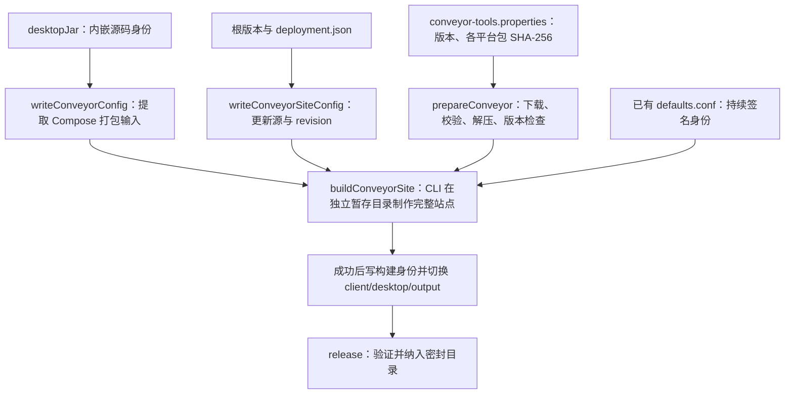

# Desktop 交叉打包与客户端签名

Desktop 使用 Conveyor，在一个构建机上生成 macOS、Windows、Linux 安装包和完整更新站点；Android
生成独立签名 APK。面向客户的发行入口是根 `release` 任务，版本准备、上传和 CI 见
[统一发行流程](releasing.md)。本页解释打包输入、工具管理、签名与各平台边界。

## Gradle 与 Conveyor 的分工

Conveyor Gradle 插件负责提取 Compose 的运行库、主类和 JVM 参数；真正制作安装器的能力由 Conveyor
原生 CLI 提供。插件不是完整打包引擎。项目把 CLI 的下载、固定版本、摘要校验和执行也接入 Gradle，
因此完整流程不要求使用者另外安装二进制或手工敲 Conveyor 命令。



`conveyor.conf` 读取 Gradle 事先写好的普通配置文件，不在 CLI 运行中反向启动 Gradle。由此避免父子
Gradle 进程争用工作目录，也不需要依赖 Windows shell 去执行 Unix shebang。

Conveyor 工具版本与下载哈希固定在 `gradle/conveyor-tools.properties`，当前为 22.1，配置兼容级别为 22。
下载工具解压到 Gradle 用户目录下的 `teamtalk-tools/conveyor`；这与打包所用的 JDK 17 是不同配置。
已经缓存并校验的工具会复用。私有环境可通过下列非秘密参数提供镜像或现成工具：

| 参数 | 等价环境变量 | 用途 |
|---|---|---|
| `-PconveyorDownloadBaseUrl` | `TEAMTALK_CONVEYOR_DOWNLOAD_BASE_URL` | 工具归档镜像根地址；文件名和锁定哈希保持不变 |
| `-PconveyorExecutable` | `TEAMTALK_CONVEYOR_EXECUTABLE` | 管理员准备的可执行文件；仍检查固定版本，不代替归档来源校验 |
| `-PconveyorConfigDir` | `TEAMTALK_CONVEYOR_CONFIG_DIR` | 存放已有 `defaults.conf` 的私密配置目录 |

没有 GitHub 不影响私有发行，但不等于首次构建完全离线。Gradle/Maven、Node/npm、Android SDK、Conveyor
及其 JDK 和更新组件仍需可达下载源或预热缓存；镜像只替换对应工具下载地址，不自动接管所有外部依赖。
Conveyor 的使用许可仍由客户按其部署方式确认，自动下载不替代许可配置。

## Desktop 签名必须持续使用同一身份

完整站点构建要求已有、非空的 `defaults.conf`。默认查找平台的 Conveyor 用户配置目录；显式
`TEAMTALK_CONVEYOR_CONFIG_DIR` 更适合 CI 与客户受控构建机。发行任务不会在缺少配置时自动生成新签名密钥。

同一组织持续交付时应保存原签名材料，在不同构建机恢复同一份配置；CI Secret 只负责分发私密输入。
不要提交私钥或把 `defaults.conf` 放进产物目录。正式 macOS 签名、公证和 Windows 受信任证书需要另外
完成配置与目标平台验证；当前预览签名不能被描述成已获得系统信任的正式发行。

为了单独排查打包，可从根目录运行内部生产任务：

```bash
./gradlew :client:desktop:buildConveyorSite
```

结果在 `client/desktop/output/`。CLI 失败时不为旧目录重新盖身份，也不把半成品当成完成站点；只有完整
构建成功，才写入 `teamtalk-release.properties` 并切换生成目录。正式交付继续使用 `release`，由统一
密封检查确认版本、必需产物与每个文件的 SHA-256。

## 平台产物与更新方式

| 客户端 | 产物 | 现有更新方式 |
|---|---|---|
| macOS | Intel / Apple Silicon 分开的 zip，内含 `.app` | Conveyor 生成的 Sparkle 更新元数据 |
| Windows | 引导 exe、MSIX / appinstaller、zip | 按生成下载页安装后的 appinstaller 更新 |
| Linux | deb、tar.gz、apt 索引 | 按下载页配置 apt；tar.gz 手动替换 |
| Android | 签名 APK | 手动下载覆盖安装，尚无应用内自动更新 |

Desktop 的完整站点包含 `download.html`、平台安装文件与更新索引，不能用其中一个 ZIP 替代整站。
独立解压版也不能被视为已经接通安装器更新路径；遵循生成下载页对应平台的说明。

根 `teamtalk.releaseVersion` 是应用内与 Conveyor 的展示版本。Android `versionCode` 与 Conveyor
`app.revision` 为 `releaseBuildNumber + 1`，零号均为 `1`；零号 Desktop 安装元数据为 macOS/Windows
`0.0.0.1`、Linux `0.0.0-1`。同一安装序号不能用于分发不同包，具体边界见
[版本机制](../04-protocol/versioning.md#零号基线的切换边界)。

Desktop 更新源固定为 `deployment.json` 的 `<serverUrl>/downloads/desktop`。登录页临时改服务器
不会改变已打包更新源；Android 使用构建时坐标。私有客户须在构建前固定自己的 HTTP/TCP 地址与更新站点。

当前 Android 最低 API 26，macOS 最低 14.0。三平台交叉出包成功不代表各系统都完成实机验收；参与
本轮内测的平台应从实际交付文件完成安装、启动和登录检查。操作系统的安装提示不能靠关闭全局系统
安全设置解决。

## Android 签名

Android 优先读取环境变量，其次读取不入库的 `local.properties`：

| 环境变量 | local.properties 字段 |
|---|---|
| `TEAMTALK_ANDROID_KEYSTORE` | `release.storeFile` |
| `TEAMTALK_ANDROID_STORE_PASSWORD` | `release.storePassword` |
| `TEAMTALK_ANDROID_KEY_ALIAS` | `release.keyAlias` |
| `TEAMTALK_ANDROID_KEY_PASSWORD` | `release.keyPassword` |

证书文件可用绝对路径或相对仓库根目录的路径。没有配置 keystore 时使用已入库的固定公开预览证书
`client/android/teamtalk-dev.jks`；该证书用于连续预览包覆盖安装，不用于组织正式私有签名。
证书缺失或密码错误会让 release 构建失败，不降级为 unsigned APK，也不临时换用另一份密钥。

统一密封流程使用 JVM APK 验签器检查真实签名，并读取 APK 内的构建身份以及 Android 输出元数据，
在清单中记录签名证书 SHA-256。单独调试构建可运行：

```bash
./gradlew :client:android:assembleRelease
```

覆盖安装要求应用 ID 与签名一致。从 debug 或另一证书换装可能要求卸载，影响本地数据；应在首次组织
内测前固定长期签名。后续每次发行仅增加安装序号，不能把更换签名造成的安装失败当成数据迁移方案。

## 本机 DMG 与 SDK 的独立边界

`:client:desktop:packageReleaseDmg` 仍可在 macOS 通过 Compose/JDK jpackage 生成当前架构的 DMG，
路径为 `client/desktop/build/compose/binaries/main-release/dmg/`。它不包含 Conveyor 的完整更新站点，
不替代统一发行里的跨平台包；Intel Mac 构建也不证明 Apple Silicon 原生包已验证。

SDK 与无头客户端从同一版本源码接入。`:client:shared:headlessDist` 提供 `tt-agent`、`tt`、`tt-mcp`
和运行库，需 JDK 17；首次运行和持久数据目录见[无头客户端](../05-clients/headless.md#3-构建与启动-agent)。

打包事实源是 `client/desktop/build.gradle.kts`、`client/desktop/conveyor.conf`、
`gradle/conveyor-tools.properties`、`client/android/build.gradle.kts` 与 `buildSrc/src/main/kotlin/release/ConveyorTools.kt`。
