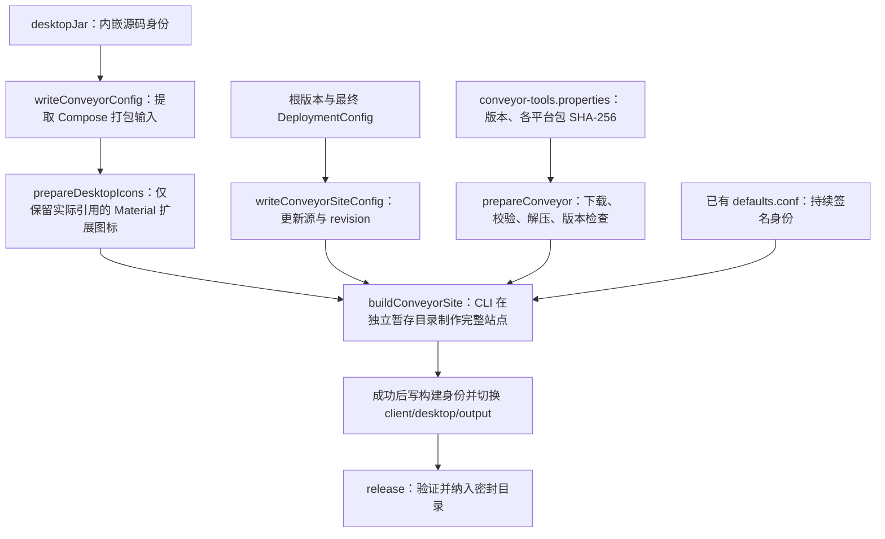

# Desktop 交叉打包与客户端签名

Desktop 使用 Conveyor，在一个构建机上生成 macOS、Windows、Linux 安装包和完整更新站点；Android
生成独立签名 APK。面向客户的发行入口是根 `release` 任务，版本准备、上传和 CI 见
[统一发行流程](releasing.md)。本页解释打包输入、工具管理、签名与各平台边界。

## Gradle 与 Conveyor 的分工

Conveyor Gradle 插件负责提取 Compose 的运行库、主类和 JVM 参数；真正制作安装器的能力由 Conveyor
原生 CLI 提供。插件不是完整打包引擎。项目把 CLI 的下载、固定版本、摘要校验和执行也接入 Gradle，
因此完整流程不要求使用者另外安装二进制或手工敲 Conveyor 命令。



`conveyor.conf` 读取 Gradle 事先写好的普通配置文件，不在 CLI 运行中反向启动 Gradle。由此避免父子
Gradle 进程争用工作目录，也不需要依赖 Windows shell 去执行 Unix shebang。

Conveyor 工具版本与下载哈希固定在 `gradle/conveyor-tools.properties`，当前为 22.1，配置兼容级别为 22。
下载工具解压到 Gradle 用户目录下的 `teamtalk-tools/conveyor`；这与打包所用的 JDK 21 是不同配置。
已经缓存并校验的工具会复用。私有环境可通过下列非秘密参数提供镜像或现成工具：

| 参数 | 等价环境变量 | 用途 |
|---|---|---|
| `-PconveyorDownloadBaseUrl` | `TEAMTALK_CONVEYOR_DOWNLOAD_BASE_URL` | 工具归档镜像根地址；文件名和锁定哈希保持不变 |
| `-PconveyorExecutable` | `TEAMTALK_CONVEYOR_EXECUTABLE` | 管理员准备的可执行文件；仍检查固定版本，不代替归档来源校验 |
| `-PconveyorConfigDir` | `TEAMTALK_CONVEYOR_CONFIG_DIR` | 存放已有 `defaults.conf` 的私密配置目录 |

没有 GitHub 不影响私有发行，但不等于首次构建完全离线。Gradle/Maven、Node/npm、Android SDK、Conveyor
及其 JDK 和更新组件仍需可达下载源或预热缓存；镜像只替换对应工具下载地址，不自动接管所有外部依赖。
Conveyor 的使用许可仍由客户按其部署方式确认，自动下载不替代许可配置。

## Desktop 签名必须持续使用同一身份

完整站点构建要求已有、非空的 `defaults.conf`。默认查找平台的 Conveyor 用户配置目录；显式
`TEAMTALK_CONVEYOR_CONFIG_DIR` 更适合 CI 与客户受控构建机。发行任务不会在缺少配置时自动生成新签名密钥。

同一组织持续交付时应保存原签名材料，在不同构建机恢复同一份配置；CI Secret 只负责分发私密输入。
不要提交私钥或把 `defaults.conf` 放进产物目录。正式 macOS 签名、公证和 Windows 受信任证书需要另外
完成配置与目标平台验证；当前预览签名不能被描述成已获得系统信任的正式发行。

为了单独排查打包，可从根目录运行内部生产任务：

```bash
./gradlew :client:desktop:buildConveyorSite
```

结果在 `client/desktop/output/`。CLI 失败时不为旧目录重新盖身份，也不把半成品当成完成站点；只有完整
构建成功，才写入 `teamtalk-release.properties` 并切换生成目录。正式发行和内测交付均使用 `release`，由统一
密封检查确认版本、必需产物与每个文件的 SHA-256。

## 实际发行包的代码裁剪

`prepareConveyorConfig` 先运行插件的 `writeConveyorConfig`，再由 `prepareDesktopIcons` 将其中的
`material-icons-extended-desktop` 替换为本次构建实际引用的图标集合。编译仍使用完整依赖，开发者照常
使用 `Icons.Filled`、`Icons.Outlined` 或 `Icons.AutoMirrored`；无需手工登记清单或复制上游矢量源码。
分析覆盖应用与各目标运行依赖的编译字节码，递归保留图标之间的引用。填充和轮廓图标按真实引用分别保留，
被保留的 class 字节、图标库非 class 资源及其他依赖均不修改。

裁剪后的 JAR、保留类清单与字节统计位于 `client/desktop/build/conveyor/icons/`，真正供 Conveyor 使用的
配置为 `build/conveyor/generated.conveyor.conf`；原始解析结果在 `extracted.conveyor.conf`，便于对照。
新增正常图标引用后下次构建会自动纳入。不要通过拼接类名反射调用图标；这种方式无法静态确定实际图标集合。
图标库结构或插件输出格式改变时，任务会报错，须审阅适配后继续打包。

这一流程仅删除未用的纯矢量图标类，不启用名称混淆。Compose `packageRelease*` 的
`desktop-proguard.pro` 仍属于另一条内部打包路径，统一 `release` / Conveyor 没有使用其整应用裁剪结果。
这条内部路径的 `proguardReleaseJars` 完成后会比较原始依赖与实际输出中 macOS、Windows、Linux 视频桥
的全部 native 方法签名。三个桥都明确保留 native 方法组：原生库会按名反查部分没有 JVM 调用者的方法，
仅禁止重命名不能防止它们被删除。检查不加载其他平台的原生库，所以任何构建宿主都能发现这种误裁剪。
Windows 10 22H2 实机报告曾复现裁剪后的 `nShutdownMediaFoundation` 缺失；该结论针对 Compose
本地压缩产物，不能据此认定未经过 ProGuard 的 Conveyor 安装包有相同缺陷。

Windows 的进程身份与系统 SID 查询还使用 JNA。压缩规则只为仍被引用的 `Structure` / `NativeMapped`
类型保留反射字段与构造器，并保存 `FieldOrder` 注解，不整包保留 `jna-platform`。同一打包检查会核对
实际输出里 `WinNT.PSID` 的 `sid` 指针字段、公开无参构造器与字段顺序；不必在构建机加载 Windows DLL。
依据见 JNA 5.15 的 [PSID 定义](https://github.com/java-native-access/jna/blob/5.15.0/contrib/platform/src/com/sun/jna/platform/win32/WinNT.java)
和 [NativeMapped 反射构造](https://github.com/java-native-access/jna/blob/5.15.0/src/com/sun/jna/NativeMappedConverter.java)。
此外显式保留 JNA 核心 `Native.initIDs` 按名绑定的成员，依据实际解析版本 5.18.1 的
[JNI 初始化清单](https://github.com/java-native-access/jna/blob/5.18.1/native/dispatch.c#L2862)。这些初始化入口
即便没有 Java 调用者也不能裁掉；升级实际解析的 JNA 版本时应核对该清单。打包后可在任意平台用输出
JNA JAR 构造 `WinNT.PSID` 并调用 `size()`，验证核心 JNI 初始化和 Structure 反射，再在 Windows 验证
真实进程身份/SID 查询；前者不会加载 Windows DLL。

尤其不能将依照构建宿主筛选 SQLite native 库的后处理接到跨平台 Conveyor：各目标 JNI、JBR 模块、字体
与媒体组件继续由原有平台输入和 native extraction 配置管理。进一步收紧 ProGuard、R8 或运行时模块前，
须分别验证数据库、反射/SPI、中文字体、媒体与系统集成，并用同一源码和运行时做包体对照。

## 平台产物与更新方式

| 客户端 | 产物 | 现有更新方式 |
|---|---|---|
| macOS | Intel / Apple Silicon 分开的 zip，内含 `.app` | Conveyor 生成的 Sparkle 更新元数据 |
| Windows | 引导 exe、MSIX / appinstaller、zip | 按生成下载页安装后的 appinstaller 更新 |
| Linux | deb、tar.gz、apt 索引 | 按下载页配置 apt；tar.gz 手动替换 |
| Android | 签名 APK | 手动下载覆盖安装，尚无应用内自动更新 |

Desktop 的完整站点包含 `download.html`、平台安装文件与更新索引，不能用其中一个 ZIP 替代整站。
独立解压版也不能被视为已经接通安装器更新路径；遵循生成下载页对应平台的说明。

Windows 当前安装包要求 Windows 10 1809（build 17763）或更新版本，具体下限以 MSIX 内的
`TargetDeviceFamily.MinVersion` 为准。下载页提供的 `.exe` 是引导器，它仍会通过 `.appinstaller`
下载 MSIX；能在浏览器下载文件不等于 Windows 安装服务能读取它。

安装站点必须提供正确的 `Content-Type`、GET/HEAD 文件长度与字节 Range 响应。TeamTalk 的公共下载
路由使用 Ktor `PartialContent`，并显式声明 `.appinstaller` 为 `application/appinstaller`、`.msix` 为
`application/msix`。HTTP 与 HTTPS 均可使用；没有域名不是要求客户购买证书的理由。反向代理或其他
静态托管也必须保留这些响应语义，不能把 Range 请求退化为完整文件 `200`。微软的
[BITS 下载要求](https://learn.microsoft.com/en-us/windows/win32/bits/http-requirements-for-bits-downloads)
与 [App Installer 排障说明](https://learn.microsoft.com/en-us/windows/msix/app-installer/troubleshoot-appinstaller-issues)
列出了相应约束；包签名信任与 HTTP 下载兼容是两个独立检查。

每次交付在实际站点验证 HEAD、片段下载及不存在文件的 404，再用要分发的引导器在目标 Windows 上
完成安装；步骤见[客户端安装站点验收](../09-testing/deployment-acceptance.md#客户端安装站点的-http-验收)。

根 `teamtalk.releaseVersion` 是应用内与 Conveyor 的展示版本。Android `versionCode` 与正式发行的 Conveyor
`app.revision` 为 `releaseBuildNumber + 1`，零号均为 `1`；零号 Desktop 安装元数据为 macOS/Windows
`0.0.0.1`、Linux `0.0.0-1`。同一展示版本与 Desktop revision 不能用于分发不同包，具体边界见
[版本机制](../04-protocol/versioning.md#零号基线的切换边界)。
独立私有应用可以经用户确认，以当前版本和安装序号完成首次分发；它有自己的安装身份和空更新站点，
入口见[首次私有安装包分发](releasing.md#保持当前版本的首次私有安装包分发)。后续用户要求更新内测包时，
使用[内测 snapshot](releasing.md#保持展示版本的内测更新)：提交工作源码后手动运行
`release -PreleaseMode=snapshot -PreleaseTargets=site`，仅保留本地产物时用 `local`；不修改根版本文件。
例如展示版本仍为 `0.0.0`、根构建号仍为 `0` 时，Android code 保持 `1`，用户手动覆盖安装；Desktop 的
`desktopRevision` 自动取完整 Git first-parent 提交数加根构建号再加一，满足 Conveyor 对不同包的要求。
该计算不依赖 tag；必须使用完整 clone。同一展示版本的后续 snapshot 保留已分发源码及历史，从其后代构建。
应用身份、签名与数据目录沿用原值，不打 tag，不通过 GitHub 自动交付 snapshot。
Conveyor 对同一版本与 revision 的字节一致性检查保持有效；原包重试复用密封目录，不靠删除缓存重新制作
相同 revision 的不同包。正式发行再推进根展示版本与构建号，使 Android code 增加；新的 Desktop 展示版本
可重新按根构建号映射末位 revision，无须继续上一展示版本的内测提交计数。

内测 snapshot 生成完整 macOS 安装包，不生成差量包（`app.mac.deltas=0`），因此不必为计算差量下载旧版
ZIP；完整安装包和更新索引照常生成。正式发行保持 Conveyor 默认差量策略。该设置遵循
[Conveyor 的开发/测试构建建议](https://conveyor.hydraulic.dev/22.1/performance/#reduce-the-number-of-deltas-created-for-macos)。

Desktop 更新源固定为最终部署配置的 `<serverUrl>/downloads/desktop`。登录页临时改服务器
不会改变已打包更新源；Android 使用构建时坐标。私有客户须在构建前固定自己的 HTTP/TCP 地址与更新站点。
私有坐标在独立 clone 的 `buildSrc/deployment-local/Deployment.kt` 维护，不修改主仓库公版默认配置。

当前 Android 最低 API 26，macOS 最低 14.0。三平台交叉出包成功不代表各系统都完成实机验收；参与
本轮内测的平台应从实际交付文件完成安装、启动和登录检查。操作系统的安装提示不能靠关闭全局系统
安全设置解决。

## Android 签名

签名身份按以下优先级解析（T012），Debug 与 Release 始终绑定同一身份，满足同包名覆盖安装：

解析实现集中在 [AndroidSigningResolver](../../buildSrc/src/main/kotlin/deployment/AndroidSigningResolver.kt)，
Android 模块构建脚本只把解析结果绑定给 AGP。默认身份、参数优先级和密码回退都在同一入口维护。

1. **部署 DSL**（推荐入口）：`client { androidSigning { storeFile = ...; keyAlias = ... } }`。
   密码不属于 DSL，从下表秘密入口解析；配置了 DSL 而密码缺失会明确失败。
2. **环境变量 / local.properties**（既有私有构建路径，向后兼容）：

| 环境变量 | local.properties 字段 |
|---|---|
| `TEAMTALK_ANDROID_KEYSTORE` | `release.storeFile` |
| `TEAMTALK_ANDROID_STORE_PASSWORD` | `release.storePassword` |
| `TEAMTALK_ANDROID_KEY_ALIAS` | `release.keyAlias` |
| `TEAMTALK_ANDROID_KEY_PASSWORD` | `release.keyPassword`（缺省回退 storePassword） |

3. **固定试用证书**：以上都未配置时使用已入库的公开预览证书 `client/android/teamtalk-dev.jks`；
   该证书用于连续预览包覆盖安装，不用于组织正式私有签名。

证书文件可用绝对路径或相对仓库根目录的路径。显式选择自有证书后，文件缺失、密码缺失、
密码错误或别名无效应明确失败，不降级为 unsigned APK，也不静默回退默认证书。
非敏感部署快照只输出签名模式（`default-trial` / `custom`）与证书路径；密码与私钥
不进入部署配置、发布快照、BuildConfig 或日志。

统一密封流程使用 JVM APK 验签器检查真实签名，并读取 APK 内的构建身份以及 Android 输出元数据，
在清单中记录签名证书 SHA-256。单独调试构建可运行：

```bash
./gradlew :client:android:assembleRelease
```

覆盖安装要求应用 ID 与签名一致。从 debug 或另一证书换装可能要求卸载，影响本地数据；应在首次组织
内测前固定长期签名。正式发行推进 Android 安装 code，snapshot 保持当前 code 手动覆盖；两种方式都不能
把更换签名造成的安装失败当成数据迁移方案。

## 本机 DMG 与 SDK 的独立边界

`:client:desktop:packageReleaseDmg` 仍可在 macOS 通过 Compose/JDK jpackage 生成当前架构的 DMG，
路径为 `client/desktop/build/compose/binaries/main-release/dmg/`。它不包含 Conveyor 的完整更新站点，
不替代统一发行里的跨平台包；Intel Mac 构建也不证明 Apple Silicon 原生包已验证。

检查这条本机打包路径可运行 `:client:desktop:createReleaseDistributable`，无需 Windows MSI 所需的
WiX 工具。它会执行 ProGuard 后的 JNI 签名检查，并运行 `stripRuntimeFonts`。字体清理从 Compose
任务读取实际输出目录与包名，按 jpackage 的布局定位：

| 平台 | app-image 输出目录内的字体路径 |
|---|---|
| macOS | `<包名>.app/Contents/runtime/Contents/Home/lib/fonts` |
| Windows | `<包名>/runtime/lib/fonts` |
| Linux | `<包名>/lib/runtime/lib/fonts` |

运行时没有附带这组可选字体时跳过清理，不删除系统字体。构建工具的路径与 JNI 回归测试位于
`buildSrc` 的 `release.DesktopPackageChecksTest`，由现有 Linux/Windows 发行工具 CI 执行；实际出包和
中文渲染、媒体播放仍须在目标平台验收。Conveyor 使用自己的 JBR 组装流程，不调用这项字体清理。

SDK 与无头客户端从同一版本源码接入。`:client:shared:headlessDist` 提供 `tt-agent`、`tt`、`tt-mcp`
和运行库，需 JDK 21；首次运行和持久数据目录见[无头客户端](../05-clients/headless.md#3-构建与启动-agent)。

打包事实源是 `client/desktop/build.gradle.kts`、`client/desktop/conveyor.conf`、
`gradle/conveyor-tools.properties`、`client/android/build.gradle.kts` 与 `buildSrc/src/main/kotlin/release/ConveyorTools.kt`。
