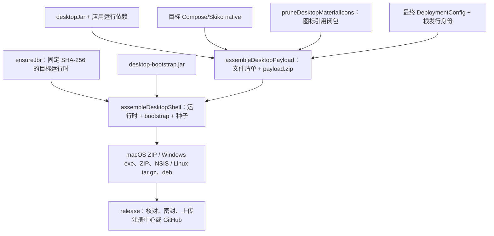

# Desktop 交叉打包与客户端签名

Desktop 由仓库内的 Gradle 任务组装 JBR、bootstrap 和应用负载，在一台 macOS 或 Linux 构建机上生成
四个目标的首装包。Android 独立生成签名 APK，无头客户端生成需要 Java 21 的发行 ZIP。对外交付使用
根 `release` 任务；发行决定、密封与上传见[统一发行流程](releasing.md)，更新契约见
[客户端发布与更新体系](client-releases.md)。

## 构建输入与产物

| 目标 key | 首装包 | 包内启动入口 |
|---|---|---|
| `macos-aarch64` | Apple Silicon `.app` ZIP | `<desktopName>.app/Contents/MacOS/<desktopName>` |
| `macos-amd64` | Intel `.app` ZIP | 同上，随包 JBR 和 Skiko 为 x64 |
| `windows-amd64` | NSIS `setup.exe`、便携 ZIP | `<desktopName>/<desktopName>.exe` |
| `linux-amd64` | `.deb`、`.tar.gz` | `<desktopName>/bin/<desktopFsName>` |

每个目标另外生成一个 `payload.zip`，供 bootstrap 首次安装及发布注册中心的文件级更新使用。
首装包包含运行时、启动器与种子负载；单独下载 `payload.zip` 不能替代首装包。



`:client:desktop:run` 仍使用宿主的 Compose runtime；交叉打包分别解析四个目标的 native 工件。
应用依赖的版本选择必须一致，不能把几个独立 runtime 图直接拼接，导致同一个协程或序列化类从不同
版本 JAR 重复加载。只替换宿主相关的 Compose/Skiko 工件，SQLite、JNA、媒体库及其资源继续保留。

图标裁剪只删除 `material-icons-extended` 中没有被负载字节码引用的图标类，保留被引用类的闭包、
原始 class 字节和非 class 资源。输出位于 `client/desktop/build/desktop-payload/icons-subset/`，报告位于
相邻的 `icons-report/`。正常使用 `Icons.*` 无须维护人工清单；动态拼接图标类名不属于支持的引用方式。
当前发行链没有整应用 ProGuard/R8 混淆，不应照搬旧 jpackage 路径的裁剪规则。

## 工具与本机构建

构建机需要 JDK 21。Gradle 管理 Maven 依赖、Launch4j 和固定版本的 JBR；完整交叉安装器构建还需要
系统 `tar`（含 gzip/xz 支持）及 NSIS 的 `makensis`：

```bash
# macOS
brew install makensis

# Debian/Ubuntu 构建机
sudo apt-get install nsis

# 单独调试四目标首装包与负载，不上传
./gradlew :client:desktop:assembleDesktopShells
```

macOS 上 Launch4j 的工具为 Intel 二进制，Apple Silicon 构建机需要可运行它们的 Rosetta 环境。
Linux CI 使用同一任务生成四目标产物。Windows CI 验证 Windows 自身的便携包；目前没有验证 Windows
宿主完整交叉生成 macOS/Linux 包，不能由 Windows 客户端可用推导出该宿主构建矩阵已覆盖。

只调试一个目标时使用对应任务，例如：

```bash
./gradlew :client:desktop:assembleDesktopShellMacosAarch64
./gradlew :client:desktop:packageWindowsPortableWindowsAmd64
./gradlew :client:desktop:buildWindowsInstallerWindowsAmd64
./gradlew :client:desktop:buildLinuxDebLinuxAmd64
```

Windows 用 `.\gradlew.bat` 调用同名任务。`assembleDesktopShellWindowsAmd64` 只准备运行时和种子树；
生成可运行 `.exe` 需 `wrapWindowsBootstrapWindowsAmd64`，通常直接使用上面的便携包或安装器任务。
`-Pteamtalk.skipWindowsInstaller=true` 仅允许本地调试跳过 NSIS；完整发行仍必须具有必需安装器。

首装包位于 `client/desktop/build/desktop-shell/<target>/`，NSIS/deb 位于其 `installer/` 子目录；
各负载位于 `client/desktop/build/desktop-payload/<target>/`。内部构建任务允许开发中的代码，不能代替
统一 `release` 对干净源码、版本、协议、身份及完整产物的校验。

### JBR 固定版本与离线输入

`gradle/jbr.properties` 固定各目标归档地址及 SHA-256。归档缓存位于
`~/.gradle/teamtalk-tools/jbr/archives/`，解压缓存按目标和摘要分目录；更新 pin 后使用新目录，
不能仅凭旧 `.complete` 文件继续使用旧 JBR。该配置文件是 Gradle 任务输入。

离线构建可设置 `TEAMTALK_JBR_DIR`，布局为 `<目录>/<target>/<归档顶层目录>/…`。
macOS 归档顶层包含 `Contents/Home/bin/java`，Linux 包含 `bin/java`，Windows 包含 `bin/java.exe`。
离线目录由维护者准备，任务检查实际 Java 入口并直接消费所选目录；它不代替管理员对离线运行时来源的确认。
其他 Gradle/Maven、Node/npm、Android SDK 依赖仍需预热，提供 JBR 不表示整个工程可以首次离线构建。

Linux tar/deb 统一记录数字所有者 `0:0`，不带构建机的扩展属性、AppleDouble 或用户名称。
运行时复制与 ZIP 归档保留符号链接和执行权限。特别是 macOS JBR 的签名资源包含链接，不能展开成
普通文件后宣称签名仍然有效。ZIP 使用 JVM 写入器重建，避免更新旧 ZIP 时残留已经删除的文件。

## 安装身份、签名与升级边界

安装身份来自最终 `DeploymentConfig.client`：`applicationId` 隔离客户端及负载数据，`desktopName`
是稳定的英文安装名称，`displayName` 用于界面。私有构建必须沿用已分发的身份和签名；改显示名称或
服务器地址不能改变数据根。配置入口见[客户端发行身份](configuration.md#客户端发行身份)。

Linux deb 的包名和 `/opt/` 目录使用 `desktopFsName`，提供 `/usr/bin/<desktopFsName>` 与桌面菜单
入口。NSIS 使用稳定安装名称注册安装目录、快捷方式和卸载项，不用可变的中文显示名称作为路径身份。
应用数据仍由客户端数据目录策略管理，安装器更新不清理账号、草稿和可靠发件箱。

根展示版本与 `desktopRevision` 同时进入桌面安装元数据：macOS `CFBundleVersion` 为
`<version>.<revision>`，deb 为 `<version>-<revision>`。正式发行、private-first、snapshot 的 revision
与通道规则由统一发行入口决定，见[内测 snapshot](releasing.md#保持展示版本的内测更新)。负载清单同时
携带 `buildIdentity`，不能用同一展示版本掩盖不同源码。

当前首装包没有接入完整的 macOS Developer ID 签名、公证或 Windows Authenticode 签名流水线。
保留 JBR 原签名不等于整个应用获得系统信任；对外扩大分发前须在实际目标系统确认安装提示及正式签名
流程。旧 Conveyor `defaults.conf` 不再是新打包任务输入，但应保留既有发行记录和签名材料。

新桌面安装器与便携包均经 bootstrap 加载用户目录中的应用负载，应用内更新只替换负载；JBR、启动器
或壳 ABI 变化需要新首装包。旧 Sparkle、AppInstaller/MSIX、apt 更新链不会自动转换为新体系：首次迁移
需要手动安装新包，旧下载目录保留；具体用户迁移边界见[从 Conveyor 迁移](client-releases.md#7-迁移说明从-conveyor)。

## 原生库与目标平台验收

Skiko 的 JAR 及其目标 native 资源必须一致；仅在包名中出现平台名称不能证明可以加载。macOS 本地文件
播放器覆盖由 `verifyMacVideoPlayerOverride` 核对源码摘要、Mach-O 架构、最低系统版本和签名边界，
`desktopJar` 再核对实际资源。重新生成该覆盖需在 macOS 显式运行 `rebuildMacVideoPlayerOverride`，
其他构建宿主消费已提交、可审阅的双架构产物。

打包保留 JNA、SQLite 和媒体运行库的 JNI/SPI/反射资源。接收媒体仍先完整下载到本地再播放；原生播放器
能力不改变这一产品边界。Linux 播放器使用 ComposeMediaPlayer 0.9.0 的 GStreamer 后端；deb 声明 JBR 图形依赖、
GStreamer 核心、base/good 插件和 libav 解码器。tar.gz 使用者需要自行准备同等系统依赖。实际图形、
字体、音频和媒体能力仍需在目标发行版验证；不能用容器中成功解压替代桌面会话验收。

`buildSrc` 的 `DesktopShellPackagingTest` 执行生成的 POSIX 启动脚本、编译 NSIS、读取实际 deb 的
压缩成员，并验证私有路径、执行位和符号链接。Linux CI 生成全部首装包并运行 `dpkg-deb` 检查；Windows
CI 生成 Launch4j 便携包并运行当前用户身份与私有存储测试。

交付前仍需从要交付的原文件完成安装、启动、登录、中文字体、托盘、本地图片/音视频、检查更新及更新后
重启，覆盖旧版本账号、草稿和发件箱保留。三平台交叉构建成功不代表三平台真实客户端都已经验收。
操作流程见[Desktop 自动化](../09-testing/desktop-automation.md)及
[部署验收](../09-testing/deployment-acceptance.md)。

## Android 签名

Android 签名由 [AndroidSigningResolver](../../buildSrc/src/main/kotlin/deployment/AndroidSigningResolver.kt)
集中解析，Debug 与 Release 使用同一身份以支持同包名覆盖安装：

1. 部署 DSL 的 `client { androidSigning { storeFile = …; keyAlias = … } }` 优先；密码从秘密入口读取。
2. 未配置 DSL 时使用环境变量或 `local.properties` 的既有签名字段。
3. 均未配置时使用仓库的公开预览证书 `client/android/teamtalk-dev.jks`，不用于组织正式私有签名。

| 环境变量 | `local.properties` |
|---|---|
| `TEAMTALK_ANDROID_KEYSTORE` | `release.storeFile` |
| `TEAMTALK_ANDROID_STORE_PASSWORD` | `release.storePassword` |
| `TEAMTALK_ANDROID_KEY_ALIAS` | `release.keyAlias` |
| `TEAMTALK_ANDROID_KEY_PASSWORD` | `release.keyPassword`，缺省回退 storePassword |

显式选用自有证书后，路径、密码或别名错误会失败，不回退默认证书。密码与私钥不进入部署快照或产物日志。
`:client:android:assembleRelease` 可单独构建 APK；统一密封流程验证实际 APK 签名与构建身份，并记录证书
SHA-256。覆盖安装要求应用 ID 和签名一致，不能以卸载导致的数据丢失代替升级迁移。

无头客户端的分发、安装与 Java 21 运行边界见[无头客户端](../05-clients/headless.md)。
