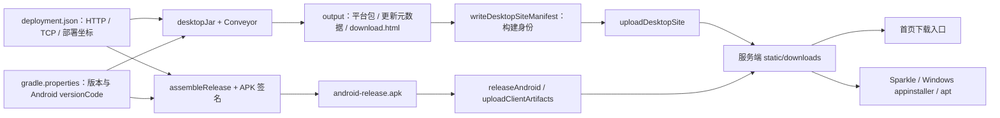

# 客户端发行与 Desktop 交叉打包

当前发行链采用 Conveyor：一个构建机生成 Desktop 三平台安装包和更新站点；Android 独立生成签名 APK。
这里说明开发者预览版怎样出包、交付和识别版本。服务端安装与升级见[部署与升级](deployment.md)，
测试者从安装到首次登录的步骤见[快速上手](../01-getting-started/README.md)。

本机 Compose DMG 的 `jpackage` 要求安装版本首段为正数，所以使用独立构建计数的正数映射。
应用内展示版本与 Conveyor 仍统一；零号版本的对应关系见[版本机制](../04-protocol/versioning.md#零号基线的切换边界)。

## 1. 产物与下载路径



| 客户端 | 构建产物 | 发布后的入口 | 更新方式 |
|---|---|---|---|
| macOS | Intel / Apple Silicon 分开的 zip，内含 `.app` | `/downloads/desktop/download.html#mac` | Conveyor 打包的 Sparkle 更新元数据 |
| Windows | 安装引导程序、MSIX / appinstaller、zip | `/downloads/desktop/download.html`；首页链接 `teamtalk.exe` | 通过安装器安装后的系统 appinstaller 更新 |
| Linux | deb、tar.gz、apt 索引 | `/downloads/desktop/download.html#linux` | 使用生成下载页配置 apt；tar.gz 手动替换 |
| Android | `client/android/build/outputs/apk/release/android-release.apk` | `/downloads/TeamTalk-android.apk` | 当前手动下载并覆盖安装，没有应用内自动更新 |
| 无头开发接入 | `client/shared/build/headless/` | 从同版本源码执行 `:client:shared:headlessDist` | 维护者替换自己的分发目录；首页和发行 workflow 尚未分发此目录 |

下载链接均相对于部署服务器，首页与静态路由位于同一 JVM 服务内，不需要额外 Web 服务。
Desktop 更新站点必须完整上传：只发一个 zip / MSIX 不会同时交付下载页、更新索引和增量包。
独立解压版也不能据此承诺安装器的更新行为，测试者应遵循生成下载页对应平台的安装步骤。

## 2. 出包前固定版本和服务器

- 版本源是 `gradle.properties` 的 `teamtalk.releaseVersion` 与 `teamtalk.releaseBuildNumber`。
  Android `versionCode = releaseBuildNumber + 1`；展示字符串和协议数字版本独立，tag 构建还校验
  `v<releaseVersion>`。准备新一轮预览时递增版本，避免用户难以区分两份同名包。
- `gradle/deployment.json` 固定 HTTP 与 TCP 坐标。私有化客户端应为目标服务器重新构建；
  TCP 登录与 HTTPS 附件通道都必须可达。修改地址不会自动发布客户端。
- Desktop 更新源也由这份配置推导为 `<serverUrl>/downloads/desktop`，经 `printSiteConfig`
  注入 Conveyor。Desktop 登录页的临时改服入口不会改变已打包的更新源。
- `allowCustomServer` 目前仅由 Desktop 登录窗口使用，改服时 HTTP host 同时作为 TCP host，
  TCP 端口沿用打包值。Android 使用打包坐标，不应向测试者承诺同样的改服入口。

```bash
./gradlew verifyRelease
```

## 3. Android：生成可以安装的预览 APK

```bash
./gradlew :client:android:assembleRelease
```

签名选择只有一条顺序：有 `local.properties` 的 `release.storeFile` 时使用指定证书；否则使用
已入库的 `client/android/teamtalk-dev.jks`。后者是公开的固定开发证书，仅用于开发者预览，
能让连续预览包以同一证书覆盖安装。证书缺失或配置错误会让 release 构建失败，不降级为 unsigned APK。

正式或自有签名配置保存在不入库的 `local.properties`：

```properties
release.storeFile=/secure/teamtalk/release.jks
release.storePassword=<证书库密码>
release.keyAlias=<别名>
release.keyPassword=<密钥密码>
```

`release.storeFile` 使用绝对路径，或相对仓库根目录的路径。不要把私有证书和密码写入
`deployment.json`；该文件会随源码分发。现有 CI 没有注入正式证书，使用仓库的预览证书。

交付前，用已安装 Android SDK 的 `build-tools/<版本>/apksigner` 检查真正要交付的文件：

```bash
apksigner verify --verbose --print-certs client/android/build/outputs/apk/release/android-release.apk
aapt dump badging client/android/build/outputs/apk/release/android-release.apk
shasum -a 256 client/android/build/outputs/apk/release/android-release.apk
```

上述工具不在 PATH 时使用 SDK 中的完整路径。记录 `versionName`、`versionCode`、证书 SHA-256
和 APK SHA-256，与下载文件一起交给内测负责人。上传任务只选择 APK 文件，**当前没有像 Desktop
站点一样校验构建身份清单**，因此暂存目录必须来自本次构建，不能混入旧 APK。

当前 Android 最低 API 26（Android 8.0）。测试者允许来源应用安装 APK 后即可安装。
覆盖安装要求应用 ID 与签名证书一致；从 debug 签名或另一证书切换过来可能需要卸载重装，
这会丢失本地缓存、登录和待发送内容。连续内测保留同一预览证书，避免把该问题误判为升级故障。

## 4. Desktop：生成三平台与更新站点

构建机需 JDK 17 与 Conveyor。当前 CI 固定安装 Conveyor 22.1；`conveyor.conf` 使用兼容级别 22，
这与应用字节码和打包 JDK 的版本 17 是两项不同配置。

在仓库根执行：

```bash
./gradlew :client:desktop:desktopJar
(cd client/desktop && conveyor make site --overwrite)
./gradlew writeDesktopSiteManifest
```

结果位于 `client/desktop/output/`。`teamtalk-release.properties` 记录 artifactType、version
和 buildIdentity，`uploadDesktopSite` 仅接纳与当前构建身份一致的站点。不要在换版本或切提交后给
旧 `output/` 重盖清单；它用于关联刚完成的构建，不是对任意历史目录做内容校验。

只在 macOS 做本机安装包检查时，可以缩小目标：

```bash
(cd client/desktop && conveyor -Kapp.machines=mac.amd64 make unnotarized-mac-zip)
```

Apple Silicon 对应目标为 `mac.aarch64`。这种局部产物不能替代用于上传的完整 `make site`。
macOS 最低为 14.0：配置与当前 Skiko、项目内视频 native 库的最低系统版本一致。

没有 Conveyor 时，少量 Mac 内测可使用现有 jpackage 任务先出本机平台的 DMG：

```bash
./gradlew :client:desktop:packageReleaseDmg
```

产物位于 `client/desktop/build/compose/binaries/main-release/dmg/`；Intel Mac 构建的是 x86_64 包，
不代表 Apple Silicon 原生包已验证。检查包内 `TeamTalk.app/Contents/Info.plist` 的
`LSMinimumSystemVersion=14.0`，从候选包启动并登录后再交付。此 DMG **不含 Conveyor 更新链**，
后续预览需重新下载并替换应用；它不能上传为完整 Desktop 更新站点。

当前仓库没有完成正式 macOS 公证和 Windows 受信任发行签名的配置与全平台实机验收。
成功生成三平台包只证明出包能力；开发者预览按下载页说明处理平台安装提示，并对实际参与内测的
平台各做一次启动和登录检查。不要要求关闭全局系统安全设置。

`conveyor.conf` 已恢复默认的版本一致性检查，不允许用不同二进制静默替换已分发版本。
正式发行仍需固定签名并验证对应平台更新路径。零号基线与旧开发包换装的边界见[版本说明](../04-protocol/versioning.md#零号基线的切换边界)。

## 5. 上传与 CI 的边界

以下命令会上传文件。先完成构建与检查，再在准备交付时执行：

```bash
./gradlew uploadDesktopSite -PDESKTOP_SITE_DIR="$PWD/client/desktop/output"
./gradlew releaseAndroid
```

`releaseDesktop` 会重新构建 Desktop 站点并上传，`releaseClients` 同时执行两端发行；不要把这些
命令当成纯本地打包。服务端部署过程保留 `static/downloads/`，客户端发布另行执行。
Android 上传通过临时文件和 rename 原子替换固定下载名；Desktop 使用 rsync 更新整站，
上传过程中不保证整目录原子切换，应在上传完成后再通知测试者下载。

现有 [release.yml](../../.github/workflows/release.yml) 使用一个 Linux Desktop job 交叉出包，
加上独立 Android 和 Server job。手动 workflow 在产物生成后部署并执行远端验收；tag 路径创建
GitHub Release 草稿。它没有三平台 jpackage matrix，也不等于各平台都已完成安装验收。
本地 Compose 的 `packageDistributionForCurrentOS` 仍走 jpackage，只产出当前 OS 的包，
适合本地检查，不是当前站点发行入口。

上传后检查首页下载链接、Android APK、Desktop 下载页、`teamtalk-release.properties` 和实际
平台安装包均可读取；更新元数据不存在时必须返回 404，不能由 HTML 下载页兜底。保留本次交付的
版本、buildIdentity、APK 摘要和测试平台记录。下载站点清单描述服务器当前分发版本，不代表
某台用户设备已经更新成功；反馈问题时同时注明重新安装/覆盖升级、操作系统和复现步骤。

## 6. 开发者接入

SDK 与无头客户端从同一版本源码接入，避免协议和服务端版本混用。`headlessDist` 提供
`tt-agent`、`tt` 和 `tt-mcp` 启动脚本及运行库，需 JDK 17；认证、首次启动和持久数据目录见
[无头客户端与自动化接入](../05-clients/headless.md#3-构建与启动-agent)。需要自写客户端时先读
[协议总览](../04-protocol/README.md)和[客户端 SDK 架构](../03-architecture/client-and-sdk.md)。

打包相关事实源：`client/desktop/conveyor.conf`、`client/desktop/build.gradle.kts`、
`client/android/build.gradle.kts`、`buildSrc/src/main/kotlin/deployment/UploadLogic.kt`。
旧的 Conveyor 选型调研和迁移过程保留在 Git 历史；当前维护者按本页操作，不再重复选择已采用的工具。
