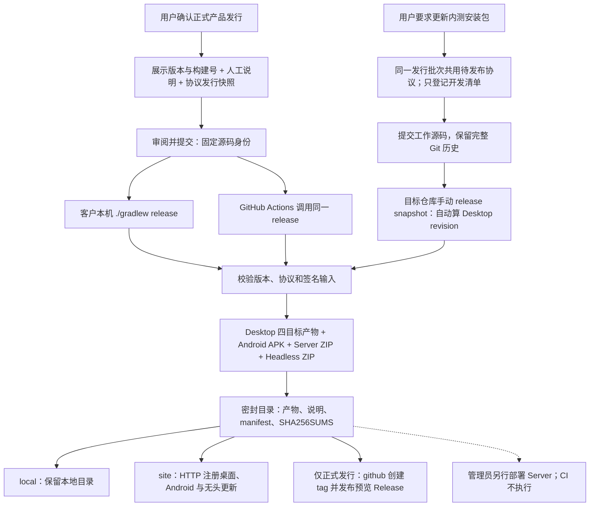

# 统一发行流程

客户端交付统一通过仓库根的 `release` 任务完成。版本来自 `gradle.properties`；正式产品发行使用随源码
提交的人工说明，内测更新使用 `snapshot` 模式并保留展示版本。客户本机与 GitHub Actions 使用同一组 Gradle 构建、校验和
上传实现。运行中的服务端继续由管理员单独部署，发行 CI 不停止、升级或重启服务。

## 谁决定发版

正式产品发行由用户明确确认，才推进 `teamtalk.releaseVersion`、定稿人工发行说明、运行
`prepareProtocolRelease`、打 tag 与发布 GitHub Release。用户要求“更新内测安装包”则已授权本次
手动 snapshot 分发，Agent 提交工作源码后即可刷包，不修改根版本配置，也不要求用户指定安装数字。

正式发行冻结协议；内测交付相对已发行基线检查当前待发布协议，保持同一个 minor，记录实际 schema 哈希。
两种交付都要求源码可追溯，并保留已安装应用的数据。纯开发、发布工具改造、
服务器部署和 Agent 本机验收不自动授权交付；不能为满足工具校验擅自发包。确认范围后按该范围完成流程，
不为每条命令重复询问。Android 的 `Release` 构建类型只表示打包方式，不代表正式产品发行。

| 交付方式 | 版本与记录 | 目标 |
|---|---|---|
| 正式产品发行（默认模式） | 新展示版本、更高构建号、人工说明与 `releases/<version>/`；公开发行使用对应 tag | `local`、`site`、`github` |
| 内测更新 `snapshot` | 根展示版本与构建号不变；Desktop revision 从完整 Git 历史推导，Android 保持当前 code 手动覆盖；同一发行批次新增共用一个待发布协议号，不登记冻结契约 | 经授权的测试应用 `local`、`site` |
| 首次私有分发 `private-first` | 新安装身份与空下载入口可保持当前展示版本和构建号 | 独立私有应用的 `local`、`site` |

## 发行由哪些事实组成

| 事实 | 唯一来源 |
|---|---|
| 展示版本、正式构建计数、协议窗口 | 根 `gradle.properties` 的五个 `teamtalk.*` 版本字段 |
| 内测 Desktop 修订号 | 完整 Git first-parent 提交数 + 根构建号 + 1，由工具计算并记录为 `desktopRevision` |
| 正式发行的变更、升级影响与已知限制 | `doc/07-operations/releases/<releaseVersion>.md`，首行为 `# TeamTalk <releaseVersion>` |
| 已冻结的协议契约 | 正式 `protocol/protocol/releases/<releaseVersion>/`；历史明确冻结的 `contracts/` 继续保护，普通内测不新增 |
| 源码身份 | 构建时的完整 Git commit；发行要求干净工作树 |
| 客户端安装身份、名称、服务器坐标和更新源 | 选中部署配置函数产生的 `DeploymentConfig`；local 存在时完整替换默认，见[运行配置](configuration.md#2-kotlin-部署配置) |
| 本次交付实际使用的部署配置 | 密封目录中的 `deployment-config.json`，只含最终解析出的非敏感字段 |
| 交付文件及摘要 | 密封目录中的 `release-manifest.json` 与 `SHA256SUMS` |

正式发行 tag 固定为 `v<releaseVersion>`，只标记对应源码，不反向决定版本。命令行临时覆盖版本配置不能形成
另一份合法发行。人工说明原样成为 GitHub Release 正文和交付目录的 `RELEASE_NOTES.md`；两个发行
tag 之间的提交记录另存为 `COMMITS.md`，没有历史 tag 时记录当前可达历史，不自动改写人工正文。



## 准备下一次发行

本节是正式产品发行。用户明确确认本次发行后，核对服务器坐标、客户端发行身份和持续使用的签名材料，再完成
这些源码变更：

1. 增加根配置的 `teamtalk.releaseVersion` 与 `teamtalk.releaseBuildNumber`。展示版本使用数字
   `x.y.z`；安装序号递增（desktopRevision = buildNumber+1，快照由提交历史推导）。纯 UI 修复不增加协议版本。
2. 编写同名人工发布说明，描述用户可见变化、升级与数据影响、已知限制。此文档随版本配置一起提交。
3. 按[协议发行规则](../04-protocol/versioning.md#开发编号与发行契约分开管理)确认当前唯一待发布 minor，
   校对生命周期注解、兼容分支和迁移，再登记开发清单与发行快照。

```bash
# 有协议变更时，先显式登记经审阅的开发清单
./gradlew :protocol:protocol:writeProtocolBaseline

# 用户确认本次发行后，为新展示版本登记快照，即使协议版本没有变化
./gradlew :protocol:protocol:prepareProtocolRelease
```

准备任务会新增可审阅文件，随后提交根配置、人工说明、源码与快照。普通 `release` 不自动修改这些
事实源。已登记的正式或独立稳定契约保守冻结；失败重试不能删除快照回收编号。
普通 snapshot 和 private-first 不登记契约，不能把内部试用包当作新的兼容版本。
客户端发行同时执行 `verifyRelease` 的源码/架构/wire 检查与 `verifyReleaseMetadata` 的发行元数据检查；
手动服务端开发部署只需要前者，避免每次临时协议调试都占用一个已冻结的客户端发行号。

当前发行是 `0.0.3 / protocol 0.3`，根构建号为 `3`。正式 tag、发行快照与密封产物不可覆盖。
后续新增契约在同一发行周期共用下一 minor；同号开发包仍按实际源码与协议清单哈希配套验证。
后续正式发行推进展示版本和根构建号；私有内测更新保持两者不变，按源码生成独立 Desktop revision。
发布注册中心对相同版本与构建号的不可变保护不能通过清理缓存或删除收据绕过。正式发行提高根构建号
使 Android 安装 code 增加；Desktop 比较完整版本，新展示版本的末位 revision 按根构建号映射，
不必追赶上一展示版本的内测计数。

### 保持展示版本的内测更新

已有私有应用更新给内测用户时，使用 `snapshot`。提交工作源码后手动运行交付任务，不必每刷一次包就
修改根文件。例如展示版本为 `0.0.1`、根构建号为 `1`，Android `versionCode` 保持 `2`，用户下载后
手动覆盖安装。应用身份、签名、数据目录和更新源保持原值；既有正式产物不被改写。

同一展示版本的快照覆盖需要单调递增的 desktopRevision。工具从完整 Git 历史执行
`git rev-list --first-parent --count HEAD`，加上根构建号和 `1` 得到 `desktopRevision`，无需修改配置，
也不依赖 tag。这个修订号用于 Desktop 安装元数据与站点记录，应用展示版本仍保持原值。

内测快照在注册中心按 **新源码身份新增不可变发布行**保存，snapshot 通道指向本次构建。
同一身份只接受原字节重试。桌面更新器按文件摘要复用本地文件，无需维护跨修订增量链；旧 manifest 保留供飞行中的下载使用。

```bash
# 新增契约开启下一 minor 后，同一发行周期共用该 minor 并登记开发清单。
./gradlew :protocol:protocol:writeProtocolBaseline

# 审阅并提交工作源码和清单，再将同一源码同步到完整的私有 clone。
# 在已有独立应用身份与 deployment-local 配置的私有 clone 中交付：
./gradlew release -PreleaseMode=snapshot -PreleaseTargets=site
```

`release` 只在手动调用时构建并交付，不修改或提交根版本。只保留本地产物时改为
`-PreleaseTargets=local`；Windows 使用 `gradlew.bat`。GitHub CI 不自动生成或上传 snapshot。
该模式拒绝 GitHub 目标和 `releaseBase`；公版测试环境也可在用户授权下使用，不能据此自动更新有真实用户的私有环境。
不需要新的人工发行说明、产品 tag 或 `prepareProtocolRelease`，
也不认领、改写旧正式发行快照。无论该发行批次内第几次修改，都相对最近正式冻结基线执行 KSP、wire 与兼容检查，
不运行 `prepareProtocolContract`；已发行协议保持冻结，新增契约共用下一待发布 minor，直到正式发行。
同号内测构建以源码 SHA 和清单哈希区分，应按同批服务端/客户端验证，不为中间版本保留额外兼容分支。

必须使用完整 clone。同一展示版本继续刷 snapshot 时，保留已分发源码及其历史，从其后代构建，不对该
内测基线做 rebase、压缩或重写。工具拒绝浅克隆；是否从已分发源码后代构建须在交付前核对，
注册中心允许显式回滚，不能代替历史与 revision 核对。尚未分发的工作提交可在交付前
整理；下一次正式推进展示版本时可重新整理开发历史，但既有正式 tag 和冻结协议记录仍按原规则保护。

密封目录为 `build/snapshots/<applicationId>/<version>/revision-<desktopRevision>/<完整源码SHA>/`，清单标记
`distributionKind=snapshot`，记录真实源码、根构建号、`desktopRevision`、安装身份、协议与签名摘要。不要把旧正式说明或旧包
当成本次源码的证明。内测说明由工具生成交付身份和提交附录；附录从最近可达的正式 tag（包括当前展示版本）
列到本次源码，没有 tag 时列可达历史，不代替日后正式发行的人工说明。原字节重试直接复用该目录；
不能对同一源码重新制作另一批字节后覆盖原包。站点按分发类型、展示版本和 Desktop revision 保留内测
历史，固定下载入口切换到本次包。
本模式只交付客户端，不部署服务端、不清理用户资料。

### 保持当前版本的首次私有安装包分发

用户可以明确要求：为一个新的私有应用提供测试安装包，保持当前展示版本与安装序号，不创建产品发行
tag 或 GitHub Release。独立安装身份的首次分发使用同一个 `release` 任务的 `private-first` 模式：

```bash
# 协议有变更时，仅登记当前开发清单，不为首次测试安装冻结新协议。
./gradlew :protocol:protocol:writeProtocolBaseline
# 审阅并提交源码和开发清单后，同步到私有 clone。

# 在具有独立 client.applicationId 和 local 配置的私有 clone 中构建并上传。
./gradlew release -PreleaseMode=private-first -PreleaseTargets=site
```

该模式要求独立私有应用标识、local 配置和 `local/site` 目标；禁止 GitHub 目标与 `releaseBase`。
协议与 snapshot 相同：当前开发清单必须登记、相对正式冻结基线兼容，但本次试用不冻结新的 minor。
正式产品发行时再固定整批变动；已有历史冻结记录保持原样。

`private-first` 面向新安装身份，发布到 preview 通道；注册中心按同一不可变身份规则处理，已有同身份只允许原字节重试。
后续内测更新使用 `snapshot` 手动刷包，正式升级按正式产品发行准备。签名、源码身份、四目标 Desktop 制品、APK
验签与密封摘要沿用统一流程。

产物保存在 `build/private-distributions/<applicationId>/<version>/<源码SHA>/`。清单标记
`distributionKind=private-first`、源码和协议契约摘要，不写产品 tag；随包说明列出实际应用身份、服务器、
版本和安装方式，不复用公版旧版本的发布说明。站点令牌按下文配置。该操作只发布客户端入口，
不升级服务端。

### 私有客户端的首次发行与后续升级

需要与公版共存时，使用独立私有 clone，在 Git 忽略的 `buildSrc/deployment-local/Deployment.kt` 配置 `client`
和自己的服务器坐标；用户确认本次发行后，再运行同一个 `release` 任务。公版主仓库的默认部署配置保持 `im.virjar.com`，
不需要私有分支或提交本机配置。应用标识、英文安装名称和签名在首次分发后保持稳定；普通升级沿用同一安装并保留
资料。用户看到的显示名称可调整，根 `gradle.properties` 仍是唯一版本来源，不为每个平台另设版本。

默认公版保留各打包渠道原有的安装身份和数据路径。新私有版独立安装、独立登录；Android 安装包由
自己的服务站点提供下载，Desktop 从包内 `serverUrl` 选择注册中心，无头升级显式传入同一站点。管理员须保留 Android
keystore 与服务端发布令牌（`CLIENT_RELEASE_PUBLISH_TOKEN`），构建机器更换时恢复原材料，避免后续安装包无法覆盖升级。
签名与安装身份匹配只能证明安装前提，分发前仍要在参与
平台检查与公版共存、分别重启以及普通升级后的资料保留；不能把交叉构建成功写成 Windows 实机验收。

本地与站点交付允许 local 覆写，GitHub 发布拒绝存在 local 覆写的构建。整个覆写目录不入 Git，源码、
根版本与协议契约仍须通过干净工作树校验，正式发行另核对人工说明与发行快照。准备发行版本是源码变更，不能写到
本地部署配置里绕过版本事实源。

## 本机构建与交付

构建机需要 Git、JDK 21 与 Android SDK；首次构建需要依赖仓库和工具下载可达。Node/npm 由 Gradle
管理，目标 JBR 按 `gradle/jbr.properties` 下载并校验摘要。完整交叉安装器还需要系统 tar 和 NSIS；
各宿主的准备命令见[Desktop 打包](desktop-cross-build.md#工具与本机构建)。客户端发布本身不依赖
全局 Node.js、`gh`、SSH、`rsync` 或 `scp`，服务端部署的工具要求另见[部署与升级](deployment.md)。
APK 身份校验需要已有 Android SDK build-tools 中的 `aapt2`；SDK 通过 `local.properties` 的 `sdk.dir`、
`ANDROID_HOME` 或 `ANDROID_SDK_ROOT` 定位。复用密封目录也需要此工具，校验阶段不自动安装它。

从干净工作树运行：

```bash
./gradlew release
```

默认只在本机产生并验证密封目录，不上传。Windows PowerShell 使用完全相同的任务和参数：

```powershell
.\gradlew.bat release
```

产物目录为 `build/releases/<releaseVersion>/<完整源码SHA>/`：

```text
<完整源码SHA>/
├── assets/
│   ├── <desktopName>-<version>-android.apk
│   ├── <desktopName>-<version>-desktop-site.zip
│   ├── TeamTalk-<version>-server.zip
│   └── TeamTalk-<version>+<完整源码SHA>-headless.zip
├── desktop/                  四目标安装器、便携包与 payload.zip
├── RELEASE_NOTES.md           已提交的人工说明
├── COMMITS.md                 提交记录附录
├── deployment-config.json     实际部署配置的规范化非敏感快照
├── release-manifest.json      版本、源码、部署摘要、签名和各文件摘要
└── SHA256SUMS
```

客户端附件前缀来自 `client.desktopName`，默认仍为 `TeamTalk`；Server 与 Headless ZIP 保持 `TeamTalk` 前缀。
显示名称可以包含中文，不作为这些发行归档的文件名。

新生成 APK 的 `assets/teamtalk-build.properties` 内嵌源码身份、完整非敏感部署配置的摘要，以及应用标识、
显示名称、英文安装名称和 HTTP/TCP 地址。封包时逐项匹配实际配置，使用 `aapt2` 从 APK 二进制清单与资源
核对包名、安装版本、默认及各语言的应用名称、非空启动入口名称，并验证 APK 签名。
Desktop 检查四目标壳产物、安装器与 payload 清单，Server ZIP 包含自身分发身份。
Headless ZIP 使用 `tt-headless/` 根目录，包含三种入口、完整运行依赖、LICENSE、
`teamtalk-release.properties` 与逐文件 `SHA256SUMS`。封包核对无头分发的版本、源码身份、协议窗口、
Java 要求、完整文件清单与摘要，拒绝缺失、额外文件或符号链接。
密封清单记录源 commit、协议窗口、部署配置摘要、签名证书信息、
文件大小与 SHA-256。同一路径已有密封目录时复核并复用，出现不同身份、文件增删或字节变化立即失败。
部署摘要依据最终 `DeploymentConfig` 对象的规范化 JSON 计算，不依据配置源码；只改注释、变量名或
等价函数拆分不会改变配置身份。密封的 `deployment-config.json` 用于交付溯源和复核，不接受手工修改。

新密封清单使用 `format=3`，核对四目标 Desktop 负载的源码身份、最低壳 ABI 和逐文件摘要，并要求 APK 内嵌完整部署身份字段。既有 `format=1` 目录可按原字节复用，
仍核对 APK 的源码身份及二进制包名、名称和版本；只有整组部署身份字段均缺失时才兼容旧 APK，
其中任一字段存在就必须全部匹配。新增密封目录同时记录 `headlessArtifact`；既有未记录此字段的
`format=1/2` 密封目录仍按原来的三个附件复用，不补造或改写旧清单及产物。

这个目录可以复制给没有 GitHub 的客户。解压 Desktop 站点 ZIP 时须保持完整目录；Server ZIP 是可供
人工部署的分发文件，构建或下载它都不会自动改变运行实例。Headless ZIP 需要外部 Java 21，不附带 JDK；
POSIX 支持 agent、CLI、MCP 与用户级便携安装，Windows 原生只支持 CLI。
独立构建入口为 `:client:headless:headlessDist`、`:client:headless:verifyHeadlessDist` 与
`:client:headless:headlessDistZip`；配置、安装和升级见[无头客户端](../05-clients/headless.md#3-构建与启动-agent)。

## 发布到站点

`site` 向部署配置中的 `serverUrl` 上传四个 Desktop 目标、Android 和 Headless，统一调用
`POST /api/v1/client/releases`。服务端须先部署支持注册中心的版本，并配置至少 16 字符的
`CLIENT_RELEASE_PUBLISH_TOKEN`；构建机通过环境变量 `TEAMTALK_CLIENT_RELEASE_TOKEN` 提供同一令牌。
不要把令牌写入源码、发行归档或命令历史。客户端发布不再依赖 SSH/SFTP，也不自动部署服务端。

```bash
# 已经准备并确认的正式发行
./gradlew release -PreleaseTargets=site
# 经授权的测试环境快照
./gradlew release -PreleaseMode=snapshot -PreleaseTargets=site
```

发布器从已校验的密封目录流式生成和上传 ZIP。服务端校验文件清单、大小和摘要，将文件放入内容寻址
对象仓，再在数据库事务中登记发布并切换通道。六个端点分别生效，不构成跨端原子发布；中途失败保留密封目录，
重试同一批字节即可。已成功上传的原字节重试不会重置管理员后续的停用或回滚决定。
同一身份不同字节返回冲突，不能借 snapshot 覆盖原记录。新 snapshot 使用新的源码身份；晋级、停用和回滚
由管理台调整通道指针，详细接口与约束见[客户端发布与更新体系](client-releases.md)。

首页下载区 `/#download` 由注册中心驱动，Android 的 `/downloads/android.json` 和旧固定 APK 下载入口
继续兼容。某个 Android 通道已有注册记录后，即使停用或关闭，也不回落到磁盘上的历史静态包；仅尚未接入
注册中心的旧部署保留旧目录读取。Desktop 更新使用随安装包确定的 `serverUrl`，不随登录业务服务器而改变；
无头升级通过 `--server-url` 或 `TK_SERVER_URL` 显式指定注册中心。Android 仍由用户下载安装，协议兼容提示与客户端文件更新分别处理。

发布后检查每个平台的通道指针、下载链接和摘要，再通知测试者更新。切换到新工具链前的 Conveyor 安装包
不会凭空获得应用内更新器；应按[迁移说明](client-releases.md#7-迁移说明从-conveyor)手动覆盖安装并验收数据保留。
此任务不上传 Server ZIP，也不重启任何服务器进程。

### 站点发布令牌

服务端读取进程环境中的 `CLIENT_RELEASE_PUBLISH_TOKEN`，未配置时不接受构建机上传。普通部署会重新生成
`conf/env.sh`，该文件不是额外发布令牌的持久配置入口。使用本实例的 systemd drop-in 引用独立的
owner-only 环境文件，例如 `/etc/teamtalk/client-release.env`：

```ini
# /etc/systemd/system/teamtalk.service.d/client-release.conf
[Service]
EnvironmentFile=/etc/teamtalk/client-release.env
```

环境文件以 `CLIENT_RELEASE_PUBLISH_TOKEN=<受控秘密>` 赋值，权限设为 `0600`；通过受控输入写入，
不把真实值放入 shell 历史或报告。首次配置或轮换后重载 systemd 并重启已授权的实例；普通部署保留该
drop-in，启动脚本继承其环境。构建机使用相同值的 `TEAMTALK_CLIENT_RELEASE_TOKEN`。令牌设置不等于
客户端已发布：仍须执行授权范围内的 `release ... -PreleaseTargets=site` 并核对六个目标。

## 发布到 GitHub

向 GitHub 发布额外提供 `GITHUB_TOKEN`，以及 `-PreleaseRepository=owner/repo` 或环境变量
`GITHUB_REPOSITORY`。Token 需要对应仓库的 Release 与 tag 写权限。源 commit 必须已经存在于目标仓库。
存在 `buildSrc/deployment-local/` 时拒绝 GitHub 发布，须在使用已提交默认配置的公版仓库执行。

```bash
./gradlew release -PreleaseTargets=github -PreleaseRepository=example/team-talk
```

Gradle 校验已有 tag 是否指向同一 commit，缺失时创建 tag；随后创建或继续未完成的 Release 草稿，
逐个校验并上传附件，全部齐备后公开为预览 Release。新密封目录的附件包括 Android APK、Desktop 站点 ZIP、
Server ZIP、Headless ZIP、人工说明、提交附录、实际部署配置快照及两份校验清单。
已经公开的同名版本只接受完全一致的内容，不会被另一份源码或二进制静默覆盖。

同一目录可以顺序发布到两个目标：

```bash
./gradlew release -PreleaseTargets=site,github -PreleaseRepository=example/team-talk
```

两个目标互不构成事务。站点成功而 GitHub 失败时，保留密封目录，针对失败目标重试即可；不需要回退已成功
目标，也不应重新生成签名包。统一任务当前先执行站点、后执行 GitHub。

## 复用密封目录与失败重试

显式指定已有目录可跳过其中各类产物的重建：

```bash
./gradlew release "-PreleaseBundle=build/releases/0.0.1/<完整源码SHA>" -PreleaseTargets=site
```

Windows 将命令前缀换成 `.\gradlew.bat`；路径含空格时为整个 `-P参数=路径` 加引号。复用要求当前
工作树干净，并与密封目录的源码、根版本、协议窗口和部署配置完全一致，正式发行另核对人工说明；不能在新源码下给旧目录
重新贴标签。使用 local 覆写时，复用同样要求当前函数返回结果与密封配置一致；Git 忽略该目录不意味着可以
给旧产物换服务器坐标。同一目标已完成且字节一致会直接返回，同一分发身份出现不同内容则失败。
内测重试须同时传 `-PreleaseMode=snapshot` 与原 `-PreleaseBundle=<密封目录>`，不改源码或根配置。

保留密封目录是准确重试的前提。固定输入与源 commit 有助于追踪产物，但签名、时间戳和外部工具缓存意味着
重新构建不保证与先前产物逐字节一致；不能以“同一个版本”替代原文件的 SHA-256。

## GitHub Actions 的触发边界

[release.yml](../../.github/workflows/release.yml) 监听 main 上根 `gradle.properties` 的变动、`v*` tag
和人工触发。普通 main 变动将本次 push 前的 commit 交给 `-PreleaseBase=<before>`，由 Gradle 比较展示版本；
改变 JVM 参数或开发协议 minor 不触发正式发行。根展示版本变化时须同时提高构建号；只改构建号不构成
合法正式发行，也不是内测刷包入口。人工说明和冻结
快照不匹配会在构建前失败。

普通 CI 另外运行 `verifyReleaseChange -PreleaseBase=<比较基点>`，检查该基点已有的发行快照未被修改或删除。
正式发行要求展示版本和根构建号一起推进，人工说明与对应快照完整匹配；单独变更或回退根构建号会被拒绝。
内测刷包不修改这两个字段，也不通过 CI 自动交付。
纯开发 minor 变动仍由 wire 校验
约束，不被客户端发行门禁强迫提前冻结。新增 tag 或 Release 都不能掩盖对旧发行记录的改写。

CI 与发行工作流共用 `scripts/ci/release_history.py` 解析比较基点。普通 push 使用 `before`，PR 使用目标分支
的 base；历史压缩导致旧提交不再是当前祖先时，改用两者唯一的共同祖先。缺失旧对象时按校验后的完整 SHA
从 origin 获取，无法确定共同祖先则失败。所有 `v<数字版本>` tag 中的冻结记录都必须保留原样，包括不在
当前祖先链上的 tag；使用共同祖先不能绕过已发行协议保护。tag 和人工触发没有比较基点，仍执行 tag 历史检查。

CI 准备 JDK、Android SDK、缓存和私密输入，再调用同一个 `release`。默认目标为 GitHub；仓库变量
`TEAMTALK_RELEASE_TARGETS` 可设为 `site,github`，人工触发时的 `targets` 选择优先于该变量。
tag 触发必须与根版本一致。CI 不自行拼归档或执行服务器部署。

| GitHub 配置 | 何时需要 | 注入后的用途 |
|---|---|---|
| Secret `ANDROID_KEYSTORE_BASE64` | 使用自有 Android 签名时 | 既有 keystore 文件的 Base64；恢复到临时文件，通过 `TEAMTALK_ANDROID_KEYSTORE` 传入 |
| Secrets `ANDROID_STORE_PASSWORD`、`ANDROID_KEY_ALIAS`、`ANDROID_KEY_PASSWORD` | 配置自有 Android keystore 时 | 对应 `TEAMTALK_ANDROID_STORE_PASSWORD`、`TEAMTALK_ANDROID_KEY_ALIAS`、`TEAMTALK_ANDROID_KEY_PASSWORD` |
| Secret `CLIENT_RELEASE_PUBLISH_TOKEN` | 目标包含 `site` 时 | 与目标服务器相同的发布令牌，通过 `TEAMTALK_CLIENT_RELEASE_TOKEN` 传入 |
| 自动提供的 `GITHUB_TOKEN` | GitHub 发布 | workflow 声明 `contents: write`；无须把个人 token 写进源码 |
| Variable `TEAMTALK_RELEASE_TARGETS` | 自动触发需要追加站点时 | 默认为 `github`，可配置为 `site,github`；它是目标选择，不含秘密 |

未提供自有 Android keystore 时使用固定公开预览证书，其他 Android 密码 Secret 不会改变这个选择。
Android 签名缺失会使实际打包失败，CI 不生成替代密钥。私密文件放在 runner 临时目录，步骤完成后
清理；发行附件只包含公开制品和身份摘要。

CI 使用 `release-bundle-<源码SHA>` artifact 保留完整密封目录 14 天。重跑同一次 workflow 时先尝试恢复
该目录，让 Gradle 复核并复用原字节；若旧 artifact 已过期或不存在，需要重新构建，已发布同名不同内容
仍会被目标拒绝。同一仓库只运行一个发行 workflow，后续触发不会取消正在执行的发行任务。

`deployServer` / `deployStagedServer` 仍由管理员人工运行，步骤见[部署与升级](deployment.md)。这些 Linux
服务运维任务目前还需要本机 SSH、rsync 和 OpenSSL；Windows 支持范围是统一产物构建与客户端发布，
不能由此推断旧服务端部署任务已经移除了 Unix 工具依赖。

## 交付前的简单验收

核对密封清单的版本、源 commit 与目标地址；站点发布完成后检查首页 `/#download`、六个目标的安装包
链接与更新元数据。对实际交付的平台，从原文件安装或覆盖升级，完成启动、登录和一条消息/附件短路径；记录
版本、签名与 SHA-256。构建通过不等于所有操作系统都经过安装验收，也不证明用户设备已经完成更新。

发行实现入口为 `buildSrc/src/main/kotlin/release/ReleaseTasks.kt`、`ReleaseMetadata.kt`、`ReleaseBundle.kt`
与 `release/publish/`；协议发行边界见[版本与兼容规则](../04-protocol/versioning.md)。
