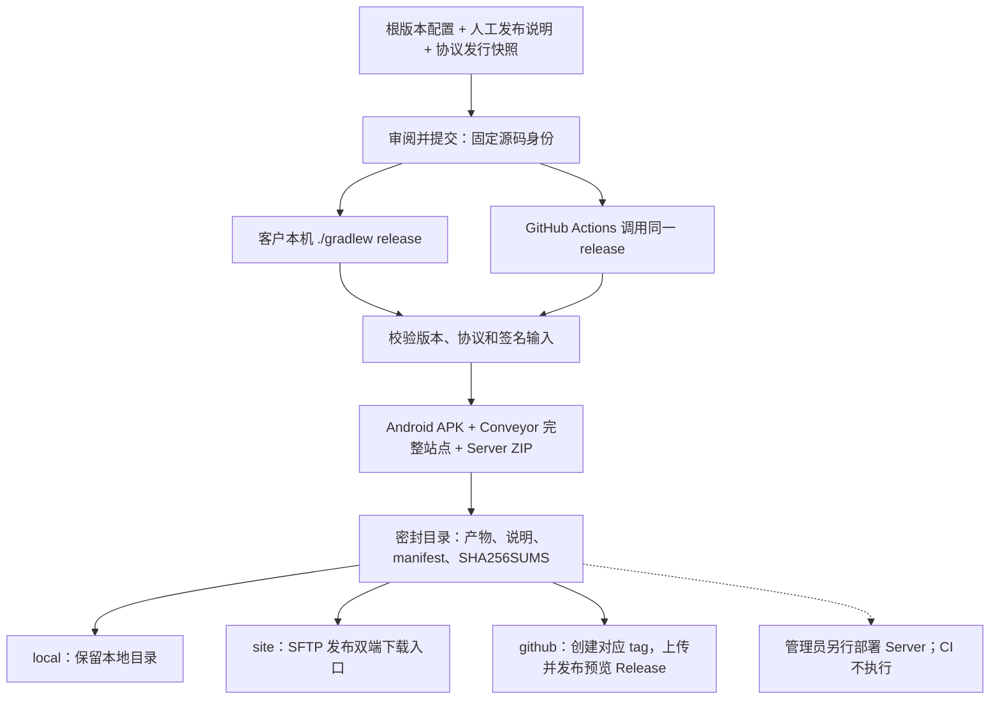

# 统一发行流程

客户端发行统一通过仓库根的 `release` 任务完成。版本来自 `gradle.properties`，发布说明来自随源码
提交的人工文档；GitHub 是可选发布目标。客户本机与 GitHub Actions 使用同一组 Gradle 构建、校验和
上传实现。运行中的服务端继续由管理员单独部署，发行 CI 不停止、升级或重启服务。

## 发行由哪些事实组成

| 事实 | 唯一来源 |
|---|---|
| 展示版本、安装序号、协议窗口 | 根 `gradle.properties` 的五个 `teamtalk.*` 版本字段 |
| 给用户的变更、升级影响与已知限制 | `doc/07-operations/releases/<releaseVersion>.md`，首行为 `# TeamTalk <releaseVersion>` |
| 已冻结的协议契约 | `protocol/protocol/releases/<releaseVersion>/` |
| 源码身份 | 构建时的完整 Git commit；发行要求干净工作树 |
| 客户端服务器坐标和更新源 | `gradle/deployment.json` |
| 交付文件及摘要 | 密封目录中的 `release-manifest.json` 与 `SHA256SUMS` |

tag 固定为 `v<releaseVersion>`，只标记对应源码，不反向决定版本。命令行临时覆盖版本配置不能形成
另一份合法发行。人工说明原样成为 GitHub Release 正文和交付目录的 `RELEASE_NOTES.md`；两个发行
tag 之间的提交记录另存为 `COMMITS.md`，没有历史 tag 时记录当前可达历史，不自动改写人工正文。



## 准备下一次发行

先确认目标服务器坐标和持续使用的签名材料，再完成这些源码变更：

1. 增加根配置的 `teamtalk.releaseVersion` 与 `teamtalk.releaseBuildNumber`。展示版本使用数字
   `x.y.z`；安装序号递增，当前 Conveyor 映射要求不超过 `65534`。纯 UI 修复不增加协议版本。
2. 编写同名人工发布说明，描述用户可见变化、升级与数据影响、已知限制。此文档随版本配置一起提交。
3. 按[协议发行规则](../04-protocol/versioning.md#开发编号与发行契约分开管理)收敛未发行的开发 minor，
   校对生命周期注解、兼容分支和迁移，再登记开发清单与发行快照。

```bash
# 有协议变更时，先显式登记经审阅的开发清单
./gradlew :protocol:protocol:writeProtocolBaseline

# 每个新展示版本都登记发行快照，即使协议版本没有变化
./gradlew :protocol:protocol:prepareProtocolRelease
```

准备任务会新增可审阅文件，随后提交根配置、人工说明、源码与快照。普通 `release` 不自动修改这些
事实源。发行快照登记后即保守冻结，向内测用户或私有客户分发同样适用；失败重试不能删除快照回收编号。
客户端发行同时执行 `verifyRelease` 的源码/架构/wire 检查与 `verifyReleaseMetadata` 的发行元数据检查；
手动服务端开发部署只需要前者，避免每次临时协议调试都占用一个已冻结的客户端发行号。

零号 `0.0.0` 已从早先分发的 commit 认领，不能将新的 commit 重新上传成同名零号发行。本地检查也
不绕过 Conveyor 对已有版本的字节一致性保护；下一次重新出包交付应准备新展示版本与安装序号。

## 本机构建与交付

构建机需要 Git、JDK 17 与 Android SDK；首次构建需要依赖仓库和工具下载可达。Gradle 管理 Node.js、
Conveyor 的固定版本下载、摘要校验与缓存，不要求手工安装全局 Node.js、Conveyor、`gh`、`rsync` 或
`scp` 来发布客户端。Conveyor 的持续签名配置仍需准备，详见[Desktop 打包](desktop-cross-build.md)。

从干净工作树运行：

```bash
./gradlew release
```

默认只在本机产生并验证密封目录，不上传。Windows PowerShell 使用完全相同的任务和参数：

```powershell
.\gradlew.bat release
```

产物目录为 `build/releases/<releaseVersion>/<完整源码SHA>/`：

```text
<完整源码SHA>/
├── assets/
│   ├── TeamTalk-<version>-android.apk
│   ├── TeamTalk-<version>-desktop-site.zip
│   └── TeamTalk-<version>-server.zip
├── desktop/                  完整 Desktop 更新站点
├── RELEASE_NOTES.md           已提交的人工说明
├── COMMITS.md                 提交记录附录
├── release-manifest.json      版本、源码、部署摘要、签名和各文件摘要
└── SHA256SUMS
```

APK 内嵌构建身份并校验安装版本与签名，Desktop 检查三平台必需文件和 Conveyor 元数据，Server ZIP
包含自身分发身份。密封清单记录源 commit、协议窗口、部署配置摘要、工具清单摘要、签名证书信息、
文件大小与 SHA-256。同一路径已有密封目录时复核并复用，出现不同身份、文件增删或字节变化立即失败。

这个目录可以复制给没有 GitHub 的客户。解压 Desktop 站点 ZIP 时须保持完整目录；Server ZIP 是可供
人工部署的分发文件，构建或下载它都不会自动改变运行实例。无头 SDK 分发仍通过
`:client:shared:headlessDist` 单独构建，尚未列入统一发行附件。

## 发布到私有站点

`site` 使用 `gradle/deployment.json` 中的 SSH 坐标，把双端产物发布到
`<deployPath>/static/downloads/`。上传由 JVM 内的 SSH/SFTP 实现，Windows 本机不需要 Unix 上传工具。
远端需要 Linux 的 SFTP 服务与 `flock`、`mv`、`rm`、`rmdir` 命令，账号须有该下载目录的写权限；
不要求 SFTP 提供 POSIX rename 扩展。

| 参数 | 等价环境变量 | 内容 |
|---|---|---|
| `-PreleaseSshKey` | `TEAMTALK_RELEASE_SSH_KEY` | 已有私钥文件路径 |
| `-PreleaseKnownHosts` | `TEAMTALK_RELEASE_KNOWN_HOSTS` | 已核验目标主机身份的 known_hosts 文件路径 |
| 无命令行口令参数 | `TEAMTALK_RELEASE_SSH_PASSPHRASE` | 私钥有口令时提供 |

路径参数可以指向仓库外文件；不要提交私钥，也不要将口令写入命令历史。准备好上述环境后：

```bash
./gradlew release -PreleaseTargets=site
```

下载入口保持不变：Android 为 `/downloads/TeamTalk-android.apk`，Desktop 为
`/downloads/desktop/download.html` 及同目录的安装包、更新元数据。上传先写独立暂存目录并校验摘要，
最终 rename/remove 由持有 `flock` 的同一个远程进程顺序执行，SFTP 负责暂存上传与回读校验；
Android 保持普通文件，Desktop 保持真实目录，符合现有 HTTP 静态服务路径校验。

Desktop 整目录切换有短暂的 rename 窗口，Android 与 Desktop 也不构成同时可见的双端事务。
发布日志与旧产物保留到切换完成；失败时恢复旧下载入口，中断后的下次调用先恢复未完成切换。
不要在任务尚未成功时通知测试者更新。站点收据记录 `releaseBuildNumber`，拒绝降低安装序号或用同一序号
替换成另一批文件；自动回滚只恢复本次失败切换前的状态，不提供任意历史版本降级发布。
此任务不上传 Server ZIP、不运行服务端部署，也不修改数据库。

## 发布到 GitHub

向 GitHub 发布额外提供 `GITHUB_TOKEN`，以及 `-PreleaseRepository=owner/repo` 或环境变量
`GITHUB_REPOSITORY`。Token 需要对应仓库的 Release 与 tag 写权限。源 commit 必须已经存在于目标仓库。

```bash
./gradlew release -PreleaseTargets=github -PreleaseRepository=example/team-talk
```

Gradle 校验已有 tag 是否指向同一 commit，缺失时创建 tag；随后创建或继续未完成的 Release 草稿，
逐个校验并上传附件，全部齐备后公开为预览 Release。附件包括三个归档、人工说明、提交附录及两份校验清单。
已经公开的同名版本只接受完全一致的内容，不会被另一份源码或二进制静默覆盖。

同一目录可以顺序发布到两个目标：

```bash
./gradlew release -PreleaseTargets=site,github -PreleaseRepository=example/team-talk
```

两个目标互不构成事务。站点成功而 GitHub 失败时，保留密封目录，针对失败目标重试即可；不需要回退已成功
目标，也不应重新生成签名包。统一任务当前先执行站点、后执行 GitHub。

## 复用密封目录与失败重试

显式指定已有目录可跳过三类产物重建：

```bash
./gradlew release "-PreleaseBundle=build/releases/0.0.1/<完整源码SHA>" -PreleaseTargets=site
```

Windows 将命令前缀换成 `.\gradlew.bat`；路径含空格时为整个 `-P参数=路径` 加引号。复用要求当前
工作树干净，并与密封目录的源码、根版本、协议窗口、部署配置和人工说明完全一致；不能在新源码下给旧目录
重新贴标签。同一目标已完成且字节一致会直接返回，已有同版不同内容则失败并要求准备新发行。

保留密封目录是准确重试的前提。固定输入与源 commit 有助于追踪产物，但签名、时间戳和外部工具缓存意味着
重新构建不保证与先前产物逐字节一致；不能以“同一个版本”替代原文件的 SHA-256。

## GitHub Actions 的触发边界

[release.yml](../../.github/workflows/release.yml) 监听 main 上根 `gradle.properties` 的变动、`v*` tag
和人工触发。main 变动将本次 push 前的 commit 交给 `-PreleaseBase=<before>`，由 Gradle 比较展示版本与安装序号；
单独改变 JVM 参数或开发中的协议 minor 不自动发版。展示版本变化时须同时提高安装序号，人工说明和冻结
快照不匹配会在构建前失败。

普通 CI 另外运行 `verifyReleaseChange -PreleaseBase=<比较基点>`，检查该基点已有的发行快照未被修改或删除。
只有展示版本或安装序号变化时，才要求当前人工说明与对应快照完整匹配；纯开发 minor 变动仍由 wire 校验
约束，不被客户端发行门禁强迫提前冻结。新增 tag 或 Release 都不能掩盖对旧发行记录的改写。

CI 准备 JDK、Android SDK、缓存和私密输入，再调用同一个 `release`。默认目标为 GitHub；仓库变量
`TEAMTALK_RELEASE_TARGETS` 可设为 `site,github`，人工触发时的 `targets` 选择优先于该变量。
tag 触发必须与根版本一致。CI 不自行拼归档、调用 Conveyor 命令或执行服务器部署。

| GitHub 配置 | 何时需要 | 注入后的用途 |
|---|---|---|
| Secret `CONVEYOR_DEFAULTS_CONF` | 构建完整 Desktop 站点时 | 已有 `defaults.conf` 的完整内容，恢复到临时目录，通过 `TEAMTALK_CONVEYOR_CONFIG_DIR` 传入 |
| Secret `ANDROID_KEYSTORE_BASE64` | 使用自有 Android 签名时 | 既有 keystore 文件的 Base64；恢复到临时文件，通过 `TEAMTALK_ANDROID_KEYSTORE` 传入 |
| Secrets `ANDROID_STORE_PASSWORD`、`ANDROID_KEY_ALIAS`、`ANDROID_KEY_PASSWORD` | 配置自有 Android keystore 时 | 对应 `TEAMTALK_ANDROID_STORE_PASSWORD`、`TEAMTALK_ANDROID_KEY_ALIAS`、`TEAMTALK_ANDROID_KEY_PASSWORD` |
| Secret `RELEASE_SSH_KEY` | 目标包含 `site` 时 | 已有 SSH 私钥完整内容；恢复文件后通过 `TEAMTALK_RELEASE_SSH_KEY` 传入 |
| Secret `RELEASE_KNOWN_HOSTS` | 目标包含 `site` 时 | 已核验主机身份的 known_hosts 内容；恢复文件后通过 `TEAMTALK_RELEASE_KNOWN_HOSTS` 传入 |
| Secret `RELEASE_SSH_PASSPHRASE` | 站点私钥有口令时 | 通过同名带 `TEAMTALK_` 前缀环境变量传入 |
| 自动提供的 `GITHUB_TOKEN` | GitHub 发布 | workflow 声明 `contents: write`；无须把个人 token 写进源码 |
| Variable `TEAMTALK_RELEASE_TARGETS` | 自动触发需要追加站点时 | 默认为 `github`，可配置为 `site,github`；它是目标选择，不含秘密 |

未提供自有 Android keystore 时使用固定公开预览证书，其他 Android 密码 Secret 不会改变这个选择。
Conveyor 签名配置缺失会使实际打包失败，CI 不生成替代密钥。私密文件放在 runner 临时目录，步骤完成后
清理；发行附件只包含公开制品和身份摘要。

CI 使用 `release-bundle-<源码SHA>` artifact 保留完整密封目录 14 天。重跑同一次 workflow 时先尝试恢复
该目录，让 Gradle 复核并复用原字节；若旧 artifact 已过期或不存在，需要重新构建，已发布同名不同内容
仍会被目标拒绝。同一仓库只运行一个发行 workflow，后续触发不会取消正在执行的发行任务。

`deployServer` / `deployStagedServer` 仍由管理员人工运行，步骤见[部署与升级](deployment.md)。这些 Linux
服务运维任务目前还需要本机 SSH、rsync 和 OpenSSL；Windows 支持范围是统一产物构建与客户端发布，
不能由此推断旧服务端部署任务已经移除了 Unix 工具依赖。

## 交付前的简单验收

核对密封清单的版本、源 commit 与目标地址；站点发布完成后检查 Android 文件、Desktop 下载页及更新元数据
可读取。对本轮实际邀请的平台，从交付文件安装或覆盖升级，完成启动、登录和一条消息/附件短路径；记录
版本、签名与 SHA-256。构建通过不等于所有操作系统都经过安装验收，也不证明用户设备已经完成更新。

发行实现入口为 `buildSrc/src/main/kotlin/release/ReleaseTasks.kt`、`ReleaseMetadata.kt`、`ReleaseBundle.kt`
与 `release/publish/`；协议发行边界见[版本与兼容规则](../04-protocol/versioning.md)。
