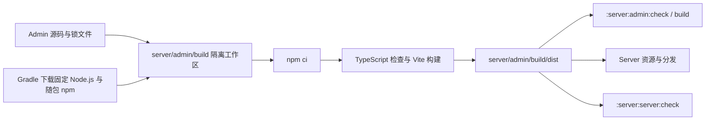

# 依赖维护与工具链升级

依赖升级优先交付可重复构建、正常业务可用和既有资料可读取。普通升级遵守
[版本与数据兼容规则](../04-protocol/versioning.md)；第三方库的大版本号不自动触发 TeamTalk 协议大版本、
清库或重新登录。是否需要迁移由实际 wire、schema、文件格式和行为变化决定。

## 版本从哪里查

| 事实 | 权威入口 |
|---|---|
| Gradle 发行包与校验值 | [Wrapper 配置](../../gradle/wrapper/gradle-wrapper.properties) |
| Kotlin、Compose、Ktor、存储、客户端库及 Admin Node/Gradle 插件版本 | [版本目录](../../gradle/libs.versions.toml)及各模块构建文件 |
| buildSrc 独立构建依赖 | [buildSrc 构建文件](../../buildSrc/build.gradle.kts) |
| Admin 声明、实际安装图和 Node 范围 | [package.json](../../server/admin/package.json)、[锁文件](../../server/admin/package-lock.json) |
| CI 工具环境 | [.github/workflows](../../.github/workflows) |
| TeamTalk 展示/协议/安装序号 | [gradle.properties](../../gradle.properties)，语义见[版本机制](../04-protocol/versioning.md) |

本文不复制一份当前依赖版本表。目录中的声明仍须与解析后的 runtime graph 核对：传递依赖可能提升版本，
不同模块也可能解析出不同结果。外部候选以官方发布说明、对应版本 POM/Gradle metadata 为证，过滤
alpha、beta、RC、snapshot；IDE 的更新提示只说明存在新版本。

## 按兼容关系成组升级

| 升级组 | 必须一起核对 |
|---|---|
| Gradle / AGP / Kotlin / KSP / Compose | 官方兼容范围、KSP 生成任务、Android KMP 插件、compileSdk 要求、Desktop 打包插件；Compose 编译插件随 Kotlin 版本 |
| Ktor / Netty / Coroutines / Koin | Ktor 各模块及新增传递模块版本一致，Netty 全模块对齐，协程依赖符合 POM；Koin 容器所有权和关闭行为不变 |
| JDBC / Hikari / Exposed | 连接超时、事务隔离、SQL/DDL 和 schema 迁移；驱动升级与 PostgreSQL 服务进程升级分开 |
| Lucene / RocksDB / SQLite | 旧数据重开、写入后重启、格式和选项兼容、回退边界；消息、附件、草稿和 outbox 不能当作可丢弃缓存 |
| Desktop 播放器 / JNI / FFmpeg | 实际平台库和受控覆盖来源、API/ABI、关闭与 FD 释放；Maven 版本号不能代表随包原生实现 |
| Admin / Node / Vite | 锁文件重装、TypeScript 和生产构建、浏览器目标、真实管理 API |

Ktor、Netty 等多模块框架使用相应 BOM/约束保持一致，并查看服务端、SDK、Android/Desktop 的实际依赖图。
不要用全局强制版本隐藏不兼容，也不要为升级自动切换传输协议、媒体在线播放或数据存储架构。
跨代迁移拆分见[路线图](../10-reference/roadmap.md#基础软件的独立迁移)。

Admin 的 Gradle 构建固定 Node.js 版本，并使用该发行包随附的 npm；升级时同时核对
`package.json` 的 Node 范围。版本生命周期见[Node.js 官方发布表](https://nodejs.org/en/about/previous-releases)。
Vite 对 Node 和浏览器的要求见[官方迁移指南](https://v7.vite.dev/guide/migration)，产品浏览器范围见
[管理后台](../06-server/search-and-admin.md#5-管理后台)。Node 只用于构建静态资源，不是服务端运行依赖。

CI 的 Gradle Actions 保留使用 Node 24 的 v5 维护线；v6 将缓存提取为另有使用条款的专有组件，
缓存默认开启，相关许可取舍单独评估，见[官方 v6 说明](https://github.com/gradle/actions/releases/tag/v6.0.0)。

## 管理后台的构建链

[server/admin/build.gradle.kts](../../server/admin/build.gradle.kts) 使用
[`com.github.node-gradle.node`](https://github.com/node-gradle/gradle-node-plugin/blob/7.1.0/docs/usage.md)
管理 Node.js 下载和 npm 执行。插件与 Node.js 的版本从版本目录读取；前端依赖仍由 `package.json`
声明、`package-lock.json` 锁定。CI 与本地都运行 Gradle，不依赖全局 Node.js 或源码旁的 `node_modules`。

安装与编译中任一步失败，消费产物的 Gradle 任务都会失败；不能用旧静态资源绕过缺失导入或类型错误。
`:server:server:buildAdmin` 是兼容入口，实际构建由 `:server:admin` 负责。首次运行需要联网下载
Node.js 和锁定 npm 包；Vite 热更新仍可使用独立本地 Node.js，步骤见[开发环境](../01-getting-started/development.md#33-管理后台开发)。

## 一轮升级如何闭合

1. 记录起点 commit、声明与解析版本；读取官方变更和自身调用点，列出必须保留的数据与配置。
2. 以一组可回退的改动升级；更新 Wrapper 校验、版本目录和锁文件，保留协议编号、dataset 和 schema 身份。
3. 运行受影响模块编译、协议生成/基线检查，以及对应的少量集成测试；Admin 运行 `:server:admin:check`。
4. 网络组验证 TLS、认证协商、收发与附件；存储组验证旧资料重开和重启；客户端库验证候选客户端短路径。
   普通部署先经过已有 epoch/dataset 预检，保留资料，随后按需运行 `previewSmokeTest`。
5. 在提交和构建报告记录实际通过项、未验证平台及暂缓原因。打包成功不等于安装通过，本地集成也不等于
   远程业务或完整 UI 已验收；预览阶段不要求每轮重跑容量、全浏览器和完整 UI 矩阵。

存储库升级前，先在独立副本或测试数据上验证旧格式；需要整实例回退时，还必须有可恢复的同一停写点备份。
迁移失败保留现场并诊断，不通过删库让新版本启动。长期备份恢复工作仍归路线图 `REL-01`。

工具链依据：[Kotlin 与 Gradle/AGP 兼容表](https://kotlinlang.org/docs/gradle-configure-project.html)、
[AGP 9 迁移说明](https://developer.android.com/build/releases/agp-9-0-0-release-notes)、
[Compose 兼容规则](https://kotlinlang.org/docs/multiplatform/compose-compatibility-and-versioning.html)。
网络和存储依据：[Ktor 更新](https://ktor.io/changelog/)、[Netty 更新](https://netty.io/news/)、
[Koin 迁移](https://insert-koin.io/docs/support/releases/)、
[Exposed 变更](https://www.jetbrains.com/help/exposed/breaking-changes.html)、
[Lucene 更新](https://lucene.apache.org/core/corenews.html)、
[RocksDB 格式兼容政策](https://github.com/facebook/rocksdb/wiki/RocksDB-Compatibility-Between-Different-Releases)。
