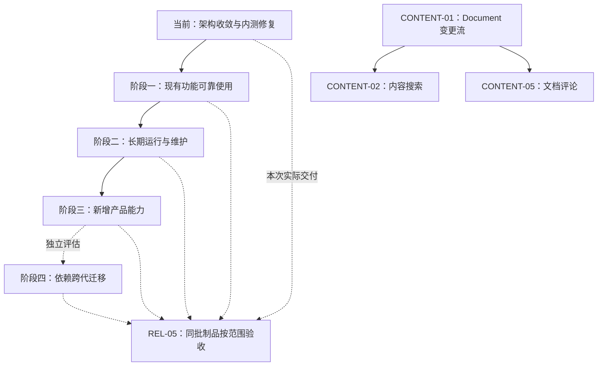

# 路线图

TeamTalk 已发布 [0.0.0 开发者预览](../07-operations/releases/0.0.0.md)。当前阶段是收敛现有架构、
修复内测中确认的问题并继续使用；下一轮产品能力在这一阶段完成后再选择推进。
本页记录尚未完成的结果和先后关系，现有能力与证据统一见[功能状态](feature-status.md)。
工作包 ID 仅用于交接，不是 wire、RPC、数据库编号，也不因调整阶段而重新编号。

## 当前阶段：现有架构收敛与持续内测

| 当前要交付的结果 | 工作边界 | 最小验证 |
|---|---|---|
| 维护者能沿调用链理解现有业务 | 明确数据与资源所有者，提取已出现的重复规则，减少任务脚本、应用状态和页面中混杂的职责；同步架构图与源码入口 | 相关模块编译和已有定向测试；没有实际问题不为分层增加抽象 |
| 已有用户流程可持续使用 | 先修复聊天、群设置、组织可见性、附件导出、账号状态和平台生命周期的真实反馈；保留正常升级数据与已发行客户端兼容 | 按改动跑 Android / Desktop 短路径；不把只通过 SDK 测试写成 UI 已验收 |
| 内测更新与正式发行分开 | 用户发起的私有 snapshot 沿用统一 Gradle 流程；正式版本由用户确认，旧发行事实保持不变 | 实际邀请的平台安装或覆盖升级并确认资料保留，统一记录于 REL-05 |
| 文档能交给下一位维护者 | 已完成实现移入功能状态和稳定设计文档；任务保留具体缺口、入口、边界和验收条件 | 文档与代码一致，链接可追踪，不把历史中间状态继续列作待开发 |

统一 Gradle 发行、Android 签名 APK、Conveyor 三平台安装包与更新站点、私有客户端独立身份、
Kotlin 部署 DSL 和 IP + 自签 TCP TLS 已有实现，见[发行流程](../07-operations/releasing.md)与
[部署配置](../07-operations/configuration.md)。这些能力不再作为“预览前尚未实现”的任务。
交叉出包与每种系统的实机验收仍是两件事，未覆盖的平台范围须在交付说明中明确。

当前阶段结束的依据是已确认问题得到处理、相关调用链与文档清楚、双端常用路径复验通过。
不等待下面所有工作包，也不要求每次重构完成全平台安装矩阵、长期容量报告或低概率历史治理。
普通升级保留已有资料；完整备份恢复尚未闭合，实例的数据用途与维护边界继续遵循
[开发者预览指南](../01-getting-started/developer-preview.md)和[版本机制](../04-protocol/versioning.md)。

## 每次交付的统一验收入口

### REL-05 · 发布物晋级门禁

本项集中承接已实现功能的发行前复验，避免每个架构工作包都因缺一轮完整制品验收长期挂起。
现有 `release` 已支持同一构建的身份、校验和、APK 验签、Conveyor 完整站点、Server ZIP、SFTP 与
GitHub 交付，以及原字节重试；实现入口为 `ReleaseTasks`、`ReleaseBundle` 和各 publisher。
不再把工具链、下载站点或签名身份校验列为待开发。

Windows 私有 snapshot `0.0.0 / revision 36`（源码 `5578b5ec`）已于 2026-09-08 获用户确认
功能验收通过；该批安装、启动与托盘问题已闭环，状态见[客户端体验](feature-status.md#客户端体验)。
后续交付按变更范围复验；Linux 桌面及未覆盖的系统/DPI/多屏组合仍按参与平台补验，不将本次结果外推。

下一次交付先固定参与的平台、目标实例和承诺的场景，用同一批密封产物完成以下验证：

1. 安装或覆盖升级、启动、登录、消息与附件短路径；私有版与公版共存，普通升级保留资料。
2. 按本次改动选择 P0 场景：Desktop 窗口/键盘、Android picker/权限/返回、媒体本地播放与离线命中、
   群文件断网恢复，以及富资产导入期间 Activity 重建。未在本次设备上覆盖的场景单独记录。
3. 账号封禁验证在线终结、旧凭据重连、错误密码不清理、中断后启动续清，以及其他账号和系统导出文件
   保留。2026-09-07 双端开发构建的关键流程与恢复证据已存在；这里补的是交付产物复验。
4. 保存制品身份、版本、签名摘要、结果及必要截图，失败项明确回到对应实现修复，不靠重新构建替换
   已验收文件后沿用旧报告。

扩大公开分发或平台承诺时，仍需补齐系统信任签名/公证、目标平台完整安装/升级/卸载与无障碍矩阵，
以及按实际 runtime graph 生成并随包携带的项目许可证和第三方归属清单。现有公开预览签名、
受控播放器许可证和管理台产物清理不等于这些工作全部完成；审计须覆盖 rich-editor fork、Desktop
原生播放器和 Server 的 JavaCV/FFmpeg native。Headless/MCP 完成 PLATFORM-03 后再接入同一入口。

完成条件：本次承诺范围由同批制品实际通过，未覆盖范围有清楚说明，维护者能按
[部署验收](../09-testing/deployment-acceptance.md)和[发行流程](../07-operations/releasing.md)复现。
完整发行矩阵随承诺扩展，不作为持续内测或无关代码重构的前置条件。

## 后续阶段与依赖

阶段表示默认的投入顺序，不是要求整阶段全部完成才能使用产品。备份、必要维护和已发生的可靠性问题
可以按真实需要前移；依赖跨代单独评估，不与业务功能捆绑。每次只选择一个有具体用户结果的切片，
明确入口、修改边界、必须保留的事实和最小验收，再更新功能状态。

## 阶段一：让现有功能可靠使用

### CLIENT-04 · 可恢复富资产创作

剩余工作是聊天 Markdown + sidecar 的跨进程草稿、私有有界源文件 spool、上传 outbox，以及断网后
继续处理和失败重试的跨进程恢复。同进程取消/移除/重试、稳定上传 identity、双端光标插入、历史回复
和 picker/clipboard 导入已有实现，不重新开发，见[附件能力](feature-status.md#附件与富内容)。

先以一个聊天草稿的强杀恢复为切片，明确源文件、上传任务和草稿的所有者；不复制或删除系统 picker
返回的用户原文件。Activity 重建的剩余设备证据集中到 REL-05，平台拖放只验收确实支持该能力的设备。

完成条件：断网选资产、强杀、重启、联网后只上传并发布一次；删除引用后迟到 READY 不复活；
重试与取消释放受管资源。跨设备只同步已 READY 的服务器资产，不承诺本地未上传源文件跨设备恢复。

### CLIENT-06 · 平台资源发布与首帧

剩余实现聚焦双端草稿 owner 的完整资源交接。SDK/Repository 的 IO 构造与 Main 发布、Desktop 大库首帧、
Android 文件卡和预览缓存 IO 迁移已有实现与真实验证，见[客户端体验](feature-status.md#客户端体验)。
不再以“所有入口尚未逐个量测”为无止境的重构目标；其他磁盘或资源工作仅在量测发现阻塞或泄漏后，
按具体入口另拆切片。

完成条件：草稿候选的创建、owner 复验、发布和关闭职责明确；取消、窗口替换和失败可关闭候选，
迟到结果不会覆盖新账号，原有首帧表现不退化。定向竞态测试验证交接，交付产物复验统一归 REL-05。
Compose 状态仍在 Main 创建，不引入通用状态框架。

### CLIENT-07 · Android 后台唤醒与系统通知

已有进程存活且允许后台联网时的标准通知、权限申请和通知点击会话；剩余是后台网络受限或进程被
回收后的可靠唤醒。当前内测明确提示重新打开应用同步消息，不把既有通知路径再列作未实现。

按目标部署选择 Provider，建立设备 endpoint、服务端持久 wake outbox 和 Android 唤醒闭环。
Push 只带必要的有界唤醒身份，消息仍通过权威同步获取；通知遵循当前会话、静音与系统权限。
私有节点可以禁用外部 Provider，中国设备的覆盖不能仅由 FCM 测试代替。

完成条件：超时、重复、乱序、进程重启与 token 轮换有界恢复，TCP/Push 竞态不产生双通知；在实际
目标真机覆盖锁屏、进程回收、断网恢复、静音、点击定位及 Provider 不可用。Provider 范围由使用需要决定。

### CORE-06 · 本地缓存生命周期

消息/媒体有界回收、损坏库隔离、clean close checkpoint、小版本事务迁移以及精确账号封禁清理已落地，
实现见[本地缓存状态](feature-status.md#客户端体验)与[账号清理架构](../03-architecture/client-and-sdk.md#211-账号封禁与本地资料清理)。
剩余为旧 namespace 的保留/回收策略、离线 SQLite compaction，以及隔离库的显式诊断、恢复或放弃工具。

可先交接只读诊断：沿两端 LocalCacheFactory、`JvmLocalCacheRecovery` 和 `LocalCacheSchema` 列出
精确 namespace、数据库族、隔离原因、能读取的 pending/outbox 数量及无法读取的部分。不以写方式打开
原库，也不自动重放或把读取失败记为零项。恢复/放弃、跨 namespace 回收和 VACUUM 分开实施。

完成条件：维护者能辨别可重拉投影与未上服事实；旧 namespace 和隔离库有明确处置，compaction 不丢
草稿/outbox。普通凭据失效或容量回收不能扩大成清库；封禁交付复验只在 REL-05 记录。

### CONTENT-01 · 内容变更流与本地增量投影

GroupFile 的持久变更事件、实时行级投影和 stale 展示已完成；剩余实现是 Document 的持久变更流与
SDK 增量投影，替代目前需要主动刷新的协作路径。GroupFile 双端完整断网恢复的剩余证据归 REL-05。

先沿 `DocumentService`、`DocumentPolicyMutationService`、`PgUnitOfWork`、`NotifyContracts`、
`DocumentRepository` 和 `LocalDocumentProjectionStore`，定义空间失效、树节点变化与正文 revision 的
最小事件契约，事件与领域写同事务，再接重复/乱序/漏事件恢复；未来评论载荷留给 CONTENT-05。

完成条件：两个账号保存、改名、删除、撤权及断连后重放都收敛；reset、权威撤权或当前请求的 403/404
清理失效干净投影，离线旧缓存明确为 stale。客户端不做全空间预取；SDK 集成通过后接双端真实短路径。

## 阶段二：长期运行与维护

本阶段补齐持续保存资料的能力，优先处理实际实例需要的备份与维护；长期容量、历史回执治理和多角色
权限不一起压到当前内测。工具必须在保留既有数据、低版本客户端及安装身份的前提下推进。

### REL-01 · 数据发布基线、备份与恢复

在现有协议兼容窗口、PostgreSQL 顺序迁移台账、dataset 预检和客户端事务迁移之上，补齐 PostgreSQL、
RocksDB、FileStore 的一致备份、恢复和演练流程，明确 Lucene 从权威事实重建的方法。
客户端 SQLite 不冒充服务端备份的一部分；升级只能迁移可靠事实或重建明确可回拉的投影。

完成条件：一条受控流程能在同一停写点备份并恢复完整实例，识别并拒绝不匹配的部分恢复；恢复后登录、
消息、附件、群文件和文档可用。涉及存储迁移的后续发行完成一次 N→N+1 与回退演练，保留账号、草稿和
发件箱。破坏性变更另行说明数据范围与方案，普通升级不清库。

### REL-02 · 管理后台治理边界

把现有管理后台补齐到可长期维护的单实例管理员模型：凭据轮换/吊销和 ban、凭据重置、组织变更、
资产交接等动作的必要审计。服务端作为唯一权威入口；普通读取和天然幂等修改不复制命令收据框架。

完成条件：管理员凭据可轮换与主动吊销；审计可说明 actor、目标、结果和失败原因且不记录秘密；
实际会重试的破坏性命令按稳定 operationId 收敛。只有出现真实职责分离需求后才扩角色，不预建 capability 平台。

### REL-03 · 证书与 secret 轮换

首次 HTTP + 自签 TLS/TCP、公共证书注入与固定信任已有实现；剩余是长期轮换，不再重复开发首次部署。
沿 `DeploymentConfig`、`TlsDeploymentPreflight` 与 `ClientTransportTls` 明确证书更新、客户端信任过渡、
失败回退顺序；数据库口令和管理凭据独立轮换，不通过重建实例处理。

完成条件：旧客户端、轮换中的实例与更新后客户端能按既定窗口连接或明确提示处理；证书/SAN 检查
继续有效，错误轮换可恢复，账号、消息、草稿与发件箱保留。完成后用健康检查与真实业务核对结果。
不为这项工作提前引入 PROXY protocol 或通用代理身份模型。

### REL-06 · 附件存储治理

在 FileStore 现有硬限额、未引用租约和引用安全 GC 之上，提供可查询的用量、组织/账号保留期与资产
归属规则；不重写上传事务。客户端封禁清理不删除服务器文件，也不替代资产交接和组织保留策略。

完成条件：管理员能查看活动用量、预留、孤儿和拒绝原因；停用、交接、到期和超额有明确动作与审计；
并发上传、引用提交和 GC 不删除仍被业务引用的活动资产。

### CONTENT-03 · 群文件历史容量与保留治理

只治理仍会增长的 `group_file_versions`、`group_file_audits`、`group_file_commands` 历史，补用量、
保留、归档和查询。五类命令的稳定 identity、outbox/receipt、rename/delete 丢响应恢复已完成；
变更投影归 CONTENT-01，搜索归 CONTENT-02，不重复列作本项。

先统一“原命令已成功”和“当前对象仍可读取”的结果语义，覆盖 ACK 丢失后删除、退群、附件回收与
进程重启。沿 `GroupFileService` / `ExposedGroupFileRepository` 审阅创建、追加版本和 rename/delete
的重放差异，再决定终止期限、tombstone 与 receipt 压缩；不能直接用 TTL 删除仍可能被重放的收据。

完成条件：活动/历史版本字节、行数、审计和收据用量可查询；版本与审计有可配置的保留硬上限，
收据只在终止契约或 tombstone 能持续处理迟到重放后压缩。归档、恢复、清理可重启，活动引用不被
回收，迟到 commandId 不会被重新执行。这是长期治理任务，不阻塞当前小规模的正常使用。

### CONTENT-06 · Document 正文与历史容量边界

现有正文字符限制、结构限制及最多 100 条的游标历史分页继续使用；剩余是明确 UTF-8 正文预算、
总修订容量与保留策略，并量测长正文/长历史的数据库、堆内存、延迟和临时空间。

可先沿 `DocumentPolicy`、`DocumentService` 和现有集成测试闭合正文写前字节预算，覆盖 ASCII、中文、
emoji、边界和超限；超限不留下半条文档、修订、引用或事件。总历史治理另拆切片，不重复实现分页。

完成条件：边界内保存、冲突恢复、历史读取及备份恢复有可重复基准，超限稳定拒绝；只有实测证明现有
PostgreSQL + FileStore 不足，才评估正文外置，不预建 BlobStore 或去重系统。

### CONTENT-07 · 资产权限与离职治理

将已有 Document 盘点和批量交接接入可理解的管理流程，再把 GroupFile 纳入离职资产清单。
资产由操作者明确交给指定人员或组织，不推测 leader，也不因部门父链自动改变责任人。

完成条件：管理员能看待交接资产、指定目标、处理部分失败，重启后继续；Document 与 GroupFile 的
责任人、可见范围与审计一致。其他业务域真实出现后再接入。

### REL-07 · 单实例容量、SLO 与过载恢复门禁

现有连接/突发重连、消息提交/过载恢复/事件追平、搜索与大小附件基线不再重复执行为“从零建设”。
剩余是固定参考硬件，加入后台维护、慢 PostgreSQL、磁盘压力与长时间 soak，再以多轮数据制定
p95/p99、资源高水位、错误预算和恢复时间。容量基线不代替 REL-05 的客户端制品验收。

完成条件：与实际业务及存储相同的路径能量测稳态、压力和恢复；过载有界拒绝，解除后消息、序号、
游标、outbox、文件计量和索引收敛；报告保存环境、参数、曲线与恢复证据。没有实际容量问题前，
不把完整 SLO 报告设为每次内测更新的门槛，也不据局部基准扩展多节点。

### DEP-06 · PostgreSQL 维护版与宿主维护

在维护窗口核对当前 PostgreSQL 补丁、镜像 digest、扩展与宿主待重启状态；先保留可恢复备份和旧镜像，
再分别执行数据库维护与宿主更新。具体版本在实施时核对，不在路线图重复维护。

完成条件：保留 dataset 和业务资料，数据库重开、TeamTalk 健康及短路径通过，回退步骤明确。
不夹带 PostgreSQL 或操作系统大版本升级；跨代依赖另见阶段四。

## 阶段三：新增产品能力

这些工作需在当前架构收敛后按真实反馈选择，不为发布现有版本补齐整套办公产品。

### CONTENT-02 · 内容与资产搜索

承接聊天附件、群文件和 Document 搜索；领域维护自己的可重建索引与 revision/outbox，全局入口做
有界聚合，当前可见范围由服务端领域查询裁决。Document 依赖 CONTENT-01，不扩展全量预取缓存。

完成条件：重试、删除和重放不复活旧 revision；归档或撤权后不返回失效结果；文件类型/范围筛选、
打开结果与直接下载一致，Desktop/Android 都有真实数据入口。

### CONTENT-05 · Document 评论协作

在 CONTENT-01 的事件基础上增加稳定评论身份、创建/编辑/删除、实时/离线恢复及双端定位交互。
正文仍采用 expectedRevision + 409 冲突恢复，不因评论引入 CRDT 或节点级 ACL。

完成条件：断网重试、多设备和服务重启后操作收敛；文档删除或不可见后评论不独立泄漏或复活；
双端可从正文定位评论并完成基本操作。

### CONTENT-09 · Task MVP

建立责任人、状态、截止时间、提醒、组织/群上下文、审计和消息引用的独立领域，接入服务端、
本地可靠操作及双端入口。先确定任务状态与通知语义，再实现页面。

完成条件：创建、分配、状态流转、到期提醒、离线重试和消息引用通过双端实际使用验收。
日历与会议等 Task 和通知模型稳定后另行立项。

### PLATFORM-03 · Headless 与 MCP 发布产品化

已有 `tt-agent`、CLI、MCP 基础工具和 `headlessDist`，剩余是统一制品身份、清单/checksum、空白机器
安装/升级/卸载，以及 MCP 权限隔离、审计与部署体验。不是重新创建 Agent 平台。

第一步复用 `ReleaseArtifacts`，用同一个无头分发包在空临时目录完成配置、启动、CLI 登录/收发/附件
及卸载，不借用源码工作区 classpath。入口见[无头客户端](../05-clients/headless.md)。

完成条件：实际制品可诊断版本、兼容性与配置位置，基本操作和权限拒绝可验证；完整产品化后纳入
统一 release 和 REL-05。安装冒烟通过不能替代 MCP 权限/审计的剩余工作。

## 阶段四：依赖跨代迁移

### 基础软件的独立迁移

构建/服务端 JDK 21 和 Conveyor JBR 21 已落地，不再作为升级待办；Android 字节码兼容基线保持既定值。
Desktop 图标子集已进入实际 Conveyor 输入，不与未来整应用混淆、播放器升级混为一个任务。
常规维护按[依赖升级流程](../08-development/dependency-maintenance.md)执行，下列跨代工作单独评估，
不与产品功能绑定。候选版本在实施时核对稳定性与兼容矩阵，本页不推荐一个未经验证的“最新组合”。

| 工作包 | 剩余修改边界 | 完成条件 |
|---|---|---|
| `DEP-01` 构建与客户端工具链 | 评估下一代 Gradle/AGP/Kotlin/Compose/compileSdk 的兼容关系，核对 Android KMP 插件、DSL、KSP 和打包任务 | 服务端、SDK、双端可构建；协议生成一致；候选包启动及短路径通过；提高 compileSdk 不自动提高 targetSdk |
| `DEP-02` Exposed 1 | 迁移 `DatabaseFactory`、`PgUnitOfWork` 和适配器的 API/事务，在独立 PG schema 对比 DDL 与旧数据读写 | 原 dataset、迁移台账和业务行保留；回滚、并行隔离及消息/群/文档读写通过，不夹带表结构清理 |
| `DEP-03` Lucene 10 | JDK 基线已具备，剩余为搜索 API/分析器与旧索引格式迁移；保留旧索引副本并明确重建/回退 | 消息与遥测搜索、权限过滤、排序及重开通过；需要重建时从权威事实写侧目录并切换，不删权威数据 |
| `DEP-04` RocksDB 10 | 按实际 column family、blob、压缩和 WAL 选项，用旧版本产生的独立库验证升级，不先改布局 | 消息、附件、上传事务升级/重启后完整；flush/compaction 格式、JNI 范围及回退明确 |
| `DEP-05` Desktop 运行时与受控播放器 | 剩余评估播放器 API/ABI、受控原生覆盖与随包库；JBR 21 的接入和纯图标裁剪不再重复列入 | 候选包字体、本地播放、切换、全屏、关闭/重开和 FD 释放通过；许可与平台覆盖可追溯，媒体仍先完整下载再播放 |

DEP-06 的数据库维护版与宿主维护属于长期运维阶段。所有依赖迁移保留应用身份和已有资料，第三方库
升级不自动触发 TeamTalk 大协议版本或清库；完成后把稳定约束写回构建配置与对应架构文档。

## 暂不进入执行队列

- 日历与会议：等待 Task 和通知模型，再定义参会人、时区、重复规则和生命周期。
- CRDT 与 Document 节点级 ACL：仅在真实协作冲突或同空间例外授权需求出现后评估，先明确移动、搜索、
  评论语义；现有乐观锁与空间权限继续使用。
- 通用 JobManager、事件溯源和权限平台：第二个真实调用领域证明重复后再提取，不为可能的未来预建。
- RTC 通话、聊天文件夹、定时发送与 iOS：先明确产品范围与使用优先级，不因其他软件已有而自动进入队列。
- 通用应用注册、出站 Webhook、交互卡片动作：等命名外部应用真实需要安装、撤销或订阅，再沿调用链拆分。
- AI 员工主体：先完成 PLATFORM-03，并由命名岗位的实际流程证明身份、参与、收据、恢复和资产交接需求；
  现有通知机器人、SDK 和无头工具不等于完整 AI 员工平台。
- 应用/技能市场与交易服务：真实多应用交付形成稳定共性后再设计；服务由客户主动选择，不依赖读取内部资料变现。
- 通用 BlobStore、正文外置和跨正文去重：只有 CONTENT-06 的基准证明当前存储不足后才立 ADR。
- 消息索引热路径：只有基准证明逐操作提交等既有路径成为瓶颈，才评估异步批处理并保留恢复正确性。
- 多节点：以单实例为当前边界；只有容量、可用性和运维证据证明需要，才先定义存储所有权、连接路由、
  序号/事件分配、节点接管和滚动升级。已有 dataset 绑定不再列为待实现。

## 路线图维护规则

- 已完成实现及时移入功能状态与稳定文档；仅剩交付复验的切片集中到 REL-05，不在多个工作包重复挂账。
- 保留稳定工作包 ID；删除已完成工作包前，先把其他文档中的依赖改为稳定设计链接，不能留下悬空引用。
- 未实现、实现待验收与本次范围外分别说明；调后优先级不等于完成，也不能用无限扩展的验收矩阵延后结项。
- 一个切片描述一个可验收结果；实现细节留在相应架构/协议/运维章节，过程与截图留在外部任务和验收报告。
