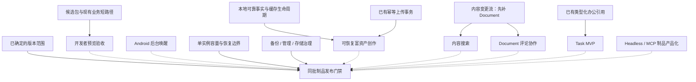

# 路线图

路线图只记录尚未完成的结果；当前能力与已完成切片见[功能状态](feature-status.md)。
工作包编号用于交接和提交引用，不表示 wire、RPC 或数据库编号。可读性收敛与修复已确认的缺陷可以先做，
不必等待完整容量报告或发布制品矩阵；产品功能仍按真实依赖推进。

## 当前优先级：小范围开发者预览

本次范围以既有沟通、附件、群文件和文档的正常流程完整为准，不要求把下面所有工作包完成后才能内测。
体验边界和最小检查见[开发者预览版指南](../01-getting-started/developer-preview.md)。

| 预览前要闭合的结果 | 当前处理 |
|---|---|
| 下载到真实可安装、能识别版本的包 | 先准备 Android 签名 APK 与本机 Intel Mac DMG；候选包安装后再定向分发。Windows/Linux/Apple Silicon 不按“能交叉构建”推定可用 |
| 现有业务正常流程没有断点 | 用 `previewSmokeTest` 与候选客户端短路径验证；认证等待、失败表单保留和 Android 基础通知是本轮收敛点 |
| 测试者知道哪些场景需要主动操作 | 文档他人修改需刷新；富资产未发送聊天草稿不具备跨进程恢复；Android 后台网络受限或进程被回收后的唤醒仍缺 |
| 数据用途与维护授权一致 | 已撤销默认服务器随时清空授权；普通升级保留资料，内部版本兼容窗口与本地迁移见[版本机制](../04-protocol/versioning.md)，对外仍不保证兼容 |

本次不将 Document 评论、内容搜索、Task、日历、通话、通用应用平台作为阻塞项。
厂商 Push、跨进程富资产 spool、任意私有服务器组合与全平台安装更新各有独立工作量；
先限定预览使用场景，后续按真实反馈推进。低概率历史收据治理、完整容量 SLO 和通用管理治理不抢占当前正常路径修复。
开发者预览已经采用有条件兼容，REL-01 的备份恢复应前移；不能再沿用可清空实例的假设。

## 后续如何选择一项工作

当前清单中的大多数工作包跨越协议、存储、SDK 和双端产品，不能因某个 API 或局部测试完成就整包关闭。
每次先交付下面的一项窄切片，完成后更新功能状态；同批制品、完整 UI 与长时间容量验收集中到发布阶段。

| 可选下一项 | 为什么值得先做 | 当前需要的工作规模 |
|---|---|---|
| `CORE-06` 隔离库诊断清单 | 用户需要知道哪些本地可靠事实尚待处理 | 可独立做只读诊断；实际恢复/放弃另一步 |
| `CONTENT-06` UTF-8 正文预算 | 现有字符数限制不等于字节/事务预算 | 可独立闭合一条服务端边界，不等于完成历史治理 |
| `REL-03` 可选 HTTP 与自签 TCP 契约 | 当前运行时、SDK、部署脚本并不支持同一组组合 | 先统一配置与信任契约，再按矩阵实现 |
| `CONTENT-03` 可靠命令的终止语义 | 回执增长不能直接用 TTL 删除解决 | 先区分确认结果与当前对象读取，再决定回收 |
| `CONTENT-01` Document 变更事件 | 搜索与评论的同步基础仍缺 | 协议、服务端、SDK 三层闭环后再接双端 |
| `CLIENT-04` 富资产草稿和 spool | 当前进程内重试不等于强杀恢复 | 跨平台持久化，需要单独完整工作包 |
| `PLATFORM-03` 现有无头制品安装链 | 已有程序，不需要重新造 Agent 平台 | 可先交付制品 identity/安装冒烟；权限与审计继续保留 |
| `REL-01/02/05/06/07` 发布治理 | 备份、管理、制品、配额和容量需要真实边界证据 | 分阶段交付，正式发布前集中验收 |

管理台依赖产物移出 Git 的切片已经完成，不再作为 `REL-05` 待办；这不代表许可证审计、签名或同批制品门禁完成。
阅读架构与追踪代码从[架构入门](../03-architecture/architecture-primer.md)开始。

## 依赖与发布汇合点

图中实线表示能力依赖及正式发布基线，虚线表示按该版本承诺的范围进入验收；
开发者预览采用上节的较小范围，不等待所有产品能力。容量测试不阻塞每次内部重构。
是否缩减某次正式版本的功能范围，应明确记录该版本范围，不能通过把未完成工作包标为完成来缩减。

每份交接任务应固定：**一个用户结果、现有证据与入口、修改边界、必须保留的事实、最小验收、完成后更新哪里**。
下面标为“可交接第一步”的小节可以直接作为下一次 AI 任务的起点。简单 CRUD/文档整理交给普通实施任务；
跨存储、命令终止、同步恢复先由能完整判断状态边界的任务定好契约，再拆分实施。

## 阶段一：发布基线与可运营性

### REL-01 · 数据发布基线、备份与恢复

在已建立的协议 0.0 兼容窗口、PostgreSQL 顺序迁移台账与客户端事务迁移入口之上，补齐 PostgreSQL、RocksDB、FileStore、客户端
SQLite schema 与 dataset identity 的版本化演进制度。服务端提供同一停写点的备份、恢复、可重建索引、
容量预检和故障注入工具；客户端 SQLite 不冒充服务端备份的一部分，但正式版本升级必须按事实类别执行
版本化迁移，或只重建明确可重建的投影，不能静默清空 outbox、草稿等本地可靠事实。

完成条件：一条受控流程可备份并恢复完整实例；只恢复部分存储会拒绝启动；恢复后登录、消息、附件、
群文件和文档验收通过，Lucene 可从权威事实重建；首个正式版本之后至少完成一次 N→N+1 迁移和回滚
演练。普通升级保留现有资料；项目对外仍不保证兼容，破坏性变更必须明确数据范围与处理方案。

### REL-02 · 管理后台治理边界

首发只建立一个服务端权威的实例管理员身份，不提前拆分只读、运营、安全等角色，也不抽象尚无第二个
调用方的 capability 平台。ban、凭据重置、组织变更和资产交接等敏感动作由服务端裁决并记录必要审计，
有真实重试风险的破坏性命令使用稳定 operationId；普通读取和天然幂等修改不复制收据框架。

完成条件：管理员凭据可轮换和主动吊销；敏感动作审计包含 actor、目标、结果及失败原因且不记录秘密；
前端确认不作为安全边界。出现真实职责分离需求后再扩角色，而不是把多角色模型作为首发前置条件。

### REL-03 · 低门槛传输部署与 secret 轮换

产品约束：HTTP 不能以申请 HTTPS 证书作为尝试项目的前置条件；TCP 可以通过内部生成与信任自签证书闭环。
当前运行时允许明文监听，但 SDK 非本地连接要求 HTTPS/TLS，部署脚本又把 TCP 的证书与 HTTP scheme 绑定。
这三层的准确状态见[传输配置边界](../07-operations/configuration.md#传输配置边界)，不能把“服务进程可启动”写成完整部署可用。

**可交接第一步：写清并实现一张可重复验证的连接矩阵。**

1. 从 `DeploymentConfig`、`EnvSh`、`TlsDeploymentPreflight`、`ServerTransportConfiguration`、
   `ClientTransportTls` 与两端 `canonicalHttpServerBase` 追配置来源，不新增散落的 profile/flavor。
2. 分开 HTTP scheme、TCP TLS 选择与证书信任；定义自签证书首次安装、固定信任、轮换/失配失败，
   不通过 trust-all 或关闭主机名检查制造“可连接”。低门槛 HTTP 是显式部署模式，不做握手失败后的静默降级。
3. 按本地开发、远程 HTTP + TCP TLS、远程 HTTPS + TCP TLS 三种产品组合验证登录、附件上传/下载与健康；
   证书失配时行为可诊断。完整组合未验证前继续标为部分实现。

随后补齐数据库口令、管理凭据等非 TLS secret 的轮换与故障恢复。首发不提前引入可信代理 CIDR、来源头或
PROXY protocol；代理可以 TCP 透传，应用不据来源头推断真实来源。

完成条件：文档中的每种支持组合都能由标准部署工具产出并被 Android/Desktop/无头 SDK 实际使用；
HTTP 不强制证书前置，TCP 自签或配置证书的信任与轮换有闭环；数据库、管理凭据与证书可分别轮换，
健康和业务验收通过，运行时与文档对代理来源头的语义一致。

### REL-05 · 发布物晋级门禁

保留现有一次构建、制品 identity、部署和服务端远程验收链，补齐使用同一批发布物的 Desktop 自动化、
Android emulator 或真机冒烟、安装/升级/卸载验证、报告与截图归档。TeamTalk 自有代码与文档已确定采用
Apache License 2.0 并加入根 `LICENSE`；首个正式发布前仍须让服务端和图形客户端制品携带适用的项目许可证、
按实际 runtime graph 生成的第三方许可证与归属清单，并提供可核验版本、签名或校验和；Headless/MCP
产品化后接入同一门禁。P0 UI 矩阵明确覆盖 Desktop 键盘/窗口、双端系统 picker/权限/返回路径及最低无障碍语义；附件还必须验证
认证下载完成后原子进入账号缓存、播放器只读本地文件，以及 Desktop/Android 离线命中。
源码中的生成依赖已移出 Git 跟踪；第三方审计仍须按实际 runtime graph 覆盖受控 rich-editor fork、
Desktop 原生播放器以及 Server 随包的 JavaCV/FFmpeg native 依赖，不能把清理 node_modules 当作许可审计完成。

已完成切片（双端媒体下载/播放生命周期、离线缓存命中、Intel macOS 本地媒体原生覆盖与 FD 门禁）
见[功能状态](feature-status.md)「图片、语音、视频与缩略图」；同一批未经重建的 release artifacts 复验、
Conveyor 可分发安装包/更新站点、签名、公证、许可证随制品分发及第三方归属审计仍未完成，因此
REL-05 保持未完成。

完成条件：服务端、Desktop 和 Android 制品不经重建完成部署/安装；P0 用户流程全部通过；
任一失败阻止 draft 晋级正式发布，一个没有项目背景的维护者可按文档完成整条流程。

### REL-06 · 附件存储治理

在现有 FileStore 全局/上传者硬围栏、未引用租约和安全 GC 之上，形成可查询、可审计的账号/组织存储
配额、资产归属、保留期与账号生命周期策略。策略不能通过删除仍被业务引用的对象来伪造达标。

完成条件：管理员可查看当前用量、预留、孤儿和拒绝原因；账号停用、组织变更、资产交接、保留到期和
超额都有确定动作与审计；并发上传、引用提交和 GC 竞态不会突破额度或删除活动资产。

### REL-07 · 单实例容量、SLO 与过载恢复门禁

把现有独立的连接/认证/突发重连、消息提交/过载恢复/离线事件追平、首屏消息/用户搜索，以及
小对象附件 SDK HTTP 上传/GroupFile 引用/另一成员鉴权下载基线扩展成发布级容量门禁。大于 32 MiB 的
FileStore 文件系统层已用产品 SDK、另一成员下载、精确 TeamTalk 服务重启、同 identity 重放和第二次下载形成
独立门禁。剩余工作是固定参考服务器规格，补齐后台维护、慢 PostgreSQL、磁盘压力和长时间 soak，再基于
多轮样本为关键路径确定 p95/p99、错误预算、资源高水位和恢复时间。当前应用代码的双端本地优先缓存门禁
已独立通过；未经重建的同批正式发布物复验仍归 REL-05，不由服务端容量报告代替。容量测试必须运行与实际
发布相同的业务路径和存储配置，不能用测试专用捷径换取好看的数字。

完成条件：同一套工具可执行稳态、突发重连、慢 PostgreSQL、磁盘逼近容量、事件积压和长时间 soak；
过载以有界拒绝和可观测退避收敛，不制造假 ACK、无限队列或健康假阳性；负载解除后消息、seq、事件
游标、outbox、文件计量和 Lucene 投影均可证明一致。发布报告保存参考硬件、参数、容量曲线、错误分类、
资源高水位及恢复时间，并作为未来是否进入多节点 ADR 的唯一容量证据之一。

## 阶段二：收紧同步与可靠性边界

### CORE-06 · 本地缓存生命周期

为权威投影、本地可靠事实、消息历史和旧 namespace 分别定义保留策略。Desktop 与 Android 的可回拉媒体已在
同一物理媒体根内跨 deployment/dataset/uid scope 共享 512 MiB 与 4,096 条目预算；身份目录仍隔离，但旧账号
不再各自获得一份配额。LRU 只扫描可重新下载的生产文件形状，并跨 scope 共享 reservation 和消费者租约；
录音源文件、草稿、outbox、未知路径与符号链接不参与回收。可回拉
权威消息已按 chat 最新前缀及逻辑字节双预算分批回收。Android 已实现不删库的周期完整性检查，Desktop GUI 每次打开
均先完整检查；两端确认损坏后都只隔离精确 deployment + dataset + uid 账号并重建干净投影。headless JVM 对承载可靠 inbox/outbox
的损坏库保留原库并明确失败，不静默替换。

已完成 clean close 的受限 checkpoint、双端损坏隔离重建、跨 namespace 媒体预算，以及零号基线的
minor 事务迁移/major 启动重置入口；按 epoch 自动删除旧库的历史代码已移除。剩余工作是旧 namespace
的明确保留/回收策略、离线 SQLite compaction，以及隔离库的显式诊断、恢复或放弃工具，不能将 outbox、
草稿等尚未上服事实当作可重拉投影。

**可交接第一步：只读隔离库诊断。** 从两端 LocalCacheFactory、`JvmLocalCacheRecovery`、
Android 损坏隔离入口与 `LocalCacheSchema` 入手，先列出精确 namespace、数据库族、隔离原因、
可读取的 pending/outbox 数量与无法读取的部分；不得打开原库为可写、自动重放命令或以零项假装读取成功。
用临时 SQLite 验证健康、损坏、sidecar、不认识的文件形状和符号链接，核对诊断不修改原文件。
恢复/放弃、跨 namespace 回收和 VACUUM 是后续独立步骤，必须先确认哪些本地事实可以处置。

完成条件：消息历史按服务端可回拉边界有界回收；旧 namespace 按数据类别明确保留或回收；媒体缓存有界；损坏只隔离精确账号和
deployment namespace；可重建投影自动恢复，无法恢复的本地事实给出明确处置而不是假成功。

## 阶段三：补齐客户端产品闭环

### CLIENT-04 · 可恢复富资产创作

在已落地的幂等上传事务之上，聊天与文档已经共用有界滚动的待处理资产区：上传中可显式取消，失败项可
同时重试或移除。取消/移除先从 Markdown 删除该资产的全部语义引用并发布/持久化当前 owner 草稿，再
best-effort 取消平台上传任务；待处理区只投影当前正文仍引用的 job，因此迟到 `READY` 不会把用户已经
移除的节点复活。当前进程内的重试保留原 `jobId`、`assetId` 和 `AttachmentUploadIdentity`，FAILED 到
PREPARING 只有一个调用胜出，旧 attempt 不能覆盖新状态。Android 首次准备后复用不可变 `PreparedMedia`；
Desktop 只管理自身创建的剪贴板临时源，不复制或删除 picker/drop 原文件。失败保留源，READY、取消/移除
或关闭时释放。
已完成切片（当前进程取消/移除与同进程重试、聊天/文档可视光标插入、回复内嵌资产双端历史验收、
Android 二进制粘贴与系统 picker 导入）见[功能状态](feature-status.md)「Markdown 上下文图片/文件」。

剩余工作是聊天 Markdown + sidecar 的跨进程草稿、私有有界源文件 spool、上传 outbox、断网续传和失败
重试的跨进程恢复；原 owner 的 Activity 重建续接仍缺 AOSP/emulator 或另一设备的真实平台证据，拖放
只要求支持该系统能力的平板或设备。

完成条件：断网选资产、强杀、重启、联网后只上传并发布一次；删除引用后迟到 READY 不复活；重试与
取消释放资源；回复历史可重放并通过真实双端验收。跨进程持久化与有界 spool/outbox 仍未完成，不能把
这些切片等同于整个工作包完成。跨设备只同步已经 READY 的服务端资产，不伪造本地未上传源文件的跨设备能力。

### CLIENT-06 · 平台资源发布与首帧

已完成切片（IO 候选构造与 Main 复验 owner 的交接、50,000 条媒体大库真实 UI 门禁、Android 文件卡
与视频/文本预览缓存根移出 Main、StrictMode 零违规门禁）见[功能状态](feature-status.md)
「客户端资源换代与首帧」。剩余工作仍包括双端草稿 owner 的完整资源交接，以及其他尚未逐入口量测的
平台资源与磁盘工作；Compose 状态本身仍在 Main 创建，不把这次交接扩大成通用状态框架。

完成条件：大离线库不阻塞首帧；取消、窗口替换或发布失败关闭所有候选；迟到候选不能覆盖新账号；
候选资源的创建、所有权复验、发布和关闭都有确定性竞态测试，并由发布物 UI 门禁覆盖双端真实入口。

### CLIENT-07 · Android 后台唤醒与系统通知

进程存活且系统允许后台联网时的标准系统通知、权限申请和点击会话已接通，见[功能状态](feature-status.md)。
该切片补齐现有 TCP 收信的提醒，不关闭本工作包；剩余重点是后台网络受限或进程被回收后的可靠唤醒。

建立设备级 Push endpoint、Provider 适配、服务端持久 wake outbox 与 Android 系统通知闭环。Push 只携带
不透明、有界的唤醒身份，不携带 bearer、附件地址或不必要正文；客户端被唤醒后仍通过权威事件同步
读取消息并按当前会话、静音、免打扰和权限生成通知。私有化部署可以明确禁用外部 Provider，但不能把
进程被系统回收后的无通知伪装成可靠移动交付；中国移动设备不能只依赖 FCM。

完成条件：Provider 超时、重复、乱序、进程重启和 token 轮换经 outbox、去重与退避有界收敛；TCP 实时
到达与 Push 竞态不产生双通知。Android 真机至少覆盖后台、锁屏、进程回收、断网恢复、静音、通知点击
精确定位和 Provider 不可用；小米设备进入首批发布门禁，其他国产 Provider 按目标部署市场扩展。

## 阶段四：建立办公内容协作域

### CONTENT-01 · 内容变更流与本地增量投影

为 GroupFile 与 Document 定义持久、可恢复、类型化的变更事件，使客户端从游标增量维护有界本地投影，
不再每次从第一页重建，也不依赖全空间预取。

GroupFile 域已完成（五类变更与事件同事务提交、行级投影实时收敛、真机验证）见[功能状态](feature-status.md)
「群共享文件空间」；剩余：Document 域事件（工作区/正文/评论维度在
CONTENT-05 前定义）与双端各一次的完整断网恢复脚本化验收。

完成条件：重复、乱序、漏事件、断线、重启和 reset/resume 均收敛；客户端收到权威变更事件、reset 或
当前请求的 403/404 后原子删除干净投影。离线旧缓存只作明确的 stale 展示，不作为远端操作授权依据；
Desktop 与 Android 各完成一次真实断网恢复。

**可交接第一步：Document 最小持久变更契约。** 从 `DocumentService`、`DocumentPolicyMutationService`、
`PgUnitOfWork`、`NotifyContracts`、客户端 `DocumentRepository` 与 `LocalDocumentProjectionStore` 入手。
先覆盖空间失效、树节点变化、正文 revision；明确权限变化后的删除或失效语义，事件与领域写同事务。
再接 SDK 的重复/乱序/漏事件恢复，不把未来评论载荷预填成已实现。最小集成先验证两个账号的保存、改名、
删除、撤权，以及断连后重放收敛；双端完整断网脚本仍属于工作包完成条件。

### CONTENT-02 · 内容与资产搜索

统一承接聊天附件、群文件和 Document 搜索。每个领域拥有自己的可重建索引和 PostgreSQL outbox / revision
fence；全局入口只做有界聚合，服务端领域查询负责当前可见范围。

完成条件：重试、删除和重放不会复活旧 revision；归档、删除或可见范围变化后不返回失效结果；文件
类型、范围筛选和打开结果有真实数据入口，Desktop/Android 与直接下载得到一致结论。

### CONTENT-03 · 群文件历史容量与保留治理

五类群文件命令的稳定 identity、持久客户端 outbox、服务端 receipt，以及 rename/delete 丢响应恢复已经
完成，不再把它们列作本工作包。内容变更事件与本地增量投影统一归 `CONTENT-01`，群文件搜索统一归
`CONTENT-02`；本项只治理当前仍会无界增长的 `group_file_versions`、`group_file_audits` 和
`group_file_commands`，并补管理员可用的用量、保留、归档和查询入口。

**可交接第一步：统一五类命令的确认与终止语义。** `GroupFileService` / `ExposedGroupFileRepository`
中 rename/delete 的精确重放可以只确认 Unit 收据，创建与追加版本仍返回当前条目，受当前成员、条目和附件条件约束。
先定义客户端收到的“原命令已成功”与“对象目前可读”两种事实：覆盖 ACK 丢失后删除、退群、附件回收与进程重启；
普通重试仍复用原 commandId，不重新生成副作用。需要改 RPC 时同步 protocol、SDK outbox 和双端结果处理。
完成确认契约后才实现终止期限/tombstone 与 receipt 压缩，不先给数据库表加 TTL。

当前 command receipt 没有 TTL，而且不能先按时间直接删除：仍持有稳定 commandId 的客户端可能迟到重放，
缺失收据会让旧 identity 被重新执行或误判为新命令。任何 receipt 回收实现必须先定义客户端可观察的
可靠终止契约，或留下足以持续拒绝旧 identity 的有界 tombstone；版本正文和审计再按各自业务价值设计
分层保留，不能用删除仍被活动条目、下载引用或可靠重放依赖的行来伪造容量达标。

完成条件：管理员能按群查看活动/历史版本字节、版本行、审计行、receipt/tombstone、保留状态与拒绝原因，
并执行有审计的归档和查询；活动引用不被回收，归档/恢复/清理重启后幂等；版本与审计拥有可配置且有硬
上限的保留策略；receipt 只有在终止契约或 tombstone 已证明迟到重放不会重新执行后才可压缩，长期运行
时三类历史数据的行数与字节均有可验证边界。

### CONTENT-05 · Document 评论协作

在现有空间权限和文档修订模型上增加文档评论，建立稳定评论身份、创建/编辑/删除、实时/离线事件和
双端交互。正文仍使用 expectedRevision + 409 双选择恢复；评论不推动 CRDT 或节点级 ACL。

完成条件：评论操作在断网重试、多设备和服务重启后收敛；文档不可见或被删除后评论不单独泄漏或复活；
Desktop 与 Android 均可从正文定位评论并完成基本操作。

### CONTENT-06 · Document 正文与历史容量边界

为当前 PostgreSQL 正文快照与不可变修订模型定义 UTF-8 正文上限、单文档修订量、分页历史和事务资源
边界，并用真实长 Markdown、长历史及内嵌资产引用建立基准。二进制资产继续由现有 FileStore 承担；
没有实测存储或堆内存瓶颈前，不增加通用 BlobStore、内容寻址、去重或冷热双存储。

完成条件：边界内保存、冲突恢复、历史分页和备份恢复有重复基准，超限稳定拒绝且不留下半条修订；
报告保存数据库、堆内存、延迟和临时空间高水位。只有报告证明当前模型不足，才另立正文外置 ADR。

**可交接第一步：正文 UTF-8 字节预算。** 当前 `DocumentPolicy.MAX_MARKDOWN_LENGTH=1_000_000`
约束 Kotlin 字符串长度，已有 `listRevisions` 游标和最多 100 条页限制；缺的是明确字节预算与总历史容量，
不要重复实现分页。先确定正文 UTF-8 上限并在共享规则和服务端写前执行，覆盖 ASCII、中文、emoji、
恰好边界和超出一字节；超限不能产生文档、修订、引用或事件的半条事实。沿 `DocumentService` 与现有
Document 集成用例验证。总修订数/保留策略及长历史基准单独实施，不引入外置 BlobStore。

### CONTENT-07 · 资产权限与离职治理

把现有 Document 盘点和批量交接扩展为可理解的图形化工作流，并让 GroupFile 接入同一离职资产清单。
资产明确交给指定人员或组织；不猜测 leader，也不因部门父链自动改变责任人。项目、监控等领域实际
出现后再逐域接入。

完成条件：管理员可查看待交接资产、明确目标、执行并看到部分失败；客户端或服务端重启后可继续；
Document 与 GroupFile 的责任人、可见结果和必要审计一致收敛。

### CONTENT-09 · Task MVP

建立任务责任人、状态、截止时间、提醒、组织/群上下文、审计和消息引用的独立领域，提供服务端契约、
本地可靠操作和 Desktop/Android 入口。

完成条件：双端完成创建、分配、状态流转、到期提醒、离线重试和消息引用，并通过真实部署验收。日历与
会议必须等 Task 和通知模型稳定后另行立项。

## 阶段五：现有自动化制品产品化

### PLATFORM-03 · Headless 与 MCP 发布产品化

把 `tt-agent`、CLI 和 MCP 纳入统一 release version、制品清单、checksum、安装、升级和卸载体验，补齐
MCP 权限隔离、审计和部署配置；使用实际发布制品做产品路径冒烟。

完成条件：空白机器可按文档安装、配置、升级和卸载；实际制品完成登录、收发、附件及权限拒绝冒烟；
版本与服务端兼容性可诊断，完成后接入既有同批制品晋级门禁。

**可交接第一步：无头制品安装冒烟。** 从 `client/shared/build.gradle.kts` 的 headless 分发任务、
`ReleaseArtifacts` 与[无头客户端](../05-clients/headless.md)入手。复用既有 build identity/manifest，
用同一个分发包在空临时目录完成安装、启动、CLI 登录收发和卸载，确认不借用源码工作区 classpath。
版本、checksum、配置位置与退出清理应可诊断。MCP 权限隔离/审计未完成时仍保留为部分能力，
不把此切片包装成完整 Agent 平台或整个 PLATFORM-03 完成。

## 基础软件的独立迁移

常规依赖维护按[依赖升级流程](../08-development/dependency-maintenance.md)执行；下列跨代工作不阻塞小范围
预览，也不与业务功能一起打包。当前版本以版本目录、Wrapper 和锁文件为准；目标版本在实施时重新核对稳定性。

| 工作包 | 修改边界与可交接第一步 | 完成条件 |
|---|---|---|
| `DEP-01` 构建与客户端工具链 | 将 Gradle 9、AGP 9、Kotlin 2.4、Compose 1.12、compileSdk 37 作为一组评估；先列官方兼容矩阵，检查 Android KMP 插件、新 DSL、KSP 和打包任务，不直接绕过版本检查 | 服务端/SDK/双端可构建；协议生成一致；Android release 与 Desktop 候选包可启动并完成短路径；只提高 compileSdk 不自动提高 targetSdk |
| `DEP-02` Exposed 1 | 从 `DatabaseFactory`、`PgUnitOfWork` 和 Exposed 适配器开始迁移 `v1.core`/`v1.jdbc` 导入、事务及 UUID API；在独立 PG schema 对比新建 DDL 与现有数据读写 | 原 dataset、迁移台账和业务行保留；事务回滚、并行容器隔离及消息/群/文档核心读写通过，不夹带表结构清理 |
| `DEP-03` Lucene 10 与 JDK 21 | 单独确定服务端 JDK 基线，再处理搜索 API 与分析器兼容；保留旧索引副本，核对重建和回退边界 | 消息与遥测搜索、权限过滤、排序和重开通过；无法原地兼容时从权威事实构建侧目录并原子切换，不能删除权威资料 |
| `DEP-04` RocksDB 10 | 从 `MessageStore`/`FileStore` 的实际 column family、blob、压缩和 WAL 选项入手，用当前版本产生的独立库验证跨版本读取，不先改存储布局 | 消息、附件、上传事务在升级和重启后完整；flush/compaction 后的格式、JNI 平台支持和回退方案明确，再进入保留资料的部署 |
| `DEP-05` Desktop 运行时与受控播放器 | 分别评估 JBR 21 运行镜像及 ComposeMediaPlayer 更新，核对 Conveyor、jlink、字体和 Intel macOS 原生覆盖；按目标平台验证 ABI 和随包库，不以新 Maven 版本替代原生来源审计 | 候选包启动、字体、本地文件播放、切换、全屏、关闭/重开及 FD 释放通过；新旧覆盖的许可证与平台范围明确，接收媒体仍完整下载后播放 |
| `DEP-06` PostgreSQL 维护版与宿主维护 | 在维护窗口核对当前 PostgreSQL 16 补丁、镜像 digest、扩展与系统待重启状态；先保留可恢复备份与旧镜像，再分别执行数据库维护和宿主更新 | 保留原 dataset 和业务资料；数据库重开、TeamTalk 健康与短业务冒烟通过，回退步骤明确；不夹带 PostgreSQL 或操作系统大版本升级 |

官方兼容/迁移依据统一从[依赖维护](../08-development/dependency-maintenance.md)进入；每项完成后移出本表，
将稳定约束写回构建配置或对应架构章节，验收证据留在提交和构建报告。

## 暂不进入执行队列

- 日历与会议：等待 Task 和通知模型稳定后，再定义参会人、时区、重复规则和会议生命周期。
- CRDT：当前 Document 使用乐观锁和 409 冲突恢复；只有逐字符多人实时协作成为明确需求并有冲突数据时
  才单独评估。
- Document 节点级 ACL：当前空间级权限已满足产品入口；只有真实用户提出同一空间内的例外授权需求，
  并明确移动、搜索和评论语义后再立项，不预建第二棵权限继承树。
- 通用 JobManager、通用事件溯源和通用权限平台：现有领域 outbox、同步事件和 Document 域权限分别解决
  已出现的故障；第二个真实调用领域出现并证明重复后再提取。
- RTC 音视频通话、聊天文件夹和定时发送：均需先完成产品边界与真实使用优先级，不因竞品已有就直接
  进入实现队列。
- 通用应用注册、应用级配额、出站 Webhook 与交互卡片动作：当前只有受控通知机器人的入站发送和已有
  Headless/MCP 制品。第二个命名外部应用真正需要安装、撤销或出站订阅时，再按它的调用链拆分工作包。
- AI 员工一等主体：这是产品长期差异方向，但必须先完成 `PLATFORM-03`，并由至少一个命名岗位在真实
  客户流程中证明独立身份、群组/项目参与、任务收据、模型选择、状态恢复和资产交接需求，再定义新的
  Agent 身份与协议；当前 `AutomationBot`、`ImBot` 和 `tt-agent` 基础不包装成已完成的 AI 员工平台。
- 应用、AI 技能市场与交易服务：这是完全开源内核之上的长期商业层，不在首发内核中预建。只有多个
  独立应用经过真实交付形成稳定安装、升级、权限、计费和退出共性后，才设计市场协议；差旅、采购等
  服务必须由客户主动选择，不能依赖读取客户聊天、文档或内部数据变现。
- Document 大正文外置、通用 BlobStore、内容寻址和跨正文去重：只有正文与历史容量基准证明当前
  PostgreSQL + FileStore 模型不足后才立 ADR，不以潜在规模预建第二套存储抽象。
- 消息索引热路径：当前保留逐操作 commit、启动全量审计、revision fence 和 side-directory 重建；只有
  基准证明提交阻塞成为瓶颈时，才单独立项 PostgreSQL outbox 驱动的异步批处理，并保持现有正确性。
- 多节点：当前产品仍以单实例私有化部署为边界。只有单实例容量、可用性、迁移和可观测指标证明必须
  扩展时，才先立 ADR，覆盖共享权威存储与分区所有权、连接目录与路由、seq/event fencing、
  `sync_events` 正文单份引用、FileStore/Lucene 共享或分片、节点接管和滚动升级。已有 dataset UUID 绑定
  不再列为未完成任务。

## 路线图维护规则

- 已完成事项立即从路线图删除，并更新功能状态与稳定设计文档。
- 删除工作包前，先把其他未完成文本中的依赖改写为稳定设计文档链接；路线图不得留下悬空工作包 ID。
- 一个工作包只描述一个可验收结果；实现细节进入对应产品、架构、协议或运维章节。
- 不接受“持续优化”“评估一下”这类无法完成的永久任务；研究项只有满足进入条件后才转为工作包。
- UI 工作必须有 Desktop 自动化和 Android emulator/真机证据；跨账号、数据库、文件或权限链路必须有
  真实部署验收。
- 临时缺陷进入测试场景或 issue；重复暴露的系统性问题才提升为路线图工作包。
