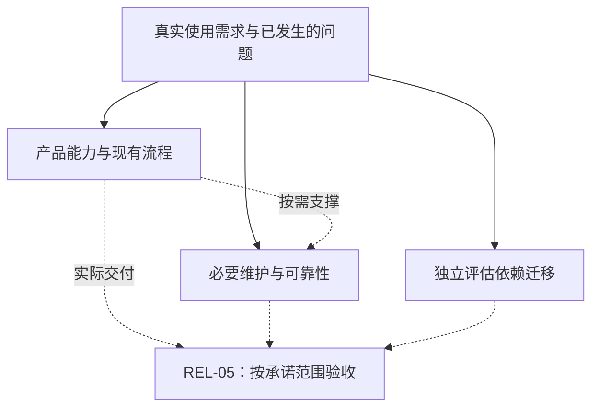

# 路线图

TeamTalk 当前发行是 [0.0.1 开发者预览](../07-operations/releases/0.0.1.md)。产品功能与支撑它的基础设施
按真实使用需求同步演进，长期治理不是新增产品能力的前置条件。
本页记录尚未完成的结果和各自边界，现有能力与证据统一见[功能状态](feature-status.md)。
工作包 ID 仅用于交接，不是 wire、RPC、数据库编号，也不因调整分类而重新编号。

## 当前投入：产品完善与必要维护

| 当前要交付的结果 | 工作边界 | 最小验证 |
|---|---|---|
| 具体用户流程得到完善 | 按真实使用需求实现产品能力，同时补齐支撑该流程的必要基础设施 | 验证完整用户路径及实际影响，不等待无关治理任务完成 |
| 维护者能沿调用链理解现有业务 | 明确数据与资源所有者，提取已出现的重复规则，减少任务脚本、应用状态和页面中混杂的职责；同步架构图与源码入口 | 相关模块编译和已有定向测试；没有实际问题不为分层增加抽象 |
| 已有用户流程可持续使用 | 修复聊天、群设置、组织可见性、附件导出、账号状态和平台生命周期的真实反馈；保留正常升级数据与已发行客户端兼容 | 按改动跑 Android / Desktop 短路径；不把只通过 SDK 测试写成 UI 已验收 |
| 内测更新与正式发行分开 | 用户发起的私有 snapshot 沿用统一 Gradle 流程；正式版本由用户确认，旧发行事实保持不变 | 实际邀请的平台安装或覆盖升级并确认资料保留，统一记录于 REL-05 |
| 文档能交给下一位维护者 | 已完成实现移入功能状态和稳定设计文档；任务保留具体缺口、入口、边界和验收条件 | 文档与代码一致，链接可追踪，不把历史中间状态继续列作待开发 |

统一 Gradle 发行、Android 签名 APK、Conveyor 三平台安装包与更新站点、私有客户端独立身份、
Kotlin 部署 DSL 和 IP + 自签 TCP TLS 已有实现，见[发行流程](../07-operations/releasing.md)与
[部署配置](../07-operations/configuration.md)。这些能力不再作为“预览前尚未实现”的任务。
交叉出包与每种系统的实机验收仍是两件事，未覆盖的平台范围须在交付说明中明确。

本地缓存生命周期的基础能力已具备：只读诊断、损坏自动重建（替换验证健康后删除损坏族）与压缩，
范围见[功能状态](feature-status.md#客户端体验)。交付故障与设备复验由 REL-05 按承诺范围承接。

每项工作的完成依据是所选用户结果已实现、相关调用链与文档清楚、受影响的客户端路径复验通过。
不等待下面所有工作包，也不要求每次重构完成全平台安装矩阵、长期容量报告或低概率历史治理。
普通升级保留已有资料；完整备份恢复尚未闭合，实例的数据用途与维护边界继续遵循
[开发者预览指南](../01-getting-started/developer-preview.md)和[版本机制](../04-protocol/versioning.md)。

## 每次交付的统一验收入口

### REL-05 · 发布物晋级门禁

本项集中承接已实现功能的发行前复验，避免每个架构工作包都因缺一轮完整制品验收长期挂起。
现有 `release` 已支持同一构建的身份、校验和、APK 验签、Conveyor 完整站点、Server/Headless ZIP、SFTP 与
GitHub 交付，以及原字节重试；实现入口为 `ReleaseTasks`、`ReleaseBundle` 和各 publisher。
不再把工具链、下载站点或签名身份校验列为待开发。

Linux 桌面及未覆盖的系统/DPI/多屏组合按交付实际参与平台补验；构建或其他系统验收不代替该平台结果。

下一次交付先固定参与的平台、目标实例和承诺的场景，用同一批密封产物完成以下验证：

1. 安装或覆盖升级、启动、登录、消息与附件短路径；私有版与公版共存，普通升级保留资料。
2. 按本次改动选择 P0 场景：Desktop 窗口/键盘、Android picker/权限/返回、媒体本地播放与离线命中、
   群文件断网恢复，以及富资产导入期间 Activity 重建。未在本次设备上覆盖的场景单独记录。
3. 账号封禁验证在线终结、旧凭据重连、错误密码不清理、中断后启动续清，以及其他账号和系统导出文件
   保留。开发构建的验证不替代交付产物复验。
4. 保存制品身份、版本、签名摘要、结果及必要截图，失败项明确回到对应实现修复，不靠重新构建替换
   已验收文件后沿用旧报告。

扩大公开分发或平台承诺时，仍需补齐系统信任签名/公证、目标平台完整安装/升级/卸载与无障碍矩阵，
以及按实际 runtime graph 生成并随包携带的项目许可证和第三方归属清单。现有公开预览签名、
受控播放器许可证和管理台产物清理不等于这些工作全部完成；审计须覆盖 rich-editor fork、Desktop
原生播放器和 Server 的 JavaCV/FFmpeg native。交付 Headless/MCP 时在同一入口复验便携安装、私有端点恢复、
授权收发、越权拒绝、升级和卸载；Linux systemd 服务按实际承诺的平台验证。

完成条件：本次承诺范围由同批制品实际通过，未覆盖范围有清楚说明，维护者能按
[部署验收](../09-testing/deployment-acceptance.md)和[发行流程](../07-operations/releasing.md)复现。
完整发行矩阵随承诺扩展，不作为持续内测或无关代码重构的前置条件。

## 工作分类与实际依赖

下方分类不表示先后顺序。只把所选功能实际依赖的维护纳入同一工作，其他长期治理和依赖迁移独立选择。
每次明确具体用户结果、修改边界、必须保留的事实和最小验收，再更新功能状态。

## 现有功能可靠使用

### CLIENT-07 · Android 后台唤醒与系统通知

小米、华为、荣耀、OPPO、vivo、魅族六家官方系统通知均已具备客户端接入、部署 Profile、设备注册、
服务端持久待通知记录及点击会话路径，六家在部署配置中独立开关。未配置厂商服务时保留进程存活的
标准通知。各厂商均已停用或限制透传唤醒，消息内容在用户点击后沿现有登录与权威同步获取，
不新增后台登录或常驻服务。实现与配置见[Android 通知](../05-clients/android.md#消息通知的当前范围)。

剩余工作：使用实际包名开通的各厂商应用、官方大陆 SDK、审核通道/分类/模板，完成真实厂商送达验收；
覆盖锁屏、系统回收、设备断网恢复、静音与已读、重复投递、通知点击、权限关闭和厂商不可用。
系统设置中的“强行停止”不作为必能唤醒的承诺。不接 Google/FCM，也不接其他聚合推送。
华为/荣耀/OPPO/vivo/魅族的服务端端点与客户端 SDK 调用按编写时官方文档实现，尚未有任何真机验证，
首次开通账号时须按注册行 lastFailure 错误码核对平台配置。未完成目标真机的厂商实际送达前，本项保持未完成。

## 长期运行与维护

按实际实例需要选择备份与维护工作；长期容量、历史回执治理和多角色权限不一起压到当前内测。工具必须在保留既有数据、低版本客户端及安装身份的前提下推进。

### CODE-01 · 功能冻结期的代码结构收敛

v0.0.1 后的功能快速演进沉淀了一批结构性负债；第一轮清理已删除 Bot 适配层、统一活动用户判定
词汇、下沉两端壳重复的遥测映射/媒体失败分类/任务提醒过滤，并修复了自第一条 .sqm 迁移起就未随
功能更新的过期测试（细节见相应提交）。本轮明确遗留、按收益排序：

- ~~Chat 域 feature 化~~：已完成。`ChatFeature` 持有编辑器热上下文、草稿生命周期、附件导入
  worker 与 chat ViewModel 管理；composer/编辑会话模型迁入 `navigation/feature/chat`，
  消除 navigation→ui.screen 反向依赖。
- ~~双草稿管道合并~~：已完成。CAS 接管的会话普通输入只写本地预览，不再进入 legacy
  setDraft 镜像 outbox；服务端兼容投影由 ChatDraftService 从 CAS 提交派生，接管时采纳
  并退役既有 legacy 待发行行；wire 契约不变。
- ~~五份可靠命令 outbox store~~：已完成。Healthy/Poisoned 骨架收敛为共享 PendingCommandSlot，
  各族保留类型化 SQL 与冲突规则。
- ~~服务端 reliable-command 回执~~：已完成。容量检查收敛为 ReliableCommandReceiptWindows
  统一语义（先清理过期再按族窗口拒绝，归一 off-by-one），维护循环收敛为 TableSweep 驱动
  + 两个按主键形态的泛型批次助手；表结构不变。
- ~~ClientRegistry 职责~~：评估后不再动。通用 trace 控制助手已在 ConnectionTraceControl.kt，
  registry 内剩余的是必须持有其连接索引与 Looper 的最小协调胶水；再抽协作者只是参数搬运。
- **telemetry/connection-trace 两套 Lucene 引擎**：已评估。openRuntime/closeRuntime 生命周期
  ~90% 结构相同，正确的第一步是抽共享 LuceneIndexRuntime（四件套字段 + 开/关级联 + 回滚次序，
  约省 120 行×2）；但两引擎存在真实并发不对称（telemetry 有 searchMutationGate、trace 手动
  删文件重置），完整合一为一个引擎不划算，需要专门一轮仔细阅读生命周期后实施。
- ~~归档/隔离 CLI~~：已按产品决策整体移除。服务器是唯一可靠信息源，未发送本地事实不值得专门
  工程化：损坏缓存改为自动重建并删除损坏族，v1/v2 归档、校验与显式放弃命令（export/discard/
  verify 五条）及三重校验/凭据引用检查机制全部删除，压缩不再被隔离副本阻塞。

第二轮清理已落地：DocumentService 测试包装删除、遥测入口限流骨架合一、android.json 契约入
protocol、下载状态发布器下沉 app 层（顺带修复 Desktop 压力驱逐缺陷）、视频/语音发送编排统一
（Android 视频获得上传占位）、custody 目标校验合一、遥测基线策略下沉 domain 与编解码器入
infra、9 处 Compose 判空强解修复。剩余按收益排序：

- **AuthController 900 行单 Composable**：封禁清理编排与数据集切换/准入分派提为可测协调器
  （已有 AuthUserLogoutRetirement 先例）；认证凭据 owner 世代是全客户端最敏感路径，须整段
  上下文仔细迁移，不可局部机械替换。
- **ChatScreen 1013 行 / ChatViewModel 847 行**：发送事务（performSend 96 行）提为
  ChatComposerSubmitActions、消息聚焦状态机与失败码探测拆 owner 文件。
- **DocumentDraftPersistence 双内核**：Android/Desktop 两套 600+ 行并发机制抽共享
  SerialDraftWriteCoordinator（generation + coalescing + flush 栅栏）。
- **DocumentRepository 43 方法端口**按消费者切 Read/Write/CommandReceipt 三片。
- **AdminRoutes 48 端点单文件** + AdminService 17 依赖拆用例类。
- **headless agent 5500 行独立 client/headless 模块**（全仓零反向引用，条件成熟）。
- **双 Lucene 引擎**：LuceneIndexRuntime + 队列预算合一 + 写循环统一到协程版。

最小验证：每项独立提交，相关模块编译 + 既有定向测试；Chat/Auth 域拆分需 Android/Desktop
短路径真机复验。

### REL-01 · 数据发布基线、备份与恢复

在现有协议兼容窗口、PostgreSQL 顺序迁移台账、dataset 预检和客户端事务迁移之上，补齐 PostgreSQL、
RocksDB、FileStore 的一致备份、恢复和演练流程，明确 Lucene 从权威事实重建的方法。
客户端 SQLite 不冒充服务端备份的一部分；升级只能迁移可靠事实或重建明确可回拉的投影。

现有部署 `.rollback` 只回退程序和配置，不含业务数据。先做同版本停服冷备与隔离恢复演练：
同时停止 TeamTalk 与本实例 PostgreSQL，再成套保存完整 `data/`、配置、对应制品及 systemd drop-in。
每包记录共同备份 ID 和组件摘要；dataset 相同不代表备份时点相同，必须能识别同数据集跨时点混包。
复用现有部署锁、停服和健康检查，不把热备、跨主机迁移与第一版恢复工具捆绑。

完成条件：一条受控流程能在同一停写点备份并恢复完整实例，识别并拒绝不匹配的部分恢复；恢复后登录、
消息、附件、群文件和文档可用。涉及存储迁移的后续发行完成一次 N→N+1 与回退演练，保留账号、草稿和
发件箱。破坏性变更另行说明数据范围与方案，普通升级不清库。

### REL-03 · 证书与 secret 轮换

首次 HTTP + 自签 TLS/TCP、公共证书注入与固定信任已有实现；剩余是长期轮换，不再重复开发首次部署。
沿 `DeploymentConfig`、`TlsDeploymentPreflight` 与 `ClientTransportTls` 明确证书更新、客户端信任过渡、
失败回退顺序；数据库口令和管理凭据独立轮换，不通过重建实例处理。

完成条件：旧客户端、轮换中的实例与更新后客户端能按既定窗口连接或明确提示处理；证书/SAN 检查
继续有效，错误轮换可恢复，账号、消息、草稿与发件箱保留。完成后用健康检查与真实业务核对结果。
不为这项工作提前引入 PROXY protocol 或通用代理身份模型。

### REL-06 · 附件存储治理

在 FileStore 现有硬限额、未引用租约和引用安全 GC 之上，提供可查询的用量、组织/账号保留期与资产
归属规则；不重写上传事务。客户端封禁清理不删除服务器文件，也不替代资产交接和组织保留策略。

完成条件：管理员能查看活动用量、预留、孤儿和拒绝原因；停用、交接、到期和超额有明确动作与审计；
并发上传、引用提交和 GC 不删除仍被业务引用的活动资产。

### CONTENT-03 · 群文件历史容量与保留治理

只治理仍会增长的 `group_file_versions`、`group_file_audits`、`group_file_commands` 历史，补用量、
保留、归档和查询。五类命令的稳定 identity、outbox/receipt、rename/delete 丢响应恢复已完成；
变更投影与文件名搜索已有实现，见[功能状态](feature-status.md#客户端体验)，不重复列作本项。

先统一“原命令已成功”和“当前对象仍可读取”的结果语义，覆盖 ACK 丢失后删除、退群、附件回收与
进程重启。沿 `GroupFileService` / `ExposedGroupFileRepository` 审阅创建、追加版本和 rename/delete
的重放差异，再决定终止期限、tombstone 与 receipt 压缩；不能直接用 TTL 删除仍可能被重放的收据。

完成条件：活动/历史版本字节、行数、审计和收据用量可查询；版本与审计有可配置的保留硬上限，
收据只在终止契约或 tombstone 能持续处理迟到重放后压缩。归档、恢复、清理可重启，活动引用不被
回收，迟到 commandId 不会被重新执行。这是长期治理任务，不阻塞当前小规模的正常使用。

### CONTENT-06 · Document 正文与历史容量边界

正文写入边界已明确：最多 1,000,000 个 UTF-16 单元，对应合法 UTF-8 正文最多 3,000,000 字节，
另有结构限制与整条 RPC 限制。ASCII、中文和 emoji 的边界往返、超限拒绝及失败后文档、修订、
引用和事件不变由定向测试覆盖，见[正文契约](../06-server/domain-services.md)。不再叠加更严的
字节限制，也不改变旧正文读取范围。

剩余为总修订容量与保留策略，以及长正文/长历史的数据库、堆内存、延迟和临时空间量测。
最多 100 条的游标历史分页继续使用，不重复实现分页。

完成条件：边界内保存、冲突恢复、历史读取及备份恢复有可重复基准，超限稳定拒绝；只有实测证明现有
PostgreSQL + FileStore 不足，才评估正文外置，不预建 BlobStore 或去重系统。

### CONTENT-07 · 资产权限与离职治理

将已有 Document 盘点和批量交接接入可理解的管理流程，再把 GroupFile 纳入离职资产清单。
资产由操作者明确交给指定人员或组织，不推测 leader，也不因部门父链自动改变责任人。

完成条件：管理员能看待交接资产、指定目标、处理部分失败，重启后继续；Document 与 GroupFile 的
责任人、可见范围与审计一致。其他业务域真实出现后再接入。

### REL-07 · 单实例容量、SLO 与过载恢复门禁

现有连接/突发重连、消息提交/过载恢复/事件追平、搜索与大小附件基线不再重复执行为“从零建设”。
剩余是固定参考硬件，加入后台维护、慢 PostgreSQL、磁盘压力与长时间 soak，再以多轮数据制定
p95/p99、资源高水位、错误预算和恢复时间。容量基线不代替 REL-05 的客户端制品验收。

完成条件：与实际业务及存储相同的路径能量测稳态、压力和恢复；过载有界拒绝，解除后消息、序号、
游标、outbox、文件计量和索引收敛；报告保存环境、参数、曲线与恢复证据。没有实际容量问题前，
不把完整 SLO 报告设为每次内测更新的门槛，也不据局部基准扩展多节点。

### DEP-06 · PostgreSQL 维护版与宿主维护

在维护窗口核对当前 PostgreSQL 补丁、镜像 digest、扩展与宿主待重启状态；先保留可恢复备份和旧镜像，
再分别执行数据库维护与宿主更新。具体版本在实施时核对，不在路线图重复维护。

完成条件：保留 dataset 和业务资料，数据库重开、TeamTalk 健康及短路径通过，回退步骤明确。
不夹带 PostgreSQL 或操作系统大版本升级；跨代依赖另见[依赖跨代迁移](#依赖跨代迁移)。

## 新增产品能力

新增能力按真实流程与反馈立项，参考下方长期方向，不为发布现有版本补齐整套办公产品。
现有文档、任务与无头自动化能力以[功能状态](feature-status.md)为准；每项新增工作应明确具体使用者、
当前缺口及可验证结果，再确定实施范围。

## 依赖跨代迁移

### 基础软件的独立迁移

构建/服务端 JDK 21 和 Conveyor JBR 21 已落地，不再作为升级待办；Android 字节码兼容基线保持既定值。
Desktop 图标子集已进入实际 Conveyor 输入，不与未来整应用混淆、播放器升级混为一个任务。
常规维护按[依赖升级流程](../08-development/dependency-maintenance.md)执行，下列跨代工作单独评估，
不与产品功能绑定。候选版本在实施时核对稳定性与兼容矩阵，本页不推荐一个未经验证的“最新组合”。

| 工作包 | 剩余修改边界 | 完成条件 |
|---|---|---|
| `DEP-01` 构建与客户端工具链 | 评估下一代 Gradle/AGP/Kotlin/Compose/compileSdk 的兼容关系，核对 Android KMP 插件、DSL、KSP 和打包任务 | 服务端、SDK、双端可构建；协议生成一致；候选包启动及短路径通过；提高 compileSdk 不自动提高 targetSdk |
| `DEP-02` Exposed 1 | 迁移 `DatabaseFactory`、`PgUnitOfWork` 和适配器的 API/事务，在独立 PG schema 对比 DDL 与旧数据读写 | 原 dataset、迁移台账和业务行保留；回滚、并行隔离及消息/群/文档读写通过，不夹带表结构清理 |
| `DEP-03` Lucene 10 | JDK 基线已具备，剩余为搜索 API/分析器与旧索引格式迁移；保留旧索引副本并明确重建/回退 | 消息与遥测搜索、权限过滤、排序及重开通过；需要重建时从权威事实写侧目录并切换，不删权威数据 |
| `DEP-04` RocksDB 10 | 按实际 column family、blob、压缩和 WAL 选项，用旧版本产生的独立库验证升级，不先改布局 | 消息、附件、上传事务升级/重启后完整；flush/compaction 格式、JNI 范围及回退明确 |
| `DEP-05` Desktop 运行时与受控播放器 | 剩余评估播放器 API/ABI、受控原生覆盖与随包库；JBR 21 的接入和纯图标裁剪不再重复列入 | 候选包字体、本地播放、切换、全屏、关闭/重开和 FD 释放通过；许可与平台覆盖可追溯，媒体仍先完整下载再播放 |

DEP-06 的数据库维护版与宿主维护属于长期运行与维护。所有依赖迁移保留应用身份和已有资料，第三方库
升级不自动触发 TeamTalk 大协议版本或清库；完成后把稳定约束写回构建配置与对应架构文档。

## 暂不进入执行队列

- 日历与会议：尚未立项，需定义参会人、时区、重复规则与会议生命周期；已有独立任务和到期提醒不等于完整日历。
- CRDT 与 Document 节点级 ACL：仅在真实协作冲突或同空间例外授权需求出现后评估，先明确移动、搜索、
  评论语义；现有乐观锁与空间权限继续使用。
- 通用 JobManager、事件溯源和权限平台：第二个真实调用领域证明重复后再提取，不为可能的未来预建。
- RTC 通话、聊天文件夹、定时发送与 iOS：先明确产品范围与使用优先级，不因其他软件已有而自动进入队列。
- 通用应用注册、出站 Webhook、交互卡片动作：等命名外部应用真实需要安装、撤销或订阅，再沿调用链拆分。
- AI 员工主体：基于现有[无头客户端与 MCP](../05-clients/headless.md)，由命名岗位的实际流程证明身份、参与、收据、恢复和资产交接需求；
  现有通知机器人、SDK 和无头工具不等于完整 AI 员工平台。
- 应用/技能市场与交易服务：真实多应用交付形成稳定共性后再设计；服务由客户主动选择，不依赖读取内部资料变现。
- 通用 BlobStore、正文外置和跨正文去重：只有 CONTENT-06 的基准证明当前存储不足后才立 ADR。
- 消息索引热路径：只有基准证明逐操作提交等既有路径成为瓶颈，才评估异步批处理并保留恢复正确性。
- 多节点：以单实例为当前边界；只有容量、可用性和运维证据证明需要，才先定义存储所有权、连接路由、
  序号/事件分配、节点接管和滚动升级。已有 dataset 绑定不再列为待实现。

## 路线图维护规则

- 已完成实现及时移入功能状态与稳定文档；仅剩交付复验的切片集中到 REL-05，不在多个工作包重复挂账。
- 保留稳定工作包 ID；删除已完成工作包前，先把其他文档中的依赖改为稳定设计链接，不能留下悬空引用。
- 未实现、实现待验收与本次范围外分别说明；调后优先级不等于完成，也不能用无限扩展的验收矩阵延后结项。
- 一个切片描述一个可验收结果；实现细节留在相应架构/协议/运维章节，过程与截图留在外部任务和验收报告。
