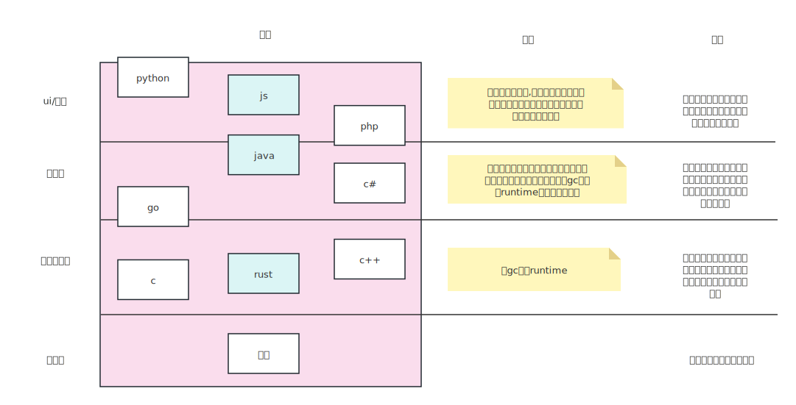

# 技术选型
teamTalk使用的核心语言是java，选择java的最主要原因是我本人多年使用java最多。当然为了自圆其说，我为了自己选择编了编理由。

## 语言层级

我把编程语言分为四种层级，物理、系统级编程、应用编程、胶水语言（UI层语言）。

从软件产品角度来说，我们大部分工作在应用编程层面，在这层面有三种选择，

- go：新语言，没有历史包袱，跨平台好。同样生态和性能不是很够，在国内除了字节和B站没有其他公司作为主要业务语言。
- java：发展三十年的老语言，历史包袱重，代码写得啰嗦。社区生态非常丰富，但是语言内置生态不够(如包管理机制)。由于jit的多年发展，目前其平均性能是应用编程层级最高。
- c#：和java同时期的语言，其技术路径和go类似（编译时runtime），由于背靠微软，多年闭源。市场占用率相对较低，在国内一般为小型公司采用。

### 性能
从性能来看，java性能是最优的。java虽然是一个字节码语言，但是其jit和gc已经经过多年的极致优化。所以代码执行速度已经不会落后c++太多了。
相对来说，go语言还是一个很新的语言，go目前的生态还在发展其语言特性本身，连gc的发展都还在初级阶段。go的语言性能目前仅限预编译提供的cpu指令层面翻译带来性能优势。

java的runtime非常大，一般来说生产环境都会把javac（java编译器）带上，足以说明java的runtime有多大了。这也是大家吐槽java笨重的原因。不过runtime大有他的好处，
那就是java的jit相比go/c#来说要完善太多。可以说go这种预编译语言几乎不具备jit能力。一个编译后只有10M的可执行文件，不太说能搞JIT。

语言层面的性能优化手段一般可以分为两种：
- jit，运行时代码优化，即runtime在代码运行的时候检测代码的执行路径进行native化编译，以及提供cpu指令级别的各种优化。典型的空间换时间思想
- 零成本抽象：即在代码编译的时候，通过分析语言结构，生成偏好业务逻辑路径的二进制代码。
  - 编译器基本的逻辑分析机制，比如a=1+1优化为a=2
  - 编译时元编程机制给编译器的提示：如c++的 #LIKE 宏，他告诉编译器在有分支的时候，那个分支是更高概率的路径。如此生产的二进制代码则会向着对应分支倾斜。

当然我会认为对于业务系统来说，jit比编译器的优化更加适合，因为业务足够复杂。只有运行起来了，runtime通过trace热点代码才能拿到真正合适的代码优化点。而编译时优化仅仅能做一部分已知场景的抽象，
另外对于jit运行时来说，jit和编译时优化是可以共存的。对于java来说，就如proguard，可以在编译后先对字节码进行一轮字节码优化，这个适合常见的编译器优化手段已经可以用上了。

### 元编程
对于业务框架来说，元编程是非常重要的需求。业务是复杂的，底层语言提供足够的元编程工具可以提供很多代码层面的业务降维功能。同样在元编程方面，java是所有语言最强大的。

- rust：为了安全和生命周期管理，rust不可能支持运行时相关元编程。rust的宏都是编译时apply，当然rust的宏也非常强大（同时使用开发宏非常复杂，大部分同学只能使用宏，而不太能开发宏）
- go：go是编译型语言，在运行时代码底层元数据本身就会被抹掉一部分，同时元编程和性能优化也有对抗的。可以看到go的反射只能做一些简单的字段读写，代码定位之类的工作。
- c/c++：不多说了，c语言系列的宏就是字符串的替换，所以不具备语言安全围栏。c的宏带来了大量奇奇怪怪的代码写法，由于是字符串替换，ide一般都不能正常分析宏的含义。同样c的宏也只能发生在编译时。
- java：
  - 编码、字节码、运行时都有相关元编程支持。如lombok在编译时生成方法/字段，减少重复开发。如Null注解只发上在代码上，给开发者提示编码规范。还有大量运行时的特殊功能性注解
  - 注解机制：用于给代码添加标记，给反射运行时使用
  - 支持字段、class、method等几乎所有java语言模型的反射操作

### 语言超集
我们说java是一个30岁的老态龙钟的丑语言，要说我也是嫌弃他的。但是这是生命周期理论的必然。

- 当语言很年轻，则生态不完善，各种功能不支持，被用户吐槽
- 当语言发展很多年，则走过的弯路都成为历史包袱。
  - 如果丢掉历史包袱，则带来不兼容变更，可能直接丢失用户，被用户吐槽。貌似这么干的语言都消失了。
  - 如果保留历史包袱，则历史包袱越来越多，学习路径陡峭，同时随着各项语言发展，需要考虑融合现代化的语言特性。
    - 如果选择大量接收现代化语言特性，则语言特性越来越复杂，最后常人无法理解，如c++
    - 如果选择拒绝现代化语言特性，则语言特性老旧。如java

这个问题的解决方法其实也是有，那就是语言超集。语言超集就是在原来的语言基础上设计一套新的语言，新的语言完全兼容老语言，这样可以换一个新语言接收现代化语言特性，同时完全兼容老语言。

- c扩展为c++，c++兼容c的语法
- c扩展为objective-C,兼容c语法，而后swift扩展objective-c成为oc超集
- java则有kotlin、groovy、Scala多种超集，还有在Android上的Dalvik字节码变种。

语言超集也存在问题，新老语言一般为两种编程范式，其编程规范存在冲突。同时有需要提供两种语言相互混用的机制。最终可能是，则新老语言范式打架，语言特性复杂到常人无法理解。
最有代表的就是c++了。很难想象c++可以像现代语言这样写得很高级，同时又能像pure-c那样写得很原始。伴随版本变更，用户对于代码的世界观被不断打破、重建。

从语言超集层面来看，java对新特性吸收一直保持谨慎态度（同时从groovy，kotlin来看，java扩展现代化语法本质上是很轻松的）。用jdk21跑java1.1的字节码没有什么兼容问题，
而用kotlin写的ui组件，其API形态已经对等到js生态的jsx了。

### 并发
从并发层面，go是强的，java就算有虚拟线程也比不上go的goroutine。目前java能使用的最好的并发方案是以netty为代表的事件驱动编程框架，然而事件驱动机制对编程同学的代码功底要求太高了。就我现在看很多开源项目里面，
那些用netty写得软件代码水平都非常差。

不过对我来说，经过多年使用netty，已经对他掌握得还可以了。大部分情况下，不会写出有泄漏风险的代码，出现问题也有经验来排查。更主要的是netty天生对内存池的一些管理，我们在进行高吞吐网络编程时，其内存使用会比go这种runtime
级别的gc内存管理占用低。

当然，这方面不是优势，因为netty这方面所有的优势，在go未来的发展路径上，都可以有更好的技术土壤来替代（比如内存池、网络编解码），而且能从语言底层解决内存泄漏、业务流中断、状态一致性等问题。
不过及时未来go这方面发展得更好，我大概率也不会选择他，因为rust比他更有发展潜力，rust更近底层、同样具备协程、有更多的异步安全模型、没有gc。

### 产出物大小
一般我们说java写的软件都很大，正常情况下给jar包都是上百M，如果java程序给终端客户使用还需要带一个java虚拟机出去，几百M是常有的事情。
相对应来说，相同功能用go来实现，则一般在10M大小的二进制包。用户拿到二进制直接就可以执行，对用户来说是极其方便的。

但是这个优势在实际落地情况下大概率不是优势，大多数场景软件所带资源比软件本身更多。比如软件依赖的图片/数据库/资产文件等。在实际业务中几百M的发布包也还是非常平常的。
另外在当下硬件资源越来越便宜的情况下，扣这么几十兆的存储真的有点奇怪了。你都云原生、微服务了，几十台机器的大机群的钱都花了，还在这里纠结说我用go写得软件只有几M，我真觉得这是为了吹嘘而吹嘘。

**如果你写的产品是给c端客户使用的，产出物大小是很重要的，go是最好的方案。如果是给B端客户使用，几百兆的产出物没有多大区别**

## 三层语言选择
从上图可以看到，我们的语言的选择大概可以分为4层，但是物理层（汇编）机会不会出现，即使出现了也没有选择。所以我在系统级编程、应用层、ui层分别选择一种语言作为因体的主要技术语言。

- 系统级编程： 选择rust，虽然rust学习难度高，但是他是现代化语言，解决了安全、高效、生态、表达能力多方面优势。
- 应用层：选择java，目前我最熟java，同时他也是最适单体巨石架构场景的语言。将会是我们最核心的、工作量最大的部分
- ui层：选择js（如果存在api和规范部分，则会以ts为主）。这也基本是没疑问，python一般都是给那些搞科研的外行用的，js大有统一前端的趋势，php近几年因为建站的需求被各种js框架替代了越来越没有声音了