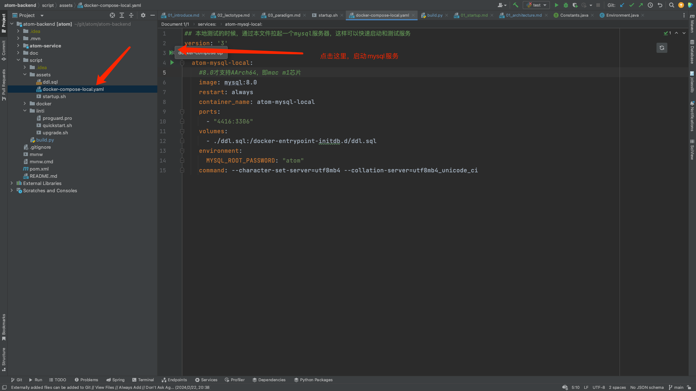

# 开始
本章节指导用户快速启动开发环境

- **本项目开源地址[github](https://github.com/yint-tech/teamTalk)**
- **更多项目，请移步因体主页：[iinti.cn](https://iinti.cn/)**

## 前置条件

### 系统条件
建议在macos系统上开发，Windows大概率可以，但是没有做过完整测试。可能需要用户自身确认一遍

### 预装软件

- java jdk：请安装jdk1.8以上，可以支持最新版本jdk，如jdk21。
- docker：测试环境使用docker创建mysql数据库服务，如没有docker，则需要手动指定mysql配置。所以建议用户安装docker
- idea：java 编译器
- node: 前端工具编译需要，建议选择新版本node，如node V20.0.0
  - yarn：推荐使用yarn替代node内置的npm，因为npm的构建速度实在太慢
- webstorm：前端编译器（您也可以根据自己的需要，选择vscode）

## 启动后端

### 打开项目
使用idea打开后端工程``team-talk-backend``

### 启动数据库

teamTalk存在唯一的外部依赖，即mysql。运行后端前需要运行好mysql，我们默认使用docker来启动和自动化配置。
请先确保docker已经启动

在idea中，直接打开文件teamTalk内置的docker脚本，既可以启动好mysql

``team-talk-backend/script/assets/docker-compose-local.yaml``

之后可以看到如下

### 启动后端
运行项目入口即可

之后可以看到启动完成

### 启动前端
使用webstorm打开前端子工程，执行入口即可

之后会自动打开浏览器，进入登录页面。你可以进行首次账号注册，进入系统

网站打开，即代表整个系统开发模式启动完成

