# 编写代码

## 代码结构
整体代码结构如下图

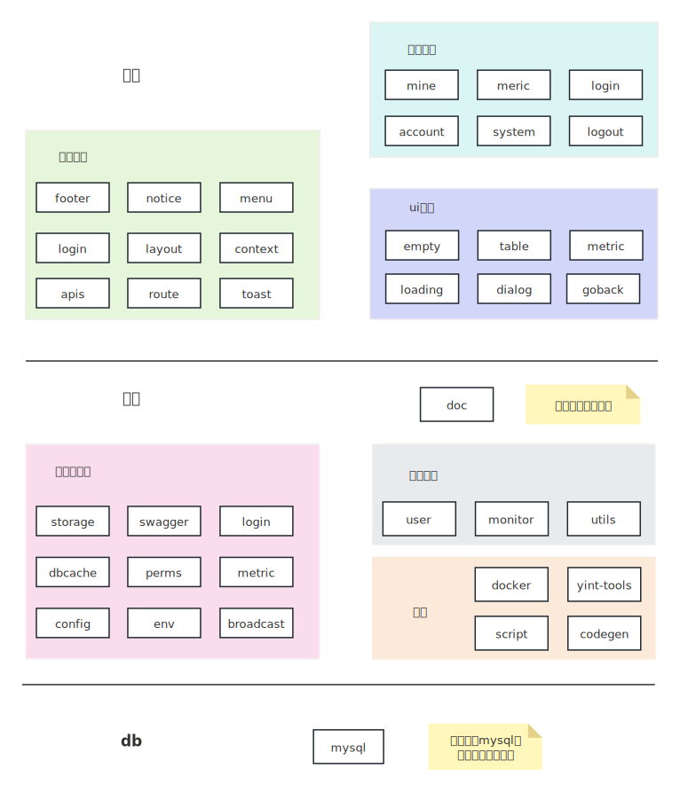

- 以springboot为容器的后端系统
- 以react+mui为容器的前端系统
- 仅以mysql作为独立三方中间件
- 以vuepress+vuepress-theme-hope为框架的文档模块
- 使用python编写个各个模块联合构建的相关脚本

### 后端

后端使用java语言，构建工具为maven，核心框架为springboot。配套方案选择有

- 序列化：mybatis-plus，即使用满足mybatis规则的扩展，大部分情况使用mbp的链式封装，特殊情况可以使用mybatis原生sql
- mysql：唯一的外部依赖，使用mysql的原因是无论如何我们需要对数据进行运维，在中国mysql是最标准，用户量最大的。
- swagger：接口API生成，即自动渲染所有controller的接口文档
- 工具类：apache commons系列和guava，原则上不使用其他工具包（如不使用hutool）

### 前端
teamTalk整体前后分离开发，前端使用react作为框架，以[Material-UI](https://v4.mui.com/zh/getting-started/installation/)为组件库。
在前端使用自建的一套脚手架工程。

## 从后到前-后端
在teamTalk基础之上，大概率需求是从数据库表设计一直走到前端页面的全流程。本章节介绍这个流程，读者了解本流程后可以进行基本的需求开发

### 数据库登入
在上一步启动阶段，我们介绍了基于docker创建的mysql。可以看到我们默认的数据库配置信息为：
- 用户名：root
- 密码：teamTalk
- host：127.0.0.1
- 端口：4416

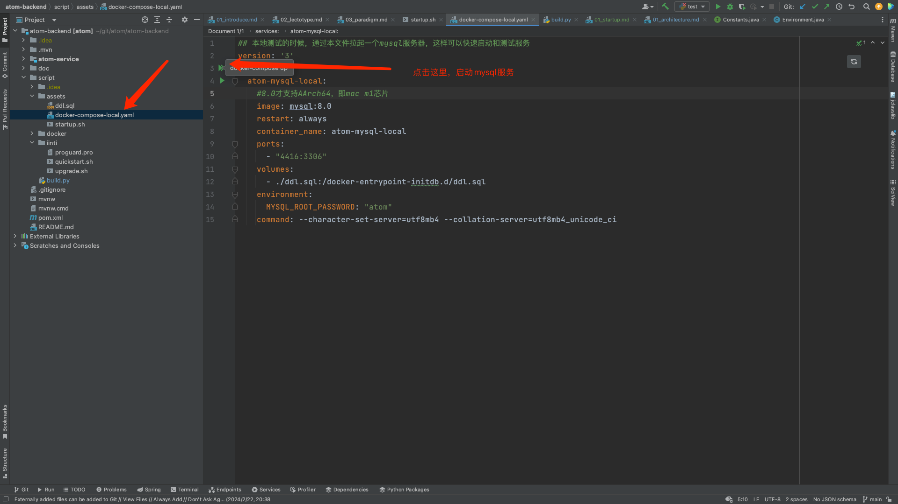

所以使用mysql客户端连接此数据库，进行数据库相关设计，这里我使用的是mysql官方的``mysql workbench``，你也可以选择自己熟悉的mysql客户端。

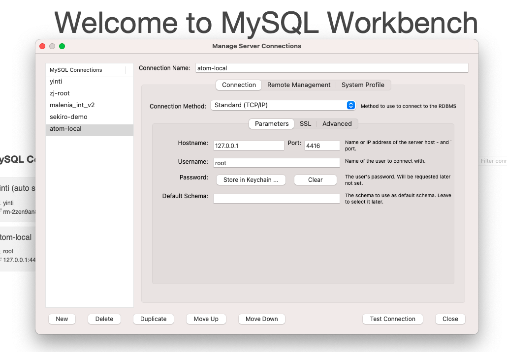
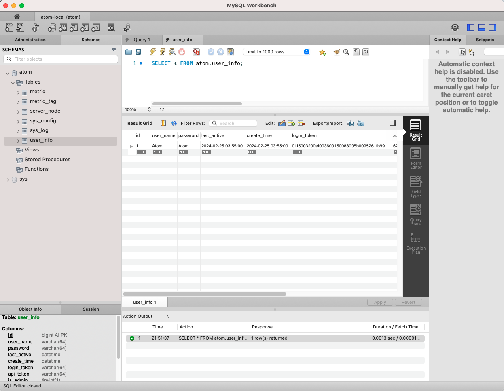

### 表结构设计
根据业务模型，创建数据表结构，用于承载底层存储。这里假定有一张设备资产表，记录公司的办公设备。他有如下字段

- 序列号：公司资产唯一编号
- 设备类型：如手机、电脑、显示器等
- 设备状态：如已采购、已分配、已损坏、丢失等
- owner：设备所属人，即当前设备分配给那个员工使用
- update_time: 修改时间
- purchase_price： 采购价格
- purchase_date:采购时间
我们根据上述业务情况进行表结构设计

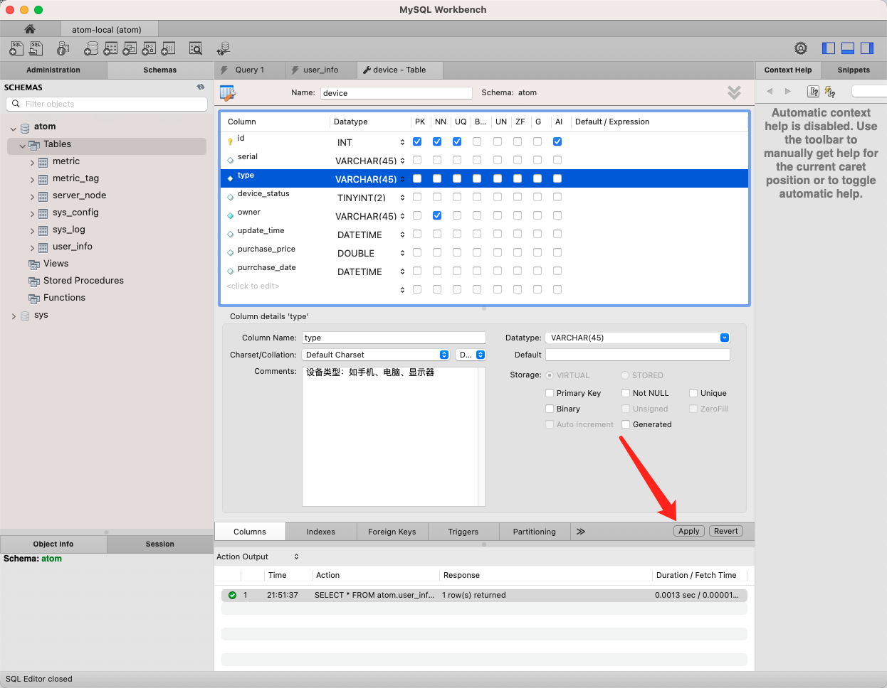
最终表结构如下
```mysql
CREATE TABLE `device` (
  `id` int NOT NULL AUTO_INCREMENT COMMENT '主键id',
  `serial` varchar(45) COLLATE utf8mb4_unicode_ci DEFAULT NULL COMMENT '序列号',
  `type` varchar(45) COLLATE utf8mb4_unicode_ci DEFAULT NULL COMMENT '设备类型：如手机、电脑、显示器',
  `device_status` tinyint DEFAULT NULL COMMENT '设备状态',
  `owner` varchar(45) COLLATE utf8mb4_unicode_ci NOT NULL COMMENT '所属用户',
  `update_time` datetime DEFAULT NULL COMMENT '最后修改时间',
  `purchase_price` double DEFAULT NULL,
  `purrchase_date` datetime DEFAULT NULL COMMENT '采购时间',
  PRIMARY KEY (`id`),
  UNIQUE KEY `id_UNIQUE` (`id`)
) ENGINE=InnoDB DEFAULT CHARSET=utf8mb4 COLLATE=utf8mb4_unicode_ci
```

### 代码生成
对于数据库模型到代码，常见模版代码大家都是自动生成的，teamTalk则是对于mybatis-plus-generator进行了简单的配置，即可以完成自动代码生成。

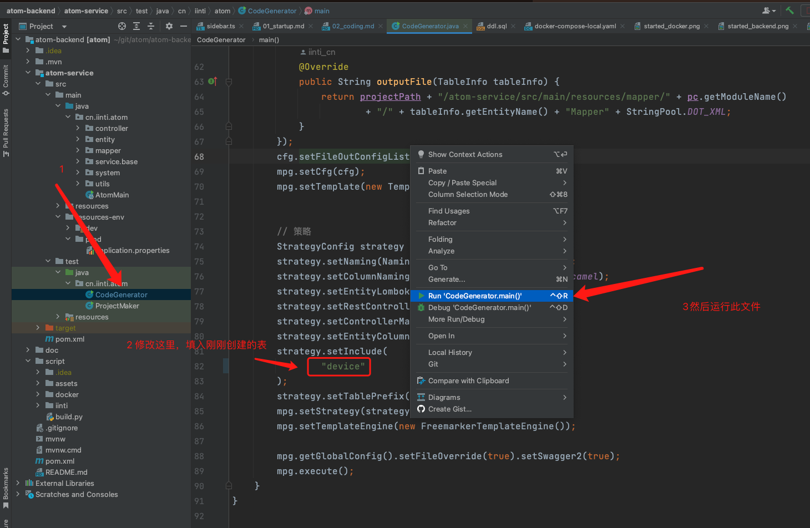
然后可以我们可以看到自动生成的代码

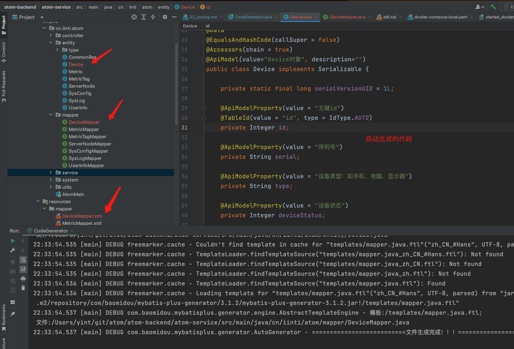

和普通的``mybatis-plus-generator``不同，teamTalk不会生成如下文件：
- controller
- service 
- serviceImpl

这是因为在teamTalk概念中，其实绝大部分表不会对应controller、service，为了避免单文件太单薄，希望读者对代码结构进行紧凑收敛。

### CRUD
接下来就是根据刚刚生成的代码，开发相关的API结构。给前端使用

我们根据其他Controller代码的样子，开发如下两个接口，然后重启``TeamTalkMain.java``入口

**注意，按理来说，DeviceController可以自动生成，但是teamTalk没有这么做，原因在上一小节进行了解释**

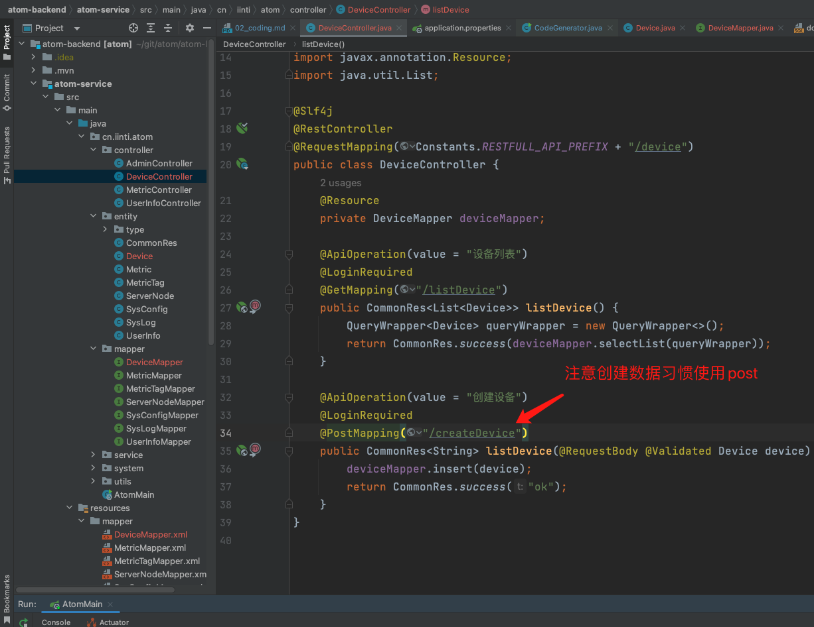
之后打开后端API接口,可以看到我们创建的API被swagger渲染

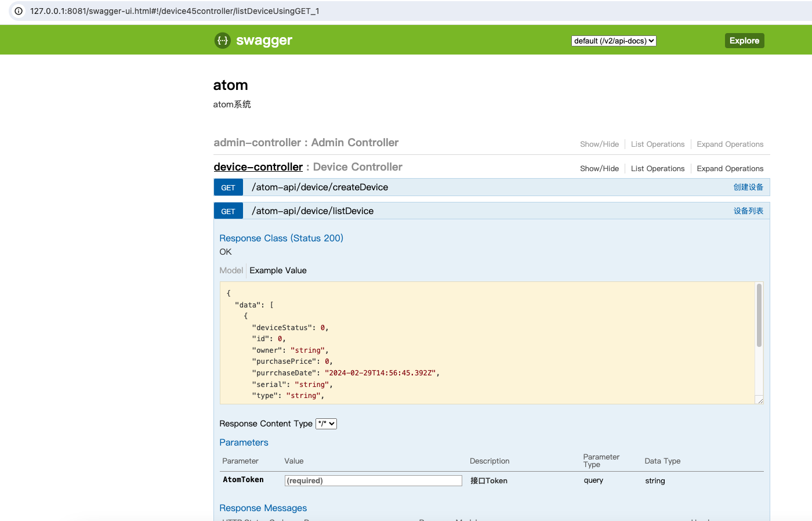

## 从后到前-前端
我们没有对前端进行过度封装，您需要手动配置菜单、路由、页面。不过好在这些工作也不再复杂。

我们打算给设备接口做一个展示表格、以及增加一个数据录入的弹窗页面。下面我们开始修改前端代码

### api路由
在``team-talk-frontend/src/apis/url.js``增加刚刚添加的两个API接口

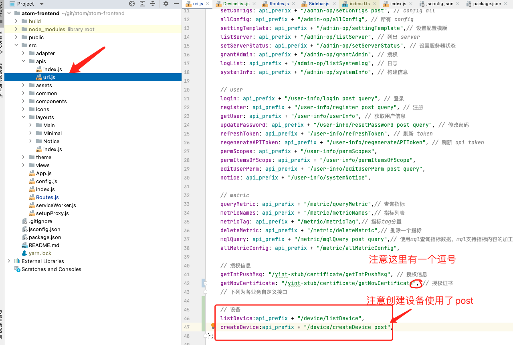

### 表格页面
我们新建页面文件，并填入如下代码，这里大家参考页面修改，然后最终看页面展示情况调整效果即可。在刚开始使用时不用理解代码原理，
直到用熟悉了之后，这些代码组件自然就理解了。

- 核心关注SimpleTable组件，他是teamTalk封装的一种简单表格
- 这里为了避免代码太多，我们没有书写非常完善的代码
  - 录入数据只实现了三个字段
  - 数据格式没有检查
  - 没有支持数据删除

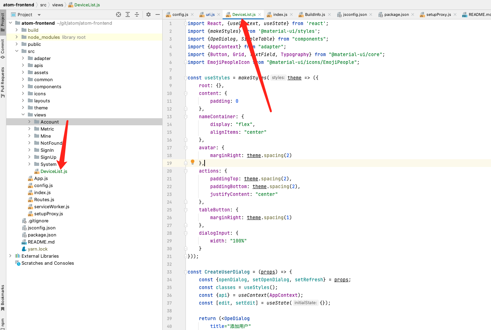
```javascript
import React, {useContext, useState} from 'react';
import {makeStyles} from '@material-ui/styles';
import {OpeDialog, SimpleTable} from "components";
import {AppContext} from "adapter";
import {Button, Grid, TextField, Typography} from "@material-ui/core";
import EmojiPeopleIcon from "@material-ui/icons/EmojiPeople";

const useStyles = makeStyles(theme => ({
  root: {},
  content: {
    padding: 0
  },
  nameContainer: {
    display: "flex",
    alignItems: "center"
  },
  avatar: {
    marginRight: theme.spacing(2)
  },
  actions: {
    paddingTop: theme.spacing(2),
    paddingBottom: theme.spacing(2),
    justifyContent: "center"
  },
  tableButton: {
    marginRight: theme.spacing(1)
  },
  dialogInput: {
    width: "100%"
  }
}));

const CreateDeviceDialog = (props) => {
  const {openDialog, setOpenDialog, setRefresh} = props;
  const classes = useStyles();
  const {api} = useContext(AppContext);
  const [edit, setEdit] = useState({});

  return (<OpeDialog
          title="新建设备"
          opeContent={(
                  <>
                    <Grid
                            container
                            spacing={6}
                            wrap="wrap"
                    >
                      <Grid
                              item
                              xs={6}
                      >
                        <Typography
                                gutterBottom
                                variant="h6"
                        >
                          序列号
                        </Typography>
                        <TextField
                                className={classes.dialogInput}
                                size="small"
                                variant="outlined"
                                value={edit.serial}
                                onChange={(e) => setEdit({
                                  ...edit,
                                  serial: e.target.value
                                })}/>
                      </Grid>
                      <Grid
                              item
                              xs={6}
                      >
                        <Typography
                                gutterBottom
                                variant="h6"
                        >
                          设备类型
                        </Typography>
                        <TextField
                                className={classes.dialogInput}
                                size="small"
                                variant="outlined"
                                value={edit.type}
                                onChange={(e) => setEdit({
                                  ...edit,
                                  type: e.target.value
                                })}/>
                      </Grid>
                      <Grid
                              item
                              xs={6}
                      >
                        <Typography
                                gutterBottom
                                variant="h6"
                        >
                          所属用户
                        </Typography>
                        <TextField
                                className={classes.dialogInput}
                                size="small"
                                variant="outlined"
                                value={edit.owner}
                                onChange={(e) => setEdit({
                                  ...edit,
                                  owner: e.target.value
                                })}/>
                      </Grid>
                    </Grid>
                  </>
          )}
          openDialog={openDialog}
          setOpenDialog={setOpenDialog}
          doDialog={() => {
            return api.createDevice(edit).then(res => {
              if (res.status === 0) {
                setRefresh(+new Date());
              }
            });
          }}
          okText="保存"
          okType="primary"/>);
}


const DeviceList = () => {
  const {api} = useContext(AppContext);

  const [addDeviceDialog, setAddDeviceDialog] = useState(false);
  const [refresh, setRefresh] = useState(+new Date());
  return (
          <div>
            <SimpleTable
                    refresh={refresh}
                    actionEl={(<Button
                            startIcon={<EmojiPeopleIcon/>}
                            color="primary"
                            variant="contained"
                            onClick={() => setAddDeviceDialog(true)}
                    >
                      添加设备
                    </Button>)}
                    loadDataFun={api.listDevice}
                    columns={[
                      {
                        label: "序列号",
                        key: "serial"
                      }, {
                        label: "设备类型",
                        key: "type"
                      }
                      , {
                        label: '设备状态',
                        key: 'deviceStatus'
                      }, {
                        label: '所属用户',
                        key: 'owner'
                      }, {
                        label: '最后修改时间',
                        key: 'updateTime'
                      }, {
                        label: '采购金额',
                        key: 'purchasePrice'
                      }, {
                        label: '采购时间',
                        key: 'purrchaseDate'
                      }
                    ]}
            />

            <CreateDeviceDialog
                    openDialog={addDeviceDialog}
                    setOpenDialog={setAddDeviceDialog}
                    setRefresh={setRefresh}
            />
          </div>
  )
}

export default DeviceList;
```

### 配置路由
页面组件注册到路由后，才会成为一个react的页面路径。否则我们无法从浏览器看到页面效果


注册完成后，访问URL:[http://localhost:3000/#/deviceList](http://localhost:3000/#/deviceList)可以看到我们刚刚编写的页面

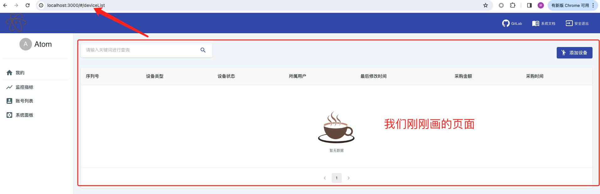

### 配置菜单
我们需要对页面功能进行分组，而菜单就是进行第一步大类功能分组方法。这里假定``设备资产管理``是我们的一个核心功能，所以需要将刚刚的页面挂到左侧菜单上，
则进行如下配置

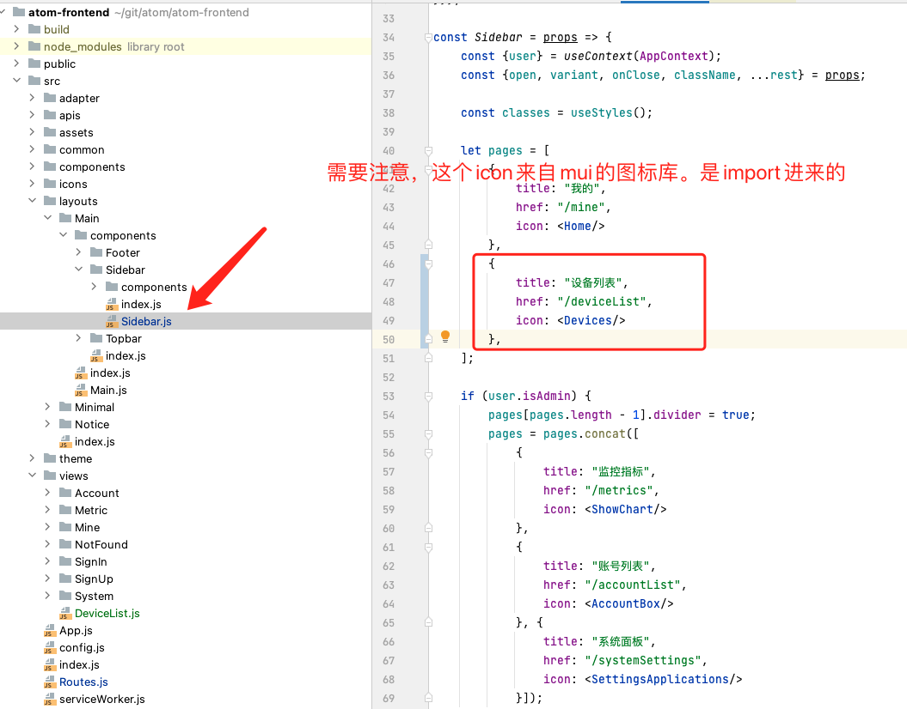

之后我们回到网页页面，可以看到页面被加入到菜单上

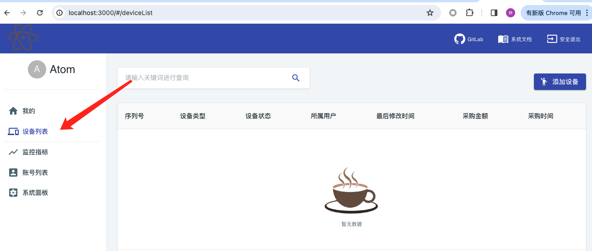

### 结尾
简单操作一下前端，录入一条数据看看效果

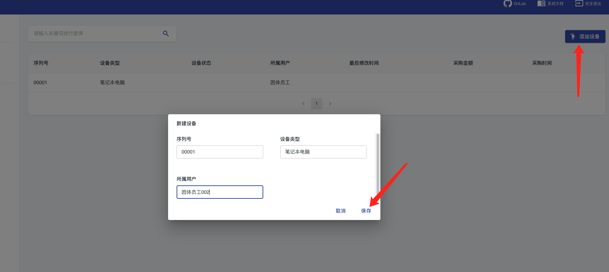


## 总结

- teamTalk开发模式一般从后往前，并以后端为主。用户需先设计数据库，然后实现后端java代码，然后实现前端页面
- 整个链路teamTalk都有其他数据模型已经实现完成，用户可以在周围找到参考代码
- teamTalk整个开发环境中，所有开发连接、用户名、密码、端口等配置都是默认完成的，并且特意绕开了常见端口。用户启动开发环境后，应该是可以直接开发全链路，不需要特殊配置
- 在我们的``设备资产管理``功能模块中，为了减少演示的代码量，我们没有实现完善代码。如数据安全校验、默认字段填充、枚举提升等等
