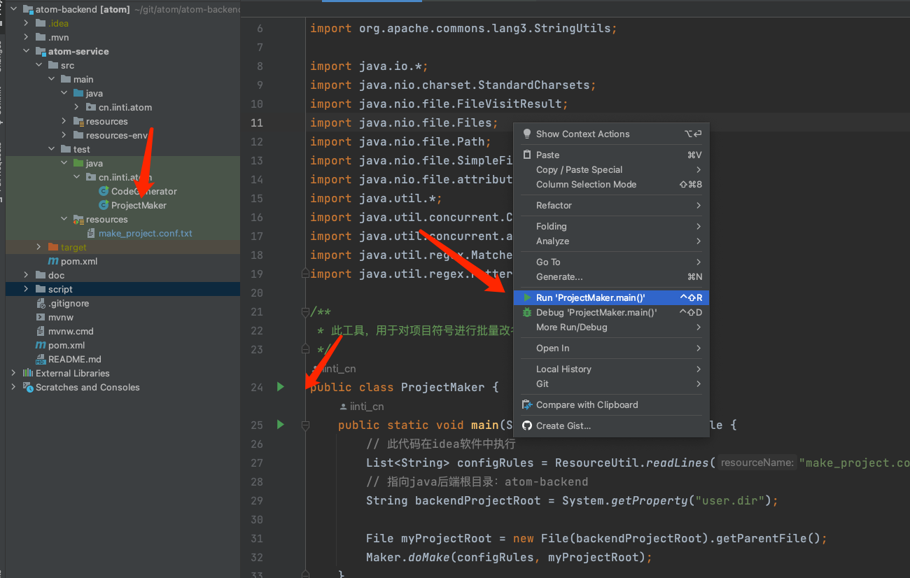
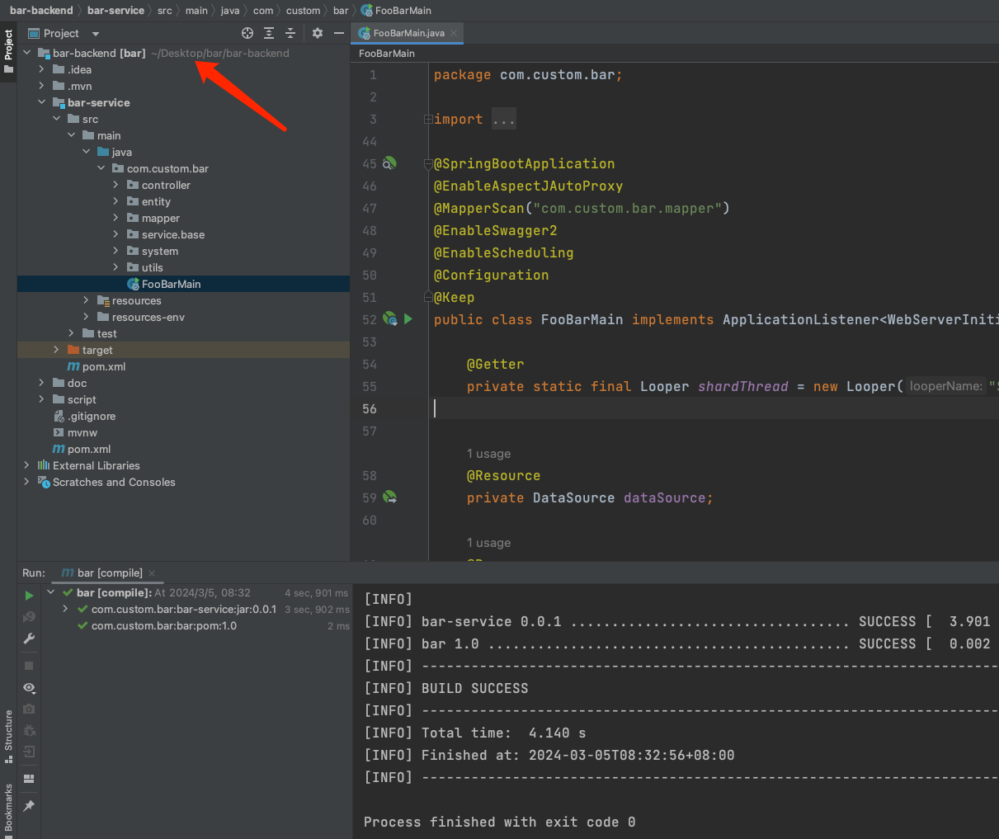

# 项目转换
项目是因体工具链提供的一种批量改名工具，这大多用于根据teamTalk脚手架代码创建新的项目。改名后项目结构将和teamTalk不同，他将是一个完全新的项目。

此改名脚本具有一下特点

- 处理好了项目关联，改名依然是一个完整的代码
- 处理好了java语言规则，如包名、文件名。  支持各种Java变种规则转义：java、groovy、kotlin、jni、aidl等多种java相关的文件，故支持Android工程改名转换
- 支持忽略规则：使用``.gitignore``语法，实现部分文件的忽略，这对于编译临时文件，idea工程文件等不需要提交的文件具有很好过滤作用
- 支持内容保持：即对于二进制文件等不能进行内容分析的部分，可以保持其不发生内容变化
- 支持后置指令：通过命令扩展的方式，在项目转换完成后执行一些hook

可以看到，teamTalk的自动改名工具，是一个来自生产实践的完善改名工具。这是我们现在使用teamTalk的最佳实践，实际上我们所有新项目，都是从此工具创建而来。


## 使用
在idea中，执行文件：``team-talk-service/src/test/java/com/virjar/tk/server/ProjectMaker.java``即可


运行完成后，可以看到在桌面产生了一个新的项目


我们打开生成的项目，可以看到他可以正常完成项目编译。一般情况下，生成项目可以直接作为新产品骨架使用。




## 使用场景

项目转换器存在下面使用场景

- 通过teamTalk创建新的项目，之后项目组织从``cn.iinti``转移为你们公司组织，如此适合在您公司内部使用
- 源码售卖：因体产品大多支持直接售卖源码，每当售卖源码时，均使用此工具为客户生成对应客户组织的代码。
- 移动安全领域：在移动安全领域，本工具可以实现攻击环境的符号rename，避免安全sdk探测开源项目符号特征。
  - 如本工具可以对[lsposed](https://github.com/LSPosed/LSPosed/)进行任意的一键改名
  - 因为teamTalk改名工具链处理好了Android项目的所有符号转移关系

## 规则和配置
项目转换器规则配置文件在：``team-talk-service/src/test/resources/make_project.conf.txt``,
- 你可以参考``ProjectMaker.java``入口函数了解如何指定配置文件
- 你可以参考配置文件内容定制转换规则

``` 
#目标输出文件夹
target:~/Desktop/bar

# 包名替换规则
pkg:com.virjar.tk.server->com.custom.bar

# 关键字替换规则
key:TeamTalk->FooBar
key:team-talk->bar


# 忽略文件
ignore:.idea
ignore:.gradle
ignore:local.properties
ignore:.DS_Store
ignore:build/
ignore:.git/
ignore:.gitmodules/
ignore:node_modules
ignore:target/
ignore:.vuepress/dist/


# 如果存在，则不执行替换规则，团队定制化的配置文件
notOverwrite:/xxx-module/build.gradle.kts

# keep文件
keep:*.jar
keep:*.aar
# md是文档，我们就不替换他了
keep:*.md
keep:*.png
keep:*.jpg
keep:*.ico
keep:*.svg
keep:*.otf
keep:*.woff2
keep:*.ttf
keep:*.woff
keep:*.p12
keep:*.eot

# 文件内容keep,这是是暂时不方便替换的内容
keepContent:com.yint.cannotEdit
keepContent:Atomic
keepContent:atomic

# 生成文件之后执行的命令
#cmd:chmod +x gradlew
#cmd:chmod +x script/startup.sh
```